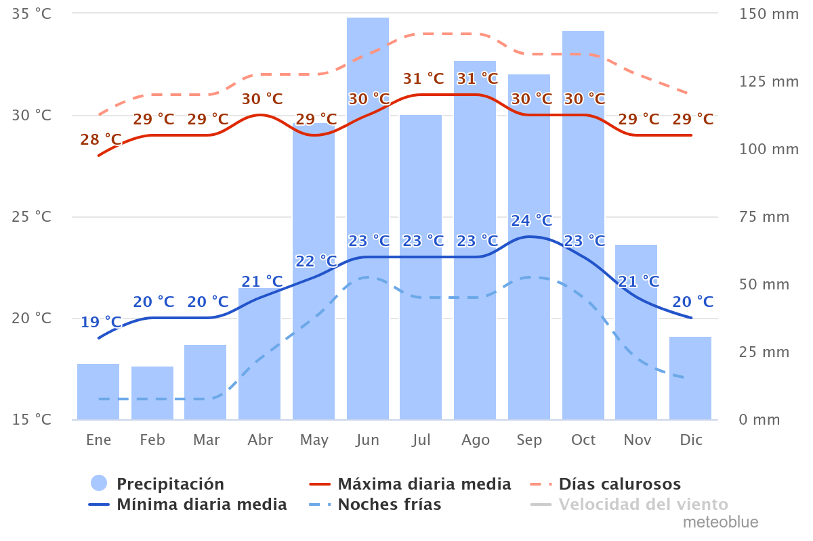
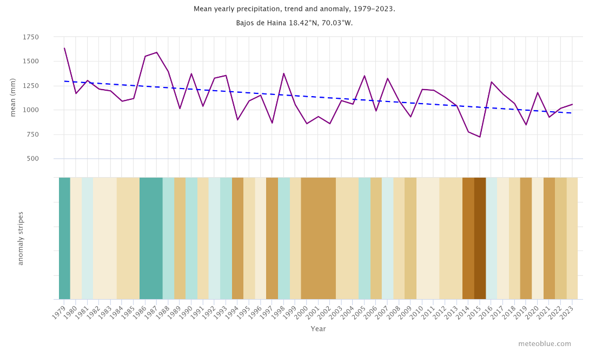
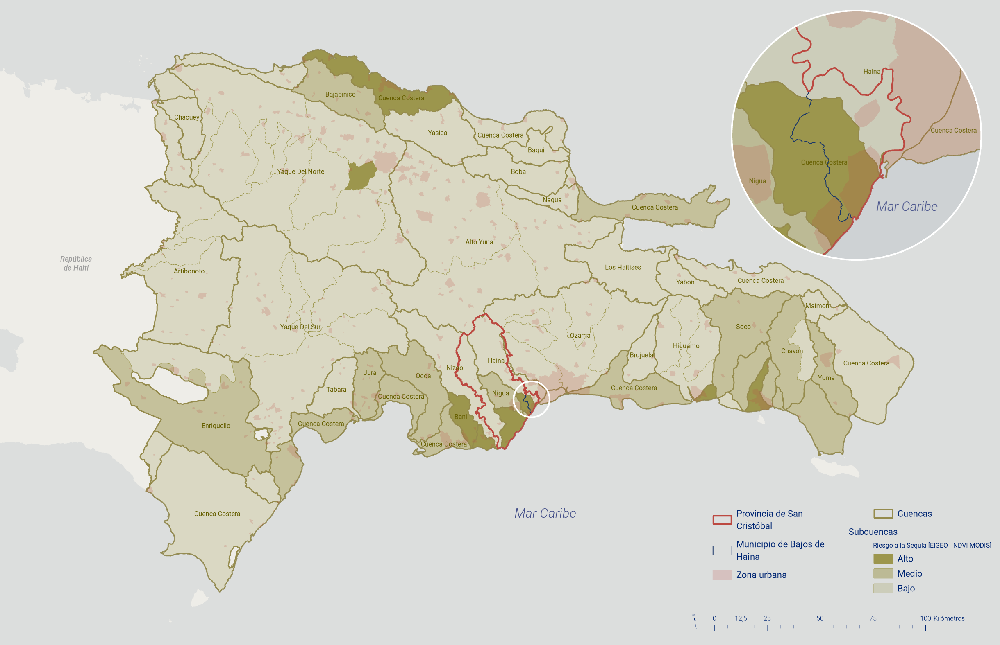
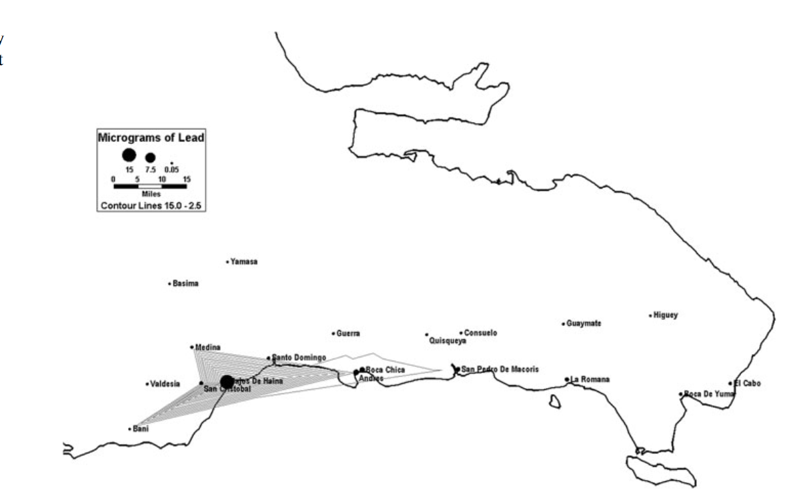

> **Fecha:** agosto 2025 **Objetivo específico:** OE1 **Resultado:** R.4 Diagnóstico municipal

## Antecedentes {#sec-antecedentes-03}

El municipio de Los Bajos de Haina, ubicado en la provincia de San Cristóbal, República Dominicana, enfrenta una serie de desafíos significativos en términos de gestión de riesgos debido a su alta concentración industrial, densidad poblacional y problemas ambientales históricos.

### Historia y desarrollo industrial {#sec-historia-industrial-03}

Desde su establecimiento como municipio en 1981 y antes de ello, Los Bajos de Haina ha experimentado un crecimiento industrial significativo. La presencia de industrias químicas, petroquímicas y de reciclaje ha sido un motor económico clave, pero también han generado importantes problemas ambientales y de salud pública.

### Problemas ambientales y de salud pública {#sec-problemas-ambientales-03}

La operación histórica de plantas de reciclaje de baterías y otras industrias ha dejado un legado de contaminación por plomo y otros metales pesados en el suelo y el aire. Desde el año 2006 hasta el 2009 El Instituto Blacksmith, clasificó a Haina como una de las localidades más contaminadas debido a la contaminación industrial, especialmente en la zona Paraíso de Dios [@blacksmithinstituteWorldsWorstPolluted2006; @blacksmithinstituteWorldsWorstPolluted2007; @blacksmithinstituteWorldsWorstPolluted2009]. Esta contaminación ha tenido impactos graves en la salud de la población local, especialmente en los niños, quienes presentan altos niveles de plomo en sangre. [@kaulFollowupScreeningLeadpoisoned1999]Tras la publicación de los informes la Secretaría de Medio Ambiente junto al Banco Interamericano de Desarrollo y diversas instituciones trabajó en programas de remediación ambiental para mitigar estos impactos [@diariolibreExplicanAccionesPara2006], en el año 2013 Paraíso de Dios no figuraba en la lista de los lugares más contaminados del mundo [@diariolibreHainaYaNo2013], No obstante en los sucesivos años y hasta la redacción de este escrito, la contaminación y problemática vinculada la industria de producción y reciclaje de baterías sigue afectando al sector, manteniéndose niveles altos de contaminación y por lo tanto la vulnerabilidad de su población[@ramirezImplicationsPhytoremediationHeavy2021].

### Afectaciones de Sequía asociadas a cambio climático {#sec-sequia-clima-03}

Según estudios elaborados por el Equipo de Información Geoespacial (EIGEO) de la Comisión Nacional de Emergencias de Rep. Dominicana, el total del territorio dominicano, el 6.32% está sujeto a un alto de nivel de riesgo por sequía, 17.26% a un nivel medio y 76.42 tiene un nivel bajo de riesgo sequía. La zona de Bajos de Haina se encuentra entre los dieciocho municipios con alto riesgo de sequía [@mimarenaPlanAccionNacional2018].

### Seguridad vial y accidentes {#sec-seguridad-vial-03}

La carretera Sánchez, una de las principales arterias del municipio, es conocida por sus altos índices de accidentes de tránsito. Recientemente, un accidente fatal entre un autobús y un camión de carga subrayó la necesidad urgente de mejorar la gestión del tráfico y las medidas de seguridad vial en el área. Los organismos de socorro y la Defensa Civil han destacado la importancia de implementar mejoras en la infraestructura vial para reducir estos riesgos [@diariolibreExpertoSeguridadVial2024].

### Gestión de residuos y servicios públicos {#sec-residuos-servicios-03}

La gestión inadecuada de residuos sólidos es otro desafío crítico. El municipio ha enfrentado problemas recurrentes de recolección y manejo de basura, lo que ha contribuido a problemas de salud pública y a la contaminación ambiental. El actual alcalde, Osvaldo Rodríguez, ha prometido mejorar estos servicios mediante la cooperación con el Gobierno Central y la implementación de campañas de concientización ciudadana [@listindiarioOsvaldoRodriguezSe2024].

### Iniciativas de desarrollo y mejoras infraestructurales {#sec-iniciativas-desarrollo-03}

En un esfuerzo por mejorar la calidad de vida y la seguridad en Los Bajos de Haina, se han iniciado varios proyectos de infraestructura. Estos incluyen la reconstrucción del malecón, la intervención en la Playa El Gringo y la construcción de un parque urbano. Estas obras, con una inversión significativa, tienen como objetivo revitalizar el área, proporcionar espacios seguros y recreativos para los residentes, y mejorar la infraestructura vial [@diariolibreDavidColladoDeja2023]​.

## Planteamiento del problema {#sec-planteamiento-problema-03}

Bajos de Haina es considerada según el "Análisis de riesgos de desastres y vulnerabilidades en la República Dominicana [@viplandeacciondipechoparaelcaribeAnalisisRiesgosDesastres2009] una de las dos comunidades con más alta exposición a multi peligros.

Bajos de Haina es un municipio con una elevada densidad poblacional, obtiene densidades de 6,950hab/km² en su zona urbana. Con una población de 124,705hab en 2010, que se incrementó a 159,888hab en el 2023 presentando unos 77,950 población masculina y 81,938 de población femenina residiendo en un reducido espacio de 39.9 km² <!-- valor canonizado: ONE División Territorial 2021 -->.[@oneIXCensoNacional2010; @oneCensoNacionalPoblacion2022] La aglomeración de personas en el territorio (4,007 hab/km² <!-- valor canonizado: ONE -->) produce un hacinamiento elevado que es una de las condiciones de vulnerabilidad más relevante. Las personas se han ubicado en cualquier espacio libre disponible incluidos cursos de agua y cañadas. El distrito urbano de Bajos de Haina ocupa apenas unos 14.4 km²^.^ de ahí su alta densidad.

La composición poblacional del municipio según los datos oficiales para el 2023 [@oneIXCensoNacional2010] es la siguiente, municipio cabecera 100,527 habitantes, distrito municipal El Carril 33,758 y distrito municipal de Quitasueño 25,623. El municipio de Bajos de Haina es el quinto mayor en población en todo el país de los municipios que no son cabecera de provincia, solo superado por los 4 municipios ubicados en la provincia de Santo Domingo (Santo Domingo Este, Santo Domingo Norte, Santo Domingo Oeste y Los Alcarrizos) y además supera en población a catorce provincias (Bahoruco, Dajabón, Elías Piña, El Seibo, Independencia, María Trinidad Sánchez, Montecristi, Pedernales, Hermanas Mirabal, Samaná, Santiago Rodríguez, Hato Mayor y San José de Ocoa).

El proceso de industrialización en Bajos de Haina, República Dominicana, se inició en 1950 con el comienzo de las operaciones productivas del Central Río Haina. A lo largo de las siguientes décadas, el desarrollo industrial continuó con la instalación de diversas empresas y complejos, como una envasadora de gas licuado de petróleo (Gas Caribe) en los años 60, la construcción del complejo termoeléctrico Haina en la misma década, el inicio de operaciones de la Refinería Dominicana de Petróleo en 1973, la creación de la Zona Industrial de Haina mediante el decreto presidencial 2581 en 1976, la consolidación de la industrialización con la instalación del Parque Industrial de ITABO en 1986, la construcción de las centrales termoeléctricas Itabo I e Itabo II en los años 80, y la creación de la Zona Franca Industrial Puerto de Haina en 1995.

A pesar de ser un importante centro económico para el país, Bajos de Haina enfrenta varios desafíos debido a su particular proceso de desarrollo urbano, crecimiento poblacional y evolución social e institucional. Entre los problemas generados se encuentran:

-   **Uso inadecuado del territorio:** Existen asentamientos humanos en zonas de alto riesgo, con condiciones de vida precarias y falta de infraestructura y servicios básicos, además de una mezcla desordenada de áreas industriales y residenciales, sin una adecuada planificación territorial.

-   **Concentración de población vulnerable en áreas de riesgo:** En las zonas más expuestas a peligros, se concentran grupos sociales con bajos recursos económicos, lo que dificulta su capacidad para enfrentar y recuperarse de los desastres.

-   **Aumento de las amenazas por degradación ambiental:** Los niveles de riesgo han aumentado progresivamente debido al deterioro del medio ambiente.

-   **Falta de capacidad para gestionar y reducir riesgos:** Tanto las instituciones públicas y privadas como los gobiernos nacionales y locales han mostrado una débil capacidad para incorporar la gestión y reducción de riesgos como parte integral del proceso de desarrollo [@ruizBajosHainaIndustrializacion2001].

Estos problemas surgieron debido a la falta de medidas de planificación territorial adecuadas durante el proceso de industrialización del municipio, sin una proyección prospectiva de los usos del suelo y sin un plan maestro urbano que facilitara la organización de las actividades industriales en función de las necesidades del asentamiento.

El ayuntamiento municipal de Bajos de Haina, que inició su andadura institucional en 1982 con la elección de su primer alcalde, no ha logrado organizar su territorio por varias razones: las decisiones de desarrollo industrial emanaban del gobierno central; la ley que organizaba los ayuntamientos en esa época [@Ley345519521952] no facilitaba su implicación efectiva en la organización de su término municipal, principalmente por la falta de presupuesto suficiente; el crecimiento poblacional y la demanda de suelo residencial, suscitados por los empleos prometidos por la industrialización, desbordaban la capacidad de planificación; y las empresas se concentraron de manera inusitada en las cercanías del Puerto, en la zona de desembocadura del Río Haina y en la costa desde el KM 13 hasta el KM 18, tomando la vieja carretera Sánchez como eje.

Este fenómeno propició que en el municipio se generaran condiciones de vulnerabilidad multidimensionales que elevan su nivel de riesgo. Como resultado, Bajos de Haina fue seleccionado como uno de los 10 municipios prioritarios dentro del diagnóstico de riesgo de los municipios vulnerables del territorio nacional en el marco del Proyecto "Fortalecimiento de las Estructuras Organizativo-Funcionales de la Gestión de Riesgo ante Desastres en República Dominicana".

El municipio de Los Bajos de Haina es un ejemplo clásico de *construcción social de riesgo*[^03-territorio-1]. La construcción social de riesgos remite a la producción y reproducción de las condiciones de vulnerabilidad que definen y determinan la magnitud de los efectos ante la presencia de una amenaza natural [@beckSociedadRiesgo2006; @beriainGiddensBaumanNluhmann1996]; es por ello la principal responsable de los procesos de desastre.

[^03-territorio-1]: *El concepto de Construcción social del riesgo alude a los mecanismos sociales intrínsecos a una sociedad que, por inobservancia de determinadas normas y regulaciones, por dejación de responsabilidad, por debilidad de las instituciones o por desconocimiento permite la generación de vulnerabilidades que pueden resultar fatales para amplias capas de población y a veces ciudades completas.*

Por lo tanto, la tematización y problematización de los riesgos en una sociedad moderna y funcionalmente diferenciada, dista de las perspectivas positivistas y normativas que observan y definen los riesgos y peligros desde fuera, tomando formas objetivas, estáticas, mitológicas y destino predeterminado, sino más bien como una observación interna que opera al interior de la sociedad, de lo cual se deduce que dependiendo del punto de referencia de la observación, sea este el sistema económico, político, legal, entre otros, se construirá socialmente el riesgo o el peligro que sea tema o problema para el observador. Esto opera fáctica y materialmente en la realidad social, cuando las organizaciones o individuos toman decisiones que pueden conllevar riesgos y peligros para la sociedad.

## Justificación del análisis {#sec-justificacion-03}

El municipio de Los Bajos de Haina, conocido por su dinamismo industrial y comercial y su alta densidad poblacional, enfrenta una serie de desafíos significativos en términos de vulnerabilidad ante desastres naturales y antrópicos. Esta situación exige una gestión de riesgos de desastres efectiva y proactiva para proteger tanto a sus habitantes como a sus infraestructuras críticas, pudiendo este proceso apoyarse en el uso de tecnologías digitales avanzadas.

**Vulnerabilidad geográfica y climática:** Los Bajos de Haina está ubicado en una zona propensa a fenómenos naturales como huracanes, inundaciones y terremotos. La proximidad al mar y la presencia de ríos y cañadas urbanas no adecuadamente gestionadas incrementan el riesgo de inundaciones, mientras que la actividad sísmica en la región caribeña influida por la presencia de las fallas de Neiba y La Trinchera de Los Muertos añade una capa adicional de amenaza. La integración de tecnologías de monitoreo y predicción, como sistemas de información geográfica (SIG) y sensores remotos, permitirá una identificación precisa de áreas de alto riesgo y el desarrollo de estrategias de mitigación específicas.

**Riesgos asociados al agua potable y sequías hidrológicas:** El suministro de agua potable es un servicio esencial que puede verse gravemente afectado por sequías y contaminación. La implementación de tecnologías de monitoreo del clima y del estado de los acuíferos, junto con sistemas de gestión del agua, es crucial para asegurar un suministro constante y seguro. Además, la gestión de recursos hídricos debe incluir estrategias para la conservación y el uso eficiente del agua, especialmente en períodos de sequía.

**Salud pública y contaminación:** La presencia de industrias en Los Bajos de Haina conlleva riesgos significativos de contaminación del aire y del subsuelo, lo que puede tener graves repercusiones en la salud pública. La utilización de tecnologías de monitoreo ambiental, como sensores de calidad del aire y sistemas de detección de contaminantes en el suelo, es esencial para identificar y mitigar estos riesgos. Asimismo, se deben establecer protocolos de respuesta rápida para incidentes de contaminación y programas de salud pública que aborden las enfermedades relacionadas con la contaminación.

**Concentración industrial:** El municipio alberga una alta concentración de industrias, incluidas algunas de alto riesgo como plantas químicas y petroleras. Esta característica no solo aumenta la probabilidad de desastres industriales, sino que también amplifica las posibles consecuencias en términos de daños materiales y ambientales. La implementación de sistemas de monitoreo en tiempo real y el uso de tecnologías de IoT (Internet de las Cosas) pueden mejorar significativamente la capacidad de detectar y responder a emergencias industriales de manera oportuna.

**Densidad poblacional y condiciones socioeconómicas:** Los Bajos de Haina es una de las áreas más densamente pobladas del país, con comunidades que a menudo viven en condiciones de vulnerabilidad socioeconómica. Estas comunidades son particularmente susceptibles a los impactos de los desastres, y a menudo carecen de los recursos necesarios para recuperarse rápidamente. El uso de aplicaciones móviles y plataformas digitales para la comunicación y educación comunitaria puede empoderar a los residentes, facilitando el acceso a información vital y recursos en caso de emergencia.

**Capacidad institucional y respuesta comunitaria:** Evaluar la capacidad institucional existente para la gestión de riesgos y la respuesta ante emergencias es crucial. Esto incluye la evaluación de recursos disponibles, la capacitación del personal y la coordinación entre diversas agencias y la comunidad. El uso de tecnologías de gestión de emergencias, como sistemas de gestión de incidentes y plataformas de coordinación en tiempo real, fortalecerá las capacidades institucionales para una respuesta efectiva y oportuna ante cualquier desastre.

**Legislación y políticas públicas:** Un análisis detallado permitirá identificar lagunas en las políticas públicas y la legislación vigente relacionadas con la gestión de riesgos de desastres. La adopción de tecnologías digitales también implica revisar y actualizar las normativas para asegurar que las soluciones tecnológicas se integren de manera efectiva y segura en las estrategias de gestión de riesgos.

**Beneficios del uso de tecnologías digitales:** La implementación de tecnologías digitales en la gestión del riesgo de desastres ofrece múltiples beneficios, como una mayor precisión en la predicción de eventos, mejor coordinación entre organismos, rápida difusión de alertas a la población y una recuperación más eficiente post-desastres. Estas tecnologías pueden incluir desde drones para evaluación de daños hasta inteligencia artificial para análisis de datos y toma de decisiones.

En resumen, la realización de un análisis de gestión de riesgo de desastres en Los Bajos de Haina es una necesidad imperativa para salvaguardar vidas, proteger la infraestructura y asegurar la continuidad de las actividades económicas. Este análisis, apoyado en el uso de tecnologías digitales avanzadas, proporcionará una base sólida para la planificación y la implementación de estrategias efectivas de mitigación y respuesta, promoviendo así un desarrollo sostenible y resiliente para el municipio.

## Caracterización básica del municipio Bajos de Haina {#sec-caracterizacion-municipio-03}

### Ubicación, descripción y características físicas {#sec-ubicacion-fisicas-03}

#### **Ubicación**{#fig-oe1-01}

El municipio de Bajos de Haina pertenece a la provincia de San Cristóbal, en la región sur de la República Dominicana. Se encuentra ubicado entre los 18º 25' N y 70º 01' W. Sus límites son: Mar Caribe al norte y al oeste; el Distrito Municipal de Nigua al sur y la ciudad de Santo Domingo al este, separada de ésta escasamente por el río Haina. Por la vía terrestre Bajos de Haina dista a unos 15 kilómetros de Santo Domingo. El municipio se encuentra localizado en la cuenca baja del Río Haina, que tiene una extensión de unos 86 kilómetros y que precisamente desemboca al mar caribe en los limites municipales que comparte con la ciudad de Santo Domingo.

#### **Descripción general**

El Municipio Bajos de Haina está ubicado en el litoral sur de la República Dominicana. En el extremo sureste de la provincia San Cristóbal, demarcación a la que pertenece. Forma parte de la región sureste del país, específicamente a la subregión de Valdesia. El asentamiento se ubica en la cuenca baja oeste del río Haina, al suroeste del Municipio Santo Domingo Oeste, a unos 10 kilómetros de la ciudad de San Cristóbal, entre los 70°02'40" de latitud norte y los 18o25'00" de latitud oeste.

Los límites de Bajos de Haina son: Al norte la sección Manoguayabo del Municipio Santo Domingo Oeste, al sur el Mar Caribe, al este el Río Haina, (que lo separa del municipio Santo Domingo Oeste, de la provincia Santo Domingo) y al oeste el arroyo Itabo que lo separa del municipio de Nigua, de la cabecera de provincia San Cristóbal.

El Municipio tiene una extensión de 39.9 km², su área urbana (Distrito municipal de Bajos de Haina) ocupa un 36% del área total, 14.4 km², mientras que su área rural ocupa unos 25.5 km², un 64% de toda la superficie de la demarcación. [@oneDivisionTerritorial20212021]

#### **Relieve**{#fig-oe1-12}

Bajos de Haina está ubicado en la llanura costera del Caribe, en el contexto de la cuenca del río Haina. La parte central del municipio se encuentra entre los 30 y 47msnm descendiendo hasta cero en la desembocadura del Rio Haina y la costa. El municipio posee suaves elevaciones hacia la carretera Francisco del Rosario Sánchez y la avenida 6 de noviembre.

Bajos de Haina es uno de los municipios de la provincia de San Cristóbal situado a menor altitud, junto con San Gregorio de Nigua.

{#fig-oe1-19}

### Clima y cambio climático {#sec-clima-cambio-climatico-03}

La exposición es el factor principal que determina el riesgo. Se relaciona directamente con el clima y se define como la presencia de personas, medios de subsistencia, especies o ecosistemas, funciones, servicios y recursos ambientales; infraestructura; o bienes económicos, sociales o culturales en áreas que podrían ser impactadas negativamente. [@ipccIPCC2023Climate2023]. Tiene una perspectiva física de proximidad al peligro que expresa la condición de desventaja debido a la ubicación de un sistema expuesto al riesgo [@icmaEvaluacionVulnerabilidadClimatica2016].

#### **Temperatura histórica**

#### {#fig-oe1-20}

El municipio Bajos de Haina presenta una temperatura media anual de 25.7°C, con una media máxima de 30.5°C y mínima de 21.5°C. La temperatura más alta se suele registrar durante el mes de agosto (31.6 °C), mientras que la mínima (19.7°C) en el mes de enero. El modelo de distribución espacial de la temperatura media anual en la provincia San Cristóbal del Atlas Climático de la República Dominicana muestra para la mayor parte del territorio en Bajos de Haina valores en el intervalo de 24-26 °C que estacionalmente oscilan en el intervalo de 22 a 26°C [@meteoblueDatosClimaticosMeteorologicos2024; @onametAtlasClimaticoRepublica2004] .

![Cambio anual de temperatura, Bajos de Haina (nota: gráfico y datos extraídos de [@meteoblueCambioClimaticoBajos2024]).](img/oe1/oe1_21.png){#fig-oe1-21}

**Temperatura futura.** La temperatura media anual se incrementó en 0.8 °C en el municipio entre 1979 al 2023 [@meteoblueCambioClimaticoBajos2024] Coincidiendo con los escenarios de [@whoHealthClimateChange2021] para San Cristóbal que revelan aumentos sostenido entre 0.6 y 0.8°C en el período 2021-2040 bajo las cuatro trayectorias representativas de concentración (RCP).15 Bajo los escenarios más drásticos la temperatura continúa aumentando hasta 1.4°C en el período 2041-2060; 2.1°C en el período 2061-2080; y hasta 2.8°C al 2081-2100.

#### **Precipitaciones históricas**

#### {#fig-oe1-22}

El municipio tiene una precipitación total anual de 1,448 mm, con máximos en mayo (188 mm) y octubre (187 mm). Se estiman 147 días de lluvia al año con una máxima en 24 horas de 282 mm en mayo. De acuerdo al modelo de distribución espacial [@onametAtlasClimaticoRepublica2004] la precipitación total anual en Bajos de Haina varía entre 1,500-1,750 mm en la mayor parte del territorio con poca variación estacional si bien ha experimentado periodos de grandes lluvias y sequias en periodos puntuales, como los que se observan en la gráfica.

![Anomalías mensuales de temperatura y precipitación, cambio climático Bajos de Haina (nota: gráfico y datos extraídos de [@meteoblueCambioClimaticoBajos2024]).](img/oe1/oe1_23.png){#fig-oe1-23}

#### **Precipitaciones futuras**

#### {#fig-oe1-24}

Si bien la precipitación ha tenido una tendencia de disminución de unos 77,5 mm desde 1971 al 2023 [@meteoblueCambioClimaticoBajos2024] exhibe una alta variabilidad. Los escenarios de la Tercera Comunicación Nacional ya revelaban que si bien al 2050 la precipitación total anual disminuiría un 15 % en el sur del país (lo que alerta sobre posibles sequías), las condiciones de un ciclo hidrológico más intensificado facilitarían la ocurrencia de eventos extremos de lluvia con mayor propensión a inundaciones repentinas [@mimarenaPlanAccionNacional2018; @pnudTerceraComunicacionNacional2018]

### Población y economía {#sec-poblacion-economia-03}

#### **Población y aspectos sociodemográficos**

En el caso del municipio de Haina, sus 4,007 Hab/km² <!-- valor canonizado: ONE Censo 2022 / División Territorial 2021 -->, lo convierten en el municipio con mayor concentración de habitantes de la provincia, superando en más de 16 veces el nivel de densidad del territorio nacional (220 Hab/km²) y en más de 7 veces la densidad de San Cristóbal (524 Hab/km²) [@oneCensoNacionalPoblacion2022].

![Demografía Bajos de Haina (nota: ilustración y datos obtenidos de [@oneBoletinTuMunicipio2022]).](img/oe1/oe1_25.png){#fig-oe1-25}

![Distribución de la población censada por sexo (nota: [@oneBoletinTuMunicipio2022]).](img/oe1/oe1_02.png){#fig-oe1-02}

#### **Actividades económicas principales**

Haina recibió la certificación como el Primer Distrito Industrial de República Dominicana, de parte del Ministerio de Industria y Comercio, MIC. y PRO-INDUSTRIA por el impacto de sus aportes económicos a través de la generación de empleos, exportaciones, compras internas y su potencial de desarrollo [@micmGobiernoDeclaraPrimer2022]. Según la Asociación de Industriales y Empresas de Haina y el Sur AIE-Haina y Sur, Haina es el "Corazón de la industria de República Dominicana". [@periodicoeldineroAIEHainaRegionPresenta2020]

En el periodo de enero a agosto de 2023 el Puerto de Haina movió en concepto de importaciones y exportaciones unos 13 mil millones de kilogramos brutos en mercancía. [@oneBaseDatosComercio2023]

De acuerdo con el estudio, "Impacto del Distrito Industrial de Haina y Región Sur en la economía dominicana", se muestra que una empresa de Haina generó en promedio ventas por 45.3 millones de pesos, cifra superior en un 111% a los 21.5 millones de pesos vendidos por una empresa promedio del sector formal [@aiehainaImpactoDistritoIndustrial2024].

La zona industrial de Haina, con sus más de 200 unidades industriales de todos los subsectores de producción nacional, ha logrado exportar a más de 40 países. Juega un papel importante para el proceso de transformación y de crecimiento económico del país.

El Distrito Industrial Haina tiene un estimado de 1,291 empresas, donde el 78.5% corresponde a empresas de servicios, un 20.4% es industrial y un 1.1% es del sector agropecuario.

#### **Producción eléctrica**

Haina produce 1713.18 giga watts de energía sobre los 21 mil 700 que se producen en el país sumadas todas las modalidades de producción de energía. Dos empresas generadoras EGE Haina y EGE Itabo desarrollan dos modalidades de producción tomando como base el combustible utilizado carbón y fuel oíl #2.

| Empresa | Central | Tecnología | Fuente primaria | Potencia instalada (MW) | Energía generada 2023 (GWh) |
|:-----------|:-----------|:-----------|:-----------|-----------:|-----------:|
| **EGE Haina** | Haina TG | Turbina de gas | Fuel #2 | 100 | 84.09 |
| **EGE Itabo** | Itabo 1 | Turbina de vapor | Carbón | 128 | 800.9 |
| **EGE Itabo** | Itabo 2 | Turbina de vapor | Carbón | 132 | 828.19 |
| **Total** |  |  |  | 360 | 1713.18 |

: Producción eléctrica Haina. Elaboración propia. {#tbl-produccion-electrica-haina .smaller}

| Región              |     2005 |     2010 |     2015 |     2020 |     2025 |
|:--------------------|---------:|---------:|---------:|---------:|---------:|
| **Yaque del Norte** | 2,027.86 | 1,887.54 | 1,769.72 | 1,670.00 | 1,587.16 |
| **Atlántica**       | 7,163.05 | 6,667.40 | 6,251.23 | 5,898.97 | 5,606.34 |
| **Yuna-Camú**       | 2,576.90 | 2,398.59 | 2,248.87 | 2,122.15 | 2,016.88 |
| **Este**            | 3,211.74 | 2,989.50 | 2,802.90 | 2,644.95 | 2,513.75 |
| **Ozama-Nizao**     | 1,159.64 | 1,079.40 | 1,012.02 |   954.99 |   907.62 |
| **Yaque del Sur**   | 4,079.97 | 3,797.66 | 3,560.62 | 3,359.97 | 3,193.30 |

: Proyección de disponibilidad hídrica por región (m³/hab./año). Tensión hídrica: 1,000-1,670. Escasez crónica: menos de 1,000. Datos de [@adieInforme2023Asociacion2023]. {#tbl-generacion-energia-haina .smaller}

### **Importación y comercialización de combustible**

La Refinería Dominicana De Petróleo REFIDOMSA tiene una participación en el mercado local que supera el 60% de los productos derivados del petróleo y provee de seguridad al país, garantizando el abastecimiento continuo de combustibles. A nivel general REFIDOMSA posee una capacidad de almacenamiento de unos 2.3 millones de barriles. Ese almacenamiento lo encabeza el crudo con un 38.0%; le sigue el gasoil regular con un 15.0%; gasolina premium 12.0%; el kerosene/Jet A-1 9.0%; fuel oíl 8.5%; gasolina regular 6.0%; gasoil óptimo 5.7%; LPG 3.3% y AC-30 2.5%.

REFIDOMSA refina o produce unos 25 mil barriles diarios, para un total de 750 mil barriles al mes. Mientras, las ventas rondan los 1.8 millones de barriles, por lo tanto, importan alrededor de un millón de galones, lo cual representa un 60% de las ventas totales.

REFIDOMSA proyecta una nueva terminal con facilidades para recepción, almacenaje y distribución de AC-30 (asfalto) en el muelle de Haina Occidental [@ehplusPrincipalesTerminalesImportacion2022].

### **Zonas Francas y Zona Industrial**

El parque Industrial Itabo (PIISA), ubicado en el sector del mismo nombre en Haina, entra en los cinco de mayor inversión individual con 448,782,869.76 en 2019 [@cnzfeInformeEstadstico20232023]. PIISA se considera la principal puerta de empleos en la provincia de San Cristóbal.

Siguiendo el estudios Impacto del Distrito Industrial de Haina y Región Sur en la economía dominicana (CIEF Consulting, Raúl Hernández y Julio Lozano), el Distrito Industrial de Haina, Ubicado en el municipio de Bajos de Haina, en la provincia San Cristóbal, está conformado por 1,291 empresas, de las cuales 78.5% son servicios, 20.4% industrias, y sector agropecuario por 1.1%, estas empresas impactan por sus aportes económicos a través de la generación de empleos de calidad, aumento en las exportaciones, compras internas y su alto potencial de desarrollo de encadenamientos productivos. El referido estudio revela que al cierre de 2018 las exportaciones de la zona alcanzaron un valor de RD\$13,265.4 millones, un aumento de RD\$10,868.8 millones con respecto a las estadísticas de 2010.

### Riesgos y amenazas {#sec-riesgos-amenazas-03}

Estos dos conceptos son parte esencial del sistema de la gestión de riesgos. Una definición muy completa del concepto de Riesgo, la aportan: Narváez, Lavell y Pérez Ortega "El riesgo es una condición latente que, al no ser modificada o mitigada a través de la intervención humana o por medio de un cambio en las condiciones del entorno físico-ambiental, anuncia un determinado nivel de impacto social y económico hacia el futuro, cuando un evento físico detona o actualiza el riesgo existente" [@narvezGestionRiesgoDesastres2009] y Amenaza es definida como "un peligro latente de que un evento físico de origen natural, o causado, o inducido por la acción humana de manera accidental, se presente con una severidad suficiente para causar pérdida de vidas, lesiones u otros impactos en la salud, así como también daños y pérdidas en los bienes, la infraestructura, los medios de sustento, la prestación de servicios y los recursos ambientales" [@lavellApuntesParaReflexion2007]

La evolución teórica científica ha dividido las amenazas en: Amenazas naturales, amenazas antrópicas y amenazas socio-naturales. Siendo la diferencia entre estas determinadas por la intervención o no de los seres humanos en su desarrollo como fenómeno.

#### Amenazas naturales

#### Sismos

Por ser un poblado costero, en caso de un maremoto de gran magnitud, provocado por fallas sísmicas como la Trinchera de los Muertos o la de Neiba, Haina es susceptible de ser afectada por un tsunami, puesto que los movimientos telúricos generan ondas sobre la superficie del agua que se desplazan a gran velocidad y llegan a las costas adentrándose hasta por varios kilómetros. El municipio, como todo el país, está expuesto a sismos, que podría afectar a todo el municipio dependiendo de la magnitud e intensidad del sismo.

{#fig-oe1-03}

{#fig-oe1-04}

{#fig-oe1-05}

En el mapa mostrado en la municipio se asienta mayormente sobre suelos de caliza arrecifal intercalado con arenas y conglomerados, siendo en general suelos aptos para cimentaciones según su capacidad portante. En los cauces de los ríos nos encontramos con aluviones y terrazas bajas, suelos blandos y saturados que con presión pueden dar lugar a asientos de la cimentación y que, en caso de sismo generan licuación y por tanto asientos y hundimientos. Este dato, que pudiera parecer poco relevante sumado a la inadecuada ocupación de los cauces por asentamientos humanos es un hecho altamente preocupante. Con más detalle contamos con el mapa situado en la Fig. 12 que evidencia que la parte baja del municipio (más próxima al mar) y los cursos de agua son una combinación de fondos de valle y llanura de inundación, componiéndose de gravas, arenas y lutitas, así como terrazas fluviales con gravas y arenas [@utecoMapaGeologicoRepublica2020].

#### Inundaciones (riesgo socio-natural)

Una de las problemáticas más desafiantes que tienen las ciudades dominicanas y específicamente Bajos de Haina, es la gestión de escorrentías acumuladas de aguas lluvias en los barrios de alta vulnerabilidad, sobre todo en los periodos de alta precipitación, eso se debe a elección inadecuado del sitio para asentamientos residenciales y a que el rápido desarrollo urbano descontrolado ha generado la impermeabilización de la ciudad, ocupando en la mayor parte de casos el eje drenante principal de las cuencas urbanas naturales o la creación de barreras urbanísticas de superficie o subterráneas y teniéndose pocas coberturas vegetales que ayuden a interceptar el agua de lluvia.

{#fig-oe1-06}

En el Municipio Cabecera de Bajos de Haina existen 9 cuencas hidrográficas, 6 de ellas vierten en el Río Haina y las otras 3 en el Mar Caribe. Las cuencas 5 y 8 (fig. 13) pertenecen a escorrentía de las calles y el resto son redes de cañadas y cursos de agua la mayoría sin tratamiento, además del Río Haina, que representan un aspecto de vulnerabilidad, un vector de riesgo y propagación de contaminación debido al gran volumen y caudal producido por las aguas pluviales que las recorren, al vertido de residuos sólidos en las mismas y las viviendas de sectores informales localizados en su trayectoria. Estas cañadas al propio tiempo constituyen una amenaza de inundaciones urbanas frecuentes [@pcaEvaluacionSocioambientalPrograma2023].

#### Huracanes

{#fig-oe1-07}

![Ciclones que han pasado a 100 km de las costas de RD entre 1922-2022 (nota: mapa de elaboración propia basado en la información de [@knappInternationalBestTrack2010]).](img/oe1/oe1_08.png){#fig-oe1-08}

El municipio de Haina se encuentra ubicado en la costa sur o sea frente al Mar Caribe esto lo hace altamente expuesto a huracanes y ciclones, La globalidad del municipio y provincia al que pertenece, se encuentran en una de las zonas de mayor amenaza a ciclones tropicales de todo el país. [@viplandeacciondipechoparaelcaribeAnalisisRiesgosDesastres2009]

En el año de 1979 el ciclón David de categoría 5 (escala Saffir-Simpson[^03-territorio-2]) afectó de forma directa este municipio devastándolo prácticamente por completo generando daños a nivel de las viviendas, la industria y formas productivas y las comunicaciones y servicios generales.

[^03-territorio-2]: *La escala Saffir-Simpson define y clasifica la categoría de un huracán en función de la velocidad de los vientos del mismo. La categoría 1 es la menos intensa (vientos de 119 a 153 km/h); la categoría 5 es la más intensa (vientos mayores que 250 km/h). La categoría de un huracán no está relacionada necesariamente con los daños que ocasiona. Los huracanes categorías 1 ó 2 pueden causar efectos severos dependiendo de los fenómenos atmosféricos que interactúen con ellos, el tipo de región afectada y la velocidad de desplazamiento del huracán. Los huracanes de categoría 3,4, ó 5 son considerados como severos.*[@nhccSaffirsimpsonHurricaneWind2021]

En 1998 el huracán George afecto sensiblemente el municipio generando inundaciones catastróficas y daños por los fuertes vientos de categoría 3.

![Amenaza a ciclones tropicales (nota: mapa de elaboración propia basado en mapa original de [@viplandeacciondipechoparaelcaribeAnalisisRiesgosDesastres2009]).](img/oe1/oe1_09.png){#fig-oe1-09}

#### Sequías

El consenso de instituciones mundiales bajo el Marco de Sendai [@undrrInformeGrupoTrabajo2017; @wmoGuidelinesDefinitionCharacterization2023], define sequía como un período de tiempo anormalmente seco, lo suficientemente prolongado para ocasionar una escasez de agua, que se refleja en una disminución apreciable en el caudal de los ríos y en el nivel de los lagos y/o en el agotamiento de la humedad del suelo y el descenso de los niveles de aguas subterráneas por debajo de sus valores normales.

| Región              |     2005 |     2010 |     2015 |         2020 |     2025 |
|:--------------------|---------:|---------:|---------:|-------------:|---------:|
| **Yaque del Norte** | 2,027.86 | 1,887.54 | 1,769.72 | **1,670.00** | 1,587.16 |

: Proyección de la disponibilidad de agua per cápita por región hidrográfica (m³/hab./año). Elaboración propia. {#tbl-agua-per-capita .smaller}

La provincia de San Cristóbal está definida como de Alta Vulnerabilidad a sequia agrícola con base en Análisis de riesgos [@viplandeacciondipechoparaelcaribeAnalisisRiesgosDesastres2009]. En el caso de Haina no se encuentran ubicados importantes sistemas de producción agrícola, siendo las explotaciones básicamente de agricultura para consumo familiar en las zonas del distrito municipal El Carril. Las sequias en este municipio amenazan básicamente la disponibilidad de agua potable para los habitantes de sus zonas urbanas producidas por eventos de sequía hidrológica. Un elemento resaltable es que ante eventos de sequía los pobladores deben competir con las necesidades de agua para la producción industrial.

![Amenaza a sequías agrícolas (nota: mapa de elaboración propia basado en mapa original de [@viplandeacciondipechoparaelcaribeAnalisisRiesgosDesastres2009]).](img/oe1/oe1_10.png){#fig-oe1-10}

| Planificación                   | Medio Ambiente y Recursos Naturales |
|:--------------------------------|:------------------------------------|
| Obras Públicas y Comunicaciones | Educación                           |
| Agricultura                     | Salud Pública y Asistencia Social   |
| Fuerzas Armadas                 | Policía Nacional                    |
| Defensa Civil                   | Cruz Roja                           |
| Bomberos                        | Recursos Hidráulicos                |
| Agua Potable y Alcantarillados  | Vivienda                            |
| Organismos Municipales          |                                     |

: Instituciones integrantes del Plan Nacional de Sequía. Elaboración propia basada en [@indhriPlanHidrologicoNacional2010; @mimarenaPlanAccionNacional2018]. {#tbl-instituciones-plan-sequia .smaller}

Conforme a lo definido en el Plan Nacional de Sequía y el Plan Hidrológico Nacional, se puede hablar de sequía hidrológica cuando existe, a escala regional, un total de precipitaciones menores a la media estacional (sequía meteorológica), lo que se traduce en un nivel de aprovisionamiento anormal de los cursos de agua y de los reservorios de agua superficial y subterránea [@indhriPlanHidrologicoNacional2010; @mimarenaPlanAccionNacional2018].

Como se observa en la Tabla 2 los datos establecen una situación de escasez crónica únicamente para la región hidrológica Ozama-Nizao que es en la que está ubicado el municipio de los Bajos de Haina. Esta situación de escasez crónica se incrementaría cada año partiendo del 2020.

#### Deslizamientos

Los deslizamientos son eventos que se presentan en zonas donde se conjugan factores naturales y antrópicos. Se asocian con la inestabilidad de terrenos donde incide el factor topográfico, el tipo de suelo, la pérdida de vegetación protectora, el nivel de saturación de agua del suelo y las intervenciones realizadas por la población sobre las laderas. En el caso de Haina se presentan en la zona urbana, asociados al mal manejo de las cañadas. Igualmente se han verificado eventos de deslizamiento por asociación de situaciones riesgos tales como la colmatación de los espacios por el crecimiento urbano, la ubicación de viviendas en zonas inadecuadas en ladera, episodios de lluvias prolongados y licuefacción de los suelos.

{#fig-oe1-11}

#### Tsunamis

Dependiendo de la magnitud del sismo se verán afectadas las zonas del borde costero donde se emplazan poblaciones e importantes instalaciones de carácter industrial, al igual que el Puerto de Haina.

#### Amenazas antrópicas

Son no naturales o antrópicas las amenazas que se generan por la acción u omisión del ser humano respecto del medio ambiente, entre ellas: incendios forestales, contaminación por derrames de químicos, gases venenosos y partículas de hollín, acumulación de basuras, mala planificación e insuficiencia de redes de infraestructura, asentamientos ilegales y urbanizaciones precarias, etc.. [@undrrUNDRRTerminlogyHazard2007].

#### Incendios

Los incendios urbanos son emergencias que se generan provocadas por causas humanas o tecnológicas en viviendas, empresas y comercios ubicados en las ciudades. Los escapes de gas, los cortocircuitos y las conexiones irregulares al sistema eléctrico son los principales causantes de incendios según informaciones suministradas por la intendencia general de bomberos. En el municipio de los bajos de Haina una de las causas más frecuentes de incendios catastróficos está relacionada con la combustión de los residuos sólidos urbanos almacenados de forma inadecuada en el vertedero municipal. En ocasiones también se denuncian causas humanas relacionadas con las actividades de los buzos que sobreviven de la basura quienes queman materiales en sus cercanías procurando metales u y otros productos.

#### Accidentes industriales

El peligro se basa en un examen de los estudios científicos disponibles. El concepto de riesgo o la probabilidad de efectos nocivos, y la comunicación subsiguiente de esa información, se introduce cuando se considera la exposición en conjunción con los datos sobre los posibles peligros.

El planteamiento básico en la evaluación de riesgos se describe con la sencilla fórmula: Peligro + Exposición = Riesgo Todo sistema de clasificación y comunicación de peligros (en relación con el lugar de trabajo, los consumidores o el transporte) empieza con una evaluación de los peligros que entrañan los productos químicos de que se trate. Su grado de peligrosidad dependerá de sus propiedades intrínsecas, es decir, de su capacidad para interferir en procesos biológicos normales, y de su capacidad para arder, explotar, corroer, etc... [@mimarenaGuiaNacionalRiesgos2020]

En el municipio de los Bajos de Haina se concentra uno de los mayores polos industriales del país. Este polo industrial está integrado por empresas de todo tipo, de forma específica establecer que se encuentran allí la única refinería de petróleo del país, las más importante empresa nacional de producción de componentes para la producción de pintura Multiquimica Dominicana diversos laboratorios de manufactura de medicamentos, producción y manufactura de baterías de automóviles, un importante almacenamiento de carbón mineral para la producción de electricidad en las centrales térmicas ITABO I y II, procesamiento y manufactura de agregados en GATTS INDUSTRIAL entre muchas otras sin presentar un listado exhaustivo.

Siguiendo la Guía Nacional de Riesgo en República Dominicana [@mimarenaGuiaNacionalRiesgos2020], se identifica la necesidad de:

#### Identificación y etiquetado

Crear las condiciones para establecer el sistema de identificación, clasificación de las sustancias, materiales y mercancías peligrosas y comunicación del peligro, con requisitos sobre etiquetas y fichas de datos de seguridad.

#### Información operativa

Brindar información que pueda ser utilizada por los productores e importadores de sustancias peligrosas para el comercio, consumo y transporte, tanto a nivel nacional como internacional, y en situaciones de respuesta a emergencias con sustancias nucleares, biológicas, químicas y radioactivas (NBQRE).

#### Evaluaciones internacionales

Brindar información sobre productos y sustancias químicas ya evaluadas internacionalmente, sin necesidad de nuevos ensayos.

El municipio no cuenta con un catálogo detallado de las empresas que allí están asentadas y mucho menos de los procesos industriales que allí se verifican. Tampoco se cuenta con un registro de las diferentes sustancias que se manipulan. Esta realidad supone un riesgo latente de accidentes industriales sobre los cuales las autoridades municipales, por el desconocimiento que hemos planteado anteriormente, no presenta ninguna capacidad instalada para actuar prospectivamente sobre el riesgo que significan y establecer regulaciones de protección para sus habitantes.

#### Contaminación ambiental

| Estudio | Fuente |
|:-----------------------------------|:-----------------------------------|
| Elevated Blood Lead and Erythrocyte Protoporphyrin Levels of Children Near a Battery-recycling Plant in Haina, Dominican Republic | [@kaulElevatedBloodLead1999] |
| Follow-up screening of lead-poisoned children near an auto battery recycling plant, Haina, Dominican Republic | [@kaulFollowupScreeningLeadpoisoned1999] |
| Determinación de metales pesados en aguas y sedimentos del Río Haina | [@perezDeterminacionMetalesPesados2004] |
| Diagnóstico socioeconómico y ambiental del manejo de residuos sólidos domésticos en el municipio de Haina | [@peraltaDiagnosticoSocioeconomicoAmbiental2011] |
| Measuring the vulnerability of populations susceptible to lead contamination in the Dominican Republic: evaluating composite index construction methods | [@ratickMeasuringVulnerabilityPopulations2013] |
| Evaluación del potencial fitorremediativo para el control de la exposición al plomo y otros metales y restauración ambiental en Haina, República Dominicana | [@sanchezEvaluacionPotencialFitorremediativo2017] |
| Informe de Cumplimiento Ambiental. Haina y Municipios Circundantes | [@mirsaInformeCumplimientoAmbiental2018] |
| Implications of the phytoremediation of heavy metal contamination of soils and wild plants in the industrial area of Haina, Dominican Republic | [@ramirezImplicationsPhytoremediationHeavy2021] |

: Estudios consultados sobre contaminación ambiental en Bajos de Haina. Elaboración propia. {#tbl-estudios-contaminacion-haina .smaller}

La zona de Haina presenta uno de los índices de vulnerabilidad y susceptibilidad ambiental más elevados de toda la isla, debido al cumulo de factores contaminantes, industriales, vehiculares y de extracción minera, la extracción minera està relacionada con explotación de agregados para la construcción.

En todo el municipio de Haina, Rio Haina y zonas circundantes, se han detectado niveles elevados de plomo y metales pesados, desde hace 20 años [@perezDeterminacionMetalesPesados2004] persistiendo hoy en día. En la actualidad el conjunto de fábricas que operan en Haina produce anualmente 9,8 toneladas de formaldehído, 1,2 toneladas de plomo, 416 toneladas de amonio y 18.5 toneladas de ácido sulfúrico, presentes en el oxígeno de la zona, también se han detectado 84 sustancias peligrosas, de las cuales 65 son tóxicos de importancia. Entre los contaminantes que se arrojan al suelo los más peligrosos serían: plomo con 74,2 toneladas, cobre con 91,3 toneladas, y ácido sulfúrico con 412 toneladas. Mientras, anualmente se vierten al agua 33,9 toneladas de ácido sulfúrico, 29,6 toneladas de ácido fosfórico, 4,5 toneladas de cloro y 10,2 toneladas de amonio [@ccadInventarioEmisionesContaminantes2009; @sanchezEvaluacionPotencialFitorremediativo2017; @mirsaInformeCumplimientoAmbiental2018; @ramirezImplicationsPhytoremediationHeavy2021].

#### Plantas de reciclaje y producción de baterías

#### METALOXA

El nivel más elevado de contaminación de todo Haina especialmente la zona urbana de Bajos de Haina, proviene del plomo residual encontrado en los terrenos donde funcionó la empresa de reciclaje de baterías de automóviles Metaloxa, que operó en el barrio Paraíso de Dios en 1979 y que fue clausurada en el año 1999, ante las persistentes protestas de sus habitante, de grupos ecologistas y tras detectarse altos niveles de plomo en sangre en niños de la zona. [@kaulFollowupScreeningLeadpoisoned1999].

#### Verde Eco-reciclaje Industrial (VERI)

Una auditoría independiente certificada por el Ministerio de Medio Ambiente y realizada por el Consorcio Medio Ambiente & Industria (MIRSA) confirmó que las operaciones de la empresa recicladora de celdas de plomo y productora de baterías "Verde Eco-reciclaje Industrial" (VERI) no cumplen con las normativas ambientales de la República Dominicana. La auditoría encontró numerosas violaciones graves al permiso medioambiental en el reciclaje de baterías para automóviles en sus instalaciones en Haina.

La auditoría reveló que la concentración de plomo en el aire era de 38 µg/m³ durante el día y 49 µg/m³ durante la noche, valores que exceden en 2533% y 3267%, respectivamente, el límite permitido de 1.5 µg/m³. Además, se detectó en los suelos próximos a VERI la presencia de cromo y plomo en niveles que superan los límites establecidos por la norma internacional de referencia [@mirsaInformeCumplimientoAmbiental2018].

#### Contaminación persistente

{#fig-oe1-13}

La contaminación ambiental en la zona de Haina ha tenido una débil remediación. Durante 20 años, se han llevado a cabo acciones específicas contra las fábricas contaminantes de plomo, logrando visibilizar la problemática y el cese de operaciones de METALOXA [@diariolibreMedioAmbienteCerrara2006]. También se han presentado demandas contra VERI en las instancias judiciales más elevadas [@copceeaAccionConstitucionalAmparo2019]. En este período, se ha creado y modificado la normativa medioambiental existente, se han emitido fallos judiciales a favor de los vecinos de las zonas afectadas y se han iniciado múltiples iniciativas por parte de ayuntamientos y ministerios.

A pesar de todas estas actuaciones e intervenciones, los niveles de contaminación en la zona permanecen invariables, siendo hasta el día de hoy uno de los puntos más afectados por la contaminación multisectorial de la isla [@ramirezImplicationsPhytoremediationHeavy2021].

### Actores del territorio {#sec-actores-territorio-03}

#### Actores en gestión de riesgos

El Sistema Nacional de Prevención, Mitigación y Respuesta ante Desastres consta, en términos organizacionales, de varias instancias de coordinación que funcionarán de forma jerárquica e interactuante.

Estas instancias son las siguientes:

-   **Consejo Nacional de Prevención, Mitigación y Respuesta ante desastres.**
-   **Comisión Nacional de Emergencias**, que incluye el Comité Técnico de Prevención y Mitigación de RiesgosCentro de Operaciones de Emergencias, el Comité Operativo Nacional de Emergencias y el Equipo Consultivo.
-   **Comités Regionales, Provinciales y Municipales de Prevención, Mitigación y Respuesta ante Desastres (CMPMR).**

La ley establece la creación de un Comité Municipal de Prevención, Mitigación y Respuesta (CMPMR) en cada municipio. En Bajos de Haina, este comité incluye expertos de diversas instituciones públicas, privadas y organizaciones de la sociedad civil relacionadas con la Gestión de Riesgo de Desastres (GRD) en el municipio.

El CMPMR es un equipo multidisciplinario de profesionales que mantiene una relación cercana con las comunidades, asegurando el cumplimiento de las políticas de GRD a nivel local.

Según la ley, estos comités (regionales, provinciales y municipales) estarán formados por las principales autoridades locales: el alcalde municipal, que lo preside, y los representantes institucionales que se detallan a continuación.

| Institución | Institución |
|:---|:---|
| **Planificación** | **Medio Ambiente y Recursos Naturales** |
| **Obras Públicas y Comunicaciones** | **Educación** |
| **Agricultura** | **Salud Pública y Asistencia Social** |
| **Fuerzas Armadas** | **Policía Nacional** |
| **Defensa Civil** | **Cruz Roja** |
| **Bomberos** | **Recursos Hidráulicos** |
| **Agua Potable y Alcantarillados** | **Vivienda** |
| **Organismos Municipales** |  |

: Instituciones integrantes del Comité Municipal de Prevención, Mitigación y Respuesta (CMPMR). Elaboración propia. {#tbl-cmpmr-instituciones .smaller}

Además, participarán dos representantes de la sociedad civil organizada, elegidos entre asociaciones gremiales, profesionales o comunitarias.

En el municipio de Haina otras entidades tanto pública como privadas pueden solicitar ser incorporadas en los trabajos de la GRD o asistir e integrar el CMPMR mediante invitación del alcalde municipal.

| Categoría | Nombre | Detalle de mandato |
|:-----------------------|:-----------------------|:-----------------------|
| **Instituciones Públicas** | Ayuntamiento de Bajos de Haina (Departamento Municipal de Planificación y Programación; Departamento de Gestión Ambiental y del Riesgo) | Gobierno municipal encargado por ley de la GRD en el municipio (Ley 147-02 y Ley 170-07). |
| **Instituciones Públicas** | Defensa Civil Haina | Asegura que los operativos del país sean adecuados para los perjuicios que se originen por desastres causados por inundación, terremoto, tormenta, huracán, fuego, escasez o distribución deficiente de suministros, y en general para proveer el orden, salud y bienestar económico, seguridad pública y preservación de la vida y de la propiedad (Ley 287 de 1966). |
| **Instituciones Públicas** | Cruz Roja Dominicana | Decreto No. 477 de 1932, que otorgó reconocimiento gubernamental a la Cruz Roja Dominicana. Es asesora en materia de GRD del gobierno dominicano. |
| **Instituciones Públicas** | Cuerpo de Bomberos de Haina | Ley 5110, relativa a los Cuerpos de Bomberos, de fecha 29 de junio de 1912; responsable de extinción de incendios y auxilio a la población en situaciones de emergencia. |
| **Instituciones Públicas** | Policía Nacional | Ley Orgánica de la Policía Nacional, No. 590-16, del 15 de julio de 2016. Mandato: salvaguardar la seguridad ciudadana; prevenir y controlar los delitos; perseguir e investigar las infracciones penales; mantener el orden público. |
| **Instituciones Públicas** | Policía Municipal | Ley 176-07 art. 173 y 174. Institución obligada a preservar los bienes municipales y hacer cumplir las leyes, ordenanzas, resoluciones, reglamentos y disposiciones municipales. |
| **Instituciones Públicas** | Hospital Barsequillo | Entidad pública de salud que hace parte del sistema nacional de salud y principal entidad en el entorno municipal. |
| **Instituciones Públicas** | Distrito Escolar 04-06 Haina | Órgano de gestión que rige un conjunto de centros escolares de distintos niveles y modalidad, bajo los lineamientos del Ministerio de Educación. |
| **ONG con mandato en GRD** | Centro de Acción Social y Promoción del Desarrollo ARCOÍRIS | Fundado el 6 de mayo de 2001, legalizado mediante resolución 033-ONG del 31 de octubre de 2006 e inscrito en el registro de ASFL con el número 4953 del 3 de julio de 2012. La GRD es una de sus áreas prioritarias. |
| **ONG con mandato en GRD** | World Vision | Confraternidad internacional con misión de asistencia en catástrofes, emergencias y gestión de desastres. |
| **ONG con mandato en GRD** | COOPCEA | ONG local con interés en la gestión de riesgo de desastres y el medio ambiente. |
| **Organizaciones Comunitarias de Base** | Juntas de Vecinos | Organizaciones comunitarias, barriales o sectoriales de una demarcación territorial, mediadoras en los conflictos que surgen entre sus miembros y frente a las autoridades municipales y nacionales, con facultad para denunciar violaciones a las normas de planeamiento urbano, medio ambiente y demás normas de la vida municipal. |
| **Organizaciones Comunitarias de Base** | Coordinadora de Juntas de Vecinos | Entidad que agrupa a las juntas de vecinos del municipio de Haina. |
| **Organizaciones Comunitarias de Base** | Redes Comunitarias de Prevención, Mitigación y Respuesta | Entidades locales en los barrios y comunidades con mandato social para intervenir en la GRD. |
| **Empresas** | Asociación de Industrias de Haina y el Sur | Entidad no gubernamental sin fines de lucro, creada el 17 de septiembre de 1981, constituida por Decreto Presidencial No. 3361 del 27 de octubre de 1983, bajo la Ley No. 520 del 26 de julio de 1925. Trabaja en la solución de los problemas que afectan a los asociados y su entorno. |
| **Empresas** | Patronato Pro-Desarrollo de Haina | PADESHA es una organización privada sin fines de lucro fundada en 1992 y con personería jurídica adquirida el 31 de diciembre de 1993 mediante la Ley 53-93. Trabaja en la mejora de la calidad de vida de los moradores de Haina. |

: Actores involucrados en la Gestión de Riesgos. Elaboración propia. {#tbl-actores-grd .striped .smaller}

| Capítulo | Secciones y artículos |
|:-----------------------------------|:-----------------------------------|
| **Capítulo I** | Secciones: I. Objeto, objetivo y ámbito de aplicación (Art. 1, 2 y 3); II. Definiciones (Art. 4). Artículos: 6. Ordenamiento territorial; 7. Potestad del ordenamiento territorial; 8. Criterios para el ordenamiento territorial; 9. Ejecución de los planes aprobados para el ordenamiento territorial; 10. Protección de los bienes integrados al dominio público. |
| **Capítulo II** | Artículos: 12. Sistema de ordenamiento territorial (SNOT); 13. Coordinación del SNOT; 14. Establecimiento de comités consultivos. |
| **Capítulo III** | Artículos: 15. Gestión del ordenamiento territorial; 16. Gestión del ordenamiento territorial a nivel municipal; 17. Participación ciudadana. |
| **Capítulo IV** | Artículos: 18. Objetivo de la planificación; 19. Instrumentos de la planificación; 20. Requisitos para los Planes de Ordenamiento Territorial (párrafos 1, 2 y 3). |
| **Capítulo V** | Secciones: I. Del Plan Nacional de Ordenamiento Territorial (Art. 21); II. Del Plan Regional de Ordenamiento Territorial (Art. 22); III. Plan Municipal de Ordenamiento Territorial (PMOT) (Art. 23, 24 y 4 párrafos); IV. Planes especiales de impacto supramunicipal (Art. 25, 26, 27 y 3 párrafos). |
| **Capítulo VI** | Artículos: 28. Creación del SNIT; 29. Funciones del SNIT; 30. Puesta en marcha del SNIT; 31. Entidades integradas al SNIT. |

: Estructura de la Ley 368-22 sobre ordenamiento territorial: capítulos, secciones y artículos. Elaboración propia. {#tbl-ley-368-22-estructura .smaller}

| Instrumento | Descripción | Elaboración | Aprobación |
|:-----------------|:-----------------|:-----------------|:-----------------|
| **Plan Nacional de Ordenamiento Territorial (PNOT)** | Define las directrices generales para el ordenamiento del territorio nacional, considerando aspectos como la protección ambiental, el desarrollo económico, la infraestructura y la inclusión social. | Consejo Nacional de Ordenamiento Territorial (CONOT) | Poder Ejecutivo |
| **Planes Regionales de Ordenamiento Territorial (PROT)** | Desarrollan las directrices del PNOT a nivel regional, considerando las características y necesidades específicas de cada región. | Consejos Regionales de Ordenamiento Territorial (CROT) | CONOT |
| **Planes Municipales de Ordenamiento Territorial (PMOT)** | Establecen las directrices para el ordenamiento territorial a nivel municipal, detallando el uso del suelo, la infraestructura y los equipamientos urbanos. | Ayuntamientos | CONOT |
| **Planes Parciales de Ordenamiento Territorial (PPOT)** | Se elaboran para áreas específicas dentro de un municipio, con el objetivo de abordar problemáticas o necesidades particulares de la zona. | Ayuntamientos o particulares | CONOT |
| **Planes Especiales de impacto supramunicipal (PEOT)** | Se enfocan en áreas con características o problemáticas singulares, como zonas costeras, áreas de alto riesgo o zonas con patrimonio cultural. | CONOT o ayuntamientos | CONOT |
| **Planes de Desarrollo Urbano (PDU)** | Definen las estrategias y acciones para el desarrollo socioeconómico y territorial de una ciudad o municipio a largo plazo. | Ayuntamientos | CONOT |
| **Licencias y Permisos Urbanísticos** | Permiten controlar el cumplimiento de las normas urbanísticas y garantizar un desarrollo urbano ordenado. | \- | \- |
| **Sistema Nacional de Información Territorial (SNIT)** | Plataforma digital para la recopilación, gestión y difusión de información territorial, que permite contar con información actualizada y accesible para la toma de decisiones en planificación urbana. | \- | \- |

: Instrumentos de ordenamiento territorial establecidos en la Ley 368-22. Elaboración propia. {#tbl-instrumentos-368-22 .smaller}

| Marco legal | Aspectos clave |
|:-----------------------------------|:-----------------------------------|
| **Constitución de la República Dominicana** | Regula la división político-administrativa del país. Otorga al Congreso Nacional la atribución de modificar unidades territoriales. |
| **Ordenamiento territorial** | Proceso político y técnico-administrativo para la ocupación ordenada y uso sostenible del territorio. Criterios para modificar unidades territoriales: distribución espacial de la población y funcionalidad de las ciudades. |
| **Estrategia Nacional de Desarrollo 2030 (Ley 1-12)** | Responde al mandato constitucional y legal. Se organiza en cuatro ejes estratégicos: Estado Social Democrático de Derecho; Sociedad con Igualdad de Derechos y Oportunidades (cohesión territorial y vivienda digna); Economía Sostenible, Integradora y Competitiva; Sociedad de Producción y Consumo Ambientalmente Sostenible. Entre sus líneas de acción relacionadas con la cohesión territorial destacan el fortalecimiento de las capacidades de planificación del ordenamiento territorial, el diseño e implementación de un Plan Nacional de Ordenamiento Territorial y la reducción de la disparidad urbano-rural e interregional. En materia de vivienda digna plantea reubicar asentamientos en condiciones de riesgo, desarrollar normativa para viviendas seguras y amigables con el medio ambiente y garantizar acceso universal a servicios de agua potable y saneamiento. |

: Marco legal del ordenamiento territorial en República Dominicana. Elaboración propia. {#tbl-marco-legal-ot .smaller}

| Instrumento | Institución líder | Función principal | Estado operativo |
|:-----------------|:-----------------|:-----------------|:-----------------|
| **Sistema Nacional de Información Territorial (SNIT)** | MEPyD | Integración centralizada de datos geoespaciales. | En desarrollo |
| **Ventanilla Única de la Construcción (VUC)** | MIVED | Procesamiento digital de permisos de construcción. | Plenamente operacional |
| **Geoportal IDERD** | Instituto Geográfico Nacional | Directorio de datos geoespaciales nacionales. | Operacional |
| **Geoportales Sectoriales (MOPC, Medio Ambiente, DGCN)** | Varios ministerios | Visualización de datos de infraestructura, ambientales y catastrales. | Operacional |

: Actores involucrados en el Plan de Acción Social Haina. Elaboración propia adaptada de [@fernandezdepradaPlanAccionSocial2023]. {#tbl-actores-plan-accion-haina .smaller}

#### Actores en planificación urbana

Según el ordenamiento legal en el país los actores ligados a la planificación urbana y el ordenamiento territorial son las siguientes:

Ley N° 176/2007 - Distritos Nacional y los Municipios - República Dominicana.

> Artículo 126: Oficinas de Planeamiento Urbano. En cada ayuntamiento habrá una oficina de planeamiento urbano, cuyo objetivo central es asistir técnicamente a1 ayuntamiento y a las comunidades en el diseño, elaboración y ejecución de los planes de desarrollo del municipio, y regular y gestionar el planeamiento urbanístico, uso de suelo y edificación en las áreas urbanas y rurales del territorio municipal, desde criterios de inclusión y equidad social y de género, participación y eficiencia. Párrafo I [@congresonacionalrepublicadominicanaLeyNo176072007].

Ley N° 6232/63 - Planificación Urbana - República Dominicana.

> Artículo 1: Los ayuntamientos de toda ciudad cuyo número de habitantes sobrepasa la cifra de 50.000, deberán contar con un órgano técnico que regule el crecimiento de la misma, encauzándola hacia metas de bienestar común [@congresonacionalrepublicadominicanaLeyNo62321963].

Ley N° 496/2006 - Ley de creación de la Secretaría de Estado de Economía, Planificación y Desarrollo - República Dominicana.

> Artículo 4: La Secretaría de Estado de Economía, Planificación y Desarrollo tiene las siguientes atribuciones y funciones: (...) b) Ser el Órgano Rector del Sistema Nacional de Planificación e Inversión Pública y del Ordenamiento y la Ordenación del territorio. c) Formular la Estrategia de Desarrollo y el Plan Nacional Plurianual del Sector Público, incluyendo la coordinación necesaria a nivel municipal, provincial, regional, nacional y sectorial, para garantizar la debida coherencia global entre políticas, planes, programas y acciones.
>
> Artículo 13: La Dirección General de Ordenamiento y Desarrollo Territorial (DGODT) es responsable de la ordenación, el ordenamiento y la formulación de políticas públicas de desarrollo sostenible en el territorio, como expresión espacial de la política económica, social, ambiental y cultural de la sociedad [@congresonacionalrepublicadominicanaLey49606Que2006].

Ley núm. 368-22 de Ordenamiento Territorial, Uso de Suelo y Asentamientos Humanos.

> Capitulo III DEL SISTEMA NACIONAL DE ORDENAMIENTO TERRITORIAL.
>
> Artículo 12.- Sistema Nacional de Ordenamiento Territorial. El Sistema Nacional de Ordenamiento Territorial (SNOT) estará conformado por el conjunto de órganos, instrumentos, procesos y normativas al servicio del Estado para la definición de políticas, objetivos, metas y prioridades del uso y ocupación del territorio en las distintas unidades político-administrativas.
>
> Artículo 13.- Coordinación. El SNOT será coordinado por el Ministerio de Economía, Planificación y Desarrollo (MEPyD), quien velará y garantizará que:
>
> 1\) Las inversiones públicas, respondan a un equilibrio razonable entre las distintas unidades político-administrativas que conforman el territorio nacional;
>
> 2\) Se cumplan los mecanismos de participación del sector privado y la sociedad civil en la formulación, implementación, evaluación y monitoreo de los instrumentos, procesos, y normas legales que se generen en las unidades político-administrativas del territorio;
>
> 3\) Se verifique la articulación de las distintas categorías de uso del suelo entre los distintos niveles político-administrativos;
>
> 4\) Se ejecuten los mandatos de esta ley. [@congresonacionalrepublicadominicanaLey36822Ordenamiento2002].

Según el ordenamiento legal los organismos y actores que intervienen en la planificación urbana y el ordenamiento del territorio son:

-   Ayuntamientos municipales.

-   Ministerio de Economía Planificación y Desarrollo (MEPYD)

-   Dirección General de Ordenamiento y Desarrollo Territorial (DGODT). (como dependencia del MEDPYD)