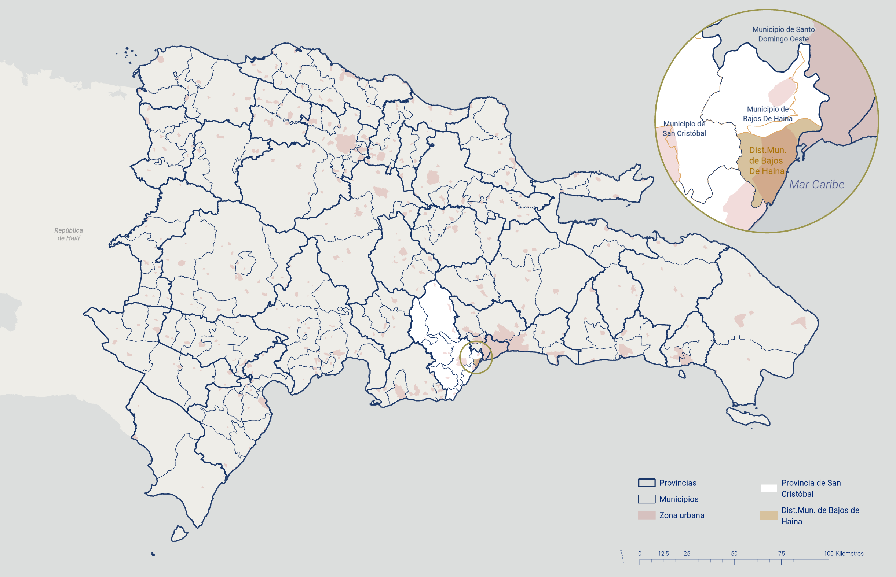
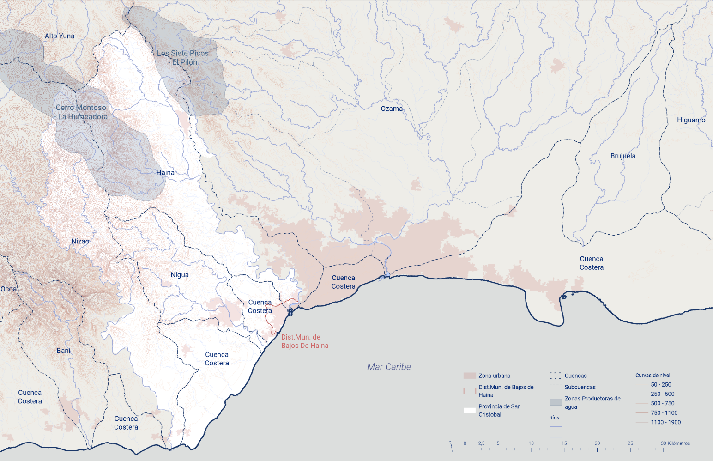
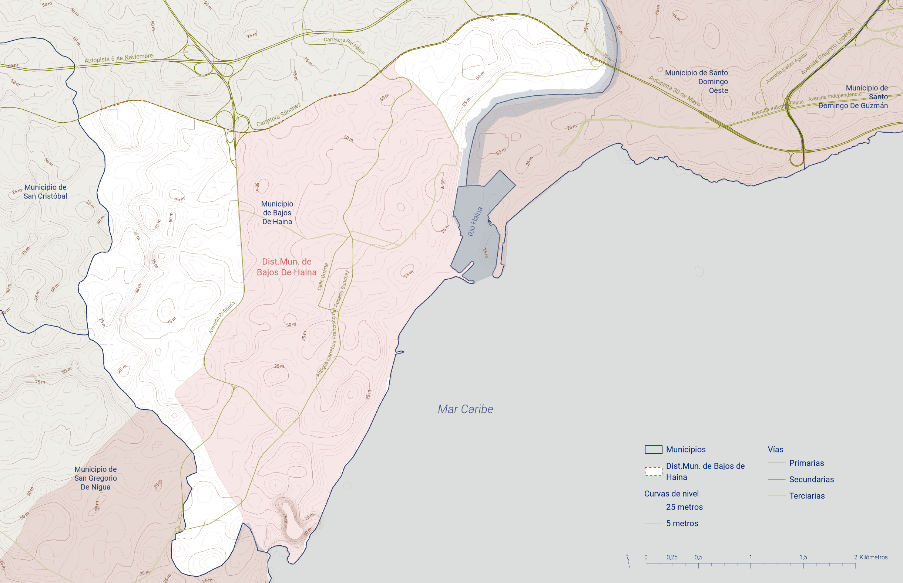
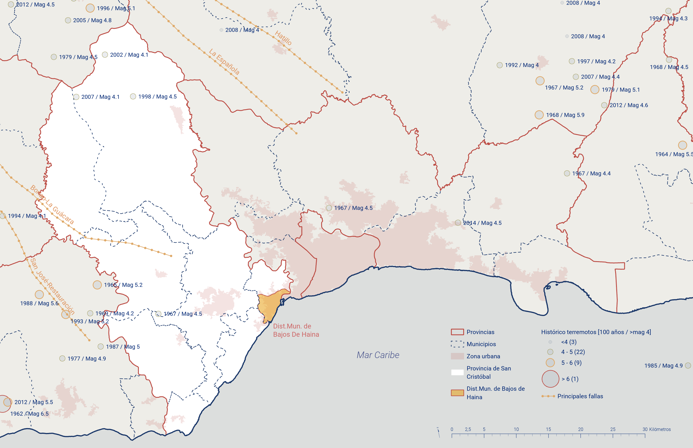
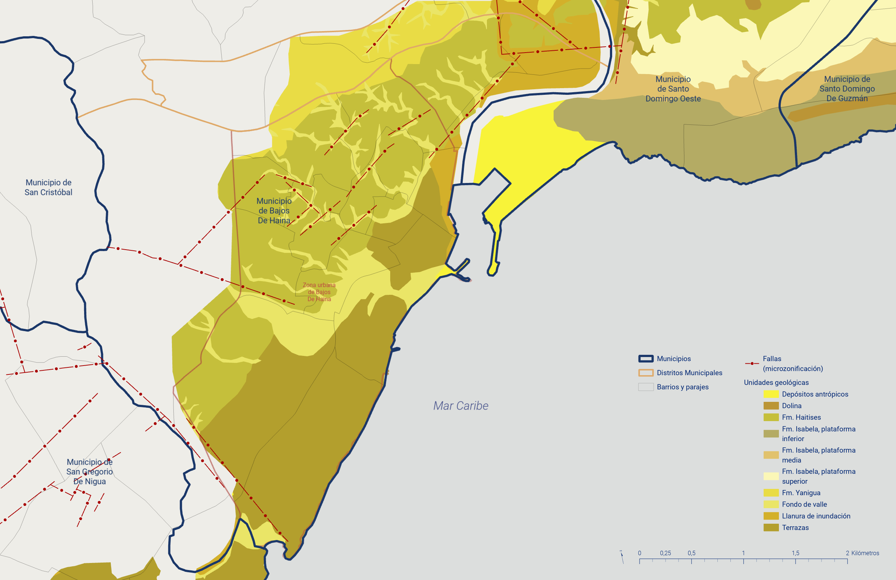
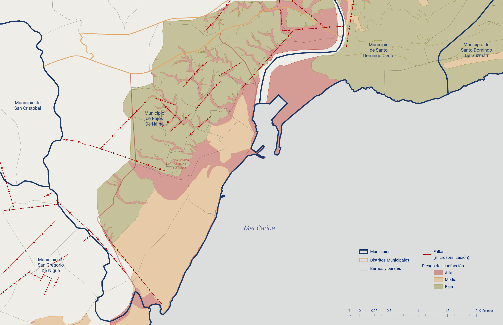
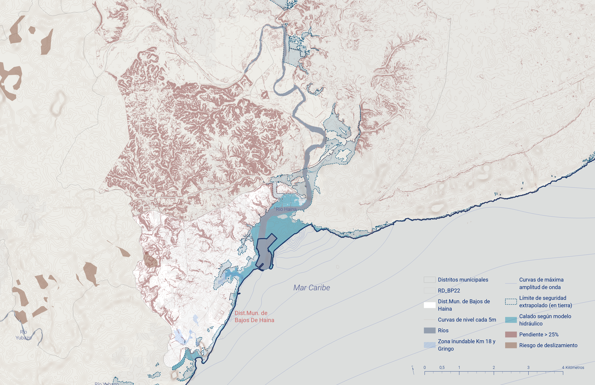
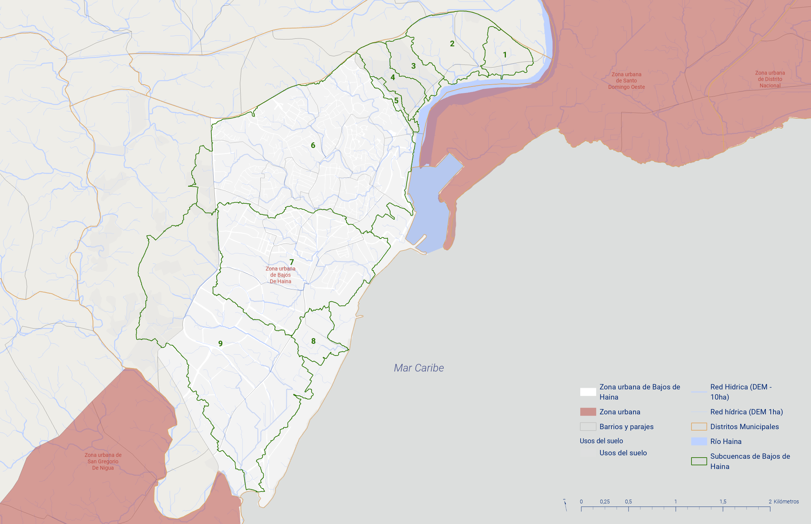
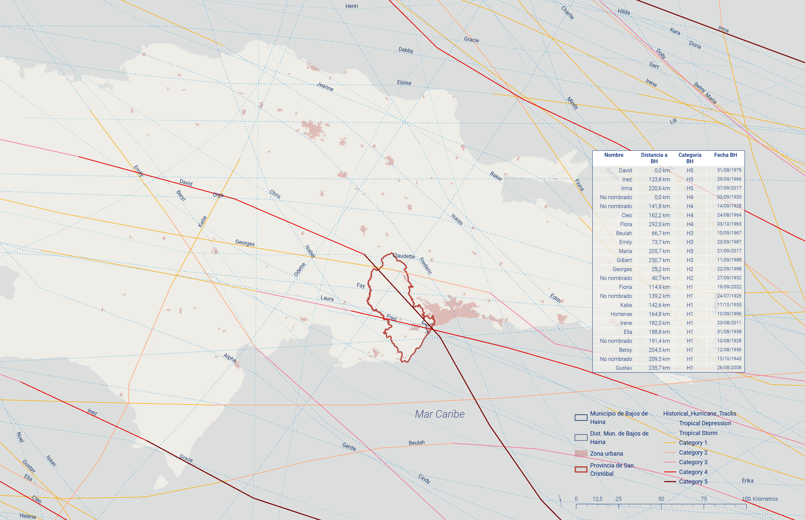

> **Fecha:** agosto 2025 **Objetivo específico:** **OE1** **Resultado:** R.4 Diagnóstico municipal **Palabras clave:** Bajos de Haina, REFIDOMSA, Contaminación por plomo, Densidad urbana, Amenazas naturales y antrópicas, Censo 2022, 16 Manzanas piloto

Bajos de Haina condensa en un territorio de 39.5 km² una combinación poco frecuente en la República Dominicana: el primer polo industrial del país, con la Refinería Dominicana de Petróleo y más de doscientas unidades productivas, convive con tejidos residenciales de alta densidad, pasivos ambientales históricos ligados al reciclaje de baterías y una exposición simultánea a amenazas de inundación, sequía y sísmicas. Esa acumulación de fenómenos hace del municipio un caso singular para el diagnóstico territorial del **OE1**: un escenario donde las tensiones entre desarrollo económico, ocupación del suelo y vulnerabilidad social se manifiestan de forma especialmente aguda. El recorrido del capítulo avanza de los antecedentes históricos e industriales a las amenazas naturales y antrópicas, y desciende luego hasta el inventario físico de las 16 manzanas seleccionadas para el levantamiento LiDAR y la encuesta domiciliaria.

## Antecedentes {#sec-antecedentes-03}

El municipio de Bajos de Haina, ubicado en la provincia de San Cristóbal, República Dominicana, enfrenta una serie de desafíos significativos en términos de gestión de riesgos debido a su alta concentración industrial, densidad poblacional y problemas ambientales históricos.

Desde su establecimiento como municipio en 1981, y aun antes de esa fecha, Bajos de Haina ha experimentado un crecimiento industrial significativo. La presencia de industrias químicas, petroquímicas y de reciclaje ha operado como motor económico clave, pero también ha generado problemas ambientales y de salud pública de largo recorrido.

La operación histórica de plantas de reciclaje de baterías y de otras industrias ha dejado un legado de contaminación por plomo y otros metales pesados en suelo y aire. Entre 2006 y 2009 el Instituto Blacksmith clasificó a Haina como una de las localidades más contaminadas del mundo por contaminación industrial, con la zona de Paraíso de Dios como foco principal [@blacksmithinstituteWorldsWorstPolluted2006; @blacksmithinstituteWorldsWorstPolluted2007; @blacksmithinstituteWorldsWorstPolluted2009]. El impacto sanitario se expresó sobre todo en la población infantil, con niveles de plomo en sangre documentados en la literatura clínica [@kaulFollowupScreeningLeadpoisoned1999]. A raíz de aquellos informes, la Secretaría de Medio Ambiente, el Banco Interamericano de Desarrollo y diversas instituciones desplegaron programas de remediación [@diariolibreExplicanAccionesPara2006] que lograron que en 2013 Paraíso de Dios saliera de la lista global [@diariolibreHainaYaNo2013]. Sin embargo, la industria de producción y reciclaje de baterías ha seguido operando y los niveles de contaminación persisten, lo que mantiene a la población del sector en situación de vulnerabilidad hasta el presente [@ramirezImplicationsPhytoremediationHeavy2021].

Al riesgo industrial se suma el riesgo hídrico por sequía. Según el Equipo de Información Geoespacial (EIGEO) de la Comisión Nacional de Emergencias, el 6.32 % del territorio dominicano está sujeto a riesgo alto de sequía, el 17.26 % a riesgo medio y el 76.42 % a riesgo bajo. Bajos de Haina se encuentra entre los dieciocho municipios con riesgo alto de sequía [@mimarenaPlanAccionNacional2018].

La seguridad vial constituye otro frente crítico. La carretera Sánchez, una de las principales arterias del municipio, registra altos índices de accidentes de tránsito; un accidente fatal entre un autobús y un camión de carga puso recientemente en evidencia la urgencia de mejorar la gestión del tráfico y las medidas de seguridad vial. Los organismos de socorro y la Defensa Civil han insistido en la necesidad de intervenir la infraestructura vial para reducir estos riesgos [@diariolibreExpertoSeguridadVial2024].

La gestión inadecuada de residuos sólidos añade una capa adicional de desafío. El municipio ha enfrentado problemas recurrentes de recolección y manejo de basura, con efectos directos sobre la salud pública y la contaminación ambiental. Durante el período de la investigación, el alcalde Osvaldo Rodríguez anunció mejoras del servicio mediante cooperación con el Gobierno Central y campañas de concientización ciudadana [@listindiarioOsvaldoRodriguezSe2024].

En paralelo a estos desafíos, se han impulsado varios proyectos de infraestructura orientados a mejorar la calidad de vida y la seguridad. Entre las obras emprendidas destacan la reconstrucción del malecón, la intervención en la Playa El Gringo y la construcción de un parque urbano, iniciativas pensadas para revitalizar el área, dotar de espacios seguros y recreativos a los residentes y mejorar la infraestructura vial [@diariolibreDavidColladoDeja2023].

## Planteamiento del problema {#sec-planteamiento-problema-03}

Bajos de Haina es considerada según el "Análisis de riesgos de desastres y vulnerabilidades en la República Dominicana [@viplandeacciondipechoparaelcaribeAnalisisRiesgosDesastres2009] una de las dos comunidades con más alta exposición a multi peligros.

Bajos de Haina es un municipio con una elevada densidad poblacional, con una densidad estimada de 6,950 hab/km² en su zona urbana (calculado sobre los 100,527 habitantes del municipio cabecera y los 14.4 km² de superficie urbanizada). Con una población de 124,705 hab en 2010, que se incrementó a 159,888 hab según el Censo 2022 [@oneCensoNacionalPoblacion2022], con 77,950 hombres y 81,938 mujeres, residiendo en un reducido espacio de 39.5 km² [@oneBoletinTuMunicipio2022]. La aglomeración de personas en el territorio (4,050 hab/km² [@oneBoletinTuMunicipio2022]) produce un hacinamiento elevado que es una de las condiciones de vulnerabilidad más relevante. Las personas se han ubicado en cualquier espacio libre disponible incluidos cursos de agua y cañadas. El distrito urbano de Bajos de Haina ocupa apenas unos 14.4 km², de ahí su alta densidad.

La composición poblacional del municipio según los datos oficiales para el 2023 [@oneCensoNacionalPoblacion2022] es la siguiente, municipio cabecera 100,527 habitantes, distrito municipal El Carril 33,758 y distrito municipal de Quitasueño 25,603. El municipio de Bajos de Haina es el quinto mayor en población en todo el país de los municipios que no son cabecera de provincia, solo superado por los 4 municipios ubicados en la provincia de Santo Domingo (Santo Domingo Este, Santo Domingo Norte, Santo Domingo Oeste y Los Alcarrizos) y además supera en población a catorce provincias (Bahoruco, Dajabón, Elías Piña, El Seibo, Independencia, María Trinidad Sánchez, Montecristi, Pedernales, Hermanas Mirabal, Samaná, Santiago Rodríguez, Hato Mayor y San José de Ocoa).

El proceso de industrialización en Bajos de Haina, República Dominicana, se inició en 1950 con el comienzo de las operaciones productivas del Central Río Haina. A lo largo de las siguientes décadas, el desarrollo industrial continuó con la instalación de diversas empresas y complejos, como una envasadora de gas licuado de petróleo (Gas Caribe) en los años 60, la construcción del complejo termoeléctrico Haina en la misma década, el inicio de operaciones de la Refinería Dominicana de Petróleo en 1973, la creación de la Zona Industrial de Haina mediante el decreto presidencial 2581 en 1976, la consolidación de la industrialización con la instalación del Parque Industrial de ITABO en 1986, la construcción de las centrales termoeléctricas Itabo I e Itabo II en los años 80, y la creación de la Zona Franca Industrial Puerto de Haina en 1995.

A pesar de ser un importante centro económico para el país, Bajos de Haina enfrenta varios desafíos derivados de su particular proceso de desarrollo urbano, crecimiento poblacional y evolución social e institucional. El **uso inadecuado del territorio** se expresa en asentamientos humanos ubicados en zonas de alto riesgo, con condiciones de vida precarias, déficit de infraestructura y servicios básicos, y una mezcla desordenada de áreas industriales y residenciales sin planificación adecuada. La **concentración de población vulnerable en áreas de riesgo** sitúa a los grupos de bajos recursos económicos precisamente en las zonas más expuestas, lo que reduce su capacidad para enfrentar y recuperarse de los desastres. El **aumento de las amenazas por degradación ambiental** eleva progresivamente los niveles de riesgo en la medida en que se deteriora el medio natural. Por último, la **débil capacidad institucional para gestionar y reducir riesgos** refleja una incorporación insuficiente de estas preocupaciones en el proceso de desarrollo, tanto en las instituciones públicas y privadas como en los gobiernos nacionales y locales [@ruizBajosHainaIndustrializacion2001].

Estos problemas surgieron debido a la falta de medidas de planificación territorial adecuadas durante el proceso de industrialización del municipio, sin una proyección prospectiva de los usos del suelo y sin un plan maestro urbano que facilitara la organización de las actividades industriales en función de las necesidades del asentamiento.

El ayuntamiento municipal de Bajos de Haina, que inició su andadura institucional en 1982 con la elección de su primer alcalde, no ha logrado organizar su territorio por varias razones: las decisiones de desarrollo industrial emanaban del gobierno central; la ley que organizaba los ayuntamientos en esa época [@Ley345519521952] no facilitaba su implicación efectiva en la organización de su término municipal, principalmente por la falta de presupuesto suficiente; el crecimiento poblacional y la demanda de suelo residencial, suscitados por los empleos prometidos por la industrialización, desbordaban la capacidad de planificación; y las empresas se concentraron de manera inusitada en las cercanías del Puerto, en la zona de desembocadura del Río Haina y en la costa desde el KM 13 hasta el KM 18, tomando la vieja carretera Sánchez como eje.

Este fenómeno propició que en el municipio se generaran condiciones de vulnerabilidad multidimensionales que elevan su nivel de riesgo. Como resultado, Bajos de Haina fue seleccionado como uno de los 10 municipios prioritarios dentro del diagnóstico de riesgo de los municipios vulnerables del territorio nacional en el marco del Proyecto "Fortalecimiento de las Estructuras Organizativo-Funcionales de la Gestión de Riesgo ante Desastres en República Dominicana".

El municipio de Bajos de Haina es un ejemplo clásico de *construcción social de riesgo*[^03-territorio-1]. La construcción social de riesgos remite a la producción y reproducción de las condiciones de vulnerabilidad que definen y determinan la magnitud de los efectos ante la presencia de una amenaza natural [@beckSociedadRiesgo2006; @beriainGiddensBaumanNluhmann1996]; es por ello la principal responsable de los procesos de desastre.

[^03-territorio-1]: *El concepto de Construcción social del riesgo alude a los mecanismos sociales intrínsecos a una sociedad que, por inobservancia de determinadas normas y regulaciones, por dejación de responsabilidad, por debilidad de las instituciones o por desconocimiento permite la generación de vulnerabilidades que pueden resultar fatales para amplias capas de población y a veces ciudades completas.*

Por lo tanto, la tematización y problematización de los riesgos en una sociedad moderna y funcionalmente diferenciada, dista de las perspectivas positivistas y normativas que observan y definen los riesgos y peligros desde fuera, tomando formas objetivas, estáticas, mitológicas y destino predeterminado, sino más bien como una observación interna que opera al interior de la sociedad, de lo cual se deduce que dependiendo del punto de referencia de la observación, sea este el sistema económico, político, legal, entre otros, se construirá socialmente el riesgo o el peligro que sea tema o problema para el observador. Esto opera fáctica y materialmente en la realidad social, cuando las organizaciones o individuos toman decisiones que pueden conllevar riesgos y peligros para la sociedad.

## Justificación del análisis {#sec-justificacion-03}

El municipio de Bajos de Haina, conocido por su dinamismo industrial y comercial y su alta densidad poblacional, enfrenta una serie de desafíos significativos en términos de vulnerabilidad ante desastres naturales y antrópicos. Esta situación exige una gestión de riesgos de desastres efectiva y proactiva para proteger tanto a sus habitantes como a sus infraestructuras críticas, pudiendo este proceso apoyarse en el uso de tecnologías digitales avanzadas.

**Vulnerabilidad geográfica y climática.** Bajos de Haina está ubicado en una zona propensa a fenómenos naturales como huracanes, inundaciones y terremotos. La proximidad al mar y la presencia de ríos y cañadas urbanas no adecuadamente gestionadas incrementan el riesgo de inundaciones, mientras que la actividad sísmica en la región caribeña, influida por la presencia de las fallas de Neiba y La Trinchera de Los Muertos, añade una capa adicional de amenaza. La integración de tecnologías de monitoreo y predicción, como sistemas de información geográfica (SIG) y sensores remotos, permite una identificación precisa de áreas de alto riesgo y el desarrollo de estrategias de mitigación específicas. El proyecto FONDOCYT contribuyó a esta capacidad mediante el levantamiento de cartografía de riesgo con vuelos de dron e imagen LIDAR sobre las 16 manzanas de alta vulnerabilidad del municipio cabecera.

**Riesgos hídricos y sequías hidrológicas.** El suministro de agua potable es un servicio esencial que puede verse gravemente afectado por sequías y contaminación. La implementación de tecnologías de monitoreo del clima y del estado de los acuíferos, junto con sistemas de gestión del agua, resulta crucial para asegurar un suministro constante y seguro. La gestión de recursos hídricos debe incluir estrategias para la conservación y el uso eficiente del agua, especialmente en períodos de sequía. El diagnóstico territorial documentó 9 cuencas hidrográficas urbanas en el municipio cabecera, 6 de ellas con vertimiento no controlado al Río Haina, lo que agrava el riesgo de inundación en barrios como Bella Vista y Villa Penca.

**Salud pública y contaminación industrial.** La presencia de industrias conlleva riesgos significativos de contaminación del aire y del subsuelo, con graves repercusiones en la salud pública. La utilización de tecnologías de monitoreo ambiental, como sensores de calidad del aire y sistemas de detección de contaminantes en el suelo, es esencial para identificar y mitigar estos riesgos, complementada con protocolos de respuesta rápida y programas de salud pública. En Bajos de Haina, el barrio Paraíso de Dios figuró entre las diez localidades más contaminadas del mundo entre 2006 y 2009 por los niveles de plomo en sangre de niños asociados al reciclaje de baterías [@blacksmithinstituteWorldsWorstPolluted2007].

**Concentración industrial y riesgo tecnológico.** El municipio alberga una alta concentración de industrias, incluidas algunas de alto riesgo como plantas químicas y petroleras. Esta característica amplifica las posibles consecuencias de los desastres industriales en términos de daños materiales y ambientales. Los sistemas de monitoreo en tiempo real y las tecnologías de IoT mejoran significativamente la capacidad de detectar y responder a emergencias industriales de manera oportuna. El diagnóstico detectó la ausencia de catálogo público de sustancias peligrosas para el Complejo Industrial de Haina, lo que impide una planificación municipal de contingencias industriales efectiva.

**Densidad poblacional y vulnerabilidad socioeconómica.** Bajos de Haina es una de las áreas más densamente pobladas del país, con comunidades que frecuentemente viven en condiciones de vulnerabilidad socioeconómica. Estas comunidades son particularmente susceptibles a los impactos de los desastres y carecen en muchos casos de los recursos necesarios para recuperarse. Las aplicaciones móviles y plataformas digitales de comunicación comunitaria pueden empoderar a los residentes, facilitando el acceso a información vital en situaciones de emergencia. El levantamiento de 16 manzanas con Survey123 (n=155 hogares encuestados) confirmó este escenario: el Índice de Calidad Urbana (ICU) promedio fue de 1.4 sobre 3 y el 78.83% de los encuestados declaró no haber participado nunca en ningún proceso formal de toma de decisiones municipal.

**Capacidad institucional y respuesta comunitaria.** La capacidad institucional existente para la gestión de riesgos y la respuesta ante emergencias requiere refuerzo en recursos, capacitación del personal y coordinación interagencial. Las tecnologías de gestión de emergencias, como sistemas de gestión de incidentes y plataformas de coordinación en tiempo real, fortalecen estas capacidades para una respuesta efectiva ante cualquier desastre. El proyecto reactivó el Comité Municipal de Prevención, Mitigación y Respuesta (CM-PMR) y desplegó prototipos digitales de respuesta (Reporta Haina, tableros TDAV y Bluespots), cuya institucionalización mediante ordenanza municipal quedó pendiente al cierre del proyecto.

**Legislación y políticas públicas.** El análisis realizado permite identificar lagunas en las políticas públicas y la legislación vigente relacionadas con la gestión de riesgos. La adopción de tecnologías digitales implica revisar y actualizar las normativas para asegurar que las soluciones tecnológicas se integren de manera efectiva y segura en las estrategias de gestión territorial. Al cierre del proyecto, el Plan Municipal de Ordenamiento Territorial (PMOT) de Bajos de Haina se encontraba en formulación y ningún instrumento vigente incorporaba restricciones de uso de suelo vinculadas al riesgo de inundación o al entorno industrial.

## Caracterización básica del municipio Bajos de Haina {#sec-caracterizacion-municipio-03}

### Ubicación, descripción y características físicas {#sec-ubicacion-fisicas-03}

{#fig-oe1-01}

El municipio de Bajos de Haina pertenece a la provincia de San Cristóbal, en la región sur de la República Dominicana. Se encuentra ubicado entre los 18º 25' N y 70º 01' W. Sus límites son: Mar Caribe al norte y al oeste; el Distrito Municipal de Nigua al sur y la ciudad de Santo Domingo al este, separada de ésta escasamente por el río Haina. Por la vía terrestre Bajos de Haina dista a unos 15 kilómetros de Santo Domingo. El municipio se encuentra localizado en la cuenca baja del Río Haina, que tiene una extensión de unos 86 kilómetros y que precisamente desemboca al mar caribe en los límites municipales que comparte con la ciudad de Santo Domingo.

El Municipio Bajos de Haina está ubicado en el litoral sur de la República Dominicana, en el extremo sureste de la provincia San Cristóbal. Forma parte de la región sureste del país, específicamente a la subregión de Valdesia. El asentamiento se ubica en la cuenca baja oeste del río Haina, al suroeste del Municipio Santo Domingo Oeste, a unos 10 kilómetros de la ciudad de San Cristóbal, entre los 70°02'40" de longitud oeste y los 18°25'00" de latitud norte.

Los límites de Bajos de Haina son: Al norte la sección Manoguayabo del Municipio Santo Domingo Oeste, al sur el Mar Caribe, al este el Río Haina, (que lo separa del municipio Santo Domingo Oeste, de la provincia Santo Domingo) y al oeste el arroyo Itabo que lo separa del municipio de Nigua, de la cabecera de provincia San Cristóbal.

El Municipio tiene una extensión de 39.5 km² [@oneBoletinTuMunicipio2022], de los cuales el área urbana (Distrito Municipal de Bajos de Haina) ocupa aproximadamente 14.4 km² (36% del total), mientras que el área rural ocupa unos 25.5 km² (64%) [@oneDivisionTerritorial20212021].

### Relieve {#sec-relieve-03}

{#fig-oe1-12}

Bajos de Haina está ubicado en la llanura costera del Caribe, en el contexto de la cuenca del río Haina. La parte central del municipio se encuentra entre los 30 y 47msnm descendiendo hasta cero en la desembocadura del Rio Haina y la costa. El municipio posee suaves elevaciones hacia la carretera Francisco del Rosario Sánchez y la avenida 6 de noviembre.

Bajos de Haina es uno de los municipios de la provincia de San Cristóbal situado a menor altitud, junto con San Gregorio de Nigua.

{#fig-oe1-19}

### Clima y cambio climático {#sec-clima-cambio-climatico-03}

La exposición es el factor principal que determina el riesgo. Se relaciona directamente con el clima y se define como la presencia de personas, medios de subsistencia, especies o ecosistemas, funciones, servicios y recursos ambientales; infraestructura; o bienes económicos, sociales o culturales en áreas que podrían ser impactadas negativamente. [@ipccIPCC2023Climate2023]. Tiene una perspectiva física de proximidad al peligro que expresa la condición de desventaja debido a la ubicación de un sistema expuesto al riesgo [@icmaEvaluacionVulnerabilidadClimatica2016].

#### Temperatura histórica

![Temperaturas medias y precipitaciones históricas en Bajos de Haina. Fuente: meteoblue y Atlas Climático de la República Dominicana [@meteoblueDatosClimaticosMeteorologicos2024; @onametAtlasClimaticoRepublica2004].](img/oe1/oe1_20.png){#fig-oe1-20}

El municipio Bajos de Haina presenta una temperatura media anual de 25.7°C, con una media máxima de 30.5°C y mínima de 21.5°C. La temperatura más alta se suele registrar durante el mes de agosto (31.6 °C), mientras que la mínima (19.7°C) en el mes de enero. El modelo de distribución espacial de la temperatura media anual en la provincia San Cristóbal del Atlas Climático de la República Dominicana muestra para la mayor parte del territorio en Bajos de Haina valores en el intervalo de 24-26 °C que estacionalmente oscilan en el intervalo de 22 a 26°C [@meteoblueDatosClimaticosMeteorologicos2024; @onametAtlasClimaticoRepublica2004] .

![Cambio anual de temperatura en Bajos de Haina. Fuente: meteoblue [@meteoblueCambioClimaticoBajos2024].](img/oe1/oe1_21.png){#fig-oe1-21}

#### Temperatura futura

La temperatura media anual se incrementó en 0.8 °C en el municipio entre 1979 al 2023 [@meteoblueCambioClimaticoBajos2024] Coincidiendo con los escenarios de [@whoHealthClimateChange2021] para San Cristóbal que revelan aumentos sostenido entre 0.6 y 0.8°C en el período 2021-2040 bajo las cuatro trayectorias representativas de concentración (RCP).15 Bajo los escenarios más drásticos la temperatura continúa aumentando hasta 1.4°C en el período 2041-2060; 2.1°C en el período 2061-2080; y hasta 2.8°C al 2081-2100.

#### Precipitaciones históricas

![Variación anual de las precipitaciones en Bajos de Haina. Fuente: meteoblue [@meteoblueDatosClimaticosMeteorologicos2024].](img/oe1/oe1_22.png){#fig-oe1-22}

El municipio tiene una precipitación total anual de 1,448 mm, con máximos en mayo (188 mm) y octubre (187 mm). Se estiman 147 días de lluvia al año con una máxima en 24 horas de 282 mm en mayo. De acuerdo al modelo de distribución espacial [@onametAtlasClimaticoRepublica2004] la precipitación total anual en Bajos de Haina varía entre 1,500-1,750 mm en la mayor parte del territorio con poca variación estacional si bien ha experimentado periodos de grandes lluvias y sequias en periodos puntuales, como los que se observan en la gráfica.

![Anomalías mensuales de temperatura y precipitación en Bajos de Haina. Fuente: meteoblue [@meteoblueCambioClimaticoBajos2024].](img/oe1/oe1_23.png){#fig-oe1-23}

#### Precipitaciones futuras

![Mapa de riesgo a la sequía por subcuencas en la provincia San Cristóbal. Elaboración propia con datos de MIMARENA [@mimarenaPlanAccionNacional2018].](img/oe1/oe1_24.png){#fig-oe1-24}

Si bien la precipitación ha tenido una tendencia de disminución de unos 77.5 mm desde 1971 al 2023 [@meteoblueCambioClimaticoBajos2024] exhibe una alta variabilidad. Los escenarios de la Tercera Comunicación Nacional ya revelaban que si bien al 2050 la precipitación total anual disminuiría un 15 % en el sur del país (lo que alerta sobre posibles sequías), las condiciones de un ciclo hidrológico más intensificado facilitarían la ocurrencia de eventos extremos de lluvia con mayor propensión a inundaciones repentinas [@mimarenaPlanAccionNacional2018; @pnudTerceraComunicacionNacional2018]

### Población y economía {#sec-poblacion-economia-03}

#### Población y aspectos sociodemográficos

En el caso del municipio de Haina, sus 4,050 hab/km² [@oneBoletinTuMunicipio2022], lo convierten en el municipio con mayor concentración de habitantes de la provincia, superando en más de 16 veces el nivel de densidad del territorio nacional (220 hab/km²) y en más de 7 veces la densidad de San Cristóbal (524 hab/km²) [@oneCensoNacionalPoblacion2022].

![Demografía Bajos de Haina (nota: ilustración y datos obtenidos de [@oneBoletinTuMunicipio2022]).](img/oe1/oe1_25.png){#fig-oe1-25}

![Distribución de la población censada por sexo (nota: [@oneBoletinTuMunicipio2022]).](img/oe1/oe1_02.png){#fig-oe1-02}

#### Actividades económicas principales

Haina recibió la certificación como el Primer Distrito Industrial de República Dominicana, de parte del Ministerio de Industria y Comercio, MIC. y PRO-INDUSTRIA por el impacto de sus aportes económicos a través de la generación de empleos, exportaciones, compras internas y su potencial de desarrollo [@micmGobiernoDeclaraPrimer2022]. Según la Asociación de Industriales y Empresas de Haina y el Sur AIE-Haina y Sur, Haina es el "Corazón de la industria de República Dominicana". [@periodicoeldineroAIEHainaRegionPresenta2020]

En el periodo de enero a agosto de 2023 el Puerto de Haina movió en concepto de importaciones y exportaciones unos 13 mil millones de kilogramos brutos en mercancía. [@oneBaseDatosComercio2023]

De acuerdo con el estudio, "Impacto del Distrito Industrial de Haina y Región Sur en la economía dominicana", se muestra que una empresa de Haina generó en promedio ventas por 45.3 millones de pesos, cifra superior en un 111% a los 21.5 millones de pesos vendidos por una empresa promedio del sector formal [@aiehainaImpactoDistritoIndustrial2024].

La zona industrial de Haina, con sus más de 200 unidades industriales de todos los subsectores de producción nacional, ha logrado exportar a más de 40 países. Juega un papel importante para el proceso de transformación y de crecimiento económico del país.

El Distrito Industrial Haina tiene un estimado de 1,291 empresas, donde el 78.5% corresponde a empresas de servicios, un 20.4% es industrial y un 1.1% es del sector agropecuario.

#### Producción eléctrica

Haina produce 1713.18 giga watts de energía sobre los 21 mil 700 que se producen en el país sumadas todas las modalidades de producción de energía. Dos empresas generadoras EGE Haina y EGE Itabo desarrollan dos modalidades de producción tomando como base el combustible utilizado carbón y fuel oíl #2.

| Empresa | Central | Tecnología | Fuente primaria | Potencia instalada (MW) | Energía generada 2023 (GWh) |
|:-----------|:-----------|:-----------|:-----------|-----------:|-----------:|
| **EGE Haina** | Haina TG | Turbina de gas | Fuel #2 | 100 | 84.09 |
| **EGE Itabo** | Itabo 1 | Turbina de vapor | Carbón | 128 | 800.9 |
| **EGE Itabo** | Itabo 2 | Turbina de vapor | Carbón | 132 | 828.19 |
| **Total** |  |  |  | 360 | 1713.18 |

: Producción eléctrica Haina. Elaboración propia. {#tbl-produccion-electrica-haina .smaller}

| Región              |     2005 |     2010 |     2015 |     2020 |     2025 |
|:--------------------|---------:|---------:|---------:|---------:|---------:|
| **Yaque del Norte** | 2,027.86 | 1,887.54 | 1,769.72 | 1,670.00 | 1,587.16 |
| **Atlántica**       | 7,163.05 | 6,667.40 | 6,251.23 | 5,898.97 | 5,606.34 |
| **Yuna-Camú**       | 2,576.90 | 2,398.59 | 2,248.87 | 2,122.15 | 2,016.88 |
| **Este**            | 3,211.74 | 2,989.50 | 2,802.90 | 2,644.95 | 2,513.75 |
| **Ozama-Nizao**     | 1,159.64 | 1,079.40 | 1,012.02 |   954.99 |   907.62 |
| **Yaque del Sur**   | 4,079.97 | 3,797.66 | 3,560.62 | 3,359.97 | 3,193.30 |

: Proyección de disponibilidad hídrica por región (m³/hab./año). Tensión hídrica: 1,000-1,670. Escasez crónica: menos de 1,000. Datos de [@adieInforme2023Asociacion2023]. {#tbl-disponibilidad-hidrica-regiones .smaller}

### Importación y comercialización de combustible {#sec-importacion-combustible-03}

La Refinería Dominicana De Petróleo REFIDOMSA tiene una participación en el mercado local que supera el 60% de los productos derivados del petróleo y provee de seguridad al país, garantizando el abastecimiento continuo de combustibles [@m&bconsultingDiagnosticoEconomicosocialProvincia]. A nivel general REFIDOMSA posee una capacidad de almacenamiento de unos 2.3 millones de barriles. Ese almacenamiento lo encabeza el crudo con un 38.0%; le sigue el gasoil regular con un 15.0%; gasolina premium 12.0%; el kerosene/Jet A-1 9.0%; fuel oíl 8.5%; gasolina regular 6.0%; gasoil óptimo 5.7%; LPG 3.3% y AC-30 2.5%.

REFIDOMSA refina o produce unos 25 mil barriles diarios, para un total de 750 mil barriles al mes. Mientras, las ventas rondan los 1.8 millones de barriles, por lo tanto, importan alrededor de un millón de galones, lo cual representa un 60% de las ventas totales [@m&bconsultingDiagnosticoEconomicosocialProvincia].

REFIDOMSA proyecta una nueva terminal con facilidades para recepción, almacenaje y distribución de AC-30 (asfalto) en el muelle de Haina Occidental [@ehplusPrincipalesTerminalesImportacion2022].

### Zonas Francas y Zona Industrial {#sec-zonas-francas-03}

El parque Industrial Itabo (PIISA), ubicado en el sector del mismo nombre en Haina, entra en los cinco de mayor inversión individual con 448,782,869.76 en 2019 [@cnzfeInformeEstadstico20232023]. PIISA se considera la principal puerta de empleos en la provincia de San Cristóbal.

Al cierre de 2018 las exportaciones de la zona alcanzaron un valor de RD$13,265.4 millones, un aumento de RD$10,868.8 millones respecto a las estadísticas de 2010 [@aiehainaImpactoDistritoIndustrial2024].

### Amenazas naturales {#sec-amenazas-naturales-03}

Estos dos conceptos son parte esencial del sistema de la gestión de riesgos. Una definición muy completa del concepto de Riesgo, la aportan: Narváez, Lavell y Pérez Ortega "El riesgo es una condición latente que, al no ser modificada o mitigada a través de la intervención humana o por medio de un cambio en las condiciones del entorno físico-ambiental, anuncia un determinado nivel de impacto social y económico hacia el futuro, cuando un evento físico detona o actualiza el riesgo existente" [@narvezGestionRiesgoDesastres2009] y Amenaza es definida como "un peligro latente de que un evento físico de origen natural, o causado, o inducido por la acción humana de manera accidental, se presente con una severidad suficiente para causar pérdida de vidas, lesiones u otros impactos en la salud, así como también daños y pérdidas en los bienes, la infraestructura, los medios de sustento, la prestación de servicios y los recursos ambientales" [@lavellApuntesParaReflexion2007]

La evolución teórica científica ha dividido las amenazas en: Amenazas naturales, amenazas antrópicas y amenazas socio-naturales. Siendo la diferencia entre estas determinadas por la intervención o no de los seres humanos en su desarrollo como fenómeno.

#### Sismos

Por ser un poblado costero, en caso de un maremoto de gran magnitud, provocado por fallas sísmicas como la Trinchera de los Muertos o la de Neiba, Haina es susceptible de ser afectada por un tsunami, puesto que los movimientos telúricos generan ondas sobre la superficie del agua que se desplazan a gran velocidad y llegan a las costas adentrándose hasta por varios kilómetros. El municipio, como todo el país, está expuesto a sismos, que podría afectar a todo el municipio dependiendo de la magnitud e intensidad del sismo.

{#fig-oe1-03}

{#fig-oe1-04}

{#fig-oe1-05}

El municipio se asienta mayormente sobre suelos de caliza arrecifal intercalado con arenas y conglomerados, siendo en general suelos aptos para cimentaciones según su capacidad portante. En los cauces de los ríos se presentan aluviones y terrazas bajas, suelos blandos y saturados que con presión pueden dar lugar a asientos de la cimentación y que, en caso de sismo, generan licuación y por tanto asientos y hundimientos.

Este dato, que pudiera parecer poco relevante, sumado a la inadecuada ocupación de los cauces por asentamientos humanos, es un hecho altamente preocupante. La cartografía geológica evidencia que la parte baja del municipio (más próxima al mar) y los cursos de agua son una combinación de fondos de valle y llanura de inundación, componiéndose de gravas, arenas y lutitas, así como terrazas fluviales con gravas y arenas [@utecoMapaGeologicoRepublica2020].

{#fig-oe1-11}

Dependiendo de la magnitud del sismo se verán afectadas las zonas del borde costero donde se emplazan poblaciones e importantes instalaciones de carácter industrial, al igual que el Puerto de Haina.

#### Inundaciones (riesgo socio-natural)

Una de las problemáticas más desafiantes que tienen las ciudades dominicanas y específicamente Bajos de Haina, es la gestión de escorrentías acumuladas de aguas lluvias en los barrios de alta vulnerabilidad, sobre todo en los periodos de alta precipitación, eso se debe a elección inadecuado del sitio para asentamientos residenciales y a que el rápido desarrollo urbano descontrolado ha generado la impermeabilización de la ciudad, ocupando en la mayor parte de casos el eje drenante principal de las cuencas urbanas naturales o la creación de barreras urbanísticas de superficie o subterráneas y teniéndose pocas coberturas vegetales que ayuden a interceptar el agua de lluvia.

{#fig-oe1-06}

En el Municipio Cabecera de Bajos de Haina existen 9 cuencas hidrográficas, 6 de ellas vierten en el Río Haina y las otras 3 en el Mar Caribe. Las cuencas 5 y 8 (ver @fig-oe1-06) pertenecen a escorrentía de las calles y el resto son redes de cañadas y cursos de agua la mayoría sin tratamiento, además del Río Haina, que representan un aspecto de vulnerabilidad, un vector de riesgo y propagación de contaminación debido al gran volumen y caudal producido por las aguas pluviales que las recorren, al vertido de residuos sólidos en las mismas y las viviendas de sectores informales localizados en su trayectoria. Estas cañadas al propio tiempo constituyen una amenaza de inundaciones urbanas frecuentes [@pcaEvaluacionSocioambientalPrograma2023].

#### Huracanes

{#fig-oe1-07}

![Ciclones que han pasado a 100 km de las costas de RD entre 1922-2022. Elaboración propia a partir de [@knappInternationalBestTrack2010].](img/oe1/oe1_08.png){#fig-oe1-08}

El municipio de Haina se encuentra ubicado en la costa sur o sea frente al Mar Caribe esto lo hace altamente expuesto a huracanes y ciclones, La globalidad del municipio y provincia al que pertenece, se encuentran en una de las zonas de mayor amenaza a ciclones tropicales de todo el país. [@viplandeacciondipechoparaelcaribeAnalisisRiesgosDesastres2009]

En el año de 1979 el ciclón David de categoría 5 (escala Saffir-Simpson[^03-territorio-2]) afectó de forma directa este municipio devastándolo prácticamente por completo generando daños a nivel de las viviendas, la industria y formas productivas y las comunicaciones y servicios generales.

[^03-territorio-2]: *La escala Saffir-Simpson define y clasifica la categoría de un huracán en función de la velocidad de los vientos del mismo. La categoría 1 es la menos intensa (vientos de 119 a 153 km/h); la categoría 5 es la más intensa (vientos mayores que 250 km/h). La categoría de un huracán no está relacionada necesariamente con los daños que ocasiona. Los huracanes categorías 1 ó 2 pueden causar efectos severos dependiendo de los fenómenos atmosféricos que interactúen con ellos, el tipo de región afectada y la velocidad de desplazamiento del huracán. Los huracanes de categoría 3,4, ó 5 son considerados como severos.*[@nhccSaffirsimpsonHurricaneWind2021]

En 1998 el huracán George afecto sensiblemente el municipio generando inundaciones catastróficas y daños por los fuertes vientos de categoría 3.

![Amenaza a ciclones tropicales. Elaboración propia a partir de [@viplandeacciondipechoparaelcaribeAnalisisRiesgosDesastres2009].](img/oe1/oe1_09.png){#fig-oe1-09}

#### Sequías

El consenso de instituciones mundiales bajo el Marco de Sendai [@undrrInformeGrupoTrabajo2017; @wmoGuidelinesDefinitionCharacterization2023], define sequía como un período de tiempo anormalmente seco, lo suficientemente prolongado para ocasionar una escasez de agua, que se refleja en una disminución apreciable en el caudal de los ríos y en el nivel de los lagos y/o en el agotamiento de la humedad del suelo y el descenso de los niveles de aguas subterráneas por debajo de sus valores normales.

| Región              |     2005 |     2010 |     2015 |         2020 |     2025 |
|:--------------------|---------:|---------:|---------:|-------------:|---------:|
| **Yaque del Norte** | 2,027.86 | 1,887.54 | 1,769.72 | **1,670.00** | 1,587.16 |

: Proyección de la disponibilidad de agua per cápita por región hidrográfica (m³/hab./año). Elaboración propia. {#tbl-agua-per-capita .smaller}

La provincia de San Cristóbal está definida como de Alta Vulnerabilidad a sequia agrícola con base en Análisis de riesgos [@viplandeacciondipechoparaelcaribeAnalisisRiesgosDesastres2009]. En el caso de Haina no se encuentran ubicados importantes sistemas de producción agrícola, siendo las explotaciones básicamente de agricultura para consumo familiar en las zonas del distrito municipal El Carril. Las sequias en este municipio amenazan básicamente la disponibilidad de agua potable para los habitantes de sus zonas urbanas producidas por eventos de sequía hidrológica. Un elemento resaltable es que ante eventos de sequía los pobladores deben competir con las necesidades de agua para la producción industrial.

![Amenaza a sequías agrícolas. Elaboración propia a partir de [@viplandeacciondipechoparaelcaribeAnalisisRiesgosDesastres2009].](img/oe1/oe1_10.png){#fig-oe1-10}

| Planificación                   | Medio Ambiente y Recursos Naturales |
|:--------------------------------|:------------------------------------|
| **Obras Públicas y Comunicaciones** | Educación                           |
| **Agricultura**                     | Salud Pública y Asistencia Social   |
| **Fuerzas Armadas**                 | Policía Nacional                    |
| **Defensa Civil**                   | Cruz Roja                           |
| **Bomberos**                        | Recursos Hidráulicos                |
| **Agua Potable y Alcantarillados**  | Vivienda                            |
| **Organismos Municipales**          |                                     |

: Instituciones integrantes del Plan Nacional de Sequía. Elaboración propia basada en [@indhriPlanHidrologicoNacional2010; @mimarenaPlanAccionNacional2018]. {#tbl-instituciones-plan-sequia .smaller}

Conforme a lo definido en el Plan Nacional de Sequía y el Plan Hidrológico Nacional, se puede hablar de sequía hidrológica cuando existe, a escala regional, un total de precipitaciones menores a la media estacional (sequía meteorológica), lo que se traduce en un nivel de aprovisionamiento anormal de los cursos de agua y de los reservorios de agua superficial y subterránea [@indhriPlanHidrologicoNacional2010; @mimarenaPlanAccionNacional2018].

Como se observa en @tbl-disponibilidad-hidrica-regiones los datos establecen una situación de escasez crónica únicamente para la región hidrológica Ozama-Nizao que es en la que está ubicado Bajos de Haina. Esta situación de escasez crónica se incrementaría cada año partiendo del 2020.

#### Deslizamientos

Los deslizamientos son eventos que se presentan en zonas donde se conjugan factores naturales y antrópicos. Se asocian con la inestabilidad de terrenos donde incide el factor topográfico, el tipo de suelo, la pérdida de vegetación protectora, el nivel de saturación de agua del suelo y las intervenciones realizadas por la población sobre las laderas. En el caso de Haina se presentan en la zona urbana, asociados al mal manejo de las cañadas. Igualmente se han verificado eventos de deslizamiento por asociación de situaciones riesgos tales como la colmatación de los espacios por el crecimiento urbano, la ubicación de viviendas en zonas inadecuadas en ladera, episodios de lluvias prolongados y licuefacción de los suelos.

### Amenazas antrópicas {#sec-amenazas-antropicas-03}

Son no naturales o antrópicas las amenazas que se generan por la acción u omisión del ser humano respecto del medio ambiente, entre ellas: incendios forestales, contaminación por derrames de químicos, gases venenosos y partículas de hollín, acumulación de basuras, mala planificación e insuficiencia de redes de infraestructura, asentamientos ilegales y urbanizaciones precarias, etc.. [@undrrUNDRRTerminlogyHazard2007].

#### Incendios

Los incendios urbanos son emergencias que se generan provocadas por causas humanas o tecnológicas en viviendas, empresas y comercios ubicados en las ciudades. Los escapes de gas, los cortocircuitos y las conexiones irregulares al sistema eléctrico son los principales causantes de incendios según informaciones suministradas por la intendencia general de bomberos. En Bajos de Haina una de las causas más frecuentes de incendios catastróficos está relacionada con la combustión de los residuos sólidos urbanos almacenados de forma inadecuada en el vertedero municipal. En ocasiones también se denuncian causas humanas relacionadas con las actividades de los buzos que sobreviven de la basura quienes queman materiales en sus cercanías procurando metales u y otros productos.

#### Accidentes industriales

El peligro se basa en un examen de los estudios científicos disponibles. El concepto de riesgo o la probabilidad de efectos nocivos, y la comunicación subsiguiente de esa información, se introduce cuando se considera la exposición en conjunción con los datos sobre los posibles peligros.

El planteamiento básico en la evaluación de riesgos se describe con la sencilla fórmula: Peligro + Exposición = Riesgo Todo sistema de clasificación y comunicación de peligros (en relación con el lugar de trabajo, los consumidores o el transporte) empieza con una evaluación de los peligros que entrañan los productos químicos de que se trate. Su grado de peligrosidad dependerá de sus propiedades intrínsecas, es decir, de su capacidad para interferir en procesos biológicos normales, y de su capacidad para arder, explotar, corroer, etc... [@mimarenaGuiaNacionalRiesgos2020]

En Bajos de Haina se concentra uno de los mayores polos industriales del país. Este polo industrial está integrado por empresas de todo tipo, de forma específica establecer que se encuentran allí la única refinería de petróleo del país, las más importante empresa nacional de producción de componentes para la producción de pintura Multiquimica Dominicana diversos laboratorios de manufactura de medicamentos, producción y manufactura de baterías de automóviles, un importante almacenamiento de carbón mineral para la producción de electricidad en las centrales térmicas ITABO I y II, procesamiento y manufactura de agregados en GATTS INDUSTRIAL entre muchas otras sin presentar un listado exhaustivo.

Siguiendo la Guía Nacional de Riesgo en República Dominicana [@mimarenaGuiaNacionalRiesgos2020], se identifica la necesidad de: (a) establecer un sistema de identificación, clasificación y comunicación del peligro de las sustancias, materiales y mercancías peligrosas, con requisitos sobre etiquetas y fichas de datos de seguridad; (b) brindar información operativa utilizable por productores e importadores para el comercio, transporte y respuesta a emergencias con sustancias nucleares, biológicas, químicas y radiactivas (NBQRE); y (c) aprovechar las evaluaciones internacionales de sustancias ya certificadas, sin necesidad de nuevos ensayos propios.

El municipio no cuenta con un catálogo detallado de las empresas que allí están asentadas y mucho menos de los procesos industriales que allí se verifican. Tampoco se cuenta con un registro de las diferentes sustancias que se manipulan. Esta realidad supone un riesgo latente de accidentes industriales sobre los cuales las autoridades municipales, por el desconocimiento que hemos planteado anteriormente, no presenta ninguna capacidad instalada para actuar prospectivamente sobre el riesgo que significan y establecer regulaciones de protección para sus habitantes.

#### Contaminación ambiental

| Estudio | Fuente |
|:-----------------------------------|:-----------------------------------|
| **Elevated Blood Lead and Erythrocyte Protoporphyrin Levels of Children Near a Battery-recycling Plant in Haina, Dominican Republic** | [@kaulElevatedBloodLead1999] |
| **Follow-up screening of lead-poisoned children near an auto battery recycling plant, Haina, Dominican Republic** | [@kaulFollowupScreeningLeadpoisoned1999] |
| **Determinación de metales pesados en aguas y sedimentos del Río Haina** | [@perezDeterminacionMetalesPesados2004] |
| **Diagnóstico socioeconómico y ambiental del manejo de residuos sólidos domésticos en el municipio de Haina** | [@peraltaDiagnosticoSocioeconomicoAmbiental2011] |
| **Measuring the vulnerability of populations susceptible to lead contamination in the Dominican Republic: evaluating composite index construction methods** | [@ratickMeasuringVulnerabilityPopulations2013] |
| **Evaluación del potencial fitorremediativo para el control de la exposición al plomo y otros metales y restauración ambiental en Haina, República Dominicana** | [@sanchezEvaluacionPotencialFitorremediativo2017] |
| **Informe de Cumplimiento Ambiental. Haina y Municipios Circundantes** | [@mirsaInformeCumplimientoAmbiental2018] |
| **Implications of the phytoremediation of heavy metal contamination of soils and wild plants in the industrial area of Haina, Dominican Republic** | [@ramirezImplicationsPhytoremediationHeavy2021] |

: Estudios consultados sobre contaminación ambiental en Bajos de Haina. Elaboración propia. {#tbl-estudios-contaminacion-haina .smaller}

La zona de Haina presenta uno de los índices de vulnerabilidad y susceptibilidad ambiental más elevados de toda la isla, debido al cumulo de factores contaminantes, industriales, vehiculares y de extracción minera, la extracción minera està relacionada con explotación de agregados para la construcción.

En todo el municipio de Haina, Rio Haina y zonas circundantes, se han detectado niveles elevados de plomo y metales pesados, desde hace 20 años [@perezDeterminacionMetalesPesados2004] persistiendo hoy en día. En la actualidad el conjunto de fábricas que operan en Haina produce anualmente 9.8 toneladas de formaldehído, 1.2 toneladas de plomo, 416 toneladas de amonio y 18.5 toneladas de ácido sulfúrico, presentes en el oxígeno de la zona, también se han detectado 84 sustancias peligrosas, de las cuales 65 son tóxicos de importancia. Entre los contaminantes que se arrojan al suelo los más peligrosos serían: plomo con 74.2 toneladas, cobre con 91.3 toneladas, y ácido sulfúrico con 412 toneladas. Mientras, anualmente se vierten al agua 33.9 toneladas de ácido sulfúrico, 29.6 toneladas de ácido fosfórico, 4.5 toneladas de cloro y 10.2 toneladas de amonio [@ccadInventarioEmisionesContaminantes2009; @sanchezEvaluacionPotencialFitorremediativo2017; @mirsaInformeCumplimientoAmbiental2018; @ramirezImplicationsPhytoremediationHeavy2021].

#### METALOXA

El nivel más elevado de contaminación de todo Haina especialmente la zona urbana de Bajos de Haina, proviene del plomo residual encontrado en los terrenos donde funcionó la empresa de reciclaje de baterías de automóviles Metaloxa, que operó en el barrio Paraíso de Dios en 1979 y que fue clausurada en el año 1999, ante las persistentes protestas de sus habitante, de grupos ecologistas y tras detectarse altos niveles de plomo en sangre en niños de la zona. [@kaulFollowupScreeningLeadpoisoned1999].

#### Verde Eco-reciclaje Industrial (VERI)

Una auditoría independiente certificada por el Ministerio de Medio Ambiente y realizada por el Consorcio Medio Ambiente & Industria (MIRSA) confirmó que las operaciones de la empresa recicladora de celdas de plomo y productora de baterías "Verde Eco-reciclaje Industrial" (VERI) no cumplen con las normativas ambientales de la República Dominicana. La auditoría encontró numerosas violaciones graves al permiso medioambiental en el reciclaje de baterías para automóviles en sus instalaciones en Haina.

La auditoría reveló que la concentración de plomo en el aire era de 38 µg/m³ durante el día y 49 µg/m³ durante la noche, valores que exceden en 2533% y 3267%, respectivamente, el límite permitido de 1.5 µg/m³. Además, se detectó en los suelos próximos a VERI la presencia de cromo y plomo en niveles que superan los límites establecidos por la norma internacional de referencia [@mirsaInformeCumplimientoAmbiental2018].

#### Contaminación persistente

![Afectación geográfica de exposición a contaminantes derivados de reciclaje de baterías en Bajos de Haina. Niveles de plomo y zonas de mayor exposición. Fuente: [@mirsaInformeCumplimientoAmbiental2018; @ramirezImplicationsPhytoremediationHeavy2021].](img/oe1/oe1_13.png){#fig-oe1-13}

La contaminación ambiental en la zona de Haina ha tenido una débil remediación. Durante 20 años, se han llevado a cabo acciones específicas contra las fábricas contaminantes de plomo, logrando visibilizar la problemática y el cese de operaciones de METALOXA [@diariolibreMedioAmbienteCerrara2006]. También se han presentado demandas contra VERI en las instancias judiciales más elevadas [@copceeaAccionConstitucionalAmparo2019]. En este período, se ha creado y modificado la normativa medioambiental existente, se han emitido fallos judiciales a favor de los vecinos de las zonas afectadas y se han iniciado múltiples iniciativas por parte de ayuntamientos y ministerios.

A pesar de todas estas actuaciones e intervenciones, los niveles de contaminación en la zona permanecen invariables, siendo hasta el día de hoy uno de los puntos más afectados por la contaminación multisectorial de la isla [@ramirezImplicationsPhytoremediationHeavy2021].

#### Síntesis de factores ambientales críticos {#sec-factores-ambientales-criticos-03}

La sistematización del análisis territorial identifica seis factores ambientales críticos que condicionan la vulnerabilidad de Bajos de Haina y operan de forma interdependiente con los factores socioeconómicos descritos en @sec-05-factores-socioeconomicos.

| Factor ambiental | Situación actual | Nivel de impacto | Población afectada | Tendencia |
|:--------------|:--------------|:--------------|:--------------|:--------------|
| **Contaminación industrial** | Niveles críticos de plomo y otros metales pesados | Extremo | Toda la población, especialmente niños | Estable-negativa |
| **Gestión residuos sólidos** | Disposición inadecuada, vertederos improvisados | Alto | 100% territorio urbano | Deterioro progresivo |
| **Degradación de suelos** | Pérdida capacidad productiva y filtración | Medio-Alto | Zonas periurbanas | Acelerada |
| **Inundaciones recurrentes** | 9 cuencas urbanas sin manejo | Alto | 40% población estimada | Incremento por cambio climático |
| **Calidad/disponibilidad agua** | Escasez crónica región Ozama-Nizao | Alto | 100% población | Crisis proyectada 2025-2030 |
| **Presión sobre ecosistemas** | Pérdida cobertura vegetal y biodiversidad | Medio | Toda la cuenca | Irreversible sin intervención |

: Factores ambientales críticos y su nivel de impacto en el territorio. Síntesis del diagnóstico ambiental territorial. Elaboración propia. {#tbl-factores-ambientales-criticos-03 .smaller}

La estructura hidrográfica urbana complementa este diagnóstico ambiental. Bajos de Haina cuenta con nueve cuencas urbanas agrupadas en tres tipologías según su destino y nivel de riesgo, con una población en zona de influencia que supera los 95,000 habitantes en las cuencas que desembocan en el Río Haina.

| Cuenca | Destino | Longitud (km) | Población en zona de influencia | Nivel de contaminación | Riesgo inundación |
|:-----------|:-----------|:-----------|:-----------|:-----------|:-----------|
| **Cuencas 1-6** | Río Haina | Variable | \~95,000 habitantes | Alto | Muy Alto |
| **Cuencas 7-9** | Mar Caribe | Variable | \~65,000 habitantes | Medio-Alto | Alto |
| **Cuencas 5 y 8** | Escorrentía urbana | N/A | Toda zona urbana | Extremo | Crítico |

: Cuencas hidrográficas de Bajos de Haina: características y nivel de riesgo. Análisis hidrológico del territorio basado en [@pcaEvaluacionSocioambientalPrograma2023]. {#tbl-cuencas-hidrograficas-03 .smaller}

Según el análisis de riesgos del VI Plan de Acción DIPECHO para El Caribe [@viplandeacciondipechoparaelcaribeAnalisisRiesgosDesastres2009], el municipio se encuentra entre las dos comunidades con más alta exposición a multi-peligros del país. El Plan Hidrológico Nacional establece una situación de escasez crónica para la región hidrológica Ozama-Nizao, condición que se incrementaría a partir del 2020 [@indhriPlanHidrologicoNacional2010; @mimarenaPlanAccionNacional2018].

### Actores del territorio {#sec-actores-territorio-03}

La gobernanza del territorio en Bajos de Haina se articula en dos ámbitos institucionales complementarios que el libro desarrolla en capítulos específicos. Los actores de la **gestión de riesgos** (Sistema Nacional de Prevención, Mitigación y Respuesta, Comité Municipal de PMR, instituciones públicas, ONG con mandato en GRD, organizaciones comunitarias de base y empresas) se detallan en @sec-sistema-grd-05, con las tablas completas de instituciones integrantes del CMPMR y el inventario de actores involucrados con sus respectivos mandatos legales. Los actores de la **planificación urbana y el ordenamiento territorial** (Ayuntamiento, MEPyD, DGODT y el marco legal que los sustenta desde la Constitución hasta la Ley 368-22) se desarrollan en @sec-analisis-funcional-planificacion-04, junto con la estructura y los instrumentos de ordenamiento territorial vigentes.

La separación responde a una decisión editorial: el presente capítulo sitúa el contexto físico, histórico y ambiental del municipio, mientras que la dimensión institucional del riesgo y la planificación se aborda de forma integrada en los capítulos temáticos correspondientes, evitando la duplicación de tablas y referencias legales.

## Síntesis {#sec-sintesis-03}

El diagnóstico territorial de Bajos de Haina revela un municipio marcado por una paradoja estructural: constituye el primer polo industrial de la República Dominicana, con REFIDOMSA como referente económico de escala nacional, pero sus comunidades residenciales acumulan décadas de vulnerabilidad ambiental, informalidad urbanística y déficit de planificación. La densidad del Distrito Municipal, con 100,527 habitantes distribuidos en una zona urbana de aproximadamente 14.4 km², configura tejidos de alta ocupación donde el ICU promedio de 1.4 sobre 3 y el incumplimiento generalizado de retiros normativos, documentados en las 16 manzanas analizadas, reflejan la ausencia de regulación efectiva sostenida en el tiempo.

Los antecedentes históricos muestran que la contaminación por plomo y otras sustancias industriales no es un episodio resuelto sino una condición persistente que coexiste con los procesos de expansión urbana [@ramirezImplicationsPhytoremediationHeavy2021]. Las intervenciones institucionales documentadas, normativas, judiciales y de organismos públicos, no han revertido los niveles de contaminación multisectorial, lo que indica que el problema no es de información sino de gobernanza: el conocimiento técnico ha existido, pero los mecanismos de decisión y control no han operado con la efectividad necesaria. El riesgo industrial, el riesgo de inundación y la vulnerabilidad social no operan de forma independiente; se superponen territorialmente y se refuerzan mutuamente en los barrios de mayor densidad y menor acceso a servicios.

La caracterización físico-funcional identifica seis tipologías de manzana diferenciadas por uso del suelo, materialidad y grado de vulnerabilidad, lo que constituye el insumo primario para la normativa diferenciada formulada en el OE3 (véase @sec-recomendaciones-normativa-08). La estructura de actores territoriales, que integra el CMPMR, las juntas de vecinos, REFIDOMSA y la red de organismos nacionales, ofrece una base institucional sobre la que puede construirse un modelo de gobernanza más efectivo, siempre que los instrumentos de planificación, el PMOT y el sistema de información territorial, se desarrollen y sostengan más allá del ciclo de un proyecto de investigación.

<!-- BEGIN refs-per-chapter -->
## Referencias del capítulo {.unnumbered}

:::: {#refs-cap03 .references .csl-bib-body .hanging-indent entry-spacing="0" line-spacing="2"}
::: {#ref-adieInforme2023Asociacion2023 .csl-entry}
**ADIE**. (2023). *Informe 2023. Asociación dominicana de la indusrtia eléctrica*.
:::

::: {#ref-aiehainaImpactoDistritoIndustrial2024 .csl-entry}
**AIEHAINA**. (2024). *Impacto del distrito industrial de haina y región sur en la economía dominicana* \[2024\].
:::

::: {#ref-beckSociedadRiesgo2006 .csl-entry}
**Beck, U.** (2006). *La sociedad del riesgo* (M. R. Borras, J. Navarro, & D. Jimenez, Trans.). Paidós Barcelona.
:::

::: {#ref-beriainGiddensBaumanNluhmann1996 .csl-entry}
**Beriain, J.** (1996). *A. Giddens, Z. Bauman, n.luhmann, u.beck. Las consecuencias perversas de la modernidad: modernidad, contingencia y riesgo* (C. Sanchez Capdequí, Tran.). Anthropos.
:::

::: {#ref-blacksmithinstituteWorldsWorstPolluted2006 .csl-entry}
**Blacksmith Institute**. (2006). *The world's worst polluted places*.
:::

::: {#ref-blacksmithinstituteWorldsWorstPolluted2007 .csl-entry}
**Blacksmith Institute**. (2007). *The world's worst polluted places. The top ten of the dirty thirty*.
:::

::: {#ref-blacksmithinstituteWorldsWorstPolluted2009 .csl-entry}
**Blacksmith Institute**. (2009). *The world's worst polluted places*.
:::

::: {#ref-ccadInventarioEmisionesContaminantes2009 .csl-entry}
**CCAD**. (2009). *Inventario de emisiones de contaminantes criterio del aire en la República Dominicana*.
:::

::: {#ref-cnzfeInformeEstadstico20232023 .csl-entry}
**CNZFE**. (2023). *Informe estadstico 2023*.
:::

::: {#ref-Ley345519521952 .csl-entry}
**Congreso Nacional Republica Dominicana**. (1952). *Ley No. 3455 de Organización Municipal* (3455-1952).
:::

::: {#ref-copceeaAccionConstitucionalAmparo2019 .csl-entry}
**COPCEEA**. (2019). *Acción constitucional de amparo colectivo* (Sentencia núm. 0030-02-2019-SSEN-00136). República Dominicana Poder Judicial.
:::

::: {#ref-diariolibreExplicanAccionesPara2006 .csl-entry}
**Diario Libre**. (2006a). Explican acciones para combatir contaminación en haina. *Diario Libre*.
:::

::: {#ref-diariolibreMedioAmbienteCerrara2006 .csl-entry}
**Diario Libre**. (2006b). Medio ambiente cerrará empresa contamina con plomo. *Diario Libre*.
:::

::: {#ref-diariolibreHainaYaNo2013 .csl-entry}
**Diario Libre**. (2013). Haina ya no es de los más contaminados del planeta. *Diario Libre*.
:::

::: {#ref-diariolibreDavidColladoDeja2023 .csl-entry}
**Diario Libre**. (2023). David collado deja iniciadas obras en los bajos de haina que impactarán en el turismo. *Diario Libre*.
:::

::: {#ref-diariolibreExpertoSeguridadVial2024 .csl-entry}
**Diario Libre**. (2024). Experto en seguridad vial critica la colocación de barandillas en la carretera sánchez. *Diario Libre*.
:::

::: {#ref-ehplusPrincipalesTerminalesImportacion2022 .csl-entry}
**EHPLUS**. (2022). Principales terminales de importación y almacenamiento de \*combustibles\* en RD: Refidomsa. *EHPLUS+*.
:::

::: {#ref-icmaEvaluacionVulnerabilidadClimatica2016 .csl-entry}
**ICMA**, **ICF**, **FEDOMU**, & **ADN**. (2016). *Evaluación de la vulnerabilidad climática del distrito nacional para el plan de ordenamiento territoria*. ICMA.
:::

::: {#ref-indhriPlanHidrologicoNacional2010 .csl-entry}
**INDHRI**. (2010). *Plan hidrológico nacional República Dominicana*.
:::

::: {#ref-ipccIPCC2023Climate2023 .csl-entry}
**IPCC**. (2023). *IPCC, 2023: Climate change 2023: Synthesis report. Contribution of working groups I, II and III to the sixth assessment report of the intergovernmental panel on climate change \[core writing team, H. Lee and J. Romero (eds.)\]. IPCC, geneva, switzerland.* (First). Intergovernmental Panel on Climate Change (IPCC). <https://doi.org/10.59327/IPCC/AR6-9789291691647>
:::

::: {#ref-kaulElevatedBloodLead1999 .csl-entry}
**Kaul, B.**, & **Mukerjee, H.** (1999). Elevated blood lead and erythrocyte protoporphyrin levels of children near a battery-recycling plant in haina, dominican republic. *International Journal of Occupational and Environmental Health*, *5*(4), 307--312. <https://doi.org/10.1179/oeh.1999.5.4.307>
:::

::: {#ref-kaulFollowupScreeningLeadpoisoned1999 .csl-entry}
**Kaul, B.**, **Sandhu, R. S.**, **Depratt, C.**, & **Franklin Reyes**. (1999). Follow-up screening of lead-poisoned children near an auto battery recycling plant, \_haina, dominican republic. *Environmental Health Perspectives Volume*, *107*(11). <https://doi.org/10.1289/ehp.99107917>
:::

::: {#ref-knappInternationalBestTrack2010 .csl-entry}
**Knapp, K. R.**, **Kruk, M. C.**, **Levinson, D. H.**, **Diamond, H. J.**, & **Neumann, C. J.** (2010). The international best track archive for climate stewardship (IBTrACS) unifying tropical cyclone data. *Bulletin of the American Meteorological Society*, *91*(3), 363--376. <https://doi.org/10.1175/2009BAMS2755.1>
:::

::: {#ref-lavellApuntesParaReflexion2007 .csl-entry}
**Lavell, A.** (2007). *Apuntes para una reflexión institucional en países de la subregión andina sobre el enfoque de la gestión del riesgo*.
:::

::: {#ref-listindiarioOsvaldoRodriguezSe2024 .csl-entry}
**Listín Diario**. (2024). Osvaldo rodríguez se convierte en el ganador de la alcaldía de bajos de haina. *listindiario.com*.
:::

::: {#ref-meteoblueCambioClimaticoBajos2024 .csl-entry}
**METEOBLUE**. (2024a). *Cambio climático bajos de haina*.
:::

::: {#ref-meteoblueDatosClimaticosMeteorologicos2024 .csl-entry}
**METEOBLUE**. (2024b). *Datos climáticos y meteorológicos históricos simulados para bajos de haina*.
:::

::: {#ref-micmGobiernoDeclaraPrimer2022 .csl-entry}
**MICM**. (2022). Gobierno declara primer "Distrito industrial" de RD en haina. In *Ministerio de Industria, Comercio y Mipymes - MICM*. https://micm.gob.do/transparencia/gobierno-declara-primer-distrito-industrial-de-rd-en-haina.
:::

::: {#ref-mimarenaPlanAccionNacional2018 .csl-entry}
**MIMARENA**. (2018). *Plan de acción nacional de lucha contra la desertificación y los efectos de las sequías PAN-LCD 2018-2030*.
:::

::: {#ref-mimarenaGuiaNacionalRiesgos2020 .csl-entry}
**MIMARENA**. (2020). *Guía nacional de riesgos en República Dominicana*.
:::

::: {#ref-mirsaInformeCumplimientoAmbiental2018 .csl-entry}
**MIRSA**. (2018). *Informe de cumplimiento ambiental. Haina y municipios circundantes*. MIRSA.
:::

::: {#ref-narvezGestionRiesgoDesastres2009 .csl-entry}
**Narvéz, L.**, **Lavell, A.**, & **Pérez Ortega, G.** (2009). *La gestión del riesgo de desastres: Un enfoque basado en procesos*.
:::

::: {#ref-nhccSaffirsimpsonHurricaneWind2021 .csl-entry}
**NHCC**, & **NOAA**. (2021). Saffir-simpson hurricane wind scale. In *Saffir-Simpson Hurricane Wind Scale*. https://www.nhc.noaa.gov/aboutsshws.php.
:::

::: {#ref-onametAtlasClimaticoRepublica2004 .csl-entry}
**ONAMET**, & **JICA**. (2004). *Atlas climático de la República Dominicana*. ONAMET.
:::

::: {#ref-oneDivisionTerritorial20212021 .csl-entry}
**ONE**. (2021). *División territorial 2021*.
:::

::: {#ref-oneBoletinTuMunicipio2022 .csl-entry}
**ONE**. (2022a). *Boletín tu municipio en cifras bajos de haina - valdesia- san cristobal - el carril*. Oficina Nacional de Estadística.
:::

::: {#ref-oneCensoNacionalPoblacion2022 .csl-entry}
**ONE**. (2022b). *X censo nacional de población y vivienda*. Oficina Nacional de Estadística.
:::

::: {#ref-oneBaseDatosComercio2023 .csl-entry}
**ONE**. (2023). *Base de datos comercio exterior*.
:::

::: {#ref-pcaEvaluacionSocioambientalPrograma2023 .csl-entry}
**PCA**, **ARCOIRIS**, & **APTI**. (2023). *Evaluación socioambiental del programa integral de intervención de las cañadas en bajos de haina*.
:::

::: {#ref-peraltaDiagnosticoSocioeconomicoAmbiental2011 .csl-entry}
**Peralta, E.**, **Rosario, A. D.**, & **Vélez, C.** (2011). Diagnóstico socioeconómico y ambiental del manejo de residuos sólidos domésticos en el municipio de haina. *Ciencia y Sociedad*, *36*(2), 239--255. <https://doi.org/10.22206/cys.2011.v36i2.pp239-255>
:::

::: {#ref-perezDeterminacionMetalesPesados2004 .csl-entry}
**Pérez, J. B. C.**, **Gómez, C. L. M.**, & **Gómez, A.** (2004). Determinación de metales pesados en aguas y sedimentos del río haina. *Ciencia y Sociedad*, *29*(1), 38--71. <https://doi.org/10.22206/cys.2004.v29i1.pp38-71>
:::

::: {#ref-periodicoeldineroAIEHainaRegionPresenta2020 .csl-entry}
**Periódico elDinero**. (2020). AIEHaina y región sur presenta estudio sobre impacto económico del distrito industrial de haina. *Periódico elDinero*.
:::

::: {#ref-pnudTerceraComunicacionNacional2018 .csl-entry}
**PNUD**. (2018). *Tercera comunicación nacional de la República Dominicana ante la convención marco de las Naciones Unidas sobre cambio climático*.
:::

::: {#ref-ramirezImplicationsPhytoremediationHeavy2021 .csl-entry}
**Ramírez, A.**, **García, G.**, **Werner, O.**, **Navarro-Pedreño, J.**, & **Ros, R. M.** (2021). Implications of the phytoremediation of heavy metal contamination of soils and wild plants in the industrial area of haina, dominican republic. *Sustainability*, *13*(3), 1403. <https://doi.org/10.3390/su13031403>
:::

::: {#ref-ratickMeasuringVulnerabilityPopulations2013 .csl-entry}
**Ratick, S. J.**, & **Osleeb, J. P.** (2013). Measuring the vulnerability of populations susceptible to lead contamination in the dominican republic: Evaluating composite index construction methods. *GeoJournal*, *78*(2), 259--272. <https://doi.org/10.1007/s10708-011-9414-x>
:::

::: {#ref-ruizBajosHainaIndustrializacion2001 .csl-entry}
**Ruiz, V.**, & **Meyreles, L.** (2001). Bajos de haina. La industrialización local sin desarrollo. Efectos de un regimen municipal deformado. In *Mercados globales y gobernabilidad local*. Nueva Sociedad.
:::

::: {#ref-sanchezEvaluacionPotencialFitorremediativo2017 .csl-entry}
**Sánchez, A. R.** (2017). Evaluación del potencial fitorremediativo para el control de la exposición al plomo y otros metales y restauración ambiental en Haina, República Dominicana. In *Proyecto de investigación:*
:::

::: {#ref-undrrUNDRRTerminlogyHazard2007 .csl-entry}
**UNDRR**. (2007). *UNDRR terminlogy - hazard*. http://www.undrr.org/terminology/hazard.
:::

::: {#ref-undrrInformeGrupoTrabajo2017 .csl-entry}
**UNDRR**. (2017). *Informe del grupo de trabajo intergubernamental de expertos de composición abierta sobre los indicadores y la terminología relacionados con la reducción del riesgo de desastres*. ONU Ginebra.
:::

::: {#ref-utecoMapaGeologicoRepublica2020 .csl-entry}
**UTECO**, & **SGN**. (2020). *Mapa geológico de la República Dominicana*.
:::

::: {#ref-viplandeacciondipechoparaelcaribeAnalisisRiesgosDesastres2009 .csl-entry}
**VI Plan de Acción DIPECHO para El Caribe**. (2009). *Análisis de riesgos de desastres y vulnerabilidades en la República Dominicana. Documento de contribución al sistema nacional de prevención, mitigación y respuesta a desastres*.
:::

::: {#ref-whoHealthClimateChange2021 .csl-entry}
**WHO**. (2021). *Health and climate change: Country profile 2021: Dominican republic*. World Health Organization.
:::

::: {#ref-wmoGuidelinesDefinitionCharacterization2023 .csl-entry}
**WMO**. (2023). *Guidelines on the definition and characterization of extreme weather and climate events*.
:::
::::
<!-- END refs-per-chapter -->
