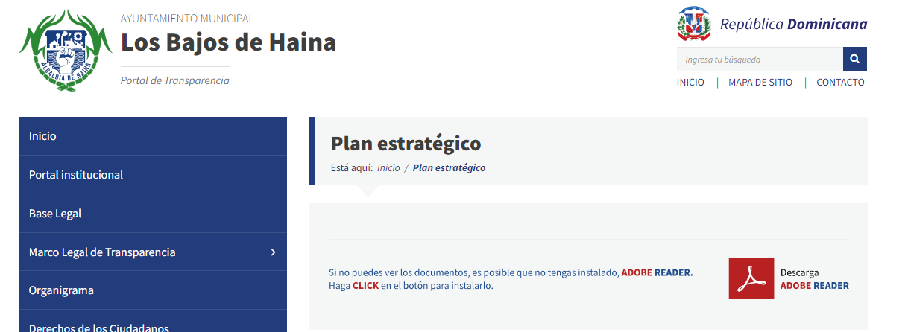

> **Fecha:** agosto 2025 **Objetivo específico:** OE1 **Resultado:** R.3 Participación diagnóstico

## Marco teórico {#sec-marco-teorico-06}

### Participación Ciudadana conceptos y enfoques

La participación ciudadana ha evolucionado desde movimientos cívicos emergentes en los años 90 hasta convertirse en un componente fundamental del Estado Social y Democrático de Derecho establecido por la Constitución actual [@republicadominicanaConstitucionRepublicaDominicana2024]. Esta transformación representa uno de los procesos de institucionalización participativa más comprehensivos de América Latina, con particular relevancia para el desarrollo de políticas públicas territoriales como las requeridas en Bajos de Haina, provincia San Cristóbal.

Los marcos teóricos internacionales han sido adaptados específicamente al contexto nacional, incorporando las particularidades de una democracia joven con instituciones en consolidación [@medinaParticipacionCiudadanaMediacion2011] El modelo conceptual integra la Escalera de Participación de Arnstein con los enfoques de organismos internacionales como CEPAL y PNUD, definiendo la participación ciudadana como "un derecho humano fundamental que permite a la ciudadanía participar en todas las etapas del ciclo de gestión de políticas públicas"[@participacionciudadanaSobreOrganizacion2025].

La conceptualización nacional trasciende los modelos clásicos al establecer constitucionalmente una "democracia participativa" que combina mecanismos de democracia directa con la representativa tradicional. Esta adaptación reconoce las características específicas del contexto latinoamericano y distingue entre "ciudadanía asistida" y "ciudadanía emancipada", identificando la necesidad de transitar hacia formas más activas de participación que superen el asistencialismo tradicional.

### Evolución de la Participación Ciudadana en República Dominicana

El desarrollo histórico experimentó una transformación gradual que puede periodizarse en cuatro etapas principales. La fase fundacional (1990-1996) se caracterizó por la emergencia de organizaciones de sociedad civil tras la estabilización democrática, destacando la fundación de Participación Ciudadana en 1993 como movimiento cívico apartidista que estableció precedentes metodológicos para la observación electoral y el monitoreo de políticas públicas [@dominicanasolidariaParticipacionCiudadana2025].

El período de reformas institucionales (2000-2010) marcó la construcción del andamiaje legal participativo. Las reformas representaron pasos cruciales hacia una justicia independiente y un gobierno transparente, culminando con la promulgación de la Ley 200-04 de Libre Acceso a la Información Pública, que estableció el derecho fundamental de acceso a información completa y oportuna de cualquier órgano del Estado [@presidenciadelarepublicadominicanaDecretoNo130052005; @congresonacionalrepublicadominicanaLeyNo200042014; @digeigMarcoLegalTransparencia2025].

La Ley 176-07 del Distrito Nacional y los Municipios introdujo los Consejos Económicos y Sociales Municipales como órganos consultivos para propiciar la participación ciudadana comunitaria, mientras que la Ley 498-06 creó el Sistema Nacional de Planificación e Inversión Pública [@congresonacionalrepublicadominicanaLeyNo176072007; @congresonacionalrepublicadominicanaLey49606Que2006].

| Período | Instrumento legal | Innovación principal | Impacto territorial |
|:------------------:|:----------------|:----------------|:----------------|
| 2004 | **Ley 200-04** | Acceso a información pública | Base de transparencia municipal |
| 2007 | **Ley 176-07** | Presupuesto participativo obligatorio | Cobertura universal municipal |
| 2010 | **Constitución** | Democracia participativa | Estado Social y Democrático |
| 2012 | **Ley 1-12 END 2030** | Participación social transversal | Planificación territorial |

: Evolución del marco legal de participación ciudadana en República Dominicana. Elaboración propia. {#tbl-marco-legal-participacion .smaller}

La revolución constitucional de 2010 representa el hito más significativo, proclamando un Estado Social y Democrático de Derecho con democracia participativa. El artículo 22 constitucional establece derechos específicos incluyendo decidir sobre asuntos mediante referendo, ejercer derecho de iniciativa popular y formular peticiones a poderes actual [@republicadominicanaConstitucionRepublicaDominicana2024].

La fase de consolidación participativa (2012-2025) se inició con la Ley 1-12 de Estrategia Nacional de Desarrollo 2030 [@congresonacionalrepublicadominicanaLey112Estrategia2012] resultado de un proceso participativo que incluyó 58 encuentros provinciales y más de 170 horas de deliberación del Consejo Económico y Social, estableciendo que "deberá promoverse la participación social en la formulación, ejecución, auditoría y evaluación de las políticas públicas" [@mepydInformesAnualesAvance2025].

### Instrumentos de planificación de Participación Ciudadana en República Dominicana

La Constitución Dominicana establece los fundamentos del sistema participativo a través de una arquitectura normativa comprehensiva. El artículo 7 define el Estado como "Social y Democrático de Derecho", mientras que el artículo 2 establece que "la soberanía reside exclusivamente en el pueblo, de quien emanan todos los poderes, los cuales ejerce por medio de sus representantes o en forma directa", reconociendo explícitamente la legitimidad de mecanismos de democracia directa.

El Sistema Nacional de Planificación e Inversión Pública (Ley 498-06) constituye el instrumento central de articulación participativa, coordinando la formulación, gestión, seguimiento y evaluación de políticas de desarrollo desde el nivel nacional hasta el territorial. Opera mediante Consejos de Desarrollo en tres niveles: provinciales, municipales y sectoriales, integrando representantes gubernamentales con organizaciones empresariales, profesionales, agropecuarias y de sociedad civil.

| Nivel | Instrumento | Composición | Función principal | Cobertura actual |
|:--------------|:--------------|:--------------|:--------------|:--------------|
| **Nacional** | Consejo Económico y Social | Sector público, privado y sociedad civil | Concertación estratégica nacional | Operativo |
| **Provincial** | Consejos Provinciales | Senadores, diputados, alcaldes, organizaciones | Territorialización de políticas públicas | 18 de 31 provincias |
| **Municipal** | Consejos Económicos y Sociales Municipales | Ayuntamiento y organizaciones locales | Planificación municipal participativa | 158 municipios |
| **Municipal** | Presupuesto Participativo | Ciudadanía y gobierno local | Decisión sobre inversión pública | Universal obligatorio |

: Estructura del sistema nacional de participación ciudadana. Elaboración propia. {#tbl-estructura-sistema-pc .smaller}

Los Consejos Provinciales de Desarrollo funcionan como espacios de concertación territorial donde representantes "discuten, analizan y proponen estrategias de desarrollo" y "promueven la participación ciudadana a través de organizaciones locales". Al 2021, operaban 18 consejos provinciales con proyección hacia cobertura completa [@11moInformeAnual2024].

El presupuesto participativo municipal representa la innovación más significativa del modelo nacional, siendo obligatorio constitucionalmente y regulado por la Ley 176-07. Este instrumento asigna hasta 40% de las transferencias nacionales para gastos de capital a decisión participativa ciudadana, siguiendo metodología tripartita: preparación y diagnóstico, consulta poblacional mediante asambleas comunitarias culminando en cabildo abierto, y ejecución con seguimiento y auditoría social

El país ha desarrollado un ecosistema digital robusto para la participación ciudadana que combina desarrollos propios con adaptaciones de plataformas internacionales. El Portal Único gob.do integra 305 trámites en línea reduciendo 46% el tiempo de respuesta de servicios públicos, mientras que el Sistema Nacional de Atención Ciudadana 3-1-1 proporciona registro y seguimiento multiplataforma de denuncias y sugerencias con cobertura nacional [@ogticPortalServiciosGobierno2025]

La implementación de la plataforma Go Vocal/CitizenLab para la formulación participativa de la Agenda Digital 2030 demostró la capacidad técnica nacional, procesando 850+ aportes de 1,015 participantes de más de 200 organizaciones durante seis meses de consulta estructurada, estableciendo precedentes metodológicos para consultas masivas digitales [@go-vocalComoGobiernoRepublica2023]

| Plataforma | Función | Alcance | Usuarios/Impacto |
|:-----------------|:-----------------|:-----------------|:-----------------|
| **Portal Único gob.do** | Trámites en línea | Nacional | 305 servicios, 46% reducción de tiempo |
| **Sistema 3-1-1** | Denuncias ciudadanas | Nacional | Multiplataforma, cobertura total |
| **Transparencia.gob.do** | Acceso a información pública | Nacional | Cumplimiento Ley 200-04 |
| **Datos.gob.do** | Portal de datos abiertos | Nacional | API disponible |
| **Go Vocal** | Consultas estructuradas | Específicas | 1.015 participantes Agenda Digital |
| **Tu PoliciApp RD** | Reportes de seguridad | Nacional | Georreferenciado |
| **Municipios Inteligentes** | Servicios municipales | 12 municipios | 1,5 millones de ciudadanos proyectados |

: Plataformas de gobierno digital en República Dominicana. Elaboración propia con base en [@ogticPortalServiciosGobierno2025; @go-vocalComoGobiernoRepublica2023]. {#tbl-plataformas-gobierno-digital .smaller}

Las experiencias municipales digitales muestran innovaciones en participación territorial. Santo Domingo Este implementó supervisión digital de obras de presupuesto participativo con transparencia en tiempo real, mientras que el Distrito Nacional asigna 150 millones de pesos para 50 sectores beneficiarios con seguimiento digital integral [@elnuevodiarioPresupuestoParticipativoSu2024].

Villa González (Santiago) representa el caso paradigmático del presupuesto participativo nacional, iniciado en 1999 bajo el lema "Conozcamos el Ayuntamiento y Trabajemos Juntos" antes de la promulgación de la ley que lo haría obligatorio. Esta experiencia pionera implementó un modelo "intensivo" inspirado en Porto Alegre, operando durante 10 años consecutivos con alta participación comunitaria, estableciendo las bases metodológicas posteriormente estandarizadas nacionalmente [@pogrebinschiLATINNODataset2017].

## Marco legal de la Participación Ciudadana en República Dominicana {#sec-marco-legal-participacion-06}

### Contexto legal

La Ley No. 55 creó e integró el Consejo Nacional de Desarrollo y se instituyó un Sistema Nacional de Planificación Económica, Social y Administrativa con el propósito de coordinar las políticas económicas y sociales del sector público. Posteriormente, el Decreto No. 613-96, de fecha 15 de diciembre de 1996, creó los Consejos de Desarrollo Provinciales y el 31 de julio de 1997, mediante Decreto No. 312-97, se aprobó el Reglamento de Aplicación de estos Consejos.

En el año 2006, mediante la Ley No. 496, se creó el Ministerio de Economía, Planificación y Desarrollo (MEPyD). En el mismo año, mediante la Ley 498, se crea el Sistema Nacional de Planificación e Inversión Pública, otorgándole funciones rectoras al MEPyD y como tal, responsable de planificar un armónico crecimiento del país, en lo económico, social, territorial e institucional.

### Instrumentos

La Ley 1-12 de la Estrategia Nacional de Desarrollo 2030 representa la guía por excelencia de la planificación del país a mediano y largo plazo. Otro de los instrumentos del Sistema Nacional de Planificación e Inversión Pública es el Plan Nacional Plurianual del Sector Público, que establece prioridades, objetivos, metas y requerimientos de recursos del sector público para un período de cuatro años. Los demás instrumentos corresponden a planes regionales, que expresarán las orientaciones del Plan Nacional Plurianual del Sector Público en los ámbitos regionales del país, e incluirá la participación de las alcaldías de los Municipios y del Distrito Nacional y los planes estratégicos sectoriales e institucionales a mediano plazo, que expresarán las políticas, objetivos y prioridades a nivel sectorial e institucional.

### Métodos

El Ministerio de Economía, Planificación y Desarrollo dispuso desde 2011 una serie de métodos de Planeación Estratégica encaminados a garantizar la eficiencia de los procesos de este organismo y de las instituciones públicas del país:

1.  **Enfoque de Marco Lógico (EML)**

Esta herramienta de gestión de proyectos proporciona una estructura analítica rigurosa para la formulación, implementación y evaluación de proyectos. Se basa en una matriz que relaciona sistemáticamente los objetivos, actividades, resultados, indicadores y fuentes de verificación.

2.  **Planificación de Proyectos Orientada a Objetivos (ZOPP)**

Metodología participativa desarrollada por la cooperación alemana (GTZ) que involucra a los actores clave en el diseño y planificación de proyectos. Mediante una serie de talleres estructurados, se identifican problemas, se definen objetivos y se elaboran estrategias de intervención precisas.

3.  **Planificación Estratégica Situacional (PES)**

Enfoque conceptualizado por Carlos Matus que integra el análisis situacional específico con la planificación estratégica. Este método se centra en comprender el contexto y las relaciones de poder, permitiendo la adaptación continua de las estrategias a las dinámicas contextuales.

4.  **Método ALTADIR de Planificación Popular (MAPP)**

Aproximación participativa orientada a la planificación comunitaria. Utiliza técnicas accesibles y visuales que facilitan la participación de la población local en la identificación de problemas, necesidades y la formulación de soluciones.

5.  **Análisis PROBES (Problemas, Objetivos y Estrategias)**

Metodología de planificación que se centra en la identificación sistemática de problemas clave, la definición precisa de objetivos y el desarrollo de estrategias específicas para abordar dichos problemas. Es particularmente útil para la gestión de proyectos y programas de desarrollo.

6.  **Metodología FLACSO de Planificación-Gestión**

Método desarrollado por la Facultad Latinoamericana de Ciencias Sociales (FLACSO) que combina teoría y práctica en la planificación y gestión de proyectos. Integra el análisis contextual, la participación de actores clave, y herramientas robustas de seguimiento y evaluación.

Desde ese entonces, el Ministerio de Economía Planificación y Desarrollo a través de la Dirección General de Desarrollo Económico y Social del Viceministerio de Planificación, brinda información bibliográfica y asistencia técnica para la aplicación de los métodos expuestos a efectos de garantizar procesos de planificación institucional de calidad.

### Planificación Municipal

La Ley 176-07 del Distrito Nacional y los Municipios estableció las competencias de los ayuntamientos y la definición de instrumentos para la planificación municipal. También confirió mandato a los ayuntamientos de formular Planes Municipales de Desarrollo (PMD) y establecer las Oficinas Municipales de Planificación y Programación (OMPP). Las otras leyes que respaldan las funciones de la OMPP corresponden a la Ley 498 -- 06 de Planificación e Inversión Pública y el Decreto 493-07 (coordinación interinstitucional y evaluación de la gestión) Reglamento de Aplicación nº 1 para la Ley nº 498 -- 06.

El principal instrumento para planificar las acciones del ayuntamiento en un periodo de gestión es el Plan Municipal de Desarrollo (PMD), que tiene una vigencia de cuatro años. Además, el ayuntamiento debe elaborar cada año un Plan Operativo Anual (POA) que detalle las actividades que realizarán los diferentes departamentos del ayuntamiento para avanzar hacia los objetivos del PMD. El POA es el insumo principal para elaborar el Presupuesto Municipal.

## Análisis situacional de la Participación Ciudadana en Bajos de Haina {#sec-situacional-participacion-06}

### Estado actual de los instrumentos y métodos de planificación y programación en Bajos de Haina

Debido a la carencia de información de libre acceso, se requiere levantar la data con fuentes secundarias obtenidas del Ayuntamiento y por medio de fuentes primarias, a través de encuestas o entrevistas directas con los funcionarios de esa institución, cuyo instrumento debe ser diseñado para cubrir las dimensiones Política/Institucional, Planificación Urbana y Gestión de Riesgos, en los factores de Diseño institucional, Sistemas legales y regulatorios, Intervención en GdR, Territorio, paisaje y biodiversidad, Modelo de ciudad, Gestión sostenible de los recursos y economía circular, Movilidad y transporte, Cohesión social e igualdad de oportunidades, Economía urbana, Vivienda, Liderar y fomentar la innovación digital, Cambio climático, Fenómenos naturales, Instrumentos de intervención y gobernanza.

### Presupuesto participativo

Se sugiere levantar la data correspondiente con el Ayuntamiento. Para ello, se debe estructurar la guía de sesión/entrevista o formulario para capturar la información con los funcionarios. Esta tarea debe partir de las dimensiones/componentes, factores/variables e indicadores contenidos en las tablas de operacionalización.

### Factores tecnológicos

### Nivel de desarrollo de la tecnología digital en la participación ciudadana de la República Dominicana

La ley No.1-12 de la Estrategia Nacional de Desarrollo 2030 determina como imprescindible que las distintas iniciativas de planificación estratégica a nivel institucional, sectorial y territorial, promovidas por las instituciones públicas centrales y locales cuenten con la participación y consulta de la sociedad civil, para la necesaria articulación y coherencia entre sí y con los instrumentos del Sistema Nacional de Planificación e Inversión Pública [@ministeriodeeconomiaplanificacionydesarrolloNormasTecnicasSistema2017], con la finalidad de elevar su eficacia En su artículo 15 consagra el derecho a la participación ciudadana al determinar que *"deberá promoverse la participación social en la formulación, ejecución, auditoría y evaluación de las políticas públicas, mediante la creación de espacios y mecanismos institucionales que faciliten la corresponsabilidad ciudadana, la equidad de género, el acceso a la información, la transparencia, la rendición de cuentas, la veeduría social y la fluidez en las relaciones Estado-Sociedad".*

Por su parte, el Consejo Económico y Social ha tramitado un proyecto de ley para la consulta ciudadana, en el artículo 35 de esta propuesta, define a la consulta ciudadana como el mecanismo a través del cual se somete a consideración de la ciudadanía los temas de un alto interés público y que tengan impacto social, económico y/o cultural en un sector o en una demarcación territorial específica o para la sociedad en términos generales. Por su parte, en el artículo 36 se menciona que todo ciudadano, de manera individual u organizada, tiene derecho de participar y ser escuchado en las consultas ciudadanas realizadas por las distintas dependencias del Estado, las cuales pueden convocar a consultas ciudadanas para recoger las opiniones y/o recomendaciones de la sociedad sobre sus planes, programas y políticas institucionales. No obstante, aún no ha sido aprobada esta ley.

En una búsqueda por los diferentes portales de instituciones públicas del país tan solo se encontró una noticia del Senado de la República Dominicana donde se menciona que se diseñó una herramienta de participación ciudadana denominada "Tu opinión cuenta"[@senadodelarepublicadominicanaTuOpinionCuenta2023]. El problema es que no existe un botón o menú de acceso, carece de secciones y la única interacción posible es dejar comentarios.

![Capturas de portal web, "Tu opinión cuenta" [@senadodelarepublicadominicanaTuOpinionCuenta2024].](img/oe1/oe1_15.jpeg){#fig-oe1-15}

De los anteriores tres párrafos se desprende que aún falta un camino por recorrer en el país en cuanto a la formalización, institucionalización o sistematización digital de la participación ciudadana. No obstante, algunas iniciativas del sector privado han tenido en cuenta la opinión de los residentes de las zonas de intervención de ciertos proyectos o en casos en los cuales se requiere de un monitoreo continuo ante riesgos en la población civil. En este último aspecto se destaca la iniciativa del diseño e implementación de "Mapeo mi barrio"[@arcoirisMapeoMiBarrio2020], una plataforma de herramientas tecnológicas de mapeo comunitario y visualización para generar capacidades frente a la pandemia generada por el COVID-19 desde cada barrio de República Dominicana.

![Capturas de pantalla, plataforma "Mapeo mi barrio" [@arcoirisMapeoMiBarrio2020].](img/oe1/oe1_16.jpeg){#fig-oe1-16}

Este desarrollo de Arcoíris, ONG dominicana, consta de una aplicación web con acceso a teléfonos inteligentes o computadores donde los ciudadanos registran en un formulario los datos personales, la ubicación, las características del hogar y el impacto del COVID-19 en el hogar. Esta información se procesa para luego ser visualizada en mapas interactivos y datos abiertos georreferenciados donde se identifican las zonas de mayor vulnerabilidad y la evolución del nivel de contagio en tiempo real.

{#fig-tecdig-participacion}

En la página web del Municipio Bajos de Haina se muestra la opción del Plan Estratégico, como también el Plan Municipal de Desarrollo y el Plan Operativo Anual (https://ayuntamientohaina.gob.do/transparencia/), no obstante, no aparecen documentos vinculados.

## Evaluación de la eficacia de las políticas de Participación Ciudadana {#sec-eficacia-politicas-06}

Se cree que existe una relación positiva entre la participación ciudadana y la transparencia y por ende en un mejor funcionamiento de la democracia. Esto aplica para los entornos locales, o sea para el funcionamiento democrático de los ayuntamientos municipales. La ley 176-07 establece en sus principios, específicamente en su letra J lo siguiente*: Participación del Munícipe. Durante los procesos correspondientes al ejercicio de sus competencias, los ayuntamientos deben garantizar la participación de la población en su gestión, en los términos que defina esta legislación, la legislación nacional y la Constitución.* Articulo 226.- Participación Ciudadana. Los ayuntamientos fomentarán la colaboración ciudadana en la gestión municipal con el fin de promover la democracia local y permitir la participación de la comunidad en los procesos de toma de decisión sobre los asuntos de su competencia.

Mas adelante establece que uno de los derechos de los munícipes es: *Participar en la gestión municipal de acuerdo con lo dispuesto en las leyes y reglamentos.* Los siguientes mecanismos efectivos de participación y consulta:

Articulo 123.- Define el Consejo Económico y Social Municipal.

El articulo 230 establece las vías de participación ciudadana:

-   El derecho de petición.
-   El referéndum municipal.
-   El plebiscito municipal.
-   El cabildo abierto.
-   El presupuesto participativo.

El articulo 231 establece los órganos de participación:

-   El Consejo Económico y Social Municipal
-   Los Comités de Seguimiento Municipal.
-   Los Consejos Comunitarios.

Estas disposiciones establecidas en la ley 176-07 no cuentan con un régimen de consecuencias por su incumplimiento remitiéndose a los derechos de denuncia y petición, para los cuales los ciudadanos tampoco tienen vías expeditas de fácil ejecución a su disposición.

Esto hace que los derechos de participación de los munícipes sean simples enunciados cuyo cumplimiento es fácilmente eludible como ocurre en la realidad en el municipio de Los Bajos de Haina.

## Transversalidad de la Participación Ciudadana {#sec-transversalidad-06}

En el Manual de Gestión Municipal del Sistema de Monitoreo de la Administración Pública( SISMAP) se plantea ""La participación ciudadana en los procesos de gestión municipal reviste de gran importancia para la propia Administración Pública Local, así como también para los/as munícipes en su condición de sujetos de participación". Esta es una relevante declaración de intencionalidad desde el ministerio de Administración Pública (MAP), pero que hasta el momento no deja de ser un simple enunciado de buenas intenciones. Un estudio realizado por el Centro Arcoíris para Ciudad Alternativa, OXFAM, Unión Europea y Fundación Solidaridad [@arcoirisSolidaridadLevantamientoNecesidades2019] titulado: Levantamiento de Necesidades Detectadas en el Terreno y su Desvinculación con Políticas Locales arrojò entre otras evidencias que *el 78,83%, nunca ha participado en actividades municipales*. *67,21% personas en los 15 municipios consultado en el estudio, no sabe lo que es el presupuesto participativo*. Estas evidencias muestran que el régimen de gobiernos locales está muy alejados de promover adecuadas experiencias de participación de sus respectivas comunidades. En el municipio de los Bajos de Haina, hasta el momento, no se detecta ninguna evidencia de procesos adecuados de participación ciudadana. En el mismo estudio citado se detecta que un 66,5 % de las mujeres en los municipios se auto percibe con necesidad de inclusión institucional y lo mismo expresa un 59.6% de los munícipes más jóvenes. Esto deja claro que en su mayoría las mujeres y los jóvenes no se sienten representados e incluidos en las políticas municipales.

### Política y gobernanza

La gobernanza local hace referencia a los procesos políticos e institucionales que median en la construcción e implementación de decisiones que impactan los territorios. Está demostrado que la Gobernanza es más eficaz mientras mayor es la participación, la inclusión y la transparencia. No se encontraron evidencias de acciones de promoción de la participación comunitaria en las implementaciones del ayuntamiento de Bajos de Haina. Una revisión rápida de su pagina web permite observar que no existe el documento del Plan Estratégico, ni del Plan Municipal de Desarrollo. Cuando se revisan algunas carpetas por ejemplo de contratos en sus carpetas de publicaciones solo aparecen dos contratos, uno de publicidad del 2022 y el de la recogida de basura a favor de Cleaning City Group de 2017, igualmente aparecen publicadas algunas, no todas, las actas de las sesiones del Concejo de Regidores. La Carta Iberoamericana de Participación Ciudadana en la Gestión Pública [@cladCartaIberoamericanaParticipacion2009] establece que: "La participación ciudadana en la gestión pública implica un proceso de construcción social de las políticas públicas. Es un derecho, una responsabilidad y un complemento de los mecanismos tradicionales de representación política". La Constitución Dominicana en su artículo 203. Sobre Referendo, plebiscitos e iniciativa normativa municipal. Dice : La Ley Orgánica de la Administración Local( 176-07) establecerá los ámbitos, requisitos y condiciones para el ejercicio del referendo, plebiscito y la iniciativa normativa municipales con el fin de fortalecer el desarrollo de la democracia y la gestión local. El espíritu participativo del régimen de gobiernos locales está, como se puede observar, constitucionalizado.

### Desarrollo sostenible

La participación ciudadana es una fuerza articuladora de la sociedad para el desarrollo sostenible. Así lo plantea el Observatorio Internacional de Democracia Participativa. [@ConferenciaAnualOIDP2019]. A nivel nacional la Ley 01-12 de Estrategia Nacional de Desarrollo 2030 establece como primer eje: "Un Estado social y democrático de derecho, con instituciones que actúan con ética, transparencia y eficacia al servicio de una sociedad responsable y *participativa*, que garantiza la seguridad y promueve la equidad, la gobernabilidad, la convivencia pacífica y el desarrollo nacional y *local*." Como se observa el carácter participativo del desarrollo para ser sostenible debe incorporar la participación de los ciudadanos, de manera especial en los entornos locales allí donde es mas efectiva. La propia ley establece como uno de sus objetivos, *Democracia participativa y ciudadanía responsable.* La República Dominicana se adhirió al pacto mundial de los Objetivos de Desarrollo Sostenibles (ODS). En ese Marco, el ODS 11 plantea: Lograr que las ciudades y los asentamientos sean inclusivos, seguros, resilientes y sostenibles. La meta 11.3 establece: De aquí al 2030, aumentar la urbanización inclusiva y sostenible y la capacidad para la planificación y la gestión participativas, integradas y sostenibles de los asentamientos humanos en todos los países. El indicador 11.3.2 de este ODS mide la proporción de ciudades con una estructura de participación directa de la sociedad civil en la planificación y la gestión urbanas que opera regular y democráticamente. En el caso del municipio de Haina no se observa ninguna iniciativa que procure el establecimiento de una agenda local que incorpore los ODS y plantee la vías y modelos de desarrollo sostenible en la escala local.

### Innovación social

"La innovación social se define como un proceso dinámico de desarrollo y aplicación estratégico de ideas, estrategias o intervenciones destinadas a abordar de forma proactiva los problemas sociales prevalentes e instigar un cambio positivo y transformador." [@jainQueEsInnovacion2023] En el libro *Construyendo La Innovación Social, Guía Para Comprender La Innovación Social en Colombia, página 28, se plantea que "...Una innovación es social cuando nace de una oportunidad que se instala en las comunidades, donde los entramados comunicacionales se hacen fuertes a la luz de problemáticas latentes, y a partir de una red de construcción simbólica se gestan focos de desarrollo y crecimiento. Este tipo de proceso hace que cambie la realidad colectiva, a partir de la suma de recursos humanos, tecnológicos, empíricos, ancestrales, donde la participación comunitaria cobra vida y se convierte en un modelo para la toma de decisiones".* El ejercicio que se propone con el presente proyecto de investigación procura precisamente crear de forma colectiva y con participación de la comunidad, sectores productivos y las autoridades un proceso innovador que incida positivamente en la realidad de la gestión de riesgo de desastres instalando estrategias y herramientas que mejoren las forma en que se trata ese aspecto en el municipio.

De todas formas es valido destacar que no se propone solo la creación de herramientas y nuevos procedimientos sino la generación, de forma colectiva, de una nueva cultura que detecte y potencie nodos articuladores y promueva una nueva cultura local para enfrentar los riesgos y peligros presentes.

## Encuesta de diagnóstico de la participación ciudadana en Bajos de Haina: ficha técnica {#sec-encuesta-ficha-06}

El diagnóstico participativo del proyecto incluyó una encuesta domiciliaria aplicada a residentes de Bajos de Haina durante el verano de 2024, con el propósito de caracterizar la situación de la participación ciudadana en el municipio a partir de las dimensiones de condiciones territoriales, actores y prácticas, y asociación, colaboración y apoyo. Los resultados detallados del procesamiento estadístico, incluidas las pruebas de fiabilidad, normalidad y correlación, se recogen en el Anexo E de este informe (@sec-estadisticas-localizacion-anexoE). Los apartados siguientes sintetizan la ficha técnica del instrumento.

### Descripción de la población

La población de referencia corresponde a los habitantes de Bajos de Haina. De acuerdo con el Censo 2022, se trata de 159.888 personas, de las cuales 77.950 son hombres y 81.938 mujeres.

### Metodología de selección de la muestra

La muestra se seleccionó por método de conveniencia, debido a problemas de seguridad en el acceso a algunos barrios. Los detalles sobre la distribución por barrio, edad y sexo de la muestra efectiva se presentan en la sección de caracterización y en el anexo estadístico.

### Técnica de recolección de información

La información se recogió mediante un formulario digital en Google Forms, aplicado por encuestadores del equipo del proyecto en visitas domiciliarias y puntos de encuentro comunitarios.

### Tamaño muestral

Se completaron **155 encuestas**, distribuidas de manera desigual entre los barrios cubiertos (Villa Penca, Bella Vista, Invi-Cea y otros).

### Intervalo de confianza

Se asignó un 95% como probabilidad para la media poblacional de los factores investigados. El intervalo de confianza resultante correspondió a un error estándar de 0,238, equivalente a un máximo de cuatro décimas de la escala y a un error aproximado del 5% (ver @sec-estadisticas-localizacion-anexoE).

### Período de levantamiento de la información

Entre el 11 de junio y el 24 de julio de 2024.

## Resultados de la encuesta {#sec-resultados-encuesta-06}

El presente apartado resume la fiabilidad del instrumento, la caracterización de la muestra y los hallazgos en las dimensiones y factores componentes de la participación ciudadana. Las salidas estadísticas completas (procesamiento de casos, Alfa de Cronbach, pruebas de normalidad Kolmogorov-Smirnov y matriz de correlaciones de Spearman) se incluyen en el Anexo E.

### Fiabilidad del instrumento

El diseño del instrumento de diagnóstico de la situación actual de participación ciudadana siguió las pautas que se consideran plausibles en este proceso. En este orden, se realizó una revisión sistemática de la literatura relacionada con participación ciudadana en países de Hispanoamérica, encontrándose que tan solo en la Junta de Andalucía se aplica actualmente una herramienta que permite cualificar el nivel de participación ciudadana en algunos procesos de planificación urbana. De manera paralela, se consultó a un grupo de expertos para estructurar el formulario a aplicar a los grupos de interés. Los grupos de interés se definieron como los habitantes de Bajos de Haina, los funcionarios del Ayuntamiento y empleados de Organizaciones Comunitarias del municipio.

Las preguntas finales corresponden a los factores y dimensiones establecidas a partir de los objetivos específicos de la investigación y se pueden visualizar en la sección de anexos.

La escala utilizada obedeció a un criterio de diseño estadístico, con transportación de la escala Likert a una estructurada de 1 a 10 a fines de lograr ítems homogéneos como mínimo recomendable para obtener un nivel de fiabilidad adecuado [@fieseDevelopmentFamilyRitual1993], de esta manera, se pudo estimar la fiabilidad del instrumento por medio de la prueba Alfa de Cronbach y compararla frente a estándares, además, se logró verificar la normalidad de las diferentes variables y establecer los modelos de análisis más adecuados (estadísticas paramétricas o no-paramétricas). Así las cosas, con base en 58 encuestas diligenciadas hasta el día 27 de junio, se evaluó la fiabilidad del formulario el cual arrojó un índice de 0.842, suficientemente elevado para considerar como fiable todo el instrumento y aplicarlo en el resto de la muestra.

La prueba de fiabilidad con las 155 encuestas presentó como resultado final un indicador de 0.812, similar al encontrado con las primeras 58. De esta forma, el proceso de inferencia estadística con la información final analizada se llevó a cabo sin inconvenientes y se tomaron en cuenta todos los factores para un análisis multivariado debido a la consistencia interna entre las preguntas del formulario.

Los resultados promedio por dimensión en la escala Likert de 1 a 10 permiten identificar las áreas de fortaleza y debilidad de la participación ciudadana en Bajos de Haina con base en la percepción directa de los residentes. Como se observa en la @fig-encuesta-promedios-06, los factores con mayor valoración corresponden a la disposición al trabajo en equipo con personas de diferente religión, raza, estratos, edades, partido político, género, rol y ocupación (7,3), la predominancia de intereses particulares en la participación ciudadana del municipio (6,9) y los inconvenientes y restricciones para una participación adecuada (6,2). En el extremo opuesto, los valores más bajos corresponden a las alternativas de formación ciudadana promovidas por el Ayuntamiento (3,3), la promoción de actividades participativas por parte del Ayuntamiento (3,6) y la apertura del gobierno local y los líderes locales para considerar las preocupaciones ciudadanas (3,9).

{#fig-encuesta-promedios-06 width=95%}

Los resultados por porcentaje de respuesta permiten identificar los comportamientos efectivamente reportados por los residentes, más allá de la percepción agregada. La @fig-encuesta-porcentajes-06 distingue cuatro bloques complementarios. En el bloque de **actividad participativa**, el hallazgo dominante es la alta participación electoral en las últimas elecciones locales (74,7 por ciento), contrastada con niveles muy bajos de protesta o manifestación (9,1 por ciento), denuncia a medios (7,8 por ciento) o notificación de problemas a las autoridades (5,8 por ciento). En el bloque de **fuentes de conflicto**, la desconfianza en funcionarios públicos (46,1 por ciento), la falta de capacitación de líderes (37,0 por ciento) y la carencia de liderazgo (32,5 por ciento) son las dimensiones más recurrentes. En el bloque de **acceso a internet**, la conectividad depende mayoritariamente de redes domésticas (61,3 por ciento) y móviles (58,1 por ciento). Finalmente, en el bloque de **acceso a plataformas de expresión**, el uso mayoritario de redes sociales privadas o grupos sociales (60,0 por ciento) contrasta con la escasa percepción de plataformas adecuadas para expresar quejas sobre gestión de riesgos (30,3 por ciento) y el bajo uso del sitio web del Ayuntamiento (11,6 por ciento).

{#fig-encuesta-porcentajes-06 width=95%}

Es importante mencionar que la estadística superior a 0,7 asegura una adecuada fiabilidad del instrumento [@georgeSPSSWindowsStep2003; @tavakolMakingSenseCronbachs2011]. En este orden, el valor de alfa oscila de 0 a 1. "Cuanto más cerca se encuentre el valor del Alfa a 1 mayor es la consistencia interna de los ítems analizados, es decir, se asume que los ítems están midiendo una misma dimensión" [@frias-navarroApuntesEstimacionFiabilidad2022].

### Caracterización de la muestra

El 98% de la muestra reside en Bajos de Haina, de los cuales, las dos terceras partes fueron mujeres, el 90% de 18 a 65 años de edad y cuatro de cada cinco encuestados fueron ciudadanos no pertenecientes al Ayuntamiento ni a organización comunitaria alguna.

<!-- Tablas duplicadas de @tbl-marco-legal-participacion, @tbl-estructura-sistema-pc y @tbl-plataformas-gobierno-digital eliminadas en Pasada 1 por redundancia. Contenido ya presente en §6.1. -->

| Casos        | N encuestas | N elementos |    \% |
|:-------------|------------:|------------:|------:|
| **Válido**   |         155 |         155 | 100,0 |
| **Excluido** |           0 |           0 |   0,0 |

: Resumen del procesamiento de casos (análisis SPSS, n=155). Elaboración propia. {#tbl-procesamiento-casos-spss .smaller}

| Alfa de Cronbach | N de elementos |
|-----------------:|---------------:|
|            0,812 |             14 |

: Estadísticas de fiabilidad: Alfa de Cronbach (n=155). Elaboración propia. {#tbl-alfa-cronbach .smaller}

### Pruebas de normalidad

De acuerdo con las buenas prácticas de análisis estadístico, se requiere desarrollar pruebas de normalidad para definir las técnicas y modelos de análisis para el adecuado proceso de inferencia. Así las cosas, se verificó la normalidad de cada factor por medio de la prueba de Kolmogorov-Smirnov sin encontrarse normalidad en ningún factor analizado para el total de la muestra, no obstante, al abrir o desglosar la data según barrio, se presentó normalidad en algunos de los indicadores analizados en los barrios Villa Penca y Bella Vista (ver anexo 3). Para consolidar las mismas técnicas en el procesamiento de la información, se determinó realizar pruebas no-paramétricas en todos los indicadores debido a que la mayor parte de estos no presentaron distribución normal. Así las cosas, se calculó la sumatoria de los cuatro mayores valores de la escala como medida de localización y se aplicó la prueba de Kolomogov-Smirnov para identificar la existencia de diferencias significativas entre las respuestas de los encuestados según barrio para cada indicador analizado.

### Pruebas de diferencias significativas

Con el propósito de enfocar el análisis según los desgloses por información demográfica, se recurrió a cruces entre variables y determinar las pruebas de diferencias entre indicadores. Al respecto, no se presentaron diferencias significativas entre los grupos de relación, edad ni sexo, pero si se encontraron diferencias significativas por barrio en la dimensión de condiciones territoriales (en los factores de formación, internet, plataforma y limitaciones y en la dimensión de actores y prácticas, específicamente en el indicador de trabajo en equipo, ver anexo 4. A continuación, los análisis y estadísticas para cada dimensión de análisis y los cruces respectivos por barrio.

### Dimensión condiciones territoriales

Esta dimensión de análisis comprende los factores de formación, infraestructura de internet, los recursos disponibles y las restricciones que presenta la ciudadanía para acceder a la participación en las decisiones del planeamiento urbano.

Las sumatorias de los cuatro mayores valores de la escala (porcentaje de personas que contestan de acuerdo con la afirmación) con relación a todos los factores analizados dejan entrever un largo camino para lograr proveer a la comunidad del ecosistema necesario para una adecuada participación ciudadana.

Es así como en el factor de formación (tabla 3) presenta un valor de 8,4% en el total de la muestra cuando se trata de iniciativas del Ayuntamiento y se incrementa a 29,7% con alternativas provenientes de organizaciones comunitarias. Al abrir o desglosar la data según el barrio, casi la tercera parte de los habitantes de Villa Penca consideran que existen alternativas de formación ciudadana promovidas por Organizaciones Comunitarias diferentes a las de Instituciones Educativas, pero tan solo dos personas de los 97 respondientes opinaron que el Ayuntamiento promueve alguna iniciativa de este tipo, lo que sugiere una oportunidad para replicar el actual modelo de formación de esas ONGs en toda la comunidad Haina.

Por otra parte, al analizar los recursos de internet y plataformas para participación comunitaria, tanto en decisiones de planeación como en gestión de riesgos, Bella Vista e Invi-Cea fueron los barrios donde una menor proporción de encuestados opinó se contaba con menos recursos, incluidos el acceso a internet, plataformas para reporte de riesgos, espacios y condiciones físicas para reuniones, en otras palabras, una mayor población de estos barrios percibe la disponibilidad de recursos digitales y físicos para la gestión de riesgos. Se identificó a Arcoiris como la ONG que promueve programas de capacitación en gestión del riesgo en el Barrio Villa Penca, de manera que se podría considerar la ampliación de la cobertura de esas iniciativas.

Con el fin de identificar el tipo de recurso disponible en la comunidad, la tabla 4 presenta los diferentes accesos a tecnología para la gestión de riesgos. Nueve de cada diez residentes de Villa Penca e Invi-Cea han reportado opiniones sobre gestión de riesgos, pero los habitantes de Bella Vista lo han realizado en menor proporción (70%). De manera adicional, más de la mitad de esta población ha reportado riesgos desde las redes sociales privada o de grupos sociales y más de las dos terceras partes lo han hecho por medio de plataformas, pero no del Ayuntamiento (tabla 4).

| Variable | Categoría | No pertenece a OC (N) | No OC (% col.) | Pertenece a OC (N) | OC (% col.) | Trabaja en Ayuntamiento (N) | Ayuntamiento (% col.) | Total (N) | Total (% col.) |
|:-------|:-------|-------:|-------:|-------:|-------:|-------:|-------:|-------:|-------:|
| **Edad** | No relaciona edad | 2 | 1,6% | 0 | 0,0% | 0 | 0,0% | 2 | 1,3% |
| **Edad** | 18 a 25 años | 24 | 19,5% | 6 | 20,7% | 0 | 0,0% | 30 | 19,4% |
| **Edad** | 26 a 35 años | 23 | 18,7% | 5 | 17,2% | 0 | 0,0% | 28 | 18,1% |
| **Edad** | 36 a 45 años | 24 | 19,5% | 4 | 13,8% | 2 | 66,7% | 30 | 19,4% |
| **Edad** | 46 a 55 años | 21 | 17,1% | 6 | 20,7% | 1 | 33,3% | 28 | 18,1% |
| **Edad** | 56 a 65 años | 17 | 13,8% | 7 | 24,1% | 0 | 0,0% | 24 | 15,5% |
| **Edad** | Más de 65 años | 12 | 9,8% | 1 | 3,4% | 0 | 0,0% | 13 | 8,4% |
| **Sexo** | Hombre | 39 | 31,7% | 15 | 51,7% | 1 | 33,3% | 55 | 35,5% |
| **Sexo** | Mujer | 84 | 68,3% | 14 | 48,3% | 2 | 66,7% | 100 | 64,5% |
| **Total** | Total | 123 | 100% | 29 | 100% | 3 | 100% | 155 | 100% |

: Distribución de la muestra por edad, sexo y relación con el Ayuntamiento. Elaboración propia. {#tbl-muestra-edad-sexo .smaller}

Una mínima parte de la población no cuenta con internet (6%), cuyo acceso se realiza por medio del teléfono móvil/celular o desde la casa. El 40% de los habitantes de Bella Vista acceden por los dos medios (Tabla 5).

| Indicadores de condiciones territoriales | Bella Vista | Invi-Cea | Villa Penca | Otros | Total |
|:-----------|-----------:|-----------:|-----------:|-----------:|-----------:|
| Se cuenta con alternativas de formación ciudadana promovidas por el Ayuntamiento, diferentes a las de Instituciones Educativas | 0,0% | 5,6% | 2,6% | 23,3% | 8,4% |
| Hay alternativas de formación ciudadana promovidas por Organizaciones Comunitarias, diferentes a las de Instituciones Educativas | 17,6% | 11,1% | 28,6% | 44,2% | 29,7% |
| Acceso a un internet adecuado (velocidad y capacidad) para presentar quejas u opiniones ante el gobierno municipal, para convocar o participar de reuniones entre vecinos u otros grupos | 23,5% | 11,1% | 20,8% | 32,6% | 23,2% |
| Se cuenta con plataforma(s) digitales para opinar o enviar información de Riesgos de los barrios | 11,8% | 16,7% | 32,5% | 41,9% | 31,0% |
| El Ayuntamiento de Bajos de Haina presenta limitaciones en recursos para el desarrollo de actividades de participación comunitaria | 35,3% | 33,3% | 50,6% | 58,1% | 49,0% |
| Suficiente disponibilidad de espacios en instituciones públicas o sedes comunales para realizar reuniones o eventos relacionados con actividades comunitarias o ciudadanas | 17,6% | 16,7% | 20,8% | 48,8% | 27,7% |
| Condiciones físicas de los espacios en instituciones públicas o sedes comunales adecuadas para realizar reuniones u eventos relacionados con actividades comunitarias o ciudadanas | 11,8% | 5,6% | 26,0% | 39,5% | 25,8% |
| Se presentan muchos inconvenientes y restricciones para una adecuada participación ciudadana en Bajos de Haina | 58,8% | 33,3% | 50,6% | 44,2% | 47,7% |
| Base | 17 | 18 | 77 | 43 | 155 |

: Condiciones territoriales para la participación ciudadana: suma de respuestas positivas (escala 7-10) por barrio. Elaboración propia. {#tbl-condiciones-territoriales .striped .smaller tbl-colwidths="\[60,8,8,8,8,8\]"}

### Dimensión Actores y prácticas

El indicador de disposición para trabajar en equipo, correspondiente a esta dimensión de análisis, resultó con diferencias significativas según barrio, siendo Bella Vista aquel donde sus pobladores manifestaron un nivel bajo de trabajo en equipo con personas de diferente religión, raza, estratos, edades, partido político, género, rol, ocupación, etc. En el total de la muestra analizada la suma de los cuatro mayores valores de la escala (de acuerdo) alcanzó las dos terceras partes de la muestra, demostrando que, en general, en Bajos de Haina no existe discriminación en el momento de incorporar a las personas en iniciativas de participación comunitaria (tabla 6).

Por otra parte, se evidencia una oportunidad para liderar los procesos de participación ciudadana en Bajos de Haina, debido a que cerca de las dos terceras partes de los encuestados no estuvieron de acuerdo con la afirmación (respuestas positivas).

La percepción de desconfianza en los funcionarios públicos, de carencia de liderazgo, de intereses particulares, como también la falta de capacitación y compromiso de los líderes, son los indicadores que más de la tercera parte de las personas encuestadas manifestaron como problemas para generar una adecuada participación ciudadana en Bajos de Haina. Una cuarta parte de los encuestados opinó de manera adicional que la falta de compromiso de la comunidad se aúna a los desafíos anteriores (tabla 7). En promedio, se mencionaron 3.2 problemas, siendo los residentes del barrio Bella Vista quienes más mencionaron desafíos (6 en promedio), así se corrobora que las iniciativas de capacitación e inclusión generan compromiso y participación ciudadanas.

| Acceso a plataformas para opinar o enviar información de riesgos de los barrios | Bella Vista | Invi-Cea | Villa Penca | Total |
|:--------------|--------------:|--------------:|--------------:|--------------:|
| Contamos con plataformas digitales propias del ayuntamiento | 5,9% | 0,0% | 1,3% | 1,8% |
| Lo hacemos en la página WEB del ayuntamiento | 0,0% | 16,7% | 15,8% | 13,5% |
| Lo hacemos desde redes sociales privadas o de grupos sociales | 41,2% | 55,6% | 63,2% | 58,6% |
| Nunca he presentado opiniones o quejas sobre GRD | 29,4% | 5,6% | 10,5% | 12,6% |
| No existen plataformas adecuadas para expresar quejas u opiniones sobre gestión de riesgos en el municipio | 35,3% | 38,9% | 23,7% | 27,9% |
| Total | 112% | 117% | 114% | 114% |

: Acceso y uso de plataformas para reporte de riesgos, por barrio. Elaboración propia. {#tbl-acceso-plataformas-riesgos .smaller tbl-colwidths="\[60,10,10,10,10\]"}

### Dimensión Asociación, colaboración y apoyo

En esta dimensión no se encontraron diferencias significativas por barrio, de manera que el proceso de inferencia se pudo desarrollar a nivel total de la muestra. En este orden, se identificó un acuerdo en que el Ayuntamiento y los líderes locales no tienen en cuenta las preocupaciones expresadas por la comunidad, además que la Alcaldía no promueve actividades en la que se abren espacios para participación comunitaria (tabla 8).

Desde la arista de la participación de la ciudadanía en los últimos doce meses, casi las tres cuartas partes de los residentes de Bajos de Haina han estado involucradas en las elecciones locales y más de la tercera parte de los encuestados refieren haberse reunido con un político, lo que sugiere una elevada participación de la comunidad en este tipo de actividades. Por otro lado, el 30% de las personas participantes de la encuesta manifestaron asistir a alguna reunión de la comunidad / junta de vecinos, audiencia pública, o a un grupo de discusión pública en los últimos doce meses, lo que indica una disponibilidad y actitud hacia la participación ciudadana (tabla 9).

| Medios para entrar a internet | Bella Vista | Invi-Cea | Villa Penca | Total |
|:--------------|--------------:|--------------:|--------------:|--------------:|
| Por el móvil (red móvil, señal en el celular) | 64,7% | 55,6% | 44,7% | 49,5% |
| Desde mi casa (red fija, con un plan de internet de hogar) | 76,5% | 50,0% | 56,6% | 58,6% |
| Ninguna | 0,0% | 5,6% | 7,9% | 6,3% |
| Total | 141% | 111% | 109,2% | 114% |

: Medios de acceso a internet por barrio. Elaboración propia. {#tbl-medios-acceso-internet .smaller}

A manera de triangulación de lo anterior, Villa Penca cuenta con la mayor cantidad de veces (10,3) y días (12,7) que las personas encuestadas trabajaron en los últimos doce meses en compañía con otros para algún beneficio de Bajos de Haina, no obstante, de manera paradójica, también los participantes de este barrio mencionaron la menor cantidad de veces (0,5 en un año, tabla 10) de unirse en función de presentar una petición en conjunto a funcionarios gubernamentales o a los líderes políticos para lograr un beneficio de la comunidad. Por otro lado, en Bella Vista, el porcentaje de personas que contribuyen con tiempo o dinero a la limpieza de las cañadas ascendió al 11,6%, en tanto las cifras de los demás barrios fue menor a 7%. Esto se explica por ser Bella Vista un barrio con mayores perjuicios debidos a las inundaciones por efectos de las lluvias.

La relativa baja participación de las personas (1,4 veces en promedio en el último año) para unirse en función de presentar una petición en conjunto a funcionarios gubernamentales o a los líderes políticos para lograr un beneficio de la comunidad valida los hallazgos de apartados anteriores, donde se mencionó que el Ayuntamiento no tiene en cuenta las preocupaciones expresadas por la comunidad, como tampoco promueve actividades en la comunidad en la que se permite que participen todos los integrantes de los barrios. A pesar de esta carencia de apoyo, las personas participan una vez al mes o cada dos meses en actividades para mejorar la calidad de vida de su comunidad.

| Actividades en los últimos doce meses | Bella Vista | Invi-Cea | Villa Penca | Otros | Total |
|:-----------|-----------:|-----------:|-----------:|-----------:|-----------:|
| Cantidad aproximada de veces que ha trabajado con otros en algun beneficio para Bajos de Haina | 3,1 | 7,3 | 10,3 | 3,3 | 5,4 |
| Cantidad aproximada de dias participando en actividades comunitarias | 4,4 | 2,8 | 12,7 | 12,8 | 9,5 |
| Porcentaje aproximado de personas que contribuyen con tiempo o dinero al desarrollo comun | 11,6 | 2,0 | 6,9 | 4,3 | 6,2 |
| Veces que se han unido para presentar peticion a funcionarios gubernamentales | 3,1 | 1,2 | 0,5 | 2,5 | 1,4 |
| **Base** | 17 | 18 | 77 | 43 | 155 |

: Actividades de participación comunitaria (frecuencia y días) en los últimos doce meses. Elaboración propia. {#tbl-actividades-participacion-12m .smaller}

### Análisis correlacional

Este apartado establece la correlación entre diferentes factores que se pueden considerar importantes para lograr una adecuada participación ciudadana. Un primer análisis se refiere a tomar como factor la facilidad para lograr la colaboración de la comunidad, medido como su antónimo "hay muchos inconvenientes y restricciones para una adecuada participación ciudadana en Bajos de Haina", frente a los demás factores. El resultado de la prueba de significación bilateral (*two tails*) de Spearman confirmó que la dificultad (inconvenientes y restricciones) de participación ciudadana se correlaciona directamente con las limitaciones en recursos por parte del Ayuntamiento y el predominio de los intereses y beneficios particulares.

Por otro lado, al considerar el factor de tomar en cuenta las preocupaciones expresadas por la comunidad para los procesos de decisión, se encontró una correlación significativa (prueba de Spearman) frente a los factores de formación, los recursos digitales (internet y plataformas), el liderazgo, el trabajo en equipo y la administración participativa (ver @sec-correlaciones-anexoE)

El coeficiente Rho de Spearman se utilizó como un estadístico no paramétrico debido a que no todas las variables del presente análisis se distribuyeron normalmente [@laerdstatisticsCronbachsAlphaSPSS2024].

De lo anterior se desprende la hipótesis que la participación ciudadana se podrá maximizar en la medida que el Ayuntamiento demuestre un mayor liderazgo, promueva el trabajo en equipo, evite los intereses y beneficios particulares, además de lograr los recursos digitales suficientes y la promoción de formación de la comunidad.

## Índice de gobernabilidad e institucionalidad {#sec-indice-gobernabilidad-06}

| Indicadores de actores y prácticas | Bella Vista | Invi-Cea | Villa Penca | Otros | Total |
|:-----------|-----------:|-----------:|-----------:|-----------:|-----------:|
| Disposición para trabajar en equipo con personas de diferente religión, raza, estratos, edades, partido político, género, rol, ocupación, etc. | 23,5% | 88,9% | 64,9% | 69,8% | 64,5% |
| En la participación ciudadana de Bajos de Haina predominan los intereses y beneficios particulares | 76,5% | 55,6% | 64,9% | 48,8% | 60,6% |
| Adecuado liderazgo de los procesos de participación ciudadana | 29,4% | 44,4% | 39,0% | 30,2% | 36,1% |
| Base | 17 | 18 | 77 | 43 | 155 |

: Actores y prácticas: suma de respuestas positivas (escala 7-10) por barrio. Elaboración propia. {#tbl-actores-practicas-barrio .smaller}

| Tipo de conflicto o desafío para la participación ciudadana | Bella Vista | Invi-Cea | Villa Penca | Total |
|:--------------|--------------:|--------------:|--------------:|--------------:|
| Desconfianza en los funcionarios públicos | 50,0% | 44,4% | 43,4% | 48,2% |
| Falta de capacitación de los líderes | 75,0% | 38,9% | 36,8% | 35,5% |
| Intereses particulares | 37,5% | 16,7% | 35,5% | 34,5% |
| Carencia de liderazgo | 25,0% | 44,4% | 28,9% | 32,7% |
| Falta de compromiso de los líderes | 31,3% | 33,3% | 27,6% | 30,9% |
| Incapacidad del Ayuntamiento para liderar | 43,8% | 38,9% | 26,3% | 29,1% |
| Bajo nivel de compromiso de la comunidad | 50,0% | 22,2% | 22,4% | 26,4% |
| Escasez de presupuesto | 50,0% | 11,1% | 13,2% | 18,2% |
| Intereses políticos partidarios | 18,8% | 5,6% | 7,9% | 16,4% |
| Locales adecuados para reunión | 37,5% | 5,6% | 11,8% | 14,5% |
| Desconocimiento de las problemáticas | 18,8% | 5,6% | 14,5% | 13,6% |
| Exclusión | 68,8% | 5,6% | 11,8% | 11,8% |
| Insuficiencia de infraestructura | 0,0% | 11,1% | 7,9% | 10,0% |
| No se presenta conflicto alguno | 100,0% | 0,0% | 2,6% | 1,8% |
| **Total** | 606% | 283% | 291% | 324% |

: Tipo de conflictos y desafíos para la participación ciudadana por barrio. Elaboración propia. {#tbl-conflictos-pc-barrio .striped .smaller}

| Indicadores de asociación y apoyo | Bella Vista | Invi-Cea | Villa Penca | Otros | Total |
|:-----------|-----------:|-----------:|-----------:|-----------:|-----------:|
| El Ayuntamiento y los líderes locales tienen en cuenta las preocupaciones expresadas por la comunidad | 5,9% | 16,7% | 9,1% | 25,6% | 14,2% |
| El Ayuntamiento promueve actividades en la comunidad en la que se permite que participemos todos los integrantes de mi barrio | 0,0% | 11,1% | 14,3% | 16,3% | 12,9% |
| Base | 17 | 18 | 77 | 43 | 155 |

: Asociación y apoyo: suma de respuestas positivas (escala 7-10) por barrio. Elaboración propia. {#tbl-asociacion-apoyo-barrio .smaller}

| Actividades que ha realizado en los últimos doce meses | Bella Vista | Invi-Cea | Villa Penca | Total |
|:--------------|--------------:|--------------:|--------------:|--------------:|
| Asistí a una reunión de la comunidad / junta de vecinos, audiencia pública, o a un grupo de discusión pública | 47,1% | 11,1% | 30,3% | 29,7% |
| Me reuní con un político | 11,8% | 50,0% | 39,5% | 36,9% |
| Participé en una protesta o manifestación | 11,8% | 5,6% | 6,6% | 7,2% |
| Participé en una campaña de información o elección | 0,0% | 11,1% | 14,5% | 11,7% |
| Alerté al periódico, la radio o a la televisión sobre un problema local | 5,9% | 0,0% | 7,9% | 6,3% |
| Notifiqué a la policía o los tribunales de un problema local. | 5,9% | 0,0% | 3,9% | 3,6% |
| Voté en las últimas elecciones locales | 58,8% | 77,8% | 75,0% | 73,0% |
| Ninguna | 5,9% | 16,7% | 13,2% | 12,6% |
| Total | 147% | 172% | 191% | 181% |

: Actividades de participación comunitaria realizadas en los últimos doce meses. Elaboración propia. {#tbl-actividades-pc-12m-2 .smaller}

## Factores socioeconómicos incluso demografía {#sec-factores-socioeconomicos-06}

La gestión del riesgo de desastres en Bajos de Haina está condicionada por una compleja interacción de factores socioeconómicos y demográficos que configuran un escenario de alta vulnerabilidad estructural. Como se detalla en el diagnóstico territorial presentado anteriormente en este informe, estos factores se articulan en torno a dinámicas poblacionales aceleradas y condiciones socioeconómicas precarias que amplifican significativamente la exposición al riesgo.

| Indicador | Valor | Comparación | Impacto en vulnerabilidad |
|:-----------------|:-----------------|:-----------------|:-----------------|
| **Densidad poblacional** | 4.007 hab/km² <!-- valor canonizado: ONE --> | 16 veces mayor que promedio nacional (220 hab/km²) | Hacinamiento crítico y presión sobre servicios |
| **Población total (2022)** | 159.888 habitantes | 5º municipio más poblado (no cabecera provincial) | Alta demanda de infraestructura urbana |
| **Distribución por género** | 77.950 hombres / 81.938 mujeres | Proporción equilibrada | Necesidad de políticas diferenciadas |
| **Certificación industrial** | Primer Distrito Industrial RD | Reconocimiento MICM y PRO-INDUSTRIA | Paradoja desarrollo económico vs. pobreza |
| **Movimiento portuario (2023)** | 13 mil millones kg | Principal puerto del país | Presión ambiental y logística |
| **Informalidad laboral** | \>60% (estimado) | Superior al promedio nacional | Ausencia de protección social |
| **Déficit habitacional** | No cuantificado | Proliferación asentamientos informales | Ocupación de zonas de riesgo |

: Indicadores demográficos y socioeconómicos de Bajos de Haina. Elaboración propia basada en [@oneBoletinTuMunicipio2022] y diagnóstico territorial del proyecto. {#tbl-indicadores-demografico-se .smaller}

El municipio presenta una densidad poblacional de 4,007 habitantes por kilómetro cuadrado <!-- valor canonizado: ONE -->, convirtiéndose en la concentración más alta de la provincia San Cristóbal, superando en más de 16 veces la densidad promedio nacional de 220 hab/km² y en más de 7 veces la densidad provincial de 524 hab/km² [@oneBoletinTuMunicipio2022]. Esta aglomeración poblacional extraordinaria, con 159,888 habitantes según el Censo 2022, distribuidos entre 77,950 hombres y 81,938 mujeres, genera condiciones de hacinamiento que constituyen uno de los factores de vulnerabilidad más críticos del territorio.

La dimensión económica del municipio presenta una paradoja significativa. Por un lado, Haina ostenta la certificación como Primer Distrito Industrial de República Dominicana otorgada por el Ministerio de Industria y Comercio (MICM) y PRO-INDUSTRIA, reconociendo su impacto económico a través de la generación de empleos, exportaciones y compras internas [@micmGobiernoDeclaraPrimer2022] El Puerto de Haina, en el período enero-agosto 2023, movilizó aproximadamente 13 mil millones de kilogramos brutos en mercancías, consolidándose como el "Corazón de la industria de República Dominicana" según la Asociación de Industriales y Empresas de Haina y el Sur [@periodicoeldineroAIEHainaRegionPresenta2020]. Sin embargo, esta robustez industrial contrasta marcadamente con indicadores sociales preocupantes que revelan la desconexión entre el desarrollo económico macro y el bienestar micro de la población local.

| Factor | Situación actual | Consecuencias directas | Impacto en gestión de riesgos |
|:-----------------|:-----------------|:-----------------|:-----------------|
| **Pobreza y desigualdad** | Altos índices, concentración en zonas marginales | Acceso limitado a vivienda digna, salud y educación | Menor capacidad de respuesta y recuperación ante desastres |
| **Informalidad económica** | Prevalencia del sector informal, sin seguridad social | Ingresos inestables, ausencia de ahorro | Vulnerabilidad económica extrema post-desastre |
| **Desempleo/subempleo** | Tasas elevadas, especialmente en jóvenes y mujeres | Migración interna, inestabilidad social | Presión sobre asentamientos informales |
| **Déficit de vivienda** | Escasez de vivienda digna y asequible | Hacinamiento, problemas de salud pública | Ocupación de cauces y laderas inestables |
|  | Infraestructura deficiente | Limitaciones en vialidad, saneamiento y servicios | Deterioro calidad de vida, exclusión social |
| Dificultad para evacuación y respuesta a emergencias |  |  |  |

: Factores socioeconómicos críticos y sus consecuencias para la gestión de riesgos. Sistematización de hallazgos del diagnóstico participativo. Elaboración propia. {#tbl-factores-se-criticos .smaller}

## Factores sociales y culturales {#sec-factores-sociales-06}

Los factores sociales y culturales en Bajos de Haina configuran un panorama complejo que, según el análisis desarrollado en secciones anteriores de este documento, está dominado por comportamientos inadecuados frente al riesgo. Esta dinámica social, identificada tanto en el diagnóstico técnico como en los talleres participativos contribuye significativamente al incremento de la vulnerabilidad comunitaria.

| Actor | Comportamiento identificado | Consecuencia directa | Efecto multiplicador |
|:-----------------|:-----------------|:-----------------|:-----------------|
| **Residentes** | Arrojan desperdicios a corrientes durante inundaciones | Obstrucción de cauces | Amplificación de inundaciones |
| **Industrias** | Operan sin medidas correctivas ambientales | Contaminación sistemática | Degradación salud pública |
| **Autoridades locales** | Respuesta reactiva, no preventiva | Gestión ineficiente | Pérdida de confianza ciudadana |
| **Organizaciones comunitarias** | Trabajo aislado, sin coordinación | Duplicación de esfuerzos | Impacto limitado de intervenciones |

: Comportamientos de actores clave y sus consecuencias para la gestión de riesgos. Observaciones de campo y entrevistas con actores clave. Elaboración propia. {#tbl-comportamientos-actores-gdr .smaller}

La cohesión social presenta debilidades significativas, manifestándose en baja articulación entre diferentes grupos poblacionales, presencia de conflictos y tensiones sociales, y limitada participación ciudadana en la toma de decisiones municipales. Un estudio realizado por el Centro Arcoíris para Ciudad Alternativa, OXFAM, Unión Europea y Fundación Solidaridad [-@arcoirisSolidaridadLevantamientoNecesidades2019] reveló que el 78.83% de los residentes nunca ha participado en actividades municipales y el 67.21% desconoce qué es el presupuesto participativo.

No obstante, estas dificultades estructurales, el diagnóstico participativo realizado con 155 residentes reveló fortalezas culturales fundamentales.

| Barrio | Disposición trabajo en equipo | Participación en actividades comunitarias (últimos 12 meses) | Frecuencia promedio (veces/año) |
|:-----------------|-----------------:|-----------------:|-----------------:|
| **Bella Vista** | 23,5% | 47,1% | 3,1 |
| **Invi-Cea** | 88,9% | 11,1% | 7,3 |
| **Villa Penca** | 64,9% | 30,3% | 10,3 |
| **Otros** | 69,8% | 29,7% | 3,3 |
| **Promedio municipal** | 64,5% | 29,7% | 5,4 |

: Disposición al trabajo colaborativo y participación por barrio (encuesta del proyecto, n=155). Elaboración propia. {#tbl-disposicion-colaborativa .smaller}

Esta capacidad de trabajo colectivo representa un capital social crucial. Como documentó el estudio mencionado, el 66.5% de las mujeres y el 59.6% de los jóvenes se auto-perciben con necesidad de inclusión institucional, evidenciando que estos grupos mayoritarios no se sienten representados en las políticas municipales actuales.

## Factores ambientales {#sec-factores-ambientales-06}

Los factores ambientales en Bajos de Haina configuran un escenario de alta complejidad con efectos confirmados en la salud pública. El análisis territorial identifica seis factores críticos que condicionan la vulnerabilidad del municipio.

| Factor ambiental | Situación actual | Nivel de impacto | Población afectada | Tendencia |
|:--------------|:--------------|:--------------|:--------------|:--------------|
| **Contaminación industrial** | Niveles críticos de plomo y otros metales pesados | Extremo | Toda la población, especialmente niños | Estable-negativa |
| **Gestión residuos sólidos** | Disposición inadecuada, vertederos improvisados | Alto | 100% territorio urbano | Deterioro progresivo |
| **Degradación de suelos** | Pérdida capacidad productiva y filtración | Medio-Alto | Zonas periurbanas | Acelerada |
| **Inundaciones recurrentes** | 9 cuencas urbanas sin manejo | Alto | 40% población estimada | Incremento por cambio climático |
| **Calidad/disponibilidad agua** | Escasez crónica región Ozama-Nizao | Alto | 100% población | Crisis proyectada 2025-2030 |
| **Presión sobre ecosistemas** | Pérdida cobertura vegetal y biodiversidad | Medio | Toda la cuenca | Irreversible sin intervención |

: Factores ambientales críticos y su nivel de impacto en el territorio. Síntesis del diagnóstico ambiental territorial. Elaboración propia. {#tbl-factores-ambientales-criticos .smaller}

La problemática de contaminación industrial merece especial atención. Entre 2006 y 2009, el Instituto Blacksmith clasificó a Haina entre las diez localidades más contaminadas del mundo, situación particularmente grave en el barrio Paraíso de Dios [@blacksmithinstituteWorldsWorstPolluted2006; @blacksmithinstituteWorldsWorstPolluted2007; @blacksmithinstituteWorldsWorstPolluted2009] Esta contaminación ha tenido impactos graves en la salud de la población local, especialmente en los niños, quienes presentan altos niveles de plomo en sangre [@kaulFollowupScreeningLeadpoisoned1999]. Aunque se implementaron programas de remediación con apoyo del Banco Interamericano de Desarrollo y en 2013 Paraíso de Dios no figuraba en la lista de los lugares más contaminados [@diariolibreHainaYaNo2013] la problemática persiste. Estudios recientes confirman que la contaminación vinculada a la industria de producción y reciclaje de baterías mantiene niveles altos, perpetuando la vulnerabilidad poblacional [@ramirezImplicationsPhytoremediationHeavy2021]

| Cuenca | Destino | Longitud (km) | Población en zona de influencia | Nivel de contaminación | Riesgo inundación |
|:-----------|:-----------|:-----------|:-----------|:-----------|:-----------|
| **Cuencas 1-6** | Río Haina | Variable | \~95.000 habitantes | Alto | Muy Alto |
| **Cuencas 7-9** | Mar Caribe | Variable | \~65.000 habitantes | Medio-Alto | Alto |
| **Cuencas 5 y 8** | Escorrentía urbana | N/A | Toda zona urbana | Extremo | Crítico |

: Cuencas hidrográficas de Bajos de Haina: características y nivel de riesgo. Análisis hidrológico del territorio basado en [@pcaEvaluacionSocioambientalPrograma2023]. {#tbl-cuencas-hidrograficas .smaller}

Según el análisis de riesgos del VI Plan de Acción DIPECHO para El Caribe [@viplandeacciondipechoparaelcaribeAnalisisRiesgosDesastres2009], el municipio se encuentra entre las dos comunidades con más alta exposición a multi-peligros del país. El Plan Hidrológico Nacional establece una situación de escasez crónica para la región hidrológica Ozama-Nizao, condición que se incrementaría a partir del 2020 [@indhriPlanHidrologicoNacional2010; @mimarenaPlanAccionNacional2018].

## Implicaciones para la planificación urbana en Bajos de Haina {#sec-implicaciones-06}

El análisis integral desarrollado presenta implicaciones fundamentales para reformular los procesos de planificación urbana. La evidencia recopilada demuestra que la ausencia de mecanismos efectivos de participación ha generado una desconexión crítica entre las políticas municipales y las necesidades reales de la población.

| Dimensión | Situación actual | Implicación para planificación | Prioridad |
|:-----------------|:-----------------|:-----------------|:-----------------|
| **Gobernanza participativa** | Solo 14,2% considera que el Ayuntamiento escucha a ciudadanos | Crear espacios permanentes de participación vinculante | Inmediata |
| **Ordenamiento territorial** | Ausencia de PMOT, ocupación informal generalizada | Desarrollar zonificación con enfoque de riesgo | Urgente |
| **Desarrollo económico local** | Paradoja: distrito industrial vs. pobreza extrema | Articular planificación urbana con inclusión económica | Alta |
| **Gestión ambiental** | 6 factores críticos identificados | Integrar sostenibilidad en toda decisión urbana | Crítica |
| **Infraestructura social** | Déficit generalizado en servicios básicos | Priorizar inversión en zonas vulnerables | Alta |
| **Identidad territorial** | Capital social subutilizado (64,5% disposición colaborativa) | Fortalecer organización comunitaria territorial | Media |

: Implicaciones de los factores de vulnerabilidad para la planificación urbana. Síntesis de hallazgos del proyecto. Elaboración propia. {#tbl-implicaciones-vulnerabilidad .smaller}

La urgencia de desarrollar un Plan Municipal de Ordenamiento Territorial (PMOT) quedó evidenciada en múltiples dimensiones del análisis. Como señala el marco normativo de la Ley 176-07 del Distrito Nacional y los Municipios [@congresonacionalrepublicadominicanaLeyNo176072007] y la Ley 498-06 del Sistema Nacional de Planificación e Inversión Pública [@congresonacionalrepublicadominicanaLey49606Que2006], este instrumento es obligatorio pero aún no existe en Bajos de Haina.

| Zona | Características | Restricciones propuestas | Instrumentos de gestión |
|:-----------------|:-----------------|:-----------------|:-----------------|
| **Protección absoluta** | Cauces, humedales, laderas \>30% | Prohibición total de ocupación | Declaratoria de utilidad pública |
| **Riesgo alto** | Buffer 50m de cauces, zonas inundables | Solo usos temporales/recreativos | Plan de reasentamiento progresivo |
| **Consolidación urbana** | Tejido existente formal | Densificación controlada | Normativa por tipología de manzana |
| **Desarrollo controlado** | Expansión urbana planificada | Cesiones obligatorias 25% para equipamiento | Planes parciales |
| **Uso mixto compatible** | Interfaz residencial-industrial | Franjas de amortiguamiento obligatorias | Evaluación impacto ambiental |

: Restricciones normativas propuestas por zona en Bajos de Haina. Propuesta técnica basada en la Ley 368-22 de Ordenamiento Territorial. Elaboración propia. {#tbl-restricciones-zona-haina .smaller}

## Recomendaciones para futuras intervenciones {#sec-recomendaciones-06}

### A. Lineamientos generales

Los lineamientos generales se fundamentan en los principios establecidos en la Ley 1-12 de Estrategia Nacional de Desarrollo 2030 (2012), que establece que "deberá promoverse la participación social en la formulación, ejecución, auditoría y evaluación de las políticas públicas" (Art. 15). La propuesta se estructura en un sistema integrado de gobernanza participativa:

| Nivel | Instancia | Composición | Funciones principales | Recursos necesarios |
|:--------------|:--------------|:--------------|:--------------|:--------------|
| **Estratégico-normativo** | Consejo Municipal de Desarrollo | 1/3 sector público, 1/3 privado, 1/3 sociedad civil | Políticas urbanas, PMOT, presupuesto | Secretaría técnica, presupuesto 0,5% ingresos |
| **Operativo-territorial** | Unidades de Gestión Territorial (9 UGT) | Delegados barriales, técnico municipal, facilitador | Planes de cuenca, proyectos locales | Facilitador por UGT, fondo proyectos |
| **Comunitario-barrial** | Comités de Desarrollo Barrial | Líderes comunitarios, organizaciones base | Diagnósticos, priorización obras, contraloría | Capacitación continua, herramientas digitales |

: Estructura de gobernanza para la gestión territorial. Diseño basado en mejores prácticas nacionales e internacionales. Elaboración propia. {#tbl-estructura-gobernanza-haina .smaller}

El primer lineamiento establece la creación de una arquitectura institucional participativa permanente, superando los mecanismos coyunturales actuales. Como establece la Carta Iberoamericana de Participación Ciudadana en la Gestión Pública [@cladCartaIberoamericanaParticipacion2009]: "La participación ciudadana en la gestión pública implica un proceso de construcción social de las políticas públicas. Es un derecho, una responsabilidad y un complemento de los mecanismos tradicionales de representación política".

El segundo lineamiento propone la digitalización integral mediante el Sistema Digital de Participación Ciudadana de Haina (SIPACH), aprovechando la experiencia de plataformas exitosas como "Mapeo mi barrio" desarrollada por ARCOIRIS (2020) y las lecciones aprendidas de Go Vocal/CitizenLab en la formulación de la Agenda Digital 2030 [@go-vocalComoGobiernoRepublica2023]

### B. Acciones específicas

Las acciones se organizan siguiendo los métodos de planificación estratégica del MEPyD (2017), particularmente el Enfoque de Marco Lógico y la Planificación Estratégica Situacional:

| Período | Acción | Meta cuantificable | Responsable principal | Presupuesto estimado (RD\$) |
|:--------------|:--------------|:--------------|:--------------|--------------:|
| **0-6 meses** | Ordenanza consultas obligatorias | 100% proyectos \>RD\$10M | Concejo Regidores | 500.000 |
|  | Formación líderes comunitarios | 50 líderes certificados | ARCOIRIS/Ayuntamiento | 1.500.000 |
|  | Plataforma digital reportes | 200 usuarios activos | OGTIC/Ayuntamiento | 2.000.000 |
| **6-18 meses** | Formular PMOT participativo | 9 asambleas territoriales | MEPyD/Ayuntamiento | 15.000.000 |
|  | Crear Observatorio Metropolitano | Estructura operativa funcional | Ayuntamiento/Academia | 8.000.000 |
|  | Presupuesto participativo digital | 40% transferencias capital | Ayuntamiento | 3.000.000 |
| **18-36 meses** | Sistema Información Territorial | Plataforma integrada operativa | Consorcio técnico | 12.000.000 |
|  | Fondo iniciativas comunitarias | 5% presupuesto municipal | Ayuntamiento | 25.000.000 |
|  | Escuela Formación Ciudadana | 500 participantes/año | Ayuntamiento/ONGs | 5.000.000 |

: Acciones específicas de participación ciudadana: metas, responsables e inversión. Propuesta técnica con costeo preliminar. Elaboración propia. {#tbl-acciones-pc-metas .smaller}

Las acciones inmediatas priorizan la construcción de confianza ciudadana. Como documentó Villa González (Santiago), municipio pionero en presupuesto participativo desde 1999, el éxito depende de resultados demostrativos rápidos [@pogrebinschiLATINNODataset2017].

### Plan de implementación

El plan adopta la metodología ALTADIR de Planificación Popular (MAPP) recomendada por el MEPyD, que facilita la participación comunitaria mediante técnicas accesibles y visuales:

| Fase | Actividades clave | Indicadores de éxito | Mecanismo de monitoreo | Punto de decisión |
|:--------------|:--------------|:--------------|:--------------|:--------------|
| **Preparatoria (Meses 1-3)** | Conformar Comité Técnico; Actualizar línea base; Gestionar convenios | Comité instalado; Diagnóstico actualizado; 3 convenios firmados | Actas constitutivas; Informe diagnóstico | Continuar/Ajustar estrategia |
| **Piloto (Meses 4-12)** | Implementar en 3 barrios; Desarrollar SIPACH beta; Medir indicadores | 3 UGT operativas; 500 usuarios plataforma; Mejora 20% participación | Evaluación trimestral participativa | Escalar/Rediseñar |
| **Consolidación (Meses 13-36)** | Escalar a todo municipio; Institucionalizar mecanismos; Crear fideicomiso | 9 UGT funcionando; Ordenanzas aprobadas; Fideicomiso operativo | Evaluación semestral; Auditoría social | Sostener/Replicar |

: Plan de implementación de la estrategia de participación ciudadana. Metodología de marco lógico adaptada al contexto local. Elaboración propia. {#tbl-plan-implementacion-pc .smaller}

El monitoreo seguirá los lineamientos del Sistema de Monitoreo de la Administración Pública (SISMAP) Municipal, que establece: "La participación ciudadana en los procesos de gestión municipal reviste de gran importancia para la propia Administración Pública Local, así como también para los/as munícipes en su condición de sujetos de participación" [@mapManualGestionMunicipal2020].

## Conclusiones {#sec-conclusiones-06}

A pesar del reducido apoyo del Ayuntamiento, evidenciado en que solo el 8.4% de la población reconoce iniciativas municipales de formación ciudadana, los residentes de Bajos de Haina demuestran una notable resiliencia social. Los datos recopilados confirman que participan activa y frecuentemente mediante trabajo en equipo en iniciativas de mejoramiento comunitario, con un promedio de 5.4 intervenciones anuales y 9.5 días de trabajo voluntario por hogar.

Las organizaciones comunitarias han suplido parcialmente el vacío institucional, logrando que el 29.7% de la población reconozca sus iniciativas de formación, casi cuatro veces más que las municipales. Barrios como Villa Penca, donde ARCOIRIS ha mantenido presencia sostenida, muestran los mejores indicadores de organización social, con residentes trabajando 10.3 veces al año en beneficio colectivo, casi el doble del promedio municipal.

El análisis correlacional (coeficiente Rho de Spearman) reveló hallazgos fundamentales: la participación ciudadana efectiva se correlaciona significativamente (p\<0.05) con cinco factores clave - formación comunitaria, recursos digitales accesibles, liderazgo reconocido, trabajo en equipo inclusivo y administración participativa real. Estos elementos, actualmente deficitarios según el diagnóstico, constituyen los pilares sobre los cuales debe construirse cualquier estrategia de fortalecimiento de la gobernanza territorial.

La paradoja del desarrollo económico desvinculado del bienestar social, ejemplificada en la coexistencia del primer distrito industrial del país con niveles críticos de contaminación ambiental documentados internacionalmente, demanda un replanteamiento radical de los modelos de planificación urbana. Como establece la Constitución Dominicana [@republicadominicanaConstitucionRepublicaDominicana2024] en su artículo 203 sobre democracia local, el fortalecimiento de la gestión municipal requiere mecanismos efectivos de participación ciudadana.

Las herramientas digitales desarrolladas en este proyecto FONDOCYT, junto con el capital social identificado (64.5% de disposición colaborativa) y las propuestas de gobernanza territorial, ofrecen una oportunidad única para transformar Bajos de Haina en un modelo de desarrollo urbano inclusivo y resiliente, siempre que exista la voluntad política para implementar las transformaciones institucionales necesarias.

### Recomendaciones

Al mejorar el ecosistema de participación ciudadana, el cual incluye las dimensiones de Formación, Infraestructura, Recursos y Trabajo en equipo, se podrá obtener una mayor resiliencia a consecuencias de fenómenos naturales y se garantizaría una mayor eficiencia en los procesos de planeación y desarrollo municipal.

Las dificultades (inconvenientes y restricciones) de la participación ciudadana en Bajos de Haina se podrán mitigar en la medida que se reduzcan los intereses y beneficios particulares y se logre mejorar la disponibilidad de recursos del Ayuntamiento.

La data obtenida en la presente medición podrá convertirse en el insumo principal de una línea base de planeación municipal en las dimensiones evaluadas debido a la consistencia interna del instrumento y al bajo nivel de dispersión de los datos. De igual manera, las futuras mediciones deberán relacionar una distribución de la muestra en diferentes barrios, con representatividad de cada uno, puesto que se encontraron diferencias significativas entre ellos.