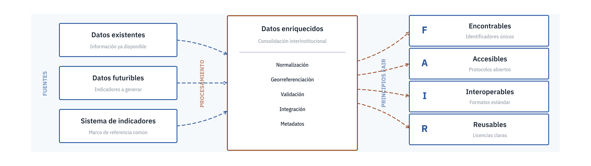
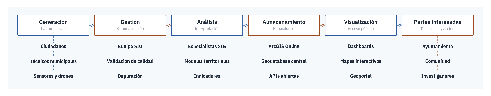
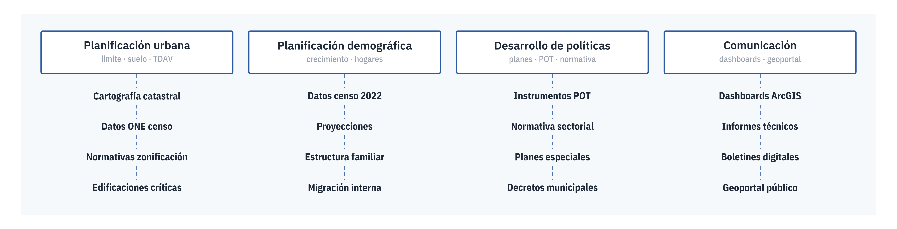
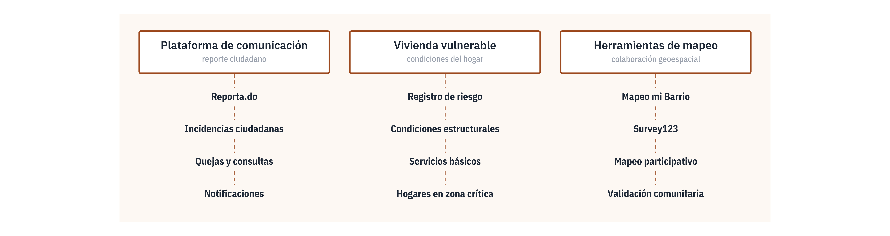
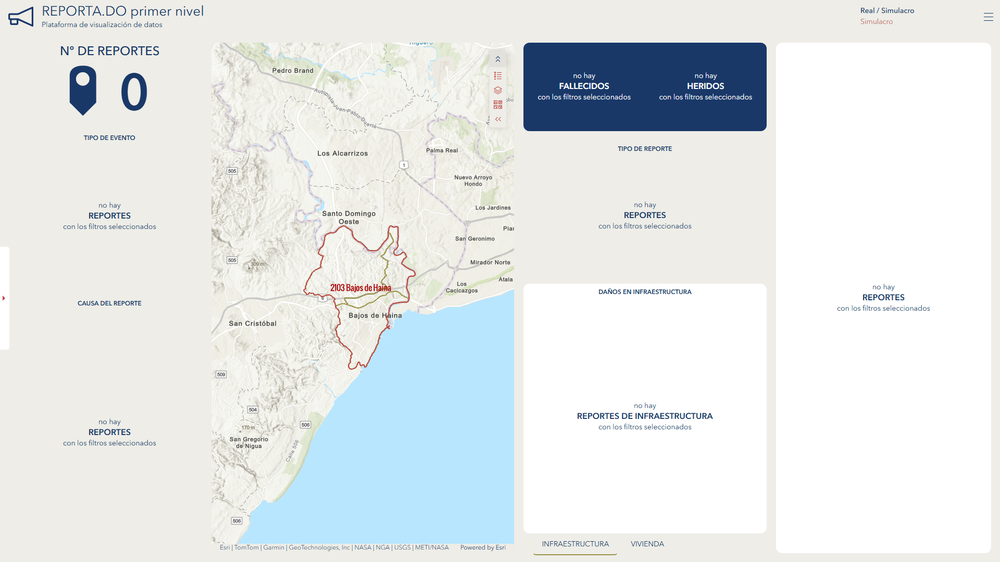

> **Fecha:** agosto 2025 **Objetivo específico:** **OE2** **Resultado:** R.1 y R.2 Sistema digital integrado **Palabras clave:** Sistemas digitales urbanos, Dashboards geoespaciales, ArcGIS Online, Planificación territorial, Municipios resilientes

El proyecto FONDOCYT construyó un sistema digital integrado para planificación urbana y gestión de riesgos en Bajos de Haina como materialización de los resultados R.1 y R.2 del **OE2**. El sistema está compuesto por ocho herramientas digitales operativas organizadas en tres módulos: ordenamiento territorial (cinco dashboards), gestión de riesgo de desastres (dos herramientas) y participación ciudadana (una plataforma). La implementación cubrió 159,888 habitantes distribuidos en 53,300 hogares, con caracterización detallada de 328 edificaciones mediante metodología LIDAR-fotogramétrica y levantamiento Survey123. El ecosistema resultante fue validado institucionalmente por el Ayuntamiento de Bajos de Haina y comunitariamente por juntas de vecinos, demostrando viabilidad técnica y social para su replicación en otros municipios dominicanos.

El sistema digital que este capítulo describe no es un producto cerrado sino un proceso abierto cuyos componentes se retroalimentan entre sí y con los otros capítulos del libro. En particular, mantiene un cruce orgánico con el Seminario-Taller de Planificación Urbana Digital celebrado en octubre de 2024 (ver capítulo 11), del que surgió el diagnóstico comunitario y la propuesta colectiva del Observatorio Ciudadano de Haina, y con el capítulo 9, donde ese Observatorio se institucionaliza como dispositivo de concertación política y social con acta firmada con la alcaldía municipal. La lectura del presente capítulo debería entenderse como una pieza de ese sistema más amplio, no como una documentación técnica aislada.

El capítulo se estructura en dos bloques complementarios. El **Bloque A** presenta la arquitectura conceptual y técnica del sistema desplegado: el fundamento de los datos FAIR como gobernanza informacional, la arquitectura general del ecosistema, la taxonomía de las dos familias de herramientas (institucionales y ciudadanas), los tres módulos funcionales en los que se organiza y el inventario técnico con enlaces operativos. El **Bloque B** examina la implementación del ecosistema en el contexto de Bajos de Haina, su validación institucional y comunitaria, la comparativa con sistemas equivalentes en otras ciudades, los desafíos identificados, las recomendaciones para el escalamiento nacional y la visión prospectiva de las líneas de trabajo que el proyecto propone como continuidad. La **matriz Afirmación–Evidencia–Fuente** al final del capítulo sirve como herramienta de trazabilidad académica interna.

## Bloque A. Arquitectura y ecosistema desplegado {#sec-bloque-a-07 .unnumbered}

Este primer bloque describe qué es el sistema digital integrado y cómo opera. Recorre, en orden creciente de detalle, el fundamento teórico que lo sostiene, la arquitectura general de sus componentes, la taxonomía de las herramientas que lo forman, los tres módulos funcionales en los que se despliega (ordenamiento territorial, gestión de riesgos y participación ciudadana) y el inventario técnico con los enlaces operativos de cada herramienta.

## Fundamento conceptual: FAIR y gobernanza informacional {#sec-ecosistema-diagrama-07}

La investigación parte de una hipótesis que reorienta la discusión habitual sobre participación ciudadana y planificación urbana digital. El problema central de la gobernanza territorial contemporánea no reside en la ausencia de canales de interacción entre la administración y la comunidad, sino en la fragmentación de la infraestructura informacional que sostiene cualquier decisión compartida [@kitchin2014data]. Sin datos comunes, depurados y consolidados, la deliberación pública se convierte en un ejercicio retórico en el que cada actor opera sobre su propia versión del territorio y los acuerdos posibles quedan reducidos al mínimo común denominador. La participación efectiva exige, como condición previa, una base empírica compartida cuyos atributos técnicos determinan el alcance de las decisiones que se pueden tomar a partir de ella.

En el horizonte conceptual del proyecto, esa base empírica compartida adopta la forma de los principios FAIR, formulados originalmente por @wilkinson2016fair para la gestión de datos científicos y progresivamente adoptados por las agencias públicas europeas e iberoamericanas como estándar de interoperabilidad. Los cuatro atributos (*findability*, *accessibility*, *interoperability* y *reusability*; en español, encontrables, accesibles, interoperables y reusables) no son un checklist técnico: constituyen una definición operativa de qué significa que un dato público sea verdaderamente público. Un dato generado por una agencia del Estado que no puede ser localizado, consultado, cruzado con otros ni reutilizado para fines distintos de los previstos por su productor original es, a efectos prácticos, un dato privado que vive en una caja institucional. La adopción de los principios FAIR transforma el dato público en infraestructura común y es, por eso, una decisión política antes que técnica.

{#fig-ecosistema-fair}

Esta reorientación hacia la infraestructura informacional tiene una consecuencia directa para el trabajo en barrios vulnerables como Bajos de Haina. Las decisiones municipales sobre ordenamiento territorial, gestión de riesgos y uso del suelo dependen de flujos de información que hoy circulan fragmentados entre la Oficina Nacional de Estadística, el Ministerio de Economía, Planificación y Desarrollo, el Ministerio de la Vivienda, el Ayuntamiento local y las organizaciones comunitarias. Cada uno de estos actores produce y custodia datos valiosos, pero la ausencia de protocolos comunes de publicación y la heterogeneidad de los formatos de intercambio impiden su composición en un cuadro único. La consecuencia es una asimetría que se manifiesta en todos los niveles: el técnico municipal toma decisiones sin acceso a los datos sectoriales, el funcionario nacional planifica sin el granulado local, y la comunidad reclama transparencia sin poder verificar los datos sobre los que se deciden las políticas que la afectan.

La respuesta que el proyecto FONDOCYT ensaya frente a este escenario es entender el ecosistema digital como un **ciclo cerrado de datos**, no como un catálogo de aplicaciones. La distinción es importante. Un catálogo de aplicaciones acumula plataformas optimizadas individualmente y espera que la suma produzca un efecto integrador; un ciclo cerrado, en cambio, parte del circuito completo por el que una observación sobre el territorio se convierte en decisión pública y vuelve a la comunidad en forma de política aplicada. Ese circuito articula al menos seis eslabones sucesivos: la generación del dato por parte de un actor en campo, su gestión y depuración por un equipo técnico, su análisis contra indicadores normativos, su almacenamiento en una infraestructura accesible, su visualización en interfaces adecuadas al perfil del usuario y su retorno a las partes interesadas que cierran el bucle alimentando nuevas observaciones. Ningún eslabón es más importante que los demás, y la rotura del ciclo en cualquier punto degrada el conjunto: una captura robusta que no se visualiza es tan inútil como una visualización sofisticada sobre datos que nadie actualiza.

{#fig-ecosistema-ciclico}

El ciclo admite también una lectura lineal como proceso productivo. Esta segunda lectura es útil para la planificación operativa porque permite aislar cada eslabón, identificar sus entradas y salidas específicas (formularios, dashboards, mapas, open data), reconocer los perfiles de usuario que intervienen en cada etapa (analistas, técnicos, servidores, interfaces ciudadanas) y asignar responsabilidades institucionales sin ambigüedades. La circularidad garantiza la sostenibilidad conceptual del sistema; la linealidad permite su gestión concreta. Ambas lecturas son complementarias y ninguna sustituye a la otra: el diseño del ecosistema exige pensar simultáneamente en ciclos de retroalimentación y en cadenas de responsabilidad.

{#fig-ecosistema-lineal}

La formulación abstracta del ciclo FAIR se vuelve operativa cuando se ancla en los actores concretos del sistema dominicano. Los generadores de datos del ecosistema del proyecto no son categorías genéricas sino agencias con nombre propio: la ONE y el IGN en el plano nacional, los organismos sectoriales como DIGEPI, MIMARENA o el MIVHED en el plano funcional, y los repositorios internacionales abiertos (NASA Earthdata, USGS, Johns Hopkins) en el plano de los datos de contexto geofísico y epidemiológico. La gestión y el análisis de estos datos recaen sobre Arcoíris RD y la DIGEPI como equipo técnico del proyecto, con apoyo metodológico de BARNA y TECCA Caribe. El almacenamiento se apoya en la nube de ArcGIS Online del consorcio y en servidores locales del proyecto. La visualización integra apps, dashboards, mapas y datos abiertos accesibles simultáneamente a tres perfiles de usuarios con intereses distintos: tomadores de decisiones municipales, público general e investigadores académicos. El cierre del ciclo depende, en última instancia, de que estos perfiles reales vuelvan a alimentar la generación mediante reportes, consultas y validaciones, en línea con la noción de *citizens as sensors* propuesta por @goodchild2007citizens. En Bajos de Haina, ese cierre se materializa en dos puntos concretos del ecosistema: los formularios Survey123 de levantamiento de campo (encuestas domiciliarias, mapeo de TDAV, reporte de incidentes), que son el eslabón de generación, y el Observatorio Ciudadano (observatoriohaina.do), que es el eslabón de retorno a la comunidad y que completa el ciclo al poner los datos procesados a disposición de los mismos actores que los generaron.

{#fig-ecosistema-flujograma}

Esta operacionalización es el punto en el que el proyecto deja de ser una propuesta conceptual y se vuelve una red concreta de actores. La garantía de que el ecosistema no depende de instituciones por definir es precisamente lo que distingue la investigación aplicada de un ejercicio de diseño puramente académico: la interoperabilidad FAIR no se formula como promesa futura sino como protocolo de trabajo entre organizaciones que ya comparten datos en el marco del consorcio. El resto del capítulo documenta cómo cada uno de los tres módulos (ordenamiento territorial, gestión de riesgos y participación ciudadana) instancia esta arquitectura común en herramientas concretas que preservan los atributos FAIR y cierran su ciclo de datos en los términos presentados aquí.

## Arquitectura general del ecosistema {#sec-07-arquitectura-ecosistema}

El sistema se estructura en tres módulos temáticos interconectados (ordenamiento territorial, gestión de riesgos y participación ciudadana) que integran diez herramientas digitales operativas sobre una arquitectura común de ArcGIS Online con geodatabase centralizada y control de acceso diferenciado por perfil de usuario. El flujo de trabajo articula cuatro fases (captura, validación, visualización y decisión) y cubre 159,888 habitantes del municipio completo, de los cuales 100,527 residen en el Distrito Municipal cabecera que constituye el área focal del proyecto. El ecosistema se validó entre junio y agosto de 2025 con el Ayuntamiento de Bajos de Haina y las juntas de vecinos participantes (@tbl-ecosistema-digital-haina-07).

| Ordenamiento territorial | Gestión de riesgos | Participación ciudadana |
|:--|:--|:--|
| **Dashboard Población · 159,888 hab. caracterizados · Densidad 4,050 hab/km² [@oneBoletinTuMunicipio2022] · 53,300 hogares** | Dashboard "Cerrando Brechas" · Sistema integral de análisis de riesgos · 82 albergues · 318 puntos de abastecimiento | Plataforma "Mapeo mi Barrio" · Mapeo participativo de servicios · 3 modalidades de captura · 7 categorías |
| **Dashboard Vivienda · Análisis habitacional municipal · 65,400 viviendas · Evolución 1985-2025** | WebApp TDAV · Tipificación de activos expuestos · Inventario de edificaciones críticas | Survey123 · Encuestas estructuradas · Online/offline · Georreferenciación |
| **Dashboard Educación · Sistema educativo municipal · 33 escuelas públicas · 151,500 personas 3+** | Dashboard REPORTA L2 · Reporte de eventos en tiempo real · Evaluación de daños post-evento | QuickCapture · Captura rápida de datos · Modo simplificado recomendado |
| **Dashboard Salud · Equipamientos sanitarios · 10 centros de salud · 1 hospital · 10 farmacias** | Plataforma Reporta.do · Reporte ciudadano nacional · Cobertura RD completa · Validación GPS | Crowdsource Reporter · Reporte detallado con internet · Información ampliada · Mapeo de organizaciones |
| **Dashboard Edificaciones · Caracterización física FONDOCYT · 328 edificaciones · 6 tipologías de manzana** | Niveles de riesgo promedio: deslizamientos 2.3/5, inundación 2.3/5, tsunami 2.1/5 | Validación comunitaria: 15 barrios representados · Actas de participación firmadas · Juntas de vecinos integradas |
| ***5 dashboards*** | *4 herramientas* | *Plataforma integral* |

: Ecosistema digital de Bajos de Haina: componentes por módulo. Elaboración propia. {#tbl-ecosistema-digital-haina-07 .smaller}

## Taxonomía: dos familias de herramientas {#sec-ecosistema-taxonomia-07}

El ecosistema digital se entiende, en segundo lugar, como una composición deliberada de **dos familias de herramientas** funcionalmente distintas y operacionalmente complementarias. Esta distinción no es una etiqueta descriptiva: responde a la observación, documentada en la literatura sobre *planning support systems*, de que los usuarios institucionales y los usuarios ciudadanos operan con lógicas de uso, tolerancias de complejidad y expectativas de formato que son incompatibles entre sí en una sola interfaz [@geertman2020planning; @kustermann2021gis]. Los ecosistemas digitales urbanos que ignoran esta distinción terminan siendo o bien plataformas técnicas demasiado densas para el ciudadano común, o bien interfaces ciudadanas demasiado simples para sostener decisiones técnicas. Separar ambas familias y diseñarlas como dos capas interoperables es la condición para que ninguna de las dos sacrifique su razón de ser.

{#fig-ecosistema-familias}

Las **herramientas institucionales** están orientadas al trabajo técnico del Ayuntamiento y los ministerios sectoriales. Agrupan los instrumentos de planificación urbana (delimitación del límite urbano, clasificación del uso del suelo, identificación de tejidos degradados de alta vulnerabilidad), de planificación demográfica (seguimiento de la dinámica poblacional, tendencias migratorias y tasas de natalidad y mortalidad), de desarrollo de políticas (formulación de planes especiales, estrategias basadas en datos y documentación normativa) y de comunicación institucional (herramientas visuales para representar y compartir datos entre técnicos). La característica común de estos instrumentos es que priorizan la densidad informacional y el análisis multicriterio sobre la simplicidad de uso: el técnico municipal necesita ver todas las capas, cruzar variables y exportar productos analíticos a costa de una curva de aprendizaje más exigente. La forma natural de esta capa son los dashboards, los geoportales y las plataformas de gestión documental.

{#fig-ecosistema-componentes-detalle}

Las **herramientas ciudadanas** obedecen a la lógica inversa. Están orientadas al trabajo directo con la población y agrupan dos componentes diferenciados: el reporte de datos (plataforma de comunicación directa entre ciudadanos y autoridades para reportar incidencias, problemas y sugerencias, junto con un registro específico de vivienda vulnerable) y el mapeo colaborativo (herramientas de visualización geoespacial que permiten a los residentes comprender su entorno inmediato y participar en su representación). La característica común de estos instrumentos es que deben operar con umbrales de entrada extremadamente bajos: soporte multimodal (texto, foto, voz, geolocalización), modo offline para contextos de conectividad intermitente, interfaces simples y protocolos de acceso sin fricción. La forma natural de esta capa son los formularios móviles, las aplicaciones de captura rápida y los mapas interactivos de consulta pública.

Cada componente del ecosistema opera sobre **datos específicos** cuya provisión compromete a actores concretos. Los instrumentos institucionales de planificación urbana requieren información normativa (leyes y regulaciones sobre zonificación), datos de densidad poblacional, información sobre áreas urbanas degradadas, planes y proyectos de intervención, datos geográficos y cartográficos actualizados. La especificación de estos datos no es meramente técnica: cada tipo implica un actor institucional responsable de su generación y mantenimiento. La arquitectura del ecosistema exige, en consecuencia, una colaboración multiactor, intersectorial e interinstitucional que sustente la disponibilidad continua de los datos sin dependencia de proyectos puntuales de investigación. Esta colaboración es la que convierte un catálogo de plataformas en un ecosistema en sentido estricto.

{#fig-ecosistema-institucionales-datos}

Los instrumentos ciudadanos requieren datos de naturaleza distinta y exigen otra lógica operativa. El componente de reporte de datos necesita un sistema de gestión de incidencias capaz de recoger informes de los ciudadanos y bases de datos para almacenar, clasificar y priorizar las incidencias reportadas, con un registro de viviendas clasificadas según su nivel de riesgo y datos sobre condiciones estructurales y ambientales de las áreas residenciales en situación vulnerable. El componente de mapeo colaborativo requiere datos geoespaciales y de uso del suelo que permitan la representación del territorio, junto con herramientas y plataformas que traduzcan esta información a un lenguaje visual accesible al usuario no técnico. La colaboración multiactor articulada por el ecosistema es distinta a la institucional: conecta comunidades, organizaciones de base y ayuntamiento en un circuito corto de retroalimentación que complementa los flujos formales entre administraciones.

{#fig-ecosistema-ciudadanas-datos}

La articulación entre las dos familias es la **condición de posibilidad del ecosistema**. Las herramientas institucionales, por sí solas, operan sobre datos agregados que corren el riesgo de perder contacto con las dinámicas locales que pretenden gestionar. Las herramientas ciudadanas, por sí solas, generan información dispersa sin un marco técnico que la convierta en insumo de decisiones formales. Solo cuando ambas familias se encuentran mediante los flujos descritos en la sección anterior, con la población como generador legítimo y el Ayuntamiento como integrador técnico, el ecosistema se convierte en un instrumento real de gobernanza territorial participativa. Esta doble arquitectura, la del ciclo FAIR de datos y la de la taxonomía de herramientas institucionales y ciudadanas, es el marco conceptual sobre el que se desarrollan los tres módulos del sistema digital integrado que se documentan a continuación.

En el caso concreto de Bajos de Haina, la articulación entre las dos familias adopta un nombre propio: el **Observatorio Ciudadano de Haina**, cuyo desarrollo se documenta en detalle en el capítulo 9 del libro. El Observatorio no fue una decisión tomada *ex ante* por el equipo del proyecto, sino una propuesta emergente que surgió de la Mesa 3 del Seminario-Taller de Planificación Urbana Digital celebrado en octubre de 2024 (ver capítulo 11, sección Mesa 3) y que se formalizó posteriormente como dispositivo institucional con acta firmada con la alcaldía municipal. El Observatorio se entiende, en los términos de este capítulo, como la articulación orgánica entre la familia institucional y la familia ciudadana: institucionaliza el espacio donde los datos compartidos, las herramientas digitales y los actores del territorio convergen bajo un marco común de gobernanza, con tres ejes que reflejan los tres módulos del sistema digital (ordenamiento territorial, gestión de riesgos y participación ciudadana). La taxonomía descrita en esta sección solo se entiende correctamente cuando se lee junto con ese dispositivo institucional.

## Módulo 1. Ordenamiento territorial {#sec-07-modulo1-ot}

El primer módulo del ecosistema agrupa las herramientas de caracterización territorial necesarias para alimentar un futuro Plan Municipal de Ordenamiento Territorial (PMOT) conforme a la Ley 368-22 y el Decreto 396-25. Son cinco dashboards temáticos (población, vivienda, educación, salud y edificaciones) construidos sobre ArcGIS Online y alimentados por fuentes oficiales (ONE, MEPyD, MINERD, SNS) y por el levantamiento FONDOCYT de campo (LIDAR, Survey123). Cada dashboard aparece a continuación como ficha de herramienta con enlace operativo, función, fuentes de datos, indicadores clave y la captura del estado del dashboard en agosto de 2025.

::: {.callout-note appearance="simple" icon=false}
## Dashboard Población de Bajos de Haina [↗](https://arcoiris.maps.arcgis.com/apps/dashboards/5efe3e50a42e48018f7702402bfe8818)

**Función.** Caracterización demográfica municipal a partir del X Censo Nacional de Población y Vivienda 2022 [@oneCensoNacionalPoblacion2022].

**Datos.** ONE: Censo 2022; serie temporal de población 1985-2025.

**Indicadores clave.** 159,888 habitantes (100,527 en el Distrito Municipal cabecera) · 53,300 hogares · 4,050 hab/km² · 3 personas/hogar promedio [@oneBoletinTuMunicipio2022].

**Filtros.** Distrito municipal (La Pared, Bajos de Haina CU).
:::

![Dashboard Población de Bajos de Haina: caracterización demográfica municipal a partir del Censo 2022. Presenta 159,888 habitantes [@oneBoletinTuMunicipio2022], 53,300 hogares, densidad de 4,050 hab/km² y evolución temporal de la población entre 1985 y 2025. Permite filtrar por distrito municipal (La Pared y Bajos de Haina CU). Fuente: ArcGIS Online, Arcoíris RD (2025).](img/oe2/oe2sd_dash_poblacion.png){#fig-oe2sd-dash-poblacion}

::: {.callout-note appearance="simple" icon=false}
## Dashboard Vivienda y Urbanización [↗](https://arcoiris.maps.arcgis.com/apps/dashboards/b4f5ab32abb54a3e8f3f522273af7d73)

**Función.** Análisis habitacional del municipio y seguimiento de los procesos de urbanización.

**Datos.** ONE: Censo 2022 (parque habitacional); capas GHSL de superficie urbanizada 1985-2025.

**Indicadores clave.** 65,400 viviendas totales · 100 viviendas colectivas · desagregación ocupadas vs. desocupadas · evolución de superficies urbanizadas 1985-2025.

**Filtros.** Distrito municipal y tipología de vivienda.
:::

{#fig-oe2sd-dash-vivienda}

::: {.callout-note appearance="simple" icon=false}
## Dashboard Educación [↗](https://www.arcgis.com/apps/dashboards/6d92d3c8d2c44d548e93ce081773e0ba)

**Función.** Cartografía del sistema educativo municipal con análisis por nivel, género y ubicación urbana o rural.

**Datos.** MINERD: directorio de escuelas públicas; ONE: Censo 2022 (población por edad).

**Indicadores clave.** 33 escuelas públicas georreferenciadas · 151,500 personas de 3 años o más · niveles educativos por género y ubicación.

**Filtros.** Nivel educativo (inicial, primario, secundario) y ámbito (urbano/rural).
:::

{#fig-oe2sd-dash-educacion}

::: {.callout-note appearance="simple" icon=false}
## Dashboard Salud [↗](https://www.arcgis.com/apps/dashboards/2b2e82cbd67146e6b80a00ca5e92bd5c)

**Función.** Inventario y georreferenciación de equipamientos sanitarios del municipio con indicadores poblacionales de salud.

**Datos.** SNS: directorio de centros de salud; SNS: indicadores municipales de morbilidad; ONE: Censo 2022 (discapacidad).

**Indicadores clave.** 10 centros de salud (9 de primer nivel + 1 hospital general) · 1 laboratorio clínico · 10 farmacias · 13.2% de la población con limitación permanente · 35.5% partos por cesárea en el SNS.

**Filtros.** Tipo de equipamiento y sector.
:::

{#fig-oe2sd-dash-salud}

::: {.callout-note appearance="simple" icon=false}
## Dashboard Encuesta de Edificaciones FONDOCYT

**Función.** Caracterización física detallada de las edificaciones del área focal del proyecto, con integración de los parámetros normativos por tipología de manzana del OE3.

**Datos.** Levantamiento LIDAR + Survey123 del proyecto FONDOCYT (2024-2025); normativa por tipologías de manzana (OE3, cap. 8).

**Indicadores clave.** 328 edificaciones evaluadas (cobertura 94%) · 1,497 personas muestrales · 1.8 viviendas/edificación promedio · 16,462 hab/km² en el área de estudio · distribución tipológica residencial 62.2% / mixto 19.5% / comercial 8.8% / dotacional 4.3% (@tbl-distribucion-tipologica-07) · 1 nivel 46.5% · block/concreto 96.4% · accesibilidad vehicular 91%.

**Integración normativa.** Incorpora las 6 tipologías de manzana (Residencial Pura, Mixta con Comercial, Mixta con Dotacional, Institucional, Mixta con Institucional, Mixta Tripartita) con parámetros diferenciados de altura (3-5 niveles), densidad (25-80 viv/ha), ocupación (50-80%) y retiros específicos.
:::

| Uso | Cantidad | Porcentaje |
|:---|---:|---:|
| **Residencial** | 204 | 62.2% |
| **Mixto** | 64 | 19.5% |
| **Comercial** | 29 | 8.8% |
| **Dotacional** | 14 | 4.3% |

: Distribución tipológica de edificaciones levantadas (n=328). Elaboración propia. {#tbl-distribucion-tipologica-07 .smaller}

## Módulo 2. Gestión de riesgos {#sec-07-modulo2-gdr}

El módulo de gestión de riesgos se inscribe en el marco de la Ley 147-02 sobre Gestión de Riesgos de la República Dominicana [@congresonacionalrepublicadominicanaLey14702Sobre2002] y en las cuatro prioridades del Marco de Sendai para la Reducción del Riesgo de Desastres 2015-2030 [@undrr2015sendai], particularmente en las de *comprender el riesgo de desastres* y *fortalecer la gobernanza del riesgo*. La aproximación conceptual adoptada entiende el riesgo como una construcción social condicionada por la exposición, la vulnerabilidad y la capacidad de respuesta [@lavellApuntesParaReflexion2007], de modo que las herramientas digitales aquí presentadas se conciben no como sustitutas de la acción institucional sino como infraestructura de información que la hace posible. El módulo agrupa tres herramientas operativas: un dashboard municipal de análisis integral (Cerrando Brechas), un dashboard de monitoreo de tejidos degradados de alta vulnerabilidad (TDAV) y la plataforma ciudadana de reporte Reporta.do.

::: {.callout-note appearance="simple" icon=false}
## Dashboard "Cerrando Brechas"

**Función.** Sistema integral de análisis y respuesta a riesgos municipales que integra capacidad institucional, niveles de amenaza y contexto socioeconómico del municipio.

**Datos.** Defensa Civil y COE (albergues y puntos de abastecimiento); ONESVIE y Ministerio de Salud (equipamiento sanitario); ONE: Censo 2022 (indicadores socioeconómicos); análisis técnico multiamenaza del proyecto.

**Indicadores clave.** Capacidad de respuesta: 82 albergues habilitados · 1 hospital · 10 farmacias operativas · 318 puntos de abastecimiento. Niveles de riesgo promedio (escala 1-5): deslizamientos 2.3 · inundación 2.3 · tsunami 2.1 · incendios 0 (@tbl-niveles-riesgo-amenaza-07). Socioeconómicos: 67,848 habitantes filtrables · pobreza 25.3% (población) / 26.9% (hogares) · pobreza extrema 2.6% / 3.5%.

**Filtros.** Amenaza, barrio, tramo socioeconómico.
:::

| Amenaza | Nivel promedio | Estado |
|:---|---:|:---|
| **Deslizamientos** | 2.3 | Medio |
| **Inundación** | 2.3 | Medio |
| **Tsunami** | 2.1 | Bajo-medio |
| **Incendios** | 0 | Sin riesgo reportado |

: Niveles de riesgo por amenaza en Bajos de Haina (escala 1-5). Elaboración propia. {#tbl-niveles-riesgo-amenaza-07 .smaller}

::: {.callout-note appearance="simple" icon=false}
## Dashboard de monitoreo TDAV

**Función.** Seguimiento en tiempo real de los tejidos degradados de alta vulnerabilidad mapeados por el proyecto, con capacidad de consulta por barrio y clasificación consolidable / no consolidable.

**Datos.** Levantamiento comunitario FONDOCYT (2024-2025) mediante WebApp TDAV + Survey123; validación del Ayuntamiento y juntas de vecinos.

**Indicadores clave.** 3,300 TDAV mapeados · 135,432 m² (13.54 ha) de superficie levantada · 56 usuarios activos en la plataforma.

**Nota.** La etiqueta "km²" que aparece en el dashboard público es un error de unidades de la interfaz ArcGIS Online; la cifra correcta es m².
:::

{#fig-dash-tdav-monitoreo}

::: {.callout-note appearance="simple" icon=false}
## Plataforma Reporta.do

**Función.** Sistema nacional de reporte ciudadano de afectaciones por inundación y otras amenazas, con validación GPS y operación en modalidad real o de simulacro. Sigue el modelo de *citizen observatories* cuyo valor para la reducción del riesgo por inundación está documentado en estudios de costo-beneficio recientes [@ferri2020citizen].

**Datos.** Formulario multipágina Survey123 (una encuesta por elemento reportado); reportes ciudadanos georreferenciados; capas de riesgo del modelo de elevación digital.

**Indicadores clave.** Cobertura nacional (República Dominicana completa) · modalidades reporte real y simulacro · arquitectura multiescala con dashboards de nivel 1 (captura ciudadana) y nivel 2 (monitoreo nacional de amenazas y daños).

**Visualizaciones asociadas.** Mapa de exposición al riesgo por inundación (@fig-reporta-inundacion); dashboard de nivel 2 (@fig-dash-reporta-l2); dashboard de nivel 1 (@fig-dash-reporta-l1).
:::

{#fig-reporta-inundacion}

{#fig-dash-reporta-l2}

{#fig-dash-reporta-l1}

## Módulo 3. Participación ciudadana {#sec-07-modulo3-part}

El tercer módulo operacionaliza la noción de participación ciudadana en el sentido que le otorga la *Guía sobre Participación Ciudadana en la Gestión Municipal de República Dominicana*, publicada por la Federación Dominicana de Municipios en el marco del programa MUNICIPIA con apoyo de AECID y FAMSI [@aecid2012guia], distinguiendo participación ciudadana, comunitaria, social y económica. La literatura internacional sobre participación pública aplicada a adaptación climática y gestión de riesgos coincide en que los canales digitales son eficaces solo cuando se combinan con mediación presencial y capacidades locales instaladas [@hugel2020public], condición que este módulo aborda mediante las tres modalidades de captura descritas a continuación.

::: {.callout-note appearance="simple" icon=false}
## Plataforma "Mapeo mi Barrio"

**Función.** Mapeo participativo de servicios comunitarios georreferenciados en seis categorías: educativo, salud, emergencia/seguridad, abastecimiento, negocios y transporte.

**Datos.** Levantamiento ciudadano continuo; servicios georreferenciados verificados por juntas de vecinos y equipo del proyecto.

**Indicadores clave.** Tres modalidades de captura complementarias: **Quick Capture** (modo simplificado recomendado), **Survey123** (formulario online/offline) y **Crowdsource Reporter** (información detallada con requerimiento de internet). Cobertura: 15 barrios representados en la validación comunitaria, actas de participación firmadas.

**Filtros.** Categoría de servicio y barrio.
:::

{#fig-oe2sd-mapeo-barrio}

## Inventario técnico y enlaces operativos {#sec-inventario-tecnico-07}
Inventario de las herramientas digitales del ecosistema FONDOCYT Haina (URLs vivas en ArcGIS Online y Survey123).

| # | Herramienta | URL |
|---:|:---|:---|
| **1** | Plataforma Haina | [arcg.is/1X00WH0](https://arcg.is/1X00WH0) |
| **2** | Plataforma Arcoíris | [Dashboard Arcoíris](https://arcoiris.maps.arcgis.com/apps/dashboards/d1919b25b020424e8252ef9d2da4dc81) |
| **3** | Dashboard REPORTA nivel 2 | [Dashboard REPORTA L2](https://arcoiris.maps.arcgis.com/apps/dashboards/ac17af0031d048e49a990dccf671e4fb) |
| **4** | WebApp para mapear TDAV | [WebApp TDAV](https://arcoiris.maps.arcgis.com/apps/webappviewer/index.html?id=1aa32161c0374b7d881f4843ef0a909d) |
| **5** | Dashboard de monitoreo TDAV | [Dashboard TDAV](https://arcoiris.maps.arcgis.com/apps/dashboards/b84b418db91145e4b7bea87cccbf9415) |
| **6** | Dashboard nivel 1 | [Dashboard L1](https://arcoiris.maps.arcgis.com/apps/dashboards/f5e320eabb614d5abae42fc4efbd1e1f) |
| **7** | Riesgo por inundación | [Experience Riesgo Inundación](https://experience.arcgis.com/experience/a76018c1b51e44f3b35ebc8a01b13eb2) |
| **8** | Encuesta Reporta 1 | [Survey123 Reporta 1](https://survey123.arcgis.com/share/67a0af96810649d8b579b2a2d3034f74) |
| **9** | Encuesta Reporta 2 | [Survey123 Reporta 2](https://survey123.arcgis.com/share/f1652f6b3340425cbc39b822095efaf0) |

: Herramientas existentes y enlaces operativos. Elaboración propia. {#tbl-herramientas-enlaces-07 .smaller}

### Detalle técnico por herramienta

El ecosistema digital del proyecto FONDOCYT se organiza en tres ejes funcionales (ordenamiento territorial, gestión de riesgos y participación ciudadana) que se reparten nueve componentes operativos. La @tbl-detalle-tecnico-07 sintetiza para cada componente su función, los datos requeridos para alimentarlo y el anclaje normativo que lo justifica; la @fig-ejes-componentes-07 visualiza la distribución del ecosistema entre los tres ejes.

| Eje · Componente | Función | Datos necesarios | Referencia normativa |
|:---|:---|:---|:---|
| **Ordenamiento territorial** | | | |
| **Límite urbano** | Define el límite urbano y clasifica el suelo en urbano, urbanizable y no urbanizable (Instrumento de Delimitación del Suelo Urbano). | Barrios y parajes DPA 2022, estadísticas demográficas y urbanas, uso del suelo predominante y secundario, juntas de vecinos. | Ley 368-22, arts. 33 y 66 |
| **Uso del suelo** | Estudia los usos actuales del suelo, áreas de amortiguamiento y usos compatibles; genera alertas de usos incompatibles y necesidad de plan especial. | Legislación vigente en ausencia de PMOT, normativas generales, estándares urbanísticos, ordenanzas y reglamentos. | Ley 368-22, arts. 40 y 41 |
| **Crecimiento demográfico** | Proyecta zonas de posible crecimiento urbano clasificadas en urbanizado, servicios especiales y áreas protegidas. | Proyección de población a 10 años (GHS), proyección de zona urbanizada a 10 años (GHS). | Ley 368-22, art. 40 |
| **Planes especiales** | Identifica zonas con necesidad de plan especial por uso o alta vulnerabilidad; aporta datos sociodemográficos, biofísicos e hidrográficos. | Distrito industrial (usos industriales, portuarios), legislación vigente aplicable. | Ley 368-22, art. 26 |
| **Tejidos Degradados de Alta Vulnerabilidad (TDAV)** | Analiza parámetros para identificar los TDAV y clasificarlos en consolidables y no consolidables. | Legislación vigente, normativas generales, ordenanzas y reglamentos. | - |
| **Vivienda vulnerable** | Facilita información de viviendas vulnerables para planes de regeneración o reubicación en suelo no consolidable. | Vivienda Censo 2022, estudios ONESVIE, Plan Decenal de Viviendas, instrumentos MIVHED. | Ley 160-21 (MIVHED) |
| **Gestión de riesgos** | | | |
| **Reporta.do** | Reporte ciudadano de afectaciones en situaciones de emergencia para identificar en tiempo real las necesidades locales y retroalimentar los análisis de GdR. | Data histórica de afectaciones, Defensa Civil, COE, REPORTA.DO, EDAN. | Ley 147-02 |
| **Participación ciudadana** | | | |
| **Mapeo mi Barrio** | Levantamiento comunitario de componentes del barrio: calles y callejones, cañadas, servicios públicos, empresas privadas, RSU, transporte público, portal de empleo. | Data a nivel manzana de elementos urbanos y actores del territorio, datos abiertos oficiales. Coordinación con OGTIC e INDOTEL para puntos wifi y estandarización. | - |
| **Participación ciudadana** | Implica a todos los actores del territorio en la construcción colectiva de los planes de ordenamiento y gestión de riesgos. | Herramientas municipales y nacionales de participación ciudadana, normativa vigente. | - |

: Componentes del ecosistema digital por eje funcional, con función, datos necesarios y anclaje normativo. Elaboración propia. {#tbl-detalle-tecnico-07 .striped .smaller tbl-colwidths="[22,35,30,13]"}

{#fig-ejes-componentes-07}

## Bloque B. Validación, escalamiento y prospectiva {#sec-bloque-b-07 .unnumbered}

El segundo bloque examina los resultados de la implementación del ecosistema en el contexto de Bajos de Haina, su validación institucional y comunitaria, la comparativa con sistemas equivalentes en otras ciudades de América Latina y África, los desafíos identificados, las recomendaciones para el escalamiento del modelo al resto de municipios dominicanos, y la visión prospectiva de las líneas de trabajo que el proyecto identifica como continuidad natural del ecosistema actual.

## Resultados de implementación {#sec-resultados-implementacion-07}

El despliegue del ecosistema digital se completó en agosto de 2025, dentro del plazo establecido para el OE2. Los indicadores de desempeño técnico sintetizan el cumplimiento frente a las metas de diseño (@tbl-indicadores-desempeno-sdi-07): las ocho herramientas previstas fueron desarrolladas, la cobertura poblacional (159,888 hab.) superó la meta, las 328 edificaciones caracterizadas rebasaron el objetivo inicial de 300 y las 16 manzanas sistematizadas completaron el plan de levantamiento. La validación institucional se realizó en dos sesiones en lugar de una y el tiempo de implementación fue de 2.5 meses frente a los 3 previstos.

| Métrica | Meta | Logrado | Estado |
|:---|:---|:---|:---|
| **Herramientas desarrolladas** | 8 | 8 | Completo |
| **Cobertura poblacional (municipio)** | 150,000+ | 159,888 | Superado |
| **Edificaciones caracterizadas** | 300+ | 328 | Superado |
| **Manzanas sistematizadas** | 16 | 16 | Completo |
| **Validación institucional** | 1 sesión | 2 sesiones | Superado |
| **Tiempo de implementación** | 3 meses | 2.5 meses | Adelantado |

: Indicadores de desempeño técnico del sistema digital integrado. Elaboración propia. {#tbl-indicadores-desempeno-sdi-07 .smaller}

El análisis de usabilidad recogido en los talleres de validación identificó que la interfaz resultó intuitiva para usuarios no técnicos, con visualización cartográfica de alta calidad, filtros dinámicos funcionales e integración fluida entre las herramientas del ecosistema. Las limitaciones más frecuentes apuntaron a la necesidad de una versión offline para zonas con conectividad intermitente, la demanda de capacitación para usuarios especializados, la mejora de la visualización de filtros en la plataforma Arcoíris y la incorporación de capas adicionales de infraestructuras esenciales.

El impacto sobre las capacidades institucionales del Ayuntamiento se materializó en cuatro dimensiones: acceso a datos territoriales actualizados en tiempo real, herramientas para la evaluación de proyectos de desarrollo, base técnica para el futuro PMOT municipal y capacidades mejoradas para la gestión de emergencias. En el plano comunitario, el ecosistema abrió canales digitales de participación ciudadana, garantizó acceso a información territorial transparente y dotó a las juntas de vecinos de herramientas para reportar problemas e incidir en las decisiones que afectan su barrio.

## Validación y apropiación social {#sec-validacion-apropiacion-07}

La validación del ecosistema se llevó a cabo en dos dimensiones paralelas que concluyen con compromisos formalizados y garantizan la continuidad del sistema más allá del ciclo del proyecto. La dimensión **institucional** se realizó en dos talleres técnicos con el Ayuntamiento de Bajos de Haina, con participación del alcalde, la Oficina de Planeamiento Urbano y técnicos municipales, cerrándose con un acta firmada y el compromiso oficial de adopción del ecosistema como herramienta de gestión territorial. La dimensión **comunitaria** se desarrolló mediante sesiones participativas con juntas de vecinos y líderes comunitarios de 15 barrios del municipio; las recomendaciones recogidas en ese proceso se incorporaron al diseño de la segunda iteración del ecosistema y las actas firmadas constituyen evidencia documental del proceso de apropiación social.

El Ayuntamiento formalizó cuatro compromisos institucionales para la adopción y sostenibilidad del sistema: la incorporación del ecosistema al plan de trabajo municipal 2026, la asignación de personal técnico para su mantenimiento, la adopción de un protocolo de actualización trimestral de datos y su integración con el futuro PMOT municipal. Los mecanismos de sostenibilidad acordados incluyen un convenio con universidades locales para la actualización de contenidos, la capacitación continua del personal municipal, el financiamiento de las licencias ArcGIS Online con presupuesto municipal ordinario y la consolidación de una red de colaboradores comunitarios capacitados.

## Comparativa internacional y casos de referencia {#sec-comparativa-internacional-07}

| Ciudad/País | Sistema | Población | Inversión | Tecnología | Cobertura |
|:---|:---|:---|:---|:---|:---|
| **Medellín, Colombia** | SIUR / POT 2014 | 2.5 M | Alta | ArcGIS, plataforma web participativa | Metropolitana |
| **Quito, Ecuador** | SIIQ | 2.8 M | Media-alta | SIG propio | Metropolitana |
| **Curitiba, Brasil** | IPPUC Digital | 1.9 M | Alta | Múltiples plataformas | Ciudad |
| **Ibarra, Ecuador** | PDOT participativo | 190 K | Media | SIG + talleres barriales | Municipal |
| **Dar es Salaam, Tanzania** | Ramani Huria | 5+ M | Baja-media | OpenStreetMap + drones | Barrios piloto |
| **Paraguay (FOLUR)** | POUT con drones | Varios municipios | Media | WingtraOne + SIG | Municipal |
| **Bajos de Haina, RD** | Ecosistema FONDOCYT | 160 K | US$ 25-40 K | ArcGIS Online | Municipal |

: Comparativa internacional de sistemas digitales urbanos. Elaboración propia. {#tbl-comparativa-internacional-sdu-07 .smaller}

El modelo Haina presenta cuatro diferenciadores técnicos respecto a los casos de referencia: integración completa entre planificación, riesgo y participación en un único ecosistema; metodología LIDAR/Survey123 para la caracterización edificatoria a escala de manzana; validación comunitaria estructurada del diseño, incorporada desde el inicio y no añadida a posteriori; y alineación explícita con el marco legal dominicano vigente (Ley 368-22 y Decreto 396-25). Ninguno de los sistemas comparados combina estas cuatro capacidades en un municipio de las dimensiones de Bajos de Haina.

La lectura detallada de los casos internacionales refuerza estos diferenciadores. La experiencia colombiana muestra que para escalar planes en todos los municipios se requiere un fuerte soporte nacional en capacitación y recursos: en 2017, más del 90% de las ciudades colombianas no habían actualizado sus POT, evidencia de la brecha entre las disposiciones legales y la capacidad local [@minvivienda2018pot]. El caso de Paraguay, documentado en el marco del programa FOLUR, demuestra que incluso municipios con recursos limitados pueden beneficiarse de tecnología de punta compartida: el gobierno adquirió drones de última generación y formó a personal de instituciones nacionales que apoyó técnicamente a los gobiernos locales [@worldbank2022folur]. En Ecuador, el PDOT de Ibarra (190,000 hab.) ilustra que la participación ciudadana temprana y sistemática conduce a planes con mayor apoyo político y social. En Tanzania, el proyecto Ramani Huria confirma que la integración de comunidades en la recolección de datos aumenta la aceptabilidad de las medidas y construye capacidad local en TIC [@iliffe2017ramani; @omdt2020ramani]. En el plano latinoamericano, el precedente de Medellín como primera ciudad de la región en implementar un gemelo digital urbano en plataforma GIS marca la direccionalidad tecnológica del sector [@telemedellin2023gemelo; @althani2023digital].

## Desafíos identificados y mejoras iterativas {#sec-desafios-07}

La evaluación en el seminario-taller identificó seis desafíos transversales del ecosistema. En **usabilidad**, se observó utilización parcial de las plataformas y dificultad para encontrar pestañas, filtros y capas, lo que reclamaría una versión "lite" o amigable con menos datos. En **visualización**, el tamaño de texto de los nombres de localidades resulta insuficiente al hacer zoom y falta diferenciación entre ríos, cañadas y otras escorrentías. En **datos**, faltan capas de infraestructura esencial, una división político-administrativa actualizada y la red hídrica completa. En **interoperabilidad**, se requiere superposición de capas y geoprocesos y la posibilidad de exportar tablas de atributos e imágenes. En **resiliencia**, es necesaria una versión offline de las plataformas para escenarios de apagón digital y vías alternas para la gestión de información en emergencias. En **accesibilidad**, se solicita mayor claridad en la información, georreferenciación automática y opciones de voz para personas no videntes.

Las mejoras propuestas incluyen crear versiones simplificadas por amenaza, integrar niveles de alerta, permitir reportes por institución con identificación, conectar reportes del 911 a la plataforma, e incluir capas de albergues e infraestructuras esenciales. Estas mejoras responden a los principios de justicia espacial y democracia participativa que caracterizan las agendas urbanas contemporáneas [@harveyRebelCitiesRight2012; @un-habitatWorldCitiesReport2020] y se alinean con la asistencia técnica promovida por el Programa Ciudades Emergentes y Sostenibles del Banco Interamericano de Desarrollo [@bid2021ciudades] para gobiernos locales de América Latina y el Caribe.

## Recomendaciones para el escalamiento nacional {#sec-recomendaciones-escalamiento-07}

La replicabilidad del modelo en otros municipios dominicanos requiere un marco institucional que articule un protocolo estándar MEPyD para municipios sin PMOT, un programa nacional de asistencia técnica y una red de municipios colaboradores con indicadores comunes de implementación. La sostenibilidad financiera del ecosistema se apoya en un modelo de inversión inicial de US$25,000-40,000 (licencias, capacitación, desarrollo) con una operación anual de US$8,000-12,000, financiable con presupuesto municipal ordinario complementado por cooperación internacional (BID, GIZ, USAID) y alianzas público-privadas. Las mejoras técnicas identificadas y la hoja de ruta de ampliación del ecosistema se desarrollan en detalle en la sección siguiente (@sec-prospectiva-07), organizada en tres capas temporales con requerimientos crecientes de inversión y coordinación interinstitucional.

## Visión prospectiva del ecosistema digital {#sec-prospectiva-07}

::: {.callout-note}
## Alcance de esta sección

Las líneas de trabajo documentadas aquí se formularon conceptualmente durante el desarrollo del proyecto FONDOCYT 2023-1-3A13-0725, a partir de las limitaciones identificadas en los talleres de validación y de las discusiones sostenidas entre los equipos de Arcoíris RD, BARNA Management School y TECCA Caribe. Su implementación técnica **queda fuera del alcance del presupuesto y los plazos del proyecto actual** y se presenta como visión prospectiva que orienta la continuidad del trabajo en futuros ciclos de investigación y cooperación. El objetivo es dejar consignadas las propuestas en un registro trazable que permita al Ayuntamiento, al consorcio y a los evaluadores de MESCYT valorar la proyección del ecosistema más allá de su primera generación.
:::

El ecosistema digital integrado descrito en los apartados anteriores resuelve los requerimientos inmediatos de caracterización territorial, monitoreo de riesgos y canalización de la participación ciudadana en Bajos de Haina. La experiencia acumulada en su desarrollo, su validación en el Seminario-Taller PUD y su confrontación con las capacidades reales del Ayuntamiento y de los ministerios sectoriales permitieron identificar un conjunto de líneas de ampliación que llevarían al sistema a una segunda generación cualitativamente distinta. Estas líneas se organizan en tres capas temporales con requerimientos crecientes de inversión, complejidad técnica y coordinación interinstitucional, y se presentan a continuación como propuestas con nombre propio.

### Capa 1. Consolidación del ecosistema existente (0-6 meses) {#sec-prospectiva-capa1-07}

La primera capa agrupa mejoras incrementales sobre las herramientas ya desplegadas, ejecutables con el presupuesto operativo ordinario del Ayuntamiento y con retorno visible en el corto plazo.

**Dashboards "lite" por amenaza.** Versiones simplificadas de los dashboards de riesgo con las capas imprescindibles activadas por defecto, pensadas para consulta rápida durante una emergencia. Los seis perfiles de actor del juego de roles de la Mesa 2 del Seminario-Taller reclamaron esta funcionalidad de forma unánime, y su implementación se reduce a la duplicación de las configuraciones existentes en ArcGIS Online con criterios de visualización mínima.

**Modo offline con sincronización diferida.** Incorporación de modo offline a las herramientas de campo del ecosistema mediante ArcGIS Field Maps y service workers para los dashboards web. Es una capacidad crítica en escenarios de apagón digital recurrentes en República Dominicana (huracanes, cortes eléctricos prolongados, saturación de red móvil durante emergencias) y conecta con el requerimiento transversal de resiliencia identificado por todos los perfiles del taller.

**Puente Reporta.do ↔ 911 / DGTIC.** Conexión técnica entre la plataforma ciudadana de reporte y el sistema nacional de emergencias. Sin esta integración, la capa ciudadana del ecosistema permanece desconectada de la respuesta institucional efectiva, y los reportes quedan atrapados en un silo sin trazabilidad. La propuesta contempla un protocolo formal de transferencia de reportes validados y un canal de retroalimentación hacia el ciudadano que reportó.

**Exportación estructurada de informes PDF.** Módulo que permite al técnico municipal generar un informe oficial desde cualquier dashboard del ecosistema, con membrete del Ayuntamiento, firma digital y trazabilidad de la fuente de datos. Resuelve el requerimiento del CMPMR municipal de disponer de evidencia imprimible para los procesos administrativos formales.

### Capa 2. Expansión funcional del ecosistema (6-18 meses) {#sec-prospectiva-capa2-07}

La segunda capa introduce módulos nuevos sobre la base técnica desplegada, con requerimientos de inversión media (cooperación internacional, convenios interinstitucionales, recursos humanos especializados) y horizonte de ejecución de año a año y medio.

#### Gemelo digital 3D de Bajos de Haina {#sec-gemelo-digital-haina}

La línea más ambiciosa de la capa 2 es el desarrollo de un **gemelo digital urbano** del municipio de Bajos de Haina concebido como herramienta innovadora para municipios que carecen de Plan de Ordenamiento Territorial. La premisa es directa: el proyecto FONDOCYT ya documentó en el capítulo 3 que en Bajos de Haina el desarrollo urbano se ha producido sin instrumento formal de planeación durante décadas, situación que reproduce el patrón de buena parte de los municipios latinoamericanos. En México, según informes recientes, el 75% de los 2,500 municipios del país no cuenta con un instrumento de planeación urbano actualizado; en Costa Rica, casi el 40% de las nuevas construcciones del periodo 2016-2019 se levantaron en municipios de alta incidencia de desastres, muchos sin plan regulador. Bajos de Haina ejemplifica esta problemática con un agravante adicional: la superposición de múltiples riesgos (contaminación industrial severa, inundaciones costeras y fluviales, sismicidad regional, accidentes industriales potenciales) sobre un tejido residencial vulnerable. La ausencia de un POT implica que las decisiones de uso de suelo se toman de forma reactiva y dispersa, sin una visión integral de largo plazo, agravando la exposición de la población a amenazas naturales y antrópicas.

El gemelo digital se concibe en este contexto como una **réplica virtual dinámica del municipio** que integra capas geoespaciales y datos en tiempo real para modelar y predecir dinámicas urbanas. Las experiencias internacionales documentadas en la sección de comparativa internacional de este capítulo (Singapur, Helsinki, Medellín, Auckland, Lisboa) muestran que los gemelos digitales urbanos permiten simular, monitorear y analizar escenarios urbanos complejos en un entorno virtual antes de tomar decisiones en el mundo real, integrando datos de sensores, imágenes satelitales, información administrativa y otras fuentes en una **única fuente de verdad** digital del estado de la ciudad. Para Bajos de Haina, esta capacidad técnica se traduce en un instrumento que puede llenar parcialmente el vacío dejado por la ausencia de POT al propiciar un desarrollo urbano más ordenado, resiliente y participativo.

La arquitectura propuesta para el gemelo digital de Haina es modular y se estructura en **cuatro componentes principales**, inspirada en marcos recomendados para ciudades digitales. El primer componente es un **repositorio de datos central** (data lake) sobre PostgreSQL/PostGIS alojado en servidores de la alcaldía, donde residen todos los datos geoespaciales, registros históricos y flujos en tiempo real con esquema flexible para incorporar nuevos datasets. El segundo componente es un **módulo de integración y analítica** que aloja un modelo hidrológico-hidráulico HEC-RAS 2D acoplado al SIG para simular inundaciones, algoritmos de análisis multicriterio para calcular índices de riesgo combinados por barrio, y rutinas de actualización que transforman datos brutos en indicadores visualizables. El tercer componente es un **motor de visualización 3D/2D** basado en CesiumJS de código abierto para renderizar el modelo 3D de Haina en un entorno web, con extrusión de edificios a partir de alturas estimadas según tipologías observadas en campo (LOD1-LOD2) y mapas 2D interactivos en Leaflet para visores ligeros. El cuarto componente son **dos interfaces de usuario diferenciadas pero conectadas**: una interna, dirigida a técnicos municipales y tomadores de decisión, con herramientas avanzadas de consulta, generación de reportes y edición de capas; y otra pública, simplificada y amigable, accesible vía navegador sin necesidad de registro, donde la ciudadanía puede visualizar mapas base, zonas de riesgo y proyectos propuestos, ejecutar simulaciones preconfiguradas y aportar comentarios geo-etiquetados.

El diferenciador del gemelo digital de Haina frente a los referentes regionales (Medellín, Quito, Curitiba) es la **escala municipal con participación ciudadana integrada desde el diseño**, no como capa añadida a posteriori. La participación se materializa mediante tres mecanismos: una funcionalidad de "Reporte Ciudadano" en la interfaz pública que permite al usuario ubicar en el mapa un punto de interés y enviar texto y/o foto sobre un problema o sugerencia (estos reportes quedan en una capa de participación que la municipalidad revisa y responde mediante un ciclo retroalimentación visible al ciudadano); encuestas interactivas vinculadas al mapa para recoger preferencias sobre prioridades de desarrollo; y talleres participativos en barrios donde los asistentes interactúan con el modelo 3D proyectado, indicando lugares de preocupación que luego el equipo técnico incorpora al gemelo. Esta integración de la participación desde el diseño hace de Haina un caso distinto al precedente de Medellín, primer gemelo digital urbano de América Latina [@telemedellin2023gemelo; @althani2023digital], donde la participación se concibió como capa añadida.

Los **casos de uso piloto** que el proyecto identifica para validar el gemelo digital una vez desplegado son tres. (1) *Simulación de inundación en barrio residencial*: seleccionar un barrio histórico de Haina frecuentemente afectado por lluvias (por ejemplo Vicentillo), simular una tormenta extrema y visualizar las áreas anegadas para identificar casas específicas en riesgo y discutir con líderes del barrio posibles obras de mitigación cuyo efecto pueda evaluarse en el modelo. (2) *Planificación de ruta de evacuación industrial*: dada la concentración de industrias químicas en el municipio, simular un escenario de fuga tóxica en una planta y, con el gemelo, analizar las vías más rápidas y seguras para evacuar poblaciones cercanas considerando la dirección de vientos predominantes incorporada en tiempo real desde estación meteorológica. (3) *Consulta pública sobre uso de un terreno vacío*: utilizar la interfaz ciudadana para plantear un dilema real (por ejemplo, un terreno baldío cercano al centro que podría destinarse a parque o a proyecto habitacional) y abrir una encuesta sobre su futuro uso vinculada visualmente al gemelo. Cada uno de estos casos serviría tanto para validar técnicamente el modelo como para construir confianza ciudadana sobre el dispositivo.

La sostenibilidad técnica y financiera del gemelo digital es la principal preocupación operativa. La experiencia internacional muestra que muchos proyectos de ciudad inteligente logran prototipos exitosos pero quedan obsoletos por falta de mantenimiento, especialmente en municipios pequeños con presupuestos acotados. Para mitigar este riesgo, el diseño del gemelo de Haina contempla tres medidas: capacitación de personal técnico municipal en manejo de SIG y de la plataforma para que pueda actualizar la información sin depender totalmente de consultores externos; uso de software libre y datos abiertos para reducir costos de licencias; y una alianza estratégica con universidades dominicanas (UASD, BARNA, PUCMM) que usen el gemelo como laboratorio de estudiantes a cambio de ayudar a mantenerlo. Adicionalmente, el sector privado local podría involucrarse en la financiación puesto que las empresas industriales se benefician directamente de mejores planes de emergencia y de la información territorial actualizada. En el mediano plazo, si el gemelo prueba su utilidad, podría integrarse en la agenda nacional del Viceministerio de Ordenamiento Territorial del MEPyD que ha fijado como meta impulsar 50 POTs municipales en el periodo 2024-2028 [@congresonacionalrepublicadominicanaLey36822Ordenamiento2002; @presidenciard2025decreto396], escalando la solución y replicándola con economía de escala.

Es importante señalar el límite conceptual del dispositivo: un gemelo digital no sustituye a un POT formal porque carece de fuerza legal. Un POT es un instrumento jurídico-político que establece normas obligatorias (usos permitidos, restricciones, parámetros constructivos), mientras que el gemelo digital es una herramienta de apoyo que produce análisis y simulaciones sin valor normativo en sí mismas. El gemelo puede indicar que cierta zona es de alto riesgo y recomendar no urbanizarla, pero sin un decreto o regulación municipal nada impide que en la realidad se continúe construyendo allí. Por tanto, el gemelo digital de Haina **no reemplaza la necesidad de un POT pero acelera su formulación** al proporcionar la base técnica y facilitar consensos previos. Idealmente, la información y los escenarios del gemelo se incorporarían al proceso formal de planificación territorial cuando se reactive, y el municipio formalizaría los hallazgos del gemelo en reglamentos o ordenanzas para dotarlos de obligatoriedad mientras llega el plan formal. En esta lectura, el gemelo digital es **un plan dinámico en construcción**: no un documento normativo sino una representación actualizada del territorio que facilita analizar de manera integrada los componentes urbanos y ensayar políticas de intervención antes de comprometerlas en obra.

**Módulo de salud ambiental "Haina Respira".** Dashboard que cruza tres capas hoy desconectadas en el sistema de información dominicano: indicadores del Sistema Nacional de Salud (morbilidad respiratoria por centro de salud y por barrio), emisiones declaradas del Distrito Industrial y la REFIDOMSA, y reportes ciudadanos de olores, ruido y partículas en suspensión captados a través de una extensión de Reporta.do. Es el cruce que el diagnóstico OE1 del proyecto identificó como urgente desde el inicio, pero cuya materialización fue bloqueada por la ausencia de datos de salud geolocalizados y por la dificultad de articular un convenio de intercambio con el Ministerio de Salud Pública. La segunda generación del ecosistema debería formalizar ese convenio y construir el dashboard.

**Portal de datos abiertos municipal "Datos Haina".** Implementación técnica del principio FAIR que hoy existe solo en el plano conceptual del ecosistema. Arquitectura propuesta: instalación de CKAN o OpenDataSoft como plataforma base, API pública REST y GeoJSON para consulta programática, licencia Creative Commons BY 4.0 para todos los conjuntos de datos, y compromiso de actualización trimestral por parte del Ayuntamiento. Datos Haina sería la pieza que convierte el ecosistema del proyecto en infraestructura pública verificable, abre la puerta a desarrollos de terceros sobre los datos municipales, y materializa los atributos de encontrabilidad, accesibilidad, interoperabilidad y reusabilidad que hoy son promesa.

**Asistente IA municipal "Pregúntale al Ayuntamiento".** Chatbot conversacional construido como sistema de recuperación aumentada (RAG) entrenado sobre tres corpus documentales: la Ley 368-22 y el Decreto 396-25, la normativa municipal vigente de Bajos de Haina, y los documentos técnicos del proyecto FONDOCYT. La infraestructura técnica ya fue probada por el proyecto en el widget IA del libro (ver Anexo L), de modo que la segunda generación solo requiere adaptar el pipeline al contexto del Ayuntamiento. El asistente resuelve consultas ciudadanas sobre trámites urbanísticos, presupuesto participativo, requisitos normativos y denuncias, con respuestas trazables a la fuente documental original. No es un bot genérico sino un asistente especializado que hace accesible el corpus normativo a un ciudadano sin formación jurídica.

#### Sistema IoT de monitoreo WASH y alertas tempranas en cañadas {#sec-iot-wash-haina}

La segunda línea técnica de la capa 2 propone una **arquitectura completa de monitoreo IoT para agua, saneamiento y drenaje urbano (WASH)** aplicable al contexto de Bajos de Haina, basada en una integración nativa de ArcGIS Online + Survey123 + ArcGIS Velocity + sensores LoRaWAN. La elección del ecosistema ESRI como hilo conductor responde a dos razones operativas: Survey123 ya está en uso en el proyecto FONDOCYT (lo emplean los componentes de levantamiento TDAV y de la encuesta de participación ciudadana), y ArcGIS Online ofrece integración nativa entre modelos 3D, datos de campo, sensores IoT y dashboards sin necesidad de un único software BIM separado. La propuesta se resume en seis componentes técnicos articulados.

Primero, una **capa 3D del territorio** publicada como Scene Layers I3S en ArcGIS Online a partir de captura de realidad con dron (Drone2Map) y modelos preexistentes en formatos Revit/IFC, SketchUp/OBJ y CityGML. Esta capa permite visualizar las redes subterráneas de agua, saneamiento y drenaje en su contexto urbano tridimensional, articulada con el gemelo digital descrito en la línea anterior. Segundo, **formularios Survey123** vinculados a activos físicos por GlobalID, con dos formatos diferenciados: uno para avance constructivo de obras de infraestructura WASH y otro para monitoreo operacional rutinario. La navegación al activo se hace en Field Maps y la inspección detallada en Survey123, todo desde el smartphone del técnico municipal o del comité de patio comunitario.

Tercero, una **red de sensores IoT LoRaWAN** distribuida en los puntos críticos del sistema hídrico municipal: sensores de nivel de agua en cañadas susceptibles de inundación, sensores de caudal en colectores principales, sensores de calidad de agua en puntos de captación y descarga. La pila técnica es The Things Network → Node-RED → MQTT → ArcGIS Velocity, lo que permite ingesta en tiempo real con conectores nativos y disparo automático de alertas por umbral. El coste estimado por sitio es de **500 a 1500 USD**, lo que permite desplegar una red inicial de seis a ocho puntos críticos con una inversión total inferior a los 12,000 USD, dentro del presupuesto operativo anual ordinario del Ayuntamiento. Cuarto, **cámaras IP** integradas mediante ArcGIS Video Server o embed de streams en Experience Builder, con la opción de cámaras solares 4G EarthCam para el monitoreo continuo de obras durante su construcción.

Quinto, los **dashboards** con selectores en cascada (barrio → manzana → comité de patio → vivienda) y semáforos verde/amarillo/rojo construidos con expresiones Arcade. Estos dashboards muestran simultáneamente el avance constructivo de las obras WASH en curva S y los niveles operacionales de los sistemas activos, separados por nivel territorial y por componente (agua potable, saneamiento, drenaje SUDS). El sexto componente es **Experience Builder** como interfaz unificada que aloja en una sola aplicación responsiva el dashboard, la visualización del gemelo 3D, los informes generados y el hub comunitario donde las juntas de vecinos pueden consultar el estado del sistema en su barrio.

La pieza analítica más relevante de la propuesta es el **sistema de indicadores en cascada multi-escala**, que articula seis niveles desde el ítem constructivo individual hasta el barrio: ítem → subsistema → vivienda → comité de patio → manzana → barrio. Cada nivel agrega los indicadores del nivel inferior con métodos de agregación diferenciados según la naturaleza del componente: el método **mínimo-restringido** para los indicadores de saneamiento (donde un único fallo crítico determina el estado del conjunto), la **media geométrica** para los indicadores de vivienda (que penaliza los desbalances entre componentes), y un método **equidad-ajustada** para los indicadores de barrio (que pondera por la distribución de los servicios entre comités y manzanas). Esta arquitectura de indicadores se alinea con tres marcos de referencia internacionales: las **escaleras de servicio OMS/UNICEF JMP** para agua, saneamiento e higiene, los **indicadores ODS 6** sobre agua limpia y saneamiento, y la metodología de **indicadores compuestos de la OCDE**. La alineación permite tanto el monitoreo operacional cotidiano del Ayuntamiento como el reporte oficial al ODS 6 dentro del sistema nacional de seguimiento de los Objetivos de Desarrollo Sostenible.

La integración del sistema IoT WASH con el resto del ecosistema digital del proyecto se materializa por dos vías. Por un lado, los datos de los sensores y los reportes Survey123 alimentan automáticamente Reporta.do para cerrar el ciclo alerta-reporte-respuesta-validación, conectando la capa institucional (Ayuntamiento, Defensa Civil, CMPMR) con la capa ciudadana (juntas de vecinos, comités de patio). Por otro lado, las alertas tempranas se propagan a los líderes comunitarios vía SMS y WhatsApp cuando un sensor cruza umbrales predefinidos, lo que convierte el componente de gestión de riesgos del ecosistema en un **sistema activo** y no meramente contemplativo. Esta línea es la que materializa, en infraestructura concreta, el principio de retroalimentación cíclica del ecosistema enunciado en el Bloque A: una observación de campo (nivel de agua en una cañada) se convierte en alerta automática (umbral cruzado), en respuesta institucional (Defensa Civil notificada) y en evacuación preventiva (juntas de vecinos avisadas) en el lapso de minutos, sin intervención humana manual en el camino crítico.

**Consolidación del Observatorio Ciudadano como articulación transversal.** Las cinco líneas de la capa 2 descritas arriba no se conciben como piezas sueltas sino como componentes de un único dispositivo articulador: el Observatorio Ciudadano de Haina. El Observatorio es **el punto de cruce entre los tres capítulos del libro que tratan el ecosistema digital**. Nace en el capítulo 11 como propuesta colectiva emergente del taller de participación ciudadana de la Mesa 3 del Seminario-Taller de Planificación Urbana Digital de octubre de 2024; se desarrolla en el capítulo 9 como dispositivo institucional con acta firmada con la alcaldía municipal, compromisos municipales para 2026 y protocolo de actualización trimestral de datos; y proyecta su arquitectura técnica en la visión prospectiva de este capítulo 7 como marco integrador del portal de datos abiertos, el asistente IA municipal, el gemelo digital y el sistema IoT de alertas tempranas. Esta triangulación es importante porque hace explícita la naturaleza **iterativa y transversal** del ecosistema del proyecto FONDOCYT: una propuesta emergida de un taller participativo se materializa como dispositivo institucional y retroalimenta la arquitectura técnica del sistema en un ciclo que atraviesa los tres capítulos del libro y que solo se entiende correctamente cuando se leen los tres en conjunto.

### Capa 3. Inteligencia avanzada y replicabilidad regional (18-36 meses) {#sec-prospectiva-capa3-07}

La tercera capa asocia el ecosistema al estado del arte internacional del urbanismo digital y requiere inversión mayor, normalmente canalizada a través de nuevos ciclos de investigación aplicada, convocatorias iberoamericanas o asociaciones público-privadas.

**Análisis automático de Tejidos Degradados de Alta Vulnerabilidad con visión por computadora.** Modelo de segmentación semántica entrenado sobre las ortofotos de drone que el proyecto FONDOCYT ya produjo durante el diagnóstico OE1. El modelo identificaría automáticamente tejidos degradados sin intervención manual, asignaría a cada manzana un score de degradación basado en parámetros morfológicos y de cobertura, y priorizaría las intervenciones de regeneración urbana por orden de severidad. El código sería replicable a otros municipios dominicanos con pequeñas adaptaciones de dominio. Se conecta directamente con el gemelo digital propuesto en la capa 2, al que alimenta con capas analíticas derivadas.

**Modelos predictivos de crecimiento urbano informal.** Uso de la serie temporal GHSL 1985-2025 (ya integrada en los dashboards del proyecto) combinada con variables socioeconómicas del Censo 2022 para proyectar dónde ocurrirá crecimiento urbano informal en los próximos cinco años. El modelo permite a la Oficina de Planeamiento Urbano del Ayuntamiento **anticipar** zonas de intervención en lugar de reaccionar a consolidaciones ya consumadas, que es la práctica histórica del municipio. Metodológicamente se apoya en el marco sistémico de intervención en barrios degradados, disponible en el corpus interno del consorcio.

**Escuela Digital Municipal FONDOCYT.** Plataforma formativa online dirigida a técnicos municipales dominicanos, con cursos en uso de ArcGIS Online aplicado al urbanismo, interpretación operativa de la Ley 368-22 y el Decreto 396-25, aplicación del Instrumento de Delimitación del Suelo Urbano, y metodología de levantamiento de tejidos degradados. La plataforma formaliza la capacitación que hoy ocurre informalmente durante los talleres del proyecto y la convierte en un recurso escalable. La replicabilidad es su valor diferencial: el proyecto FONDOCYT deja de ser un producto de Haina y se vuelve una **infraestructura formativa nacional** alineada con los compromisos académicos del consorcio ejecutor (BARNA, UASD, PUCMM) y con las necesidades del Viceministerio de Ordenamiento Territorial del MEPyD.

### URB-LEX: IA aplicada a normativa urbanística del Caribe y Centroamérica {#sec-prospectiva-urblex-07}

La línea URB-LEX es una derivación propia del proyecto FONDOCYT que toma como punto de partida el análisis normativo del OE3 (documentado en el capítulo 8 sobre normativa por tipologías de manzana) y lo extiende a una escala regional mediante técnicas de inteligencia artificial aplicadas al corpus normativo. Su formulación conceptual y su corpus documental están ya elaborados en dos borradores de investigación que viven en el repositorio del proyecto y que se presentan aquí como visión prospectiva para un segundo ciclo de publicaciones derivadas.

El primer borrador, **URB-LEX-CAC (Normativa Urbana Centroamérica y Caribe)**, construye un marco comparativo de la gobernanza territorial en la región a partir de los sistemas normativos de Costa Rica, El Salvador, Honduras, República Dominicana y los marcos regionales del Sistema de la Integración Centroamericana (SICA) y la Comunidad del Caribe (CARICOM). El análisis distingue dos mecanismos de convergencia normativa: una convergencia explícita dentro del bloque SICA, promovida activamente por instrumentos supranacionales como el Plan Regional para la Implementación de la Nueva Agenda Urbana (PRINAU-SICA), y una convergencia implícita que afecta a toda la región, incluyendo a los miembros de CARICOM, impulsada por la adopción directa de agendas globales como los Objetivos de Desarrollo Sostenible y la Nueva Agenda Urbana. El borrador está estructurado para dar lugar a una publicación académica en revistas de urbanismo comparado del Caribe y Centroamérica.

El segundo borrador, **URB-LEX-AI (Creación de un Dataset Comparativo de Normativas de Planificación Urbana)**, propone la construcción de un dataset estructurado del corpus normativo regional, etiquetado para su uso en modelos de procesamiento de lenguaje natural y en asistentes conversacionales especializados. El corpus ya agregado en el repositorio incluye aproximadamente treinta documentos normativos de cinco jurisdicciones diferentes (CARICOM, Costa Rica, El Salvador, Honduras, SICA), complementado con la matriz dominicana del proyecto FONDOCYT. La aplicación inmediata del dataset es doble: entrenar el asistente IA municipal "Pregúntale al Ayuntamiento" descrito en la capa 2, y proveer insumo para un segundo asistente de escala regional que responda consultas comparadas sobre normativa urbanística caribeña y centroamericana. El borrador de URB-LEX-AI queda posicionado para una publicación académica específica en revistas de inteligencia artificial aplicada al urbanismo y a la gobernanza territorial.

Ambos borradores están archivados en `publicaciones/borradores/urb-lex/` del repositorio del proyecto y forman parte del legado documental del FONDOCYT 2023-1-3A13-0725. Su continuidad académica está sujeta a la definición del enfoque definitivo por parte del equipo co-investigador y a la identificación del ciclo de publicación adecuado.

### Síntesis de la visión prospectiva {#sec-prospectiva-sintesis-07}

Las trece líneas de trabajo descritas en esta sección configuran una hoja de ruta coherente para la segunda generación del ecosistema digital del proyecto FONDOCYT. Su alcance combinado va desde la consolidación incremental ejecutable en el corto plazo con recursos del Ayuntamiento, hasta las propuestas de investigación avanzada que requieren cooperación internacional y nuevos ciclos de financiamiento competitivo. La tabla siguiente sintetiza las propuestas con su horizonte temporal, su coste estimado aproximado y la brecha que cada una resuelve dentro del ecosistema actual.

| # | Línea de trabajo | Capa | Horizonte | Coste | Brecha que resuelve |
|--:|:---|:---|:---|:---|:---|
| **1** | Dashboards "lite" por amenaza | 1 | 0-6 m | Bajo | Sobrecarga informacional en emergencias |
| **2** | Modo offline con sincronización diferida | 1 | 0-6 m | Bajo | Apagón digital durante crisis |
| **3** | Puente Reporta.do ↔ 911 / DGTIC | 1 | 0-6 m | Bajo | Desconexión ciudadana-institucional |
| **4** | Exportación estructurada de informes PDF | 1 | 0-6 m | Bajo | Trazabilidad administrativa |
| **5** | Gemelo digital 3D de Bajos de Haina | 2 | 6-18 m | Medio-alto | Simulación normativa y participación tridimensional |
| **6** | Módulo de salud ambiental "Haina Respira" | 2 | 6-18 m | Medio | Desconexión salud-ambiente-territorio |
| **7** | Portal de datos abiertos "Datos Haina" | 2 | 6-18 m | Medio | Principio FAIR sin materializar |
| **8** | Asistente IA municipal | 2 | 6-18 m | Medio | Acceso ciudadano al corpus normativo |
| **9** | Sistema IoT de alertas tempranas | 2 | 6-18 m | Medio | GdR contemplativo sin alertas activas |
| **10** | Visión por computadora para TDAV | 3 | 18-36 m | Alto | Identificación manual insostenible |
| **11** | Modelos predictivos de crecimiento informal | 3 | 18-36 m | Alto | Planificación reactiva vs. anticipada |
| **12** | Escuela Digital Municipal FONDOCYT | 3 | 18-36 m | Alto | Capacitación técnica sin escala |
| **13** | URB-LEX (análisis comparativo + dataset IA) | 3 | 18-36 m | Alto | Conocimiento normativo regional disperso |

: Síntesis de la visión prospectiva del ecosistema digital. Elaboración propia. {#tbl-vision-prospectiva-07 .smaller tbl-colwidths="[4,32,6,10,8,40]"}

La ejecución de esta hoja de ruta excede el alcance del proyecto FONDOCYT 2023-1-3A13-0725, cuyo ciclo concluye con la entrega del ecosistema de primera generación documentado en los apartados anteriores. Su inclusión en el libro responde al compromiso ético de dejar consignadas en un registro trazable las propuestas que surgieron durante el trabajo y que el equipo considera valiosas para la continuidad. La capa 1 es ejecutable con el presupuesto anual ordinario del Ayuntamiento de Bajos de Haina y con los contratos técnicos vigentes con Arcoíris RD. La capa 2 requiere cooperación internacional canalizada a través del BID, la GIZ o la AECID, cuyas ventanillas para municipios dominicanos están abiertas. La capa 3 y la línea URB-LEX requieren fondos de investigación adicionales, ya sea mediante un segundo ciclo FONDOCYT o mediante convocatorias iberoamericanas competitivas (PROCIENCIA-PRODOS, CYTED, Programa Iberoamericano de Ciencia y Tecnología para el Desarrollo). La formalización de cualquiera de estas continuidades corresponde al consorcio ejecutor y a las instituciones de adscripción académica de los miembros del equipo.

## Síntesis {#sec-sintesis-07}

El capítulo documenta la implementación completa del sistema digital integrado de primera generación del proyecto FONDOCYT: ocho herramientas operativas organizadas en tres módulos funcionales que aplican los principios FAIR como protocolo de gobernanza informacional compartida. El ciclo de datos articulado en torno a seis eslabones (generación, gestión, análisis, almacenamiento, visualización y retorno) se valida operativamente en el contexto dominicano con actores institucionales reales, lo que distingue el ecosistema de un ejercicio de diseño académico y lo inscribe en el estado del arte iberoamericano de sistemas digitales de gobernanza urbana.

La validación institucional con el Ayuntamiento de Bajos de Haina y la validación comunitaria con las juntas de vecinos confirman la viabilidad técnica y social del sistema. La comparativa con ecosistemas equivalentes sitúa la propuesta dentro del estado del arte iberoamericano y evidencia sus ventajas en replicabilidad con baja infraestructura institucional. Los desafíos identificados, especialmente la dependencia de conectividad y la necesidad de capacitación técnica sostenida, informan directamente las recomendaciones de la hoja de ruta prospectiva.

Los módulos de ordenamiento territorial y gestión de riesgos documentados aquí se articulan en los capítulos siguientes con la dimensión normativa (capítulo 8) y con el Observatorio Ciudadano de Haina como dispositivo institucional (capítulo 9). La lectura del sistema digital como ciclo cerrado de datos, y no como catálogo de aplicaciones, constituye el hilo conductor que conecta estos tres capítulos entre sí y con el Seminario-Taller de octubre de 2024 descrito en el capítulo 11.

## Matriz Afirmación–Evidencia–Fuente {#sec-matriz-evidencia-07 .unnumbered}

Esta matriz consolida las afirmaciones sustantivas del capítulo con la evidencia y las fuentes que las soportan, como instrumento de trazabilidad académica y auditoría pre-publicación. Las referencias marcadas con código de corpus (`[OE1_2024]`, `[SPUD_PART_2024]`, `[INFORME_NORMATIVA_2025]`) apuntan a documentos internos del proyecto FONDOCYT-BARNA archivados en el repositorio; las demás son fuentes externas canónicas del campo cuya ficha bibliográfica completa se integra en la bibliografía global del libro.

| Afirmación | Evidencia | Fuente |
|:---|:---|:---|
| **Los principios FAIR son un estándar de interoperabilidad para datos públicos** | Formulación original en *Scientific Data* | @wilkinson2016fair |
| **La fragmentación informacional precede al déficit de participación** | Marco conceptual sobre infraestructuras de datos | @kitchin2014data |
| **El ciudadano puede operar como sensor distribuido del territorio** | Concepto de *volunteered geography* | @goodchild2007citizens |
| **La separación institucional/ciudadana responde a usos divergentes** | Literatura sobre *planning support systems* | @geertman2020planning; @kustermann2021gis |
| **159,888 habitantes en Bajos de Haina** | X Censo Nacional de Población y Vivienda 2022 | @oneCensoNacionalPoblacion2022 |
| **El módulo GdR se inscribe en el Marco de Sendai** | Prioridades 1 y 2 del marco global | @undrr2015sendai; @congresonacionalrepublicadominicanaLey14702Sobre2002 |
| **El riesgo es construcción social condicionada por vulnerabilidad** | Enfoque institucional andino sobre GdR | @lavellApuntesParaReflexion2007 |
| **Los *citizen observatories* tienen valor documentado en reducción de riesgo por inundación** | Análisis costo-beneficio en cuenca Brenta-Bacchiglione | @ferri2020citizen |
| **Cuatro tipologías de participación en el contexto dominicano** | Guía oficial FEDOMU / programa MUNICIPIA | @aecid2012guia |
| **Los canales digitales requieren mediación presencial para ser eficaces** | Revisión sistemática de literatura | @hugel2020public |
| **Más del 90 % de municipios colombianos sin POT actualizado** | Informe sectorial MinVivienda–IEU UNAL | @minvivienda2018pot |
| **Ramani Huria demostró integración comunidad-TIC en Tanzania** | Documentación GFDRR / World Bank | @iliffe2017ramani; @omdt2020ramani |
| **Medellín como primer gemelo digital urbano en América Latina** | Cobertura en medios locales y revisión sistemática | @telemedellin2023gemelo; @althani2023digital |
| **La participación responde a justicia espacial y democracia** | Agenda urbana contemporánea | @harveyRebelCitiesRight2012; @un-habitatWorldCitiesReport2020 |
| **Marco normativo vigente del ordenamiento territorial dominicano** | Ley 368-22 y su reglamento de aplicación | @congresonacionalrepublicadominicanaLey36822Ordenamiento2002; @presidenciard2025decreto396 |
| **Asistencia técnica promovida para gobiernos locales LATAM** | Programa Ciudades Emergentes y Sostenibles | @bid2021ciudades |
| **Planificación territorial con recursos limitados y tecnología compartida** | Caso Paraguay, programa FOLUR | @worldbank2022folur |

: Matriz Afirmación–Evidencia–Fuente del capítulo 7. Elaboración propia. {#tbl-matriz-evidencia-07 .smaller tbl-colwidths="[42,30,28]"}

<!-- BEGIN refs-per-chapter -->
## Referencias del capítulo {.unnumbered}

:::: {#refs-cap07 .references .csl-bib-body .hanging-indent entry-spacing="0" line-spacing="2"}
::: {#ref-bid2021ciudades .csl-entry}
**Banco Interamericano de Desarrollo**. (2016). *Guía metodológica programa de ciudades emergentes y sostenibles: Tercera edición*. Banco Interamericano de Desarrollo (BID). <https://doi.org/10.18235/0012702>
:::

::: {#ref-congresonacionalrepublicadominicanaLey14702Sobre2002 .csl-entry}
**Congreso Nacional República Dominicana**. (2002). *Ley 147-02 Sobre gestión de riesgos* (147-02).
:::

::: {#ref-congresonacionalrepublicadominicanaLey36822Ordenamiento2002 .csl-entry}
**Congreso Nacional República Dominicana**. (2022). *Ley 368-22 de Ordenamiento Territorial, Uso de Suelo y Asentamientos Humanos* (368-22).
:::

::: {#ref-minvivienda2018pot .csl-entry}
**Contreras Ortiz, Y.** (2017). *20 años de ordenamiento territorial en Colombia: Experiencias, desafíos y herramientas para los actores territoriales*. Ministerio de Vivienda, Ciudad y Territorio / Instituto de Estudios Urbanos, Universidad Nacional de Colombia.
:::

::: {#ref-aecid2012guia .csl-entry}
**FEDOMU**. (2012). *Guía sobre la participación ciudadana en la gestión municipal*. Federación Dominicana de Municipios (FEDOMU).
:::

::: {#ref-ferri2020citizen .csl-entry}
**Ferri, M.**, **Wehn, U.**, **See, L.**, **Monego, M.**, & **Fritz, S.** (2020). The value of citizen science for flood risk reduction: Cost--benefit analysis of a citizen observatory in the Brenta-Bacchiglione catchment. *Hydrology and Earth System Sciences*, *24*(12), 5781--5798. <https://doi.org/10.5194/hess-24-5781-2020>
:::

::: {#ref-geertman2020planning .csl-entry}
**Geertman, S.**, & **Stillwell, J.** (2020). Planning support science: Developments and challenges. *Environment and Planning B: Urban Analytics and City Science*, *47*(8), 1326--1342. <https://doi.org/10.1177/2399808320936277>
:::

::: {#ref-iliffe2017ramani .csl-entry}
**GFDRR**. (2017). *Ramani huria: Resilience through innovation in [Dar es Salaam]{.nocase}*. Global Facility for Disaster Reduction and Recovery (GFDRR), World Bank.
:::

::: {#ref-goodchild2007citizens .csl-entry}
**Goodchild, M. F.** (2007). Citizens as sensors: The world of volunteered geography. *GeoJournal*, *69*(4), 211--221. <https://doi.org/10.1007/s10708-007-9111-y>
:::

::: {#ref-harveyRebelCitiesRight2012 .csl-entry}
**Harvey, D.** (2012). *Rebel Cities: From the Right to the City to the Urban Revolution*. Verso.
:::

::: {#ref-hugel2020public .csl-entry}
**Hügel, S.**, & **Davies, A. R.** (2020). Public participation, engagement, and climate change adaptation: A review of the research literature. *WIREs Climate Change*, *11*(4), e645. <https://doi.org/10.1002/wcc.645>
:::

::: {#ref-telemedellin2023gemelo .csl-entry}
**Jaramillo Posso, D.** (2023). *Medellín, primera ciudad de Latinoamérica en tener un gemelo digital*. Noticias Telemedellín.
:::

::: {#ref-kitchin2014data .csl-entry}
**Kitchin, R.** (2014). *The data revolution: Big data, open data, data infrastructures & their consequences*. SAGE Publications. <https://doi.org/10.4135/9781473909472>
:::

::: {#ref-kustermann2021gis .csl-entry}
**Küstermann, G. C.**, & **Bittner, E. A. C.** (2021). Developing a [GIS-integrated]{.nocase} tool to obtain citizens' input in on-site participation---Learnings from participatory urban planning of a large city. *Proceedings of the 54th Hawaii International Conference on System Sciences*, 2368--2377. <https://doi.org/10.24251/HICSS.2021.289>
:::

::: {#ref-lavellApuntesParaReflexion2007 .csl-entry}
**Lavell, A.** (2007). *Apuntes para una reflexión institucional en países de la subregión andina sobre el enfoque de la gestión del riesgo*.
:::

::: {#ref-worldbank2022folur .csl-entry}
**Ministerio del Ambiente y Desarrollo Sostenible (MADES)**. (2024). *Drone de última generación apoyará el desarrollo de Planes de Ordenamiento Urbano y Territorial*. Nota de prensa, MADES, República del Paraguay.
:::

::: {#ref-oneBoletinTuMunicipio2022 .csl-entry}
**ONE**. (2022a). *Boletín tu municipio en cifras bajos de haina - valdesia- san cristobal - el carril*. Oficina Nacional de Estadística.
:::

::: {#ref-oneCensoNacionalPoblacion2022 .csl-entry}
**ONE**. (2022b). *X censo nacional de población y vivienda*. Oficina Nacional de Estadística.
:::

::: {#ref-presidenciard2025decreto396 .csl-entry}
**Presidencia de la República Dominicana**. (2025). *Decreto núm. 396-25, que aprueba el reglamento de aplicación de la ley núm. 368-22, sobre ordenamiento territorial, uso de suelo y asentamientos humanos* (396-25).
:::

::: {#ref-un-habitatWorldCitiesReport2020 .csl-entry}
**UN-Habitat**. (2020). *World Cities Report 2020: The Value of Sustainable Urbanization*. United Nations Human Settlements Programme.
:::

::: {#ref-undrr2015sendai .csl-entry}
**UNISDR**. (2015). *Marco de Sendai para la Reducción del Riesgo de Desastres 2015-2030*. Oficina de las Naciones Unidas para la Reducción del Riesgo de Desastres.
:::

::: {#ref-althani2023digital .csl-entry}
**Weil, C.**, **Bibri, S. E.**, **Longchamp, R.**, **Golay, F.**, & **Alahi, A.** (2023). Urban digital twin challenges: A systematic review and perspectives for sustainable smart cities. *Sustainable Cities and Society*, *99*, 104862. <https://doi.org/10.1016/j.scs.2023.104862>
:::

::: {#ref-wilkinson2016fair .csl-entry}
**Wilkinson, M. D.**, **Dumontier, M.**, **Aalbersberg, Ij. J.**, **Appleton, G.**, **Axton, M.**, **Baak, A.**, **Blomberg, N.**, **Boiten, J.-W.**, **da Silva Santos, L. B.**, **Bourne, P. E.**, **Bouwman, J.**, **Brookes, A. J.**, **Clark, T.**, **Crosas, M.**, **Dillo, I.**, **Dumon, O.**, **Edmunds, S.**, **Evelo, C. T.**, **Finkers, R.**, ... **Mons, B.** (2016). The FAIR Guiding Principles for scientific data management and stewardship. *Scientific Data*, *3*, 160018. <https://doi.org/10.1038/sdata.2016.18>
:::

::: {#ref-omdt2020ramani .csl-entry}
**World Bank**. (2016). *Ramani huria: The atlas of flood resilience in [Dar es Salaam]{.nocase}*. World Bank.
:::
::::
<!-- END refs-per-chapter -->
