> **Fecha:** agosto 2025 **Objetivo específico:** **OE3** **Resultados:** R.2 + R.3 **Palabras clave:** Participación ciudadana, Observatorio territorial, Gobernanza de datos, Institucionalización, Bajos de Haina

El OE3 integra en un entregable único el diagnóstico y la estrategia de participación ciudadana junto con la plataforma web del Observatorio Ciudadano (R2), y la institucionalización del Observatorio, los protocolos de gobernanza de datos y el plan de sostenibilidad más allá del ciclo del proyecto (R3). El enfoque parte de una premisa metodológica: la tecnología digital, en contextos de baja capacidad institucional como Bajos de Haina, cumple una función catalítica solo si se acompaña de legitimación social y formalización institucional. El entregable se enmarca en la Ley 368-22 y en la Ley 176-07, que regulan la participación ciudadana, el presupuesto participativo y la consulta pública, y se alinea con los ODS 11 y 13 y el Marco de Sendai 2015-2030. Bajos de Haina, municipio costero de 39.5 km² con 159,888 habitantes a escala municipal (de los cuales 100,527 residen en el Distrito Municipal cabecera, área del proyecto) [@oneCensoNacionalPoblacion2022], combina intensa actividad industrial y portuaria con vulnerabilidad social, lo que convierte la participación informada en componente indispensable de toda estrategia de planificación resiliente.

El diagnóstico de participación ciudadana documentado en el capítulo 6 (@sec-resultados-encuesta-06) reveló un déficit estructural: el 78.83% de los encuestados declaró no haber participado nunca en ningún proceso formal de toma de decisiones municipal, y el 67.21% desconocía la existencia del presupuesto participativo. Las barreras identificadas combinan desconfianza institucional, falta de información accesible sobre planes y presupuestos, y limitaciones de alfabetización digital; como contrapeso, más del 60% de los encuestados manifestó disposición a utilizar plataformas digitales para la interacción con las autoridades. A partir de esa evidencia, el OE3 diseñó una estrategia de participación que integra mecanismos formales y digitales, articulada con el Observatorio Ciudadano como infraestructura de soporte, y que se describe en las secciones siguientes.

## Estrategia de participación ciudadana {#sec-estrategia-participacion-09}

Esta sección describe la estrategia de participación diseñada a partir del diagnóstico del capítulo 6, articulada en cinco objetivos SMART, tres fases secuenciales y cuatro ámbitos temáticos que operan sobre el ecosistema digital como infraestructura común. El punto de partida es el análisis FODA elaborado participativamente en el Taller 3 del Seminario-Taller PUD (octubre 2024), que identificó tanto los recursos disponibles para la participación como los obstáculos estructurales que la limitan.

### Análisis FODA participativo (asistido por IA)

El análisis FODA fue elaborado de manera participativa durante el Taller 3 del Seminario de Planificación Urbana Digital, con la asistencia de herramientas de inteligencia artificial para la sistematización y priorización de los insumos recogidos. Los 47 participantes, que incluyeron representantes de la alcaldía, la Oficina de Planeamiento Urbano (OPU), el CM-PMR, juntas de vecinos, organizaciones de la sociedad civil y academia, trabajaron en mesas temáticas que alimentaron la siguiente matriz.

| Análisis FODA |
|:---|
| **Fortalezas.** F1. Capital humano local calificado (13,000+ universitarios residentes [@oneCensoNacionalPoblacion2022]). F2. Marco legal nacional que respalda la participación (Ley 368-22, Ley 176-07). F3. Voluntad política del gobierno municipal demostrada mediante la firma del acta de compromiso con el proyecto. F4. Red de juntas de vecinos activas en barrios clave. F5. Ecosistema digital FONDOCYT ya operativo como infraestructura de base. |
| **Oportunidades.** O1. Ley 368-22 exige participación ciudadana en la elaboración del PMOT. O2. Alta penetración de dispositivos móviles en la población. O3. Apoyo institucional de MESCYT y cooperación académica (BARNA, UPM). O4. Alineación con agendas internacionales (ODS 11, ODS 13, Marco de Sendai). O5. Interés del sector industrial (AIE Haina) en mejorar la imagen territorial. |
| **Debilidades.** D1. 78.83% de la población sin experiencia participativa previa. D2. Ausencia de PMOT y de catastro digital municipal. D3. CM-PMR históricamente inactivo. D4. Limitaciones presupuestarias del ayuntamiento para sostener plataformas digitales. D5. Brechas de conectividad en barrios vulnerables. |
| **Amenazas.** A1. Rotación de personal municipal en cambios de gestión política. A2. Dependencia de financiamiento externo para la operación de herramientas digitales. A3. Riesgo de fatiga participativa si no se demuestran resultados concretos. A4. Presiones del sector industrial sobre las decisiones de uso de suelo. A5. Eventos climáticos extremos que pueden interrumpir procesos institucionales. |

: Análisis FODA participativo de la estrategia de participación ciudadana, Taller 3 del Seminario-Taller PUD (octubre 2024). Elaboración propia. {#tbl-foda-participacion-09 .smaller}

### Objetivos SMART consensuados

A partir del diagnóstico y el análisis FODA, los participantes del Taller 3 formularon y priorizaron los siguientes objetivos estratégicos, verificados como específicos, medibles, alcanzables, relevantes y acotados en el tiempo:

**Objetivo 1.** Incrementar del 21% al 50% el porcentaje de ciudadanos del área urbana de Haina que han participado en al menos un mecanismo formal de consulta o decisión municipal, en un plazo de 24 meses (2025-2027), medido a través de encuestas de seguimiento y registros de asistencia del ayuntamiento.

**Objetivo 2.** Lograr que al menos el 60% de los ciudadanos del área urbana conozcan la existencia y funcionamiento del presupuesto participativo, partiendo del 32.79% actual, en un plazo de 18 meses (2025-2026), mediante campañas de difusión y el módulo informativo del Observatorio.

**Objetivo 3.** Alcanzar un mínimo de 2,000 usuarios únicos trimestrales en la plataforma del Observatorio Ciudadano de Haina (https://observatoriohaina.do) para el segundo trimestre de 2026, partiendo de la línea base de 1,247 usuarios únicos registrados en los primeros 90 días de operación.

**Objetivo 4.** Formalizar mediante resolución municipal la operación del Observatorio como herramienta oficial de información y participación del ayuntamiento, incluyendo asignación de personal técnico dedicado, antes de diciembre de 2025.

**Objetivo 5.** Implementar al menos 3 ciclos completos de consulta pública digital (convocatoria, recepción de aportes, devolución de resultados) a través del Observatorio durante 2026, vinculados a decisiones concretas de planificación urbana o gestión de riesgos.

### Mecanismos y fases de participación

La estrategia de participación se organiza en tres fases secuenciales, diseñadas para construir progresivamente la confianza ciudadana y la capacidad institucional:

**Fase 1. Información y sensibilización (meses 1-6).** Esta fase se centra en garantizar que la ciudadanía disponga de la información territorial necesaria para participar de manera informada. Las acciones incluyen: publicación y difusión de los dashboards del Observatorio con datos del censo 2022, indicadores de vulnerabilidad y mapas de riesgo; campañas de comunicación en redes sociales y medios locales sobre el funcionamiento del presupuesto participativo y los derechos de participación ciudadana; jornadas de capacitación en barrios prioritarios sobre el uso de las herramientas digitales del ecosistema FONDOCYT (Survey123, Reporta.do, geoportal). El indicador de avance de esta fase es el número de ciudadanos que acceden a la información territorial a través de las plataformas digitales.

**Fase 2. Consulta y co-creación (meses 7-18).** En esta fase se activan los mecanismos de consulta bidireccional. Las acciones incluyen: implementación de módulos de consulta pública digital en el Observatorio para recabar opiniones ciudadanas sobre temas específicos de planificación; organización de talleres presenciales de validación comunitaria en barrios representativos, con apoyo de las herramientas digitales para visualizar escenarios y alternativas; articulación de los resultados de la consulta con los procesos formales de decisión municipal, particularmente con el presupuesto participativo y la futura elaboración del PMOT. El indicador de avance es el número de procesos de consulta completados y la proporción de aportes ciudadanos incorporados en decisiones municipales.

**Fase 3. Gobernanza colaborativa (meses 19-36).** Esta fase busca consolidar un modelo de gobernanza participativa sostenible. Las acciones incluyen: conformación de un comité ciudadano de seguimiento del Observatorio con representación de juntas de vecinos, organizaciones civiles, academia y sector industrial; implementación de un ciclo regular de rendición de cuentas a través de la plataforma; integración del Observatorio como insumo formal del futuro PMOT según lo establecido por la Ley 368-22. El indicador de avance es el funcionamiento regular del comité y la frecuencia de actualización de la información territorial por parte del ayuntamiento.

### Ámbitos de participación

La estrategia identifica cuatro ámbitos temáticos de participación a partir de los cuales se articulan mecanismos, herramientas y actores: planificación territorial, gestión de riesgos, ciencia ciudadana y desarrollo local (Proyecto FONDOCYT, 2025). Cada ámbito opera con lógica propia pero comparte una infraestructura común, el ecosistema digital del proyecto, que actúa como columna vertebral de la circulación de información entre la comunidad, la alcaldía y los organismos sectoriales. La Ley 176-07 del Distrito Nacional y los Municipios define las vías formales de participación que dan sustento legal a estos ámbitos: derecho de petición, referéndum municipal, plebiscito local, cabildo abierto y presupuesto participativo [@congresonacionalrepublicadominicanaLeyNo176072007]. Este marco normativo convierte los ámbitos temáticos en canales de incidencia reconocidos, articulando la legitimidad jurídica con la capacidad técnica del ecosistema digital.

Cada ámbito se materializa en tres tipos de espacio de participación que el proyecto distingue según su naturaleza: espacios reales, espacios digitales y espacios híbridos. Los espacios reales comprenden los mecanismos presenciales establecidos por ley, como los cabildos abiertos, las asambleas comunitarias por barrio o paraje y las mesas técnicas de planificación territorial donde participan representantes del ayuntamiento, la OPU, el CM-PMR y las juntas de vecinos [@congresonacionalrepublicadominicanaLeyNo176072007]. Los espacios digitales articulan las plataformas del ecosistema FONDOCYT, donde los ciudadanos pueden reportar daños a través de Reporta.do, documentar condiciones del entorno con Mapea tu Barrio, consultar indicadores de vulnerabilidad en los dashboards del Observatorio y participar en foros de consulta pública vinculados a decisiones de planificación urbana. Los espacios híbridos combinan ambas dimensiones: talleres presenciales apoyados por herramientas de visualización interactiva, sesiones de validación comunitaria de la normativa NUR-Haina-2025 en las que los participantes revisaron propuestas georreferenciadas sobre pantalla, y el propio Taller 3 del Seminario de Planificación Urbana Digital, donde 47 actores locales trabajaron simultáneamente con pizarras digitales colaborativas y análisis FODA asistido por inteligencia artificial (Proyecto FONDOCYT, 2025).

La distinción entre espacios no es solo descriptiva: responde a una lógica de complementariedad operativa. Los espacios reales garantizan la legitimidad social y la representatividad de los actores comunitarios que aún tienen acceso limitado a dispositivos digitales; los espacios digitales amplían el alcance geográfico y temporal de la participación, reducen barreras de movilidad y generan registros sistematizados de los aportes ciudadanos; los espacios híbridos son el nodo donde la información técnica se vuelve comprensible y negociable para la comunidad [@un-habitatWorldCitiesReport2020]. Esta arquitectura de ámbitos responde al contexto específico de Haina, donde el 78.83% de la población carece de experiencia participativa previa pero más del 60% manifiesta disposición a utilizar plataformas digitales para interactuar con las autoridades, una brecha que solo puede cerrarse mediante procesos que operen simultáneamente en los tres tipos de espacio.

## Observatorio Ciudadano de Haina {#sec-observatorio-ciudadano-09}

El Observatorio Ciudadano de Haina es la plataforma central del OE3: integra en un único portal web los módulos de datos territoriales, gestión de riesgos, ordenamiento territorial y participación ciudadana. Opera como infraestructura institucional de largo plazo y como interfaz pública que devuelve a la ciudadanía, en formato accesible, los datos que ella misma contribuyó a generar durante el proyecto.

. La plataforma articula los tres ejes temáticos del proyecto (ordenamiento territorial, gestión de riesgos y participación ciudadana) sobre una vista aérea del municipio, con acceso directo a las herramientas digitales desplegadas en el marco del proyecto FONDOCYT. Captura del sitio en producción.](img/observatorio/observatorio_haina_home.png){#fig-observatorio-home-09 fig-align="center"}

Disponible en línea: <https://observatoriohaina.do/>

### Diseño y arquitectura

El Observatorio Ciudadano de Haina fue concebido como un espacio de concertación política y social para promover el desarrollo municipal inclusivo y sostenible. Se estructura desde un espacio real asambleario, integrado por organizaciones locales, instituciones privadas, dependencias del gobierno con presencia en el municipio y el ayuntamiento municipal, complementado con una plataforma técnica-participativa digital que integra datos críticos, análisis geoespacial y mecanismos de gobernanza colaborativa para la toma de decisiones informadas en ordenamiento territorial y gestión de riesgos.

El Observatorio se articula en torno a tres ejes temáticos: ordenamiento territorial, gestión de riesgos y participación ciudadana. Sus fines institucionales son: (i) facilitar procesos colaborativos para la toma de decisiones en el desarrollo sostenible y resiliente del territorio municipal; (ii) mejorar la capacidad local en la prevención, mitigación y respuesta ante riesgos y desastres; (iii) fortalecer la participación activa, inclusiva y equitativa de la ciudadanía en la planificación urbana y territorial; (iv) fomentar la transparencia, rendición de cuentas y acceso abierto a información técnica y social.

La arquitectura del sitio web se organiza en las siguientes secciones principales:

| Sección | Contenido | Público objetivo |
|:---|:---|:---|
| **Nosotros** | Definición, fines, valores, instituciones participantes | General |
| **Información general** | Ubicación, demografía, economía, medio ambiente, amenazas | General / Técnico |
| **Geovisor** | Dashboards interactivos por temática (socioeconómico, físico, riesgos, OT) | Técnico / Ciudadano |
| **Ordenamiento territorial** | Marco legal, límite urbano, usos de suelo, normativa NUR-Haina-2025 | Técnico / Institucional |
| **Gestión de riesgos** | Reporta.do, dashboards de alerta, planes de emergencia | Ciudadano / CM-PMR |
| **Participación** | Foro de consulta, presupuestos participativos, Mapea tu Barrio | Ciudadano |
| **Biblioteca** | Marco legal, trabajos académicos, publicaciones | General |
| **Transparencia** | Seguimiento de iniciativas, reportes ciudadanos, documentos oficiales | General |
| **Contacto** | Canales de comunicación con el Observatorio | General |

: Arquitectura del sitio web del Observatorio Ciudadano de Haina. Elaboración propia. {#tbl-arquitectura-sitio-observatorio-09 .smaller}

### Plataforma digital

La plataforma digital del Observatorio está alojada en https://observatoriohaina.do y se despliega sobre la infraestructura de ArcGIS Online, complementada con desarrollos web propios para las secciones de participación y transparencia. La decisión de utilizar ArcGIS Online como columna vertebral del sistema respondió a tres criterios: (i) la capacidad de integrar datos geoespaciales complejos con interfaces accesibles para usuarios no técnicos; (ii) la posibilidad de actualizar capas de datos sin intervención de desarrolladores; (iii) la compatibilidad con las herramientas de captura de campo (Survey123, QuickCapture) ya desplegadas en el ecosistema digital del proyecto.

En sus primeros 90 días de operación, la plataforma registró 1,247 usuarios únicos, 4,812 sesiones y una tasa de retorno del 38% (Observatorio Ciudadano de Haina, ArcGIS Online Analytics, 2024), métricas que sugieren un nivel de adopción inicial superior al esperado para un municipio sin tradición de gobierno digital.

La plataforma principal se complementa con los siguientes dashboards interactivos desplegados en ArcGIS Online:

- **Dashboard de Población:** [arcoiris.maps.arcgis.com](https://arcoiris.maps.arcgis.com/apps/dashboards/5efe3e50a42e48018f7702402bfe8818)
- **Dashboard de Vivienda y Urbanización:** [arcoiris.maps.arcgis.com](https://arcoiris.maps.arcgis.com/apps/dashboards/b4f5ab32abb54a3e8f3f522273af7d73)
- **Dashboard de Educación:** [arcgis.com](https://www.arcgis.com/apps/dashboards/6d92d3c8d2c44d548e93ce081773e0ba)
- **Dashboard de Salud:** [arcgis.com](https://www.arcgis.com/apps/dashboards/2b2e82cbd67146e6b80a00ca5e92bd5c)
- **Dashboard de Resiliencia:** [arcoiris.maps.arcgis.com](https://arcoiris.maps.arcgis.com/apps/dashboards/d6bdcc5c17354756a066cc4166729b14)

::: {#fig-dashboards-observatorio-09}

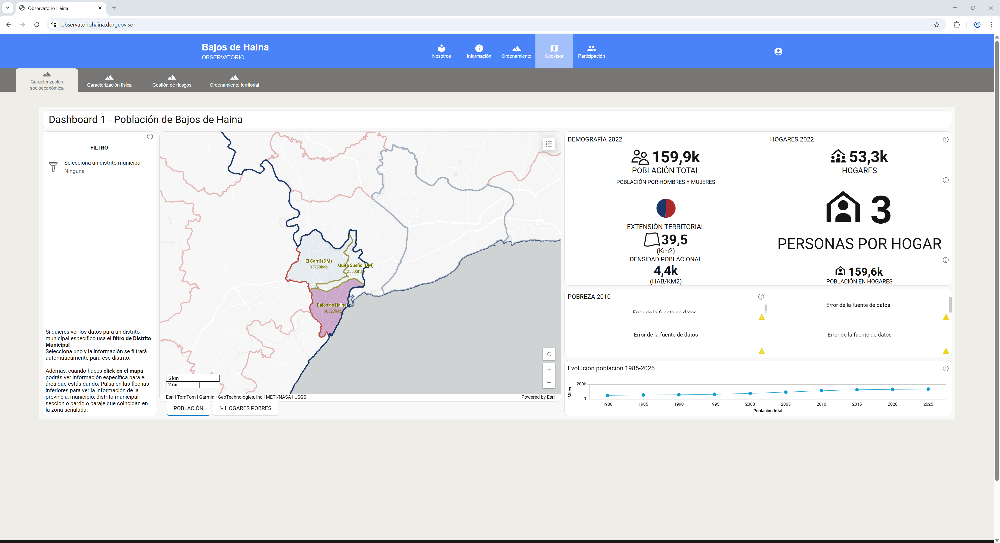{#fig-dash-poblacion}

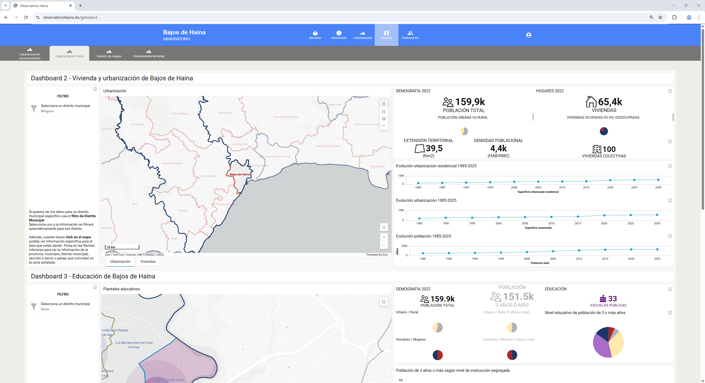{#fig-dash-vivienda}

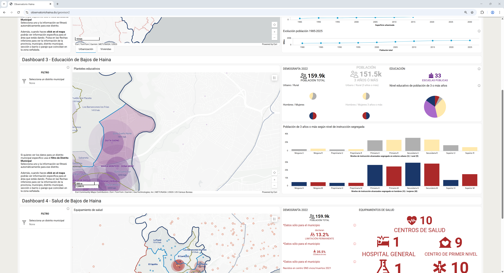{#fig-dash-educacion}

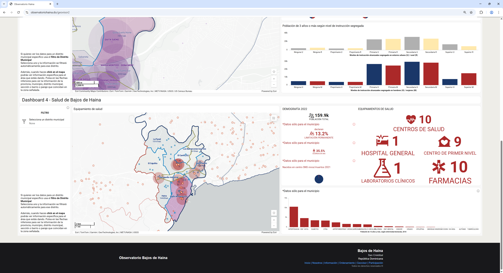{#fig-dash-salud}

Dashboards temáticos del Observatorio Ciudadano de Haina (1: Caracterización sociodemográfica, 2: Vivienda y urbanización, 3: Educación, 4: Salud). Capturas del sitio en producción [observatoriohaina.do](https://observatoriohaina.do), 2024.

:::

### Contenidos del Observatorio

El Observatorio articula tres capas de contenidos interrelacionadas: un repositorio documental que centraliza productos del proyecto y marco legal aplicable, un dashboard de resiliencia que visualiza indicadores territoriales en tiempo real, y el geovisor cartográfico que permite explorar las 16 manzanas piloto y los 38 bluespots de inundación. Las tres capas comparten infraestructura técnica (ArcGIS Online del consorcio) y se actualizan de forma incremental conforme se generan nuevos insumos.

**Repositorio documental.** El Observatorio ofrece acceso abierto a 47 documentos que constituyen la base informativa del proyecto: informes de diagnóstico territorial (OE1), documentación técnica de las herramientas digitales (OE2), sistematizaciones de los talleres participativos, propuestas normativas, marco legal nacional y local (Ley 368-22, Ley 176-07, Ley 147-02, Ley 64-00, NSRP) y materiales de referencia académica. Los documentos están organizados en la sección "Biblioteca" con clasificación por categoría (marco legal, trabajos académicos, publicaciones y prensa) y se actualizan conforme se generan nuevos productos del proyecto.

**Dashboard de resiliencia.** El dashboard de resiliencia integra 18 indicadores distribuidos en los ejes del Índice de Calidad Urbana (ICU) adaptado al contexto de Haina: accesibilidad, cobertura de servicios, calidad ambiental, vulnerabilidad física y capacidad institucional. Los datos provienen del levantamiento fotogramétrico y LiDAR de 16 manzanas, las 155 encuestas domiciliarias (Survey123) y fuentes secundarias del censo ONE 2022. El dashboard permite la visualización en tiempo real de indicadores críticos, la comparación entre manzanas o sectores y la identificación de áreas prioritarias de intervención.

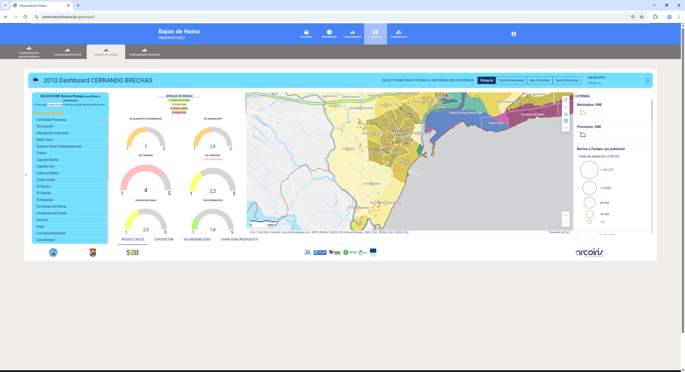{#fig-gdr-cerrando-brechas}

**Geoportal cartográfico.** El geoportal ofrece 23 capas temáticas que cubren: uso de suelo actual, límite urbano y expansión histórica, densidades, tipologías de manzana (residencial pura, mixta comercial, mixta dotacional, institucional, mixta institucional, tripartita), amenazas naturales (inundaciones, marejada ciclónica, sismicidad), amenazas antrópicas (contaminación industrial, residuos), infraestructura de servicios y equipamientos, y los 38 puntos críticos de acumulación de escorrentía (bluespots) identificados mediante el análisis del modelo digital de elevación. La población total cubierta por los datos geoespaciales integrados es de aproximadamente 159,888 habitantes, 65,400 viviendas, con una densidad promedio de 4,050 hab./km² [@oneBoletinTuMunicipio2022].

::: {#fig-modulos-ot-geoportal-09}

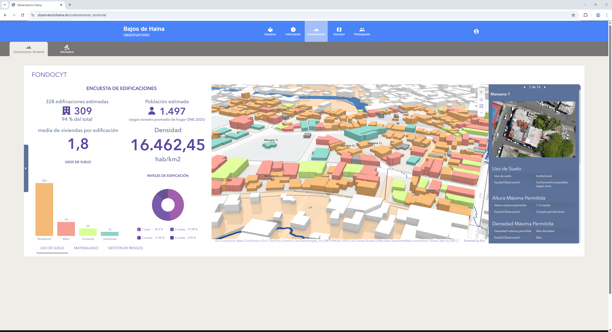{#fig-ot-uso-suelo}

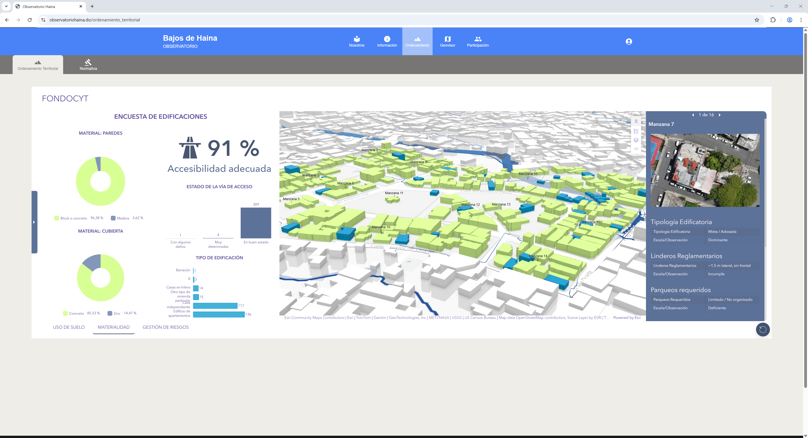{#fig-ot-materialidad}

{#fig-ot-gestion-riesgos}

Módulo de Ordenamiento Territorial del geoportal: tres capas temáticas principales (uso de suelo actual, materialidad de las edificaciones a partir del levantamiento de las 16 manzanas, gestión de riesgos con bluespots críticos). Capturas del Observatorio Ciudadano de Haina en producción, 2024.

:::

**Módulo normativo.** El módulo normativo alberga las propuestas de la Normativa Urbanística Resiliente (NUR-Haina-2025), que integra: (i) zonificación de usos compatibles con niveles de amenaza; (ii) parámetros urbanísticos diferenciados por tipología de manzana (COS/COU, alturas de 3-5 niveles, retiros específicos); (iii) lineamientos para gestión de escorrentía y continuidad verde derivados del análisis de bluespots. La NUR fue validada en 2 sesiones institucionales y 15 sesiones comunitarias en barrios representativos, con actas firmadas en todos los casos.

**Módulo de participación.** El módulo de participación integra dos herramientas de captura ciudadana. **Reporta.do** es una plataforma de reporte ciudadano georeferenciado, desarrollada en coordinación con el Centro de Operaciones de Emergencias (COE), que permite a los miembros capacitados del CM-PMR y a ciudadanos registrar reportes de daños y situaciones de riesgo. Opera en dos niveles: un primer nivel capilar de alerta rápida desde las comunidades y un segundo nivel de validación unificada por miembros del CM-PMR. Mapea tu Barrio es una herramienta de captura multimodal participativa que combina QuickCapture, Survey123 y Crowdsource para permitir a los ciudadanos documentar condiciones de su entorno con fotografías georeferenciadas, respuestas estructuradas y comentarios abiertos. Ambas herramientas están diseñadas para funcionar offline, requisito crítico en un municipio con conectividad irregular.

::: {#fig-normativa-participacion-09 layout-ncol=2}

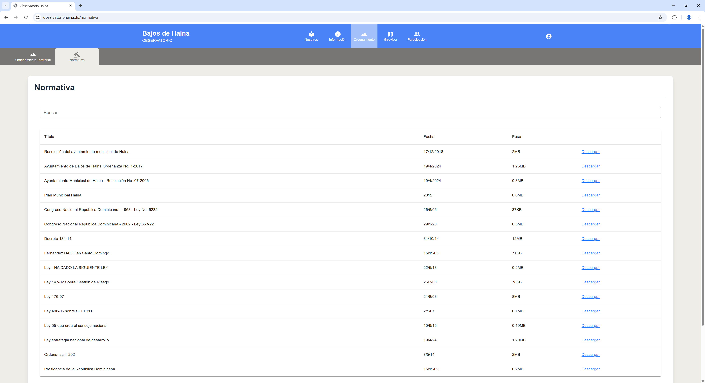{#fig-obs-normativa}

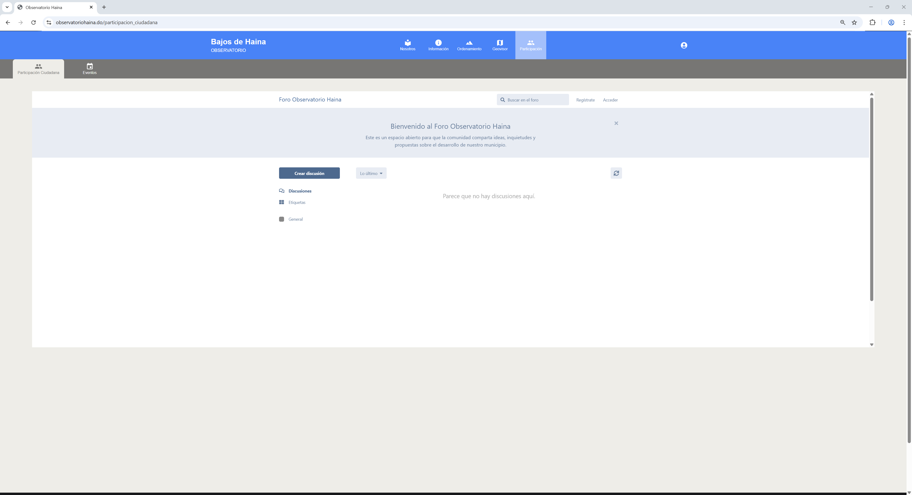{#fig-obs-participacion-foro}

Módulos normativo y de participación del Observatorio Ciudadano de Haina: acceso a la normativa NUR-Haina-2025 y al foro ciudadano digital vinculado al PMOT. Capturas del sitio en producción (observatoriohaina.do), 2024.

:::

## Gobernanza de datos {#sec-gobernanza-datos-09}

El funcionamiento sostenible del Observatorio requiere protocolos formalizados de actualización, asignación de roles institucionales y criterios de privacidad que protejan los datos personales de las comunidades participantes. Esta sección detalla el protocolo de frecuencias de actualización y la tabla de roles y responsabilidades acordados con la alcaldía municipal.

### Protocolo de actualización

El protocolo de actualización de datos del Observatorio establece tres frecuencias diferenciadas según la naturaleza de la información:

**Actualización en tiempo real.** Los reportes ciudadanos a través de Reporta.do y Mapea tu Barrio se incorporan automáticamente a la base de datos del Observatorio tras la validación por parte del personal técnico asignado. Los dashboards de alerta y gestión de riesgos reflejan esta información de manera inmediata.

**Actualización trimestral.** Los indicadores del dashboard de resiliencia, los datos de seguimiento de proyectos municipales y los registros de participación ciudadana se actualizan con periodicidad trimestral. Este ciclo coincide con el compromiso formalizado en el acta firmada con la alcaldía y permite mantener la relevancia de la información sin generar una carga operativa insostenible para el personal municipal.

**Actualización anual o por evento.** Las capas geoespaciales del geoportal (uso de suelo, infraestructura, límite urbano), los datos demográficos y los parámetros normativos se actualizan con periodicidad anual o cuando se disponga de nuevas fuentes oficiales (censos, levantamientos, modificaciones legales). Asimismo, se actualizan tras eventos significativos (desastres naturales, cambios normativos, nuevos planes sectoriales) que alteren las condiciones del territorio.

### Roles y responsabilidades

| Rol | Responsable | Funciones |
|:---|:---|:---|
| **Coordinación general** | Oficina de Planeamiento Urbano (OPU) del Ayuntamiento | Supervisión general del Observatorio, articulación interinstitucional, rendición de cuentas |
| **Administración técnica** | Personal técnico asignado por la alcaldía (1-2 técnicos) | Gestión de la plataforma, actualización de datos, validación de reportes, soporte técnico |
| **Producción de datos** | Equipos de campo municipales + CM-PMR | Captura de datos a través de Survey123, QuickCapture y Reporta.do; levantamientos periódicos |
| **Asesoría académica** | BARNA Management School / universidades asociadas | Análisis de datos, actualización metodológica, formación de personal, investigación aplicada |
| **Supervisión ciudadana** | Comité ciudadano de seguimiento del Observatorio | Monitoreo de la operación, canalización de demandas comunitarias, evaluación de pertinencia |
| **Soporte tecnológico** | Arcoíris RD / proveedor de servicios ArcGIS | Mantenimiento de la infraestructura tecnológica, licencias, actualizaciones de software |

: Roles y responsabilidades en la operación del Observatorio Ciudadano de Haina. Elaboración propia. {#tbl-roles-observatorio-09 .smaller}

El protocolo establece que la información de encuestas domiciliarias y datos personales debe ser anonimizada antes de su publicación en la plataforma, conforme a las directrices de protección de datos del proyecto. Las coordenadas exactas de viviendas se generalizan a nivel de manzana para la visualización pública, y las transcripciones de talleres participativos se anonimizan respecto a los nombres de los participantes.

## Institucionalización {#sec-institucionalizacion-09}

El cierre del ciclo del proyecto exigía convertir la plataforma técnica en un dispositivo institucional con compromisos formalizados. Esta sección documenta la jornada pública de presentación del Observatorio, el acta firmada con la alcaldía y los compromisos municipales concretos que garantizan la continuidad del ecosistema más allá del ciclo de financiamiento FONDOCYT.

### Jornada de presentación pública del Observatorio {#sec-jornada-observatorio-09}

La implementación del Observatorio Ciudadano de Haina incluyó una jornada de presentación pública con representantes del Ayuntamiento de Bajos de Haina, la Defensa Civil, organizaciones comunitarias y el equipo técnico del proyecto FONDOCYT. En esta jornada se mostraron las herramientas del ecosistema digital, se discutió el protocolo de gobernanza de datos descrito en la sección anterior y se recogieron aportes y observaciones de los actores locales para su integración al proceso de operación. La jornada actuó como puente entre la fase de desarrollo técnico de la plataforma y la fase de apropiación institucional y comunitaria, condición necesaria para la sostenibilidad del Observatorio más allá del ciclo de financiamiento del proyecto.

::: {#fig-jornada-publica-observatorio-09 layout-ncol=2}

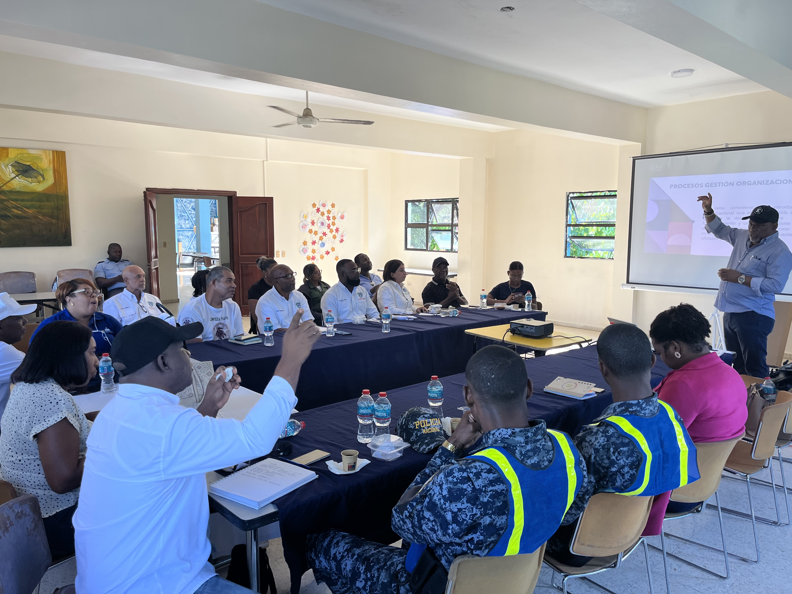{#fig-jornada-obs-sesion}

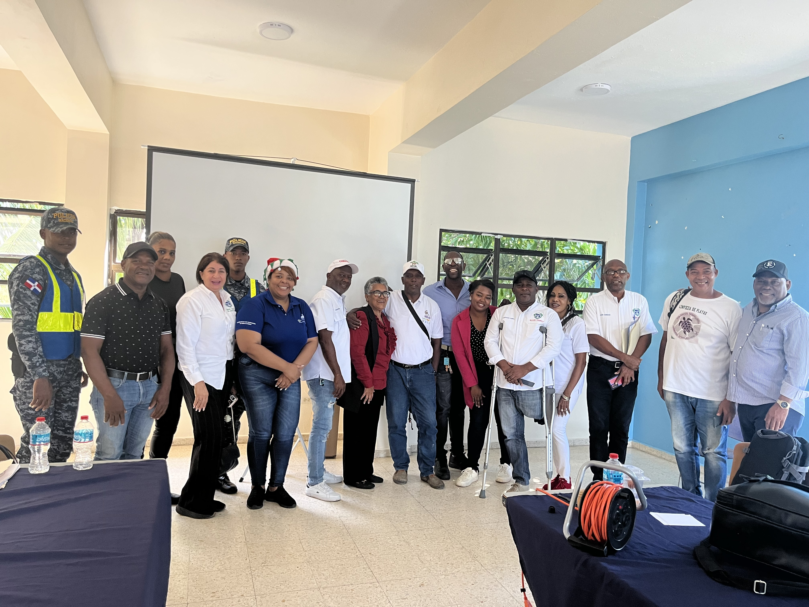{#fig-jornada-obs-grupo}

Jornada de presentación pública del Observatorio Ciudadano de Haina: sesión de trabajo con representantes del Ayuntamiento, Defensa Civil y organizaciones locales, y fotografía grupal de los asistentes tras la sesión. 2024.

:::

### Acta firmada con la alcaldía

La formalización institucional del Observatorio Ciudadano de Haina se concretó mediante un acta de compromiso firmada por la alcaldía municipal, en la que el gobierno local asumió compromisos específicos para la sostenibilidad de la plataforma y las herramientas digitales desarrolladas. Este acto constituye un hito fundamental del proyecto, coherente con la recomendación metodológica de institucionalizar antes de que concluya el ciclo de financiamiento externo. La experiencia del proyecto confirma que la sostenibilidad de los ecosistemas digitales municipales no depende de la sofisticación tecnológica sino de la formalización institucional temprana.

### Compromisos municipales 2026

El acta firmada con la alcaldía establece los siguientes compromisos para el periodo 2026:

**Protocolo de actualización trimestral.** El ayuntamiento se compromete a actualizar los datos del Observatorio con periodicidad mínima trimestral, siguiendo el protocolo descrito en @sec-gobernanza-datos-09.

**Asignación de personal técnico dedicado.** La alcaldía designará al menos un técnico con dedicación parcial para la administración de la plataforma, la validación de reportes ciudadanos y el soporte a los usuarios institucionales y comunitarios.

**Integración al futuro PMOT.** La información y los productos del Observatorio se incorporarán como insumos técnicos para la elaboración del Plan Municipal de Ordenamiento Territorial, conforme a lo establecido por la Ley 368-22 y su reglamento complementario.

**Convenios con universidades.** El ayuntamiento promueve convenios con instituciones académicas (BARNA, PUCMM, UNIBE, UPM) para garantizar la continuidad de la asesoría técnica, la formación de personal y la actualización metodológica del Observatorio.

**Integración con el SNIT.** Los datos del Observatorio se alinearán con los requerimientos del Sistema Nacional de Información Territorial (SNIT) del MEPyD, lo que permitirá la interoperabilidad con los sistemas nacionales y la conexión con los indicadores ODS 11 y 13.

Estos compromisos responden al principio de que la institucionalización se formaliza con asignación de personal y presupuesto específicos antes del cierre del proyecto de investigación, como condición necesaria para la sostenibilidad de las innovaciones sociotécnicas desarrolladas.

## Indicadores de seguimiento {#sec-indicadores-seguimiento-09}

El sistema de indicadores de seguimiento del OE3 se organiza en tres niveles: indicadores de proceso (que miden la operación de las herramientas y mecanismos), indicadores de resultado (que miden los cambios en la participación y la gobernanza) e indicadores de impacto (que miden las transformaciones en la capacidad de resiliencia territorial). Los indicadores se alinean con los objetivos SMART formulados en la sección 3.2 y con los compromisos institucionales de la sección 6.2.

| Indicador | Línea base (2024) | Meta 2026 | Fuente de verificación |
|:---|:---|:---|:---|
| **Ciudadanos con experiencia participativa** | 21.17% | 50% | Encuesta de seguimiento |
| **Conocimiento del presupuesto participativo** | 32.79% | 60% | Encuesta de seguimiento |
| **Usuarios únicos trimestrales del Observatorio** | 1,247 (primeros 90 días) | 2,000 | Analítica web |
| **Sesiones trimestrales en la plataforma** | 4,812 (primeros 90 días) | 6,000 | Analítica web |
| **Tasa de retorno de usuarios** | 38% | 40% | Analítica web |
| **Reportes ciudadanos validados (Reporta.do)** | 0 (sistema en despliegue) | 200/trimestre | Base de datos Reporta.do |
| **Ciclos de consulta pública digital completados** | 0 | 3/año | Registros del Observatorio |
| **Actualizaciones trimestrales de datos cumplidas** | 0 | 4/año | Registros del Observatorio |
| **Personal técnico asignado al Observatorio** | 0 | 1-2 técnicos | Resolución municipal |
| **Convenios académicos formalizados** | 1 (BARNA) | 3 | Actas de convenio |
| **Documentos en repositorio de acceso abierto** | 47 | 60 | Plataforma del Observatorio |
| **Capas temáticas operativas en el geoportal** | 23 | 30 | Plataforma del Observatorio |

: Indicadores de seguimiento del Observatorio Ciudadano. Elaboración propia. {#tbl-indicadores-observatorio-09 .smaller .striped}

El seguimiento de estos indicadores será responsabilidad del personal técnico asignado al Observatorio, con supervisiones trimestrales del comité ciudadano y reportes semestrales a la alcaldía. Los resultados se publicarán en la sección de transparencia de la plataforma web.

## Síntesis {#sec-sintesis-09}

El capítulo documenta el diseño, implementación e institucionalización del OE3 del proyecto FONDOCYT en Bajos de Haina: una estrategia de participación ciudadana articulada sobre el Observatorio Ciudadano (observatoriohaina.do) como infraestructura digital de gobernanza territorial. La estrategia parte del diagnóstico del capítulo 6, que reveló un déficit estructural de participación (el 78.83% de la población sin experiencia participativa previa), y propone un marco de cinco objetivos SMART, tres fases secuenciales y cuatro ámbitos de acción que integran mecanismos presenciales, digitales e híbridos.

El Observatorio reúne en una única plataforma los módulos de datos territoriales, gestión de riesgos, normativa, participación ciudadana y repositorio documental, con datos operativos validados en los primeros 90 días: 1,247 usuarios únicos, 4,812 sesiones y una tasa de retorno del 38%. La gobernanza del sistema queda formalizada en protocolos de actualización, roles institucionales asignados y un acta firmada con la alcaldía municipal que recoge compromisos concretos para el periodo 2026. Los indicadores de seguimiento sistematizados en este capítulo permiten evaluar el avance hacia los objetivos estratégicos y reportar frente a los ODS 11 y 13 y el Marco de Sendai 2015-2030.

<!-- BEGIN refs-per-chapter -->
## Referencias del capítulo {.unnumbered}

:::: {#refs-cap09 .references .csl-bib-body .hanging-indent entry-spacing="0" line-spacing="2"}
::: {#ref-congresonacionalrepublicadominicanaLeyNo176072007 .csl-entry}
**Congreso Nacional República Dominicana**. (2007). *Ley No. 176-07 del Distrito Nacional y los Municipios* (176-07).
:::

::: {#ref-oneBoletinTuMunicipio2022 .csl-entry}
**ONE**. (2022a). *Boletín tu municipio en cifras bajos de haina - valdesia- san cristobal - el carril*. Oficina Nacional de Estadística.
:::

::: {#ref-oneCensoNacionalPoblacion2022 .csl-entry}
**ONE**. (2022b). *X censo nacional de población y vivienda*. Oficina Nacional de Estadística.
:::

::: {#ref-un-habitatWorldCitiesReport2020 .csl-entry}
**UN-Habitat**. (2020). *World Cities Report 2020: The Value of Sustainable Urbanization*. United Nations Human Settlements Programme.
:::
::::
<!-- END refs-per-chapter -->
