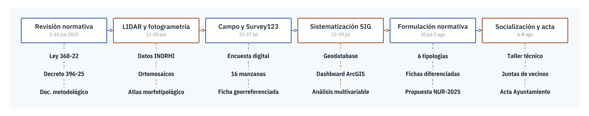

> **Fecha:** agosto 2025 **Objetivo específico:** **OE3** **Resultado:** R.1 Actividades normativa **Palabras clave:** Normativa urbanística, Tipologías de manzana, LIDAR, Survey123, Ley 368-22, Decreto 396-25, Validación comunitaria

Este capítulo documenta la formulación de la normativa urbanística y de gestión de riesgos desarrollada para el municipio de Bajos de Haina durante el periodo de ejecución comprendido entre el 1 de junio y el 8 de agosto de 2025. La elaboración estuvo a cargo de los arquitectos Danilo Minaya, Yssamar Reyes y Anyerlina Hernández, con revisión y validación de la arquitecta Ana Moyano.

## Detalle de actividades realizadas {#sec-detalle-actividades-10}

El desarrollo de la propuesta normativa para las 16 manzanas del municipio de Bajos de Haina se estructuró en seis fases progresivas, cada una con objetivos específicos, productos técnicos y resultados verificables. A continuación, se describen detalladamente las actividades ejecutadas entre el 1 de junio y el 8 de agosto de 2025.

{#fig-fases-normativa-10}

### Fase 1. Revisión de normativa y diseño metodológico

**Periodo:** 1 al 10 de junio de 2025. **Objetivo:** establecer los marcos normativos, institucionales y técnicos de referencia. Las actividades incluyeron la revisión exhaustiva de la Ley 368-22 y su reglamento (Decreto 396-25), así como de las Normas Subsidiarias Regionales de Planificación[^ley368-22-cap10]; la sistematización de experiencias nacionales e internacionales de normativa urbanística y gestión de riesgos a nivel de manzana; y la elaboración del documento metodológico base que guio el proceso técnico, incorporando componentes geoespaciales, normativos, participativos y de gestión de riesgos. **Producto:** documento metodológico de referencia para la formulación normativa.

[^ley368-22-cap10]: Ley 368-22 sobre Ordenamiento Territorial, Uso de Suelo y Asentamientos Humanos (Congreso Nacional de la República Dominicana, 2022), complementada por el Decreto 396-25 que aprueba su reglamento de aplicación.

### Fase 2. Análisis mediante LIDAR y fotogrametría

Se partió de la generación de insumos técnicos mediante un análisis fotogramétrico de alta resolución por manzana, elaborado a partir de un vuelo LIDAR realizado previamente en la zona. Este insumo permitió identificar características físicas clave de las edificaciones y su distribución espacial, sirviendo como base objetiva para establecer indicadores normativos preliminares. El material completo (hojas de análisis fotogramétrico, manzana por manzana) se conserva como referencia documental en el repositorio del proyecto dentro del entregable OE3[^oe3-repo-cap10].

**Periodo:** 11 al 20 de junio de 2025. **Objetivo:** generar una caracterización físico-espacial de alta precisión por manzana. Las actividades comprendieron el análisis e interpretación de datos altimétricos LIDAR proporcionados por el Instituto Nacional de Recursos Hidráulicos (INDRHI), el procesamiento de imágenes aéreas y generación de ortomosaicos de alta resolución, y la clasificación preliminar de manzanas según morfología urbana, densidad edificatoria, accesibilidad y conectividad. **Producto:** atlas morfotipológico de las 16 manzanas basado en insumos geoespaciales.

[^oe3-repo-cap10]: Ver entregable `INF_OE3_NormativaTipologias_2025.docx` en el repositorio del proyecto.

### Fase 3. Levantamiento de información en campo y encuestas digitales

Durante la semana del 21 de julio de 2025 se llevó a cabo un levantamiento en campo a través de encuestas estructuradas en la plataforma Survey123, con el objetivo de caracterizar cada unidad construida. La encuesta levantó variables sobre tipo de material, número de niveles, servicios, condiciones constructivas y exposición a riesgos. Este proceso fue clave para validar la fotointerpretación y ajustar la tipología normativa.

**Periodo:** semana del 21 de julio de 2025. **Objetivo:** recopilar datos detallados sobre condiciones edificatorias y características socioespaciales. Las actividades incluyeron el diseño e implementación de una encuesta estructurada de edificaciones mediante Survey123, con variables sobre uso, materiales, altura, conexión a servicios básicos y condiciones de riesgo; el levantamiento en campo con equipos técnicos acompañados por actores locales y comunitarios; y la georreferenciación individual de cada edificación evaluada. **Producto:** base de datos estructurada con ficha técnica por edificación, georreferenciada.

### Fase 4. Sistematización, análisis integrado y desarrollo del Dashboard

Todos los datos recolectados fueron integrados y sistematizados en la plataforma ArcGIS Online, generando una representación interactiva en forma de Dashboard dinámico con filtros por tipología de manzana, niveles de riesgo y condiciones constructivas, entre otras variables. Esta herramienta fue diseñada para consulta institucional y toma de decisiones basada en evidencia territorial; su detalle técnico se documenta en @sec-observatorio-ciudadano-09.

**Periodo:** 22 al 29 de julio de 2025. **Objetivo:** integrar la información recolectada en una plataforma interactiva de análisis y visualización. Las actividades comprendieron la creación de un modelo de geodatabase en ArcGIS Online para sistematizar los datos del levantamiento, el desarrollo de un Dashboard interactivo con visualización de indicadores clave por manzana, y un análisis espacial multivariable para identificar zonas prioritarias de intervención normativa y gestión de riesgo. **Producto:** plataforma digital en línea con acceso controlado y Dashboard funcional.

### Fase 5. Formulación normativa por tipología de manzana

Con base en los insumos técnicos, se elaboró un documento de normativa urbanística segmentado por tipología de manzana (residencial pura, mixta con comercial, institucional, entre otras), incorporando parámetros de densidad, altura permitida, usos de suelo, servidumbres y medidas mínimas de mitigación de riesgo. Este documento fue técnicamente validado por el Ayuntamiento mediante acta firmada (ver Fase 6); su adopción formal como normativa subsidiaria municipal corresponde al Concejo de Regidores conforme al marco legal nacional vigente. Las fichas normativas completas por tipología se recogen en @sec-cuadro-resumen-anexoG.

**Periodo:** 30 de julio al 5 de agosto de 2025. **Objetivo:** diseñar una propuesta normativa adaptada, coherente con el marco legal vigente y las condiciones locales. Las actividades comprendieron la definición de seis tipologías de manzana (residencial pura, mixta con comercial, mixta con dotacional, institucional, mixta con institucional y mixta tripartita), la elaboración de fichas normativas diferenciadas con usos permitidos, densidades máximas, parámetros de ocupación, lineamientos de mitigación de riesgos y criterios de integración urbana, y la articulación con las escalas del instrumento de planificación municipal (uso de suelo, ordenamiento ambiental y gestión de riesgo). **Producto:** documento "Propuesta Normativa Urbanística para Bajos de Haina por Tipología de Manzana" (versión 04/08/2025).

### Fase 6. Socialización institucional y validación comunitaria

La propuesta normativa fue presentada y discutida en sesiones de trabajo con el Ayuntamiento de Haina, equipos técnicos y actores sociales clave, incluidas juntas de vecinos, lo que permitió validar las categorías tipológicas, ajustar parámetros y legitimar su aplicación futura.

**Periodo:** 6 al 8 de agosto de 2025. **Objetivo:** validar técnica y socialmente la propuesta normativa y fortalecer la apropiación local. Las actividades comprendieron el taller de presentación y revisión técnica con el equipo urbanístico del Ayuntamiento de Bajos de Haina, las sesiones de validación con representantes de juntas de vecinos, líderes comunitarios y actores estratégicos del municipio, y la recogida de observaciones, ajustes y legitimación del proceso para su adopción institucional. **Producto:** acta de validación firmada por el Ayuntamiento y actas de participación comunitaria.

## Resultados globales {#sec-resultados-globales-10}

El proceso de desarrollo normativo y las actividades asociadas produjeron cinco resultados concretos al cierre del proyecto:

1. Dieciséis manzanas sistematizadas con datos geoespaciales y levantamiento técnico detallado.
2. Plataforma interactiva con Dashboard de acceso institucional y público, operativa en ArcGIS Online.
3. Propuesta normativa urbanística estructurada y alineada con la Ley 368-22 y el Decreto 396-25.
4. Seis fichas normativas diferenciadas por tipología de manzana, con parámetros cuantitativos verificables.
5. Proceso validado institucional y comunitariamente, con actas firmadas por el Ayuntamiento y representantes de barrios.

## Indicadores de seguimiento {#sec-indicadores-seguimiento-10}

| Fase | Indicador | Meta | Cumplido |
|:---|:---|:---|:---|
| **Fotogrametría y análisis LIDAR** | Número de manzanas analizadas | 16 | Sí |
| **Encuestas Survey123** | Porcentaje de edificaciones encuestadas respecto al total | ≥ 70% | Sí |
| **Sistematización GIS** | Generación de Dashboard en línea | 1 Dashboard operativo | Sí |
| **Propuesta normativa** | Documento normativo por tipología de manzana | 1 entregable completo | Sí |
| **Validación comunitaria** | Número de sesiones de socialización realizadas | ≥ 2 | Sí |

: Indicadores de seguimiento por fase del proyecto. Elaboración propia. {#tbl-indicadores-seguimiento .smaller}

## Cronograma general {#sec-cronograma-10}

| Actividad | Fecha estimada |
|:---|:---|
| **Análisis LIDAR y fotogrametría** | 1 al 15 de junio |
| **Diseño y aplicación de encuestas Survey123** | 21 al 25 de julio |
| **Levantamiento de campo** | 21 al 28 de julio |
| **Sistematización y Dashboard** | 22 de julio al 2 de agosto |
| **Redacción de normativa urbanística** | 2 al 6 de agosto |
| **Validación institucional y comunitaria** | 6 al 8 de agosto |

: Cronograma general de actividades (junio-agosto 2025). Elaboración propia. {#tbl-cronograma-general .smaller}

## Lecciones aprendidas y recomendaciones {#sec-lecciones-10}

### Síntesis de las lecciones del proceso {#sec-10-sintesis-lecciones}

**Integración tecnológica.** El uso de herramientas como LIDAR, drones con procesamiento fotogramétrico y plataformas SIG permitió obtener datos de alta resolución para caracterizar las manzanas urbanas con precisión. Este enfoque superó las limitaciones de los métodos convencionales, evidenciando que la incorporación sistemática de tecnología geoespacial mejora la capacidad de análisis multiescalar y prospectivo en el diagnóstico territorial [@gomezUsoDronesSensores2021].

**Coproducción de conocimiento.** La participación activa de las juntas de vecinos en la validación del diagnóstico urbano y en el diseño de la propuesta normativa urbanística fortaleció la apropiación social del instrumento. Esta estrategia se alinea con enfoques recientes de gobernanza colaborativa que indican que la legitimidad de los planes territoriales depende de su construcción colectiva [@burgosParticipacionCiudadanaPlanificacion2017]. Además, experiencias como la del Plan Metropolitano de Quito [@pmotPlanMunicipalOrdenamiento2020] demostraron que la inclusión comunitaria reduce los conflictos en la implementación de instrumentos de uso de suelo.

**Diferenciación normativa por tipología.** El enfoque por tipologías permitió construir normativas ajustadas a las condiciones físicas, funcionales y sociales de cada entorno, abandonando el paradigma del reglamento homogéneo. Esta metodología es coherente con el principio de equidad territorial defendido por organismos como ONU-Hábitat [@un-habitatWorldCitiesReport2020], y con experiencias como la de Medellín, que diferenció sus instrumentos urbanísticos por unidades morfológicas funcionales [@gomezPublicacionGomez20192019].

**Sistematización en plataformas digitales.** El uso de Dashboards y geodatabases permitió consolidar los hallazgos y brindar acceso compartido a instituciones clave. Esta experiencia confirma que los sistemas de información geográfica no solo son herramientas de análisis, sino también de gobernanza de datos urbanos [@pakPublicacionPakVerbeke2015].

### Recomendaciones {#sec-10-recomendaciones}

**Escalamiento como política pública.** El modelo desarrollado en Haina puede ser replicado en otros municipios mediante un protocolo metodológico estandarizado, adaptado a cada contexto local. Se recomienda que el MEPyD y el Viceministerio de Ordenamiento Territorial integren esta metodología en los lineamientos para planes municipales conforme a la Ley 368-22.

**Fortalecimiento de capacidades municipales.** La implementación exitosa del modelo requiere que los gobiernos locales cuenten con personal técnico capacitado en SIG, procesamiento LIDAR y herramientas digitales de participación. Programas de formación continua y asistencia técnica son imprescindibles, como lo ha promovido el Programa Ciudades Emergentes y Sostenibles del BID en América Latina [@terrazaDeCiudadesEmergentes2016].

**Institucionalización de la participación.** La validación de diagnósticos y normativas por actores sociales debe institucionalizarse como un paso obligatorio y vinculante en la formulación de normativa urbanística y planes de ordenamiento. Ello responde a los principios de justicia espacial y democracia participativa que caracterizan las agendas urbanas contemporáneas [@un-habitatWorldCitiesReport2020; @harveyRebelCitiesRight2012].

**Sistema de seguimiento normativo.** Para garantizar que la normativa propuesta no quede como un instrumento simbólico, se recomienda establecer indicadores de seguimiento que midan su implementación, cumplimiento y eficacia. Dichos indicadores deben formar parte de un sistema de información georreferenciado interoperable entre niveles de gobierno [@gutierrezPublicacionGutierrez20212021].

**Convenios interinstitucionales.** La sostenibilidad de estas herramientas depende de la actualización constante de los datos. Se recomienda promover convenios entre gobiernos locales, universidades y entidades como el IGN y la ONE para garantizar flujos regulares de información actualizada [@institutogeograficonacionaljosejoaquinhungriamorellCartografiaBasicaRepublica2024].

El material complementario de esta actividad (hojas resumen de análisis fotogramétrico por manzana, resultados de la encuesta Survey123, capturas del dashboard geoespacial en ArcGIS Online, documento completo de propuesta normativa urbanística y presentación de socialización con el Ayuntamiento) se conserva como referencia documental en el repositorio del proyecto, dentro del entregable OE3 Actividades Normativa.

<!-- BEGIN refs-per-chapter -->
## Referencias del capítulo {.unnumbered}

:::: {#refs-cap10 .references .csl-bib-body .hanging-indent entry-spacing="0" line-spacing="2"}
::: {#ref-burgosParticipacionCiudadanaPlanificacion2017 .csl-entry}
**Burgos, R. T. Y.**, **Arriaga, J. del R. F.**, & **Cuji, M. S.** (2017). La participación ciudadana y planificación en el contexto de la estrategia pública para el desarrollo municipal. *OIDLES Observatorio Iberoamericano del Desarrollo Local y la Economía Social*, *11*(23).
:::

::: {#ref-gomezPublicacionGomez20192019 .csl-entry}
**Gómez**. (2019). *Publicación Gómez et al. 2019*.
:::

::: {#ref-gomezUsoDronesSensores2021 .csl-entry}
**Gómez, L. F. A.**, & **Pabon, S. B. C.** (2021). Uso de drones y sensores remotos para el monitoreo de laderas: una revisión. *Ingenierías USBMed*, *12*(2), 65--73. <https://doi.org/10.21500/20275846.5158>
:::

::: {#ref-gutierrezPublicacionGutierrez20212021 .csl-entry}
**Gutiérrez**. (2021). *Publicación Gutiérrez et al. 2021*.
:::

::: {#ref-harveyRebelCitiesRight2012 .csl-entry}
**Harvey, D.** (2012). *Rebel Cities: From the Right to the City to the Urban Revolution*. Verso.
:::

::: {#ref-institutogeograficonacionaljosejoaquinhungriamorellCartografiaBasicaRepublica2024 .csl-entry}
**Instituto Geográfico Nacional José Joaquín Hungría Morell**. (2024). *Cartografía básica de República Dominicana*. IGN-RD.
:::

::: {#ref-pakPublicacionPakVerbeke2015 .csl-entry}
**Pak, B.**, & **Verbeke, J.** (2015). *Publicación Pak y Verbeke 2015*.
:::

::: {#ref-pmotPlanMunicipalOrdenamiento2020 .csl-entry}
**PMOT**. (2020). *Plan Municipal de Ordenamiento Territorial 2020*.
:::

::: {#ref-terrazaDeCiudadesEmergentes2016 .csl-entry}
**Terraza, H.**, **Rubio Blanco, D.**, & **Vera, F.** (2016). *De ciudades emergentes a ciudades sostenibles: Comprendiendo la metrópolis emergente* (Monograf{\\\'i}a (IDB-MG-499) 499; Monografía Del BID). Banco Interamericano de Desarrollo. <https://publications.iadb.org/publications/spanish/document/De-ciudades-emergentes-a-ciudades-sostenibles.pdf>
:::

::: {#ref-un-habitatWorldCitiesReport2020 .csl-entry}
**UN-Habitat**. (2020). *World Cities Report 2020: The Value of Sustainable Urbanization*. United Nations Human Settlements Programme.
:::
::::
<!-- END refs-per-chapter -->
