{#fig-sem-portada}

> **Fecha:** 11 y 12 de octubre de 2024 **Lugar:** Santo Domingo, República Dominicana (Edificio de Laboratorios de Alta Tecnología, UASD) **Marco:** XI Bienal Internacional de Arquitectura y Urbanismo de República Dominicana **Objetivo específico:** Transversal (transferencia y validación) **Palabras clave:** Seminario-taller, Planificación urbana digital, Gestión de riesgos, Participación ciudadana, UASD, Bienal de Arquitectura, FODA asistido por IA

El 11 y 12 de octubre de 2024 se llevó a cabo el Seminario-Taller de Planificación Urbana Digital, como parte de la investigación "Desarrollo de herramientas digitales de planificación urbana, gestión de riesgos y participación pública con tecnologías innovadoras g-locales para impulsar municipios seguros, resilientes y adaptados al Cambio Climático", con caso de estudio en Bajos de Haina. La iniciativa fue realizada en colaboración con BARNA Management School, Arcoíris RD y TECCA, y financiada por FONDOCYT.

El propósito del seminario-taller fue establecer un proceso dialógico y colaborativo entre representantes municipales, académicos, expertos en ordenamiento territorial y gestión de riesgos, y la comunidad local, para desarrollar soluciones prácticas y sostenibles mediante herramientas digitales adaptativas y escalables. Estas herramientas fueron diseñadas para incidir en la planificación urbana, la gestión de riesgos y la participación pública, con un enfoque particular en la adaptación al cambio climático en municipios vulnerables como Bajos de Haina. El evento contó con más de 100 participantes y la representación de más de 30 instituciones. De ese total, 47 participaron en las tres mesas técnicas (23 en la Mesa 2 de gestión de riesgos y 10 en la Mesa 3 de participación ciudadana, más los participantes de la Mesa 1), con el resto asistiendo a los paneles, inauguración y sesión plenaria del evento.

## Agenda {#sec-agenda-11}

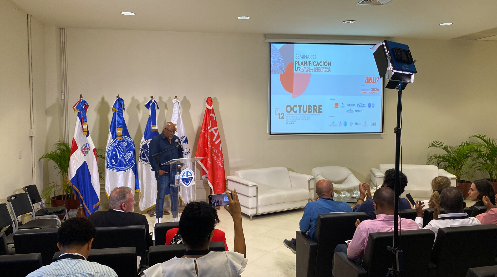{#fig-sem-apertura width=70%}

### Día 1. Introducción, contexto y aplicaciones prácticas

- **Registro y bienvenida** (08:00-09:00). Recepción de los participantes y entrega de materiales.
- **Inauguración** (09:00-09:30). Palabras de apertura e introducción a los objetivos del seminario.
- **Panel de discusión 1** (09:30-10:30). "Retos y oportunidades en la planificación urbana a través de ecosistemas digitales". Panelistas: Stephanie Gutiérrez (SARD), Niwrka Tejeda (Instituto Arnaiz), Eva Mejía (UASD), Karina Pérez (Barna Management School), Héctor Castillo (UASD).
- **Receso** (10:30-11:00).
- **Panel de discusión 2** (11:00-12:30). "Estado actual en la planificación urbana en República Dominicana". Participantes: Antony Fulgencio (Ayuntamiento de Bajos de Haina), Crisarlin de la Cruz (MIVED), Teresa Moreno (MEPyD), Edwin Olivares (COE), Ronald Skewes (DIGEPI).
- **Almuerzo** (12:30-14:00).
- **Mesas de taller** (14:00-17:30). Mesa 1: Herramientas Digitales para la Planificación Urbana (facilitadores: Ana Solís, Jorge Recio); Mesa 2: Gestión de Riesgos y Adaptación al Cambio Climático (facilitadores: Ana Moyano, Yssamar Reyes); Mesa 3: Participación Pública y Tecnologías Innovadoras (facilitadores: Carlos Manuel Ramírez Arias, Javier Villamizar).
- **Cierre del día 1** (17:30). Resumen de actividades y sesión de preguntas y respuestas.

### Día 2. Resultados y presentación de propuestas

- **Registro y bienvenida** (08:00-09:00).
- **Presentación de propuestas y planes** (09:00-10:30). Equipos de trabajo presentan propuestas; retroalimentación de expertos y participantes.
- **Receso** (10:30-11:00).
- **Continuación de presentaciones** (11:00-12:30).
- **Relatoría: experiencias y lecciones aprendidas** (12:30-13:00). Testimonios sobre replicabilidad y escalabilidad de las estrategias a nivel municipal.
- **Clausura** (13:00-13:30). Palabras de cierre; confirmación de datos para certificados; fotografía grupal.
- **Almuerzo de cierre** (13:30).

## Mesa 1. Herramientas digitales para el ordenamiento territorial (HDOT) {#sec-mesa1-hdot-11}

**Facilitadores:** Ana Solís, Jorge Recio. **Sílabo completo:** ver @sec-silabo-mesa1 en el Anexo H.

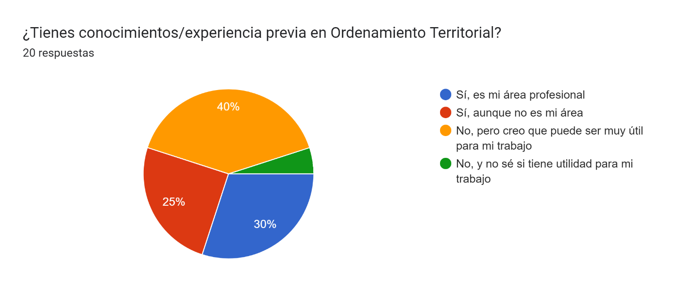{#fig-sem-mesa1-01 width=70%}

La primera mesa abordó la introducción a herramientas de mapeo y análisis espacial (SIG) aplicadas al ordenamiento territorial de Bajos de Haina. Los participantes evaluaron herramientas como la Plataforma Haina, la Plataforma Arcoíris y dashboards de monitoreo, identificando desafíos de usabilidad (dificultad para encontrar pestañas y filtros, necesidad de versión "lite" con menos datos) y proponiendo mejoras como la superposición de capas de información, geoprocesos y plataformas offline para situaciones de apagón digital.

La estructura del taller se organizó en tres fases progresivas. La Fase 1 abordó la comprensión de los conceptos fundamentales del ordenamiento territorial según la Ley 368-22, con comparativa internacional y la identificación de actores y datos necesarios para delimitar el límite urbano del municipio. La Fase 2 se centró en la estructura y gobernanza de datos, analizando el flujo actual de información entre actores institucionales y diseñando participativamente un flujo de datos ideal para el caso de estudio de Haina. La Fase 3 aplicó herramientas digitales existentes para la definición territorial: aplicaciones de levantamiento en campo, herramientas de gabinete, sistemas de validación y dashboards comparativos, culminando con prototipado rápido de soluciones a las problemáticas identificadas en las fases previas.

La metodología combinó aprendizaje basado en proyectos, sesiones teóricas breves, trabajo en equipos interdisciplinarios con perfiles complementarios, y prototipado con materiales físicos (post-its, cartón) para visualizar propuestas digitales antes de su implementación. Los criterios de evaluación ponderaron la participación en actividades grupales (40 por ciento), el desarrollo de prototipos (35 por ciento) y la reflexión final con plan de acción (25 por ciento).

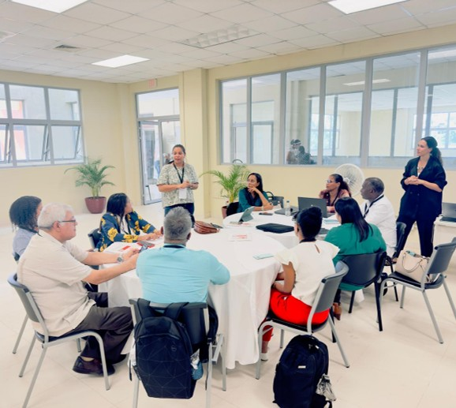{#fig-sem-mesa1-discusion width=70%}

### Acuerdos conceptuales y definiciones clave de ordenamiento territorial

La Fase 1 produjo el resultado más concreto del taller en términos normativos: la construcción colectiva de definiciones operativas para los conceptos fundamentales del ordenamiento territorial según la Ley 368-22. Los participantes partieron de una comparativa internacional facilitada mediante presentación, debatieron las discrepancias de interpretación entre instituciones y consolidaron en una tabla resumen en Miro un conjunto de términos estandarizados. Los conceptos trabajados incluyeron el límite urbano, la conurbación, el área metropolitana y las tres categorías de clasificación del suelo: urbano, urbanizable y no urbanizable. El ejercicio evidenció que la Ley 368-22 deja márgenes de ambigüedad en la definición de parámetros que distintas instituciones venían interpretando de forma divergente, lo que limita la interoperabilidad de datos y la coordinación entre actores en cualquier proceso de delimitación territorial.

El ejercicio práctico de la Fase 1 consistió en trazar gráficamente el límite urbano del municipio de Bajos de Haina a partir de capturas de ArcGIS Pro transferidas a los equipos de trabajo. Cada grupo identificó mediante stickers clasificados los datos necesarios y los actores responsables de producirlos, y los integró en un diagrama que visualizaba la cadena de información requerida para establecer el cordón urbano. La actividad puso de manifiesto que el Ayuntamiento de Haina carece de cartografía oficial actualizada a escala predial y que la información geoestadística disponible en ONE no cubre el nivel de detalle necesario para aplicar los criterios de la Ley 368-22 en un municipio con crecimiento informal acelerado como Bajos de Haina.

![Trazados colectivos del límite urbano de Bajos de Haina realizados por los equipos de la Mesa 1. **(a)** Trazado colectivo sobre capturas de ArcGIS Pro. El polígono rojo delimita el cordón urbano propuesto y los símbolos identifican equipamientos de referencia. **(b)** Segundo trazado sobre capa de población por celdas GHSL de 100 m. El recuadro azul contiene las celdas con mayor densidad y el polígono rojo delimita el cordón urbano según criterio de continuidad poblacional. Seminario-Taller PUD, octubre 2024.](img/mesa1/m1sis_limite_urbano_combinado.png){#fig-sem-mesa1-limite-urbano}

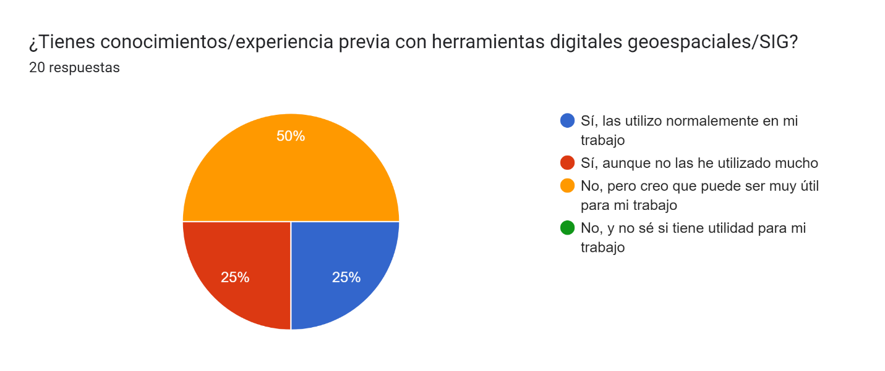{#fig-sem-mesa1-02 width=70%}

### Propuesta de flujo ideal de gobernanza de datos

La Fase 2 abordó la brecha entre el flujo actual de información entre instituciones y un flujo ideal que permitiera la interoperabilidad efectiva para el ordenamiento territorial. Los participantes analizaron mediante una tabla comparativa el estado actual, caracterizado por la fragmentación entre ONE, MIVHED, MEPyD, el Ayuntamiento y las organizaciones comunitarias, y diseñaron participativamente un flujo alternativo. El flujo ideal propuesto organiza los datos en tres capas funcionales: captura y validación primaria a cargo del Ayuntamiento y organizaciones de base; integración y estandarización a cargo de ONE y la Infraestructura de Datos Espaciales (IDE) nacional; y visualización y decisión a cargo de los ministerios sectoriales y el propio ecosistema FONDOCYT. El ejercicio identificó como cuello de botella principal la ausencia de protocolos de intercambio entre la municipalidad y los organismos nacionales, lo que obliga a cada actor a mantener sus propias bases de datos sin posibilidad de cruce sistemático.

{#fig-sem-mesa1-datos-limite}

### Prototipos digitales desarrollados en la sesión de ideación

La Fase 3 consistió en una sesión de brainstorming estructurado sobre funcionalidades deseadas para las herramientas digitales del proyecto, con captura simultánea en Miro y post-its físicos. Los participantes generaron propuestas organizadas en cuatro grupos temáticos: visualización de mapas de riesgo con capas superponibles; canales de participación pública con retroalimentación en tiempo real; dashboards de monitoreo de indicadores de vulnerabilidad accesibles para técnicos municipales; y herramientas de levantamiento en campo con modo offline para su uso durante cortes de conectividad. La compilación resultante fue entregada como documento de revisión para los stakeholders del proyecto FONDOCYT, con el objetivo de orientar el desarrollo de la segunda generación de herramientas del ecosistema digital de Haina.

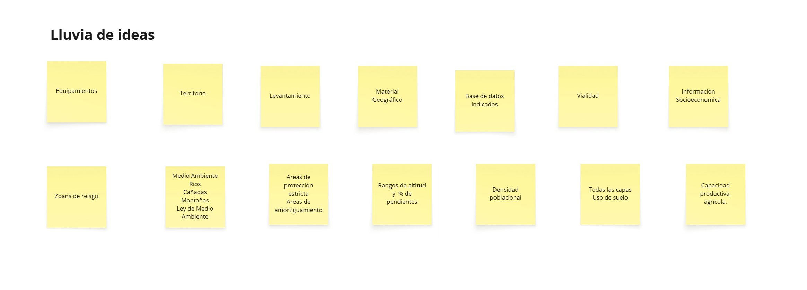{#fig-sem-mesa1-lluvia-ideas}

### Recomendaciones prioritarias {#sec-recomendaciones-mesa1-11}

Las recomendaciones del taller HDOT se estructuraron en tres líneas de acción. Primera, revisar con los stakeholders los avances en la implementación de herramientas digitales propuestas y establecer un ciclo de retroalimentación continua que evite que las plataformas se desarrollen al margen de las necesidades reales de los usuarios institucionales. Segunda, realizar más sesiones de formación para expandir el uso de herramientas digitales en ordenamiento territorial, dado que la brecha de capacidades técnicas entre instituciones fue identificada como el obstáculo principal para la adopción sostenida. Tercera, proponer criterios estandarizados de ordenamiento territorial a nivel nacional para facilitar la colaboración interinstitucional; sin estandarización previa, la interoperabilidad de datos entre municipios y ministerios permanece limitada incluso cuando las plataformas técnicas existen.

## Mesa 2. Gestión de riesgos y adaptación al cambio climático (GDR) {#sec-mesa2-gdr-11}

**Facilitadores:** Ana Moyano, Yssamar Reyes. **Sílabo completo:** ver @sec-silabo-mesa2 en el Anexo H.

{#fig-sem-mesa2-roles}

La segunda mesa se centró en métodos y tecnologías para mitigar riesgos, con ejemplos de proyectos exitosos. Se trabajaron las herramientas digitales del ecosistema GDR mediante un juego de roles con seis perfiles de actores:

  **Tomadores de decisiones.** Evaluaron la Plataforma Haina, la Plataforma Arcoíris y el Dashboard REPORTA nivel 2. Identificaron desafíos de utilización parcial y propusieron crear versiones simplificadas con capas imprescindibles por amenaza.

  **Técnicos especialistas en vulnerabilidad.** Usaron la Plataforma Haina, WebApp para mapear TDAV, Dashboard de monitoreo de levantamiento TDAV y Dashboard REPORTA nivel 2. Detectaron la falta de división político-administrativa visible y capas de infraestructuras esenciales, y sugirieron poder exportar tablas de atributos e imágenes.

  **Representantes del COE y organismos de respuesta.** Trabajaron con el Dashboard REPORTA nivel 2. Señalaron que en emergencias la digitalidad debe tener vías alternas para gestión de información y que debe existir buena comunicación con equipos locales para gestionar rumores. Sugirieron conectar reportes del 911 a la plataforma.

  **Evaluadores EDAN.** Usaron la Encuesta REPORTA 2 (Survey123). Reportaron que las líneas topográficas no son visibles, no se localizan capas de infraestructura vital, y la limitación de seleccionar solo 3 opciones de daños. Propusieron mapas más detallados con mejor localización.

  **Representantes del CMPMR municipal.** Evaluaron el Dashboard nivel 1. Identificaron que demanda mucha data y requiere conocimientos previos, y sugirieron integrar el nivel de alerta de la zona y permitir reportes propios por institución.

  **Ciudadanía.** Usó la plataforma de Riesgo por inundación y la Encuesta REPORTA 1. Solicitaron georreferenciación automática al abrir la aplicación, mayor accesibilidad y la inclusión de capas de albergues e infraestructuras.

El taller contó con 23 participantes en total: 20 asistentes y 3 moderadores, con representación de 15 mujeres y 8 hombres, provenientes de instituciones como DIGEPI, COE, SARD, MIVHED, ONE, INTEC, UASD y el CM-PMR municipal de Bajos de Haina. La metodología se basó en un juego de roles en el que cada participante asumió un perfil específico dentro del sistema de gestión de riesgos, evaluando las herramientas digitales del ecosistema FONDOCYT en condiciones simuladas de crisis.

| Perfil de actor | Herramientas evaluadas | Desafíos identificados | Sugerencias de mejora |
|:---|:---|:---|:---|
| **Tomadores de decisiones** | Plataforma Haina; Plataforma Arcoíris; Dashboard Reporta nivel 2 | Dificultad para visualizar filtros; información no disponible a nivel de barrio o manzana; texto de localidades ilegible al hacer zoom | Versión lite con capas imprescindibles; habilitar superposición de capas y geoprocesos; versión offline para apagones digitales |
| **Técnicos especialistas en vulnerabilidad** | Plataforma Haina; WebApp TDAV; Dashboard levantamiento TDAV; Dashboard Reporta nivel 2 | Ausencia de capa de infraestructuras esenciales; sin división político-administrativa visible; sin diferenciación entre ríos, cañadas y escorrentías | Exportación de tablas de atributos e imágenes por sección; agregar capa de división político-administrativa |
| **Representantes COE y organismos de respuesta** | Dashboard Reporta nivel 2 | Necesidad de vías alternas de información en emergencias; riesgo de rumores sin coordinación local | Integrar reportes telefónicos; conectar reportes del 911 a la plataforma |
| **Evaluadores EDAN** | Encuesta Reporta 2 (Survey123) | Líneas topográficas no visibles; ausencia de capas de infraestructura vital; límite de 3 opciones de daños en el formulario | Mapa más detallado con mejor localización; heredar información de otros reportes; ampliar opciones de registro de daños |
| **Representantes del CMPMR municipal** | Dashboard nivel 1 | Requiere conocimientos previos para navegación; exceso de datos sin filtro por prioridad | Integrar nivel de alerta de la zona; permitir reportes propios por institución; función de impresión de informes |
| **Ciudadanía** | Plataforma riesgo por inundación; Encuesta Reporta 1 | Localización no automática al iniciar la aplicación; accesibilidad limitada | Geolocalización automática al inicio; reporte en caso de emergencia sin movilidad; opción de voz para personas no videntes |

: Evaluación de herramientas digitales por perfil de actor. Seminario-Taller, octubre 2024. Elaboración propia. {#tbl-eval-herramientas-gdr .smaller}

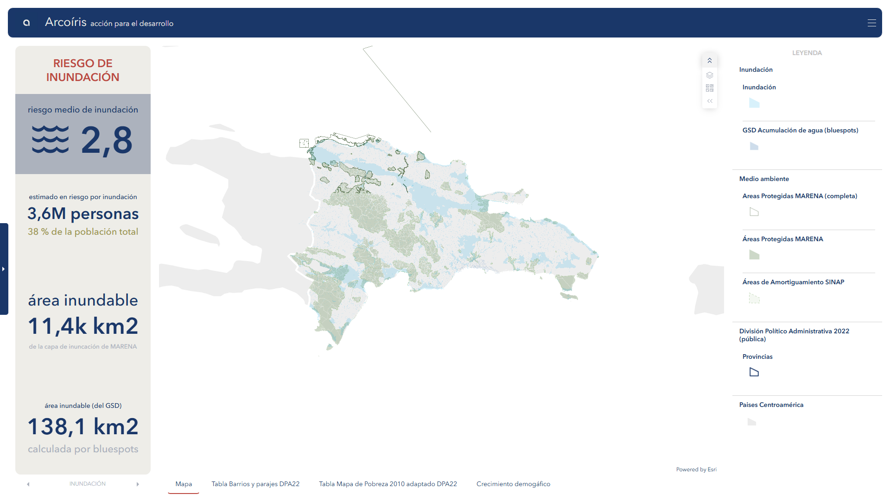{#fig-sem-mesa2-dashboard}

Los patrones más recurrentes en el análisis apuntan a tres dimensiones críticas. La primera es la necesidad de simplificación: las plataformas resultan densas en datos para su uso en situaciones de crisis y demandan versiones ligeras con las capas imprescindibles activadas por defecto. La segunda es la desconexión entre capas de información: la ausencia de infraestructuras esenciales y la falta de división político-administrativa limita la capacidad de análisis de los técnicos y evaluadores EDAN. La tercera es la dependencia de conectividad: la necesidad de soluciones offline y vías alternas de comunicación es un requerimiento transversal a todos los perfiles, especialmente en escenarios de cortes de servicio durante emergencias.

Las conclusiones del taller derivaron en cuatro recomendaciones prioritarias: evaluar de manera exhaustiva la plataforma Conoce Tu Comunidad con los perfiles de usuario identificados; realizar correcciones en el formulario Reporta.do nivel 1 con posibilidad de desarrollar una versión intermedia; implementar correcciones en la plataforma TDAV y ejecutar validaciones en campo con la Defensa Civil; y generar capacidades de impresión de informes e incorporar geoprocesos básicos para los perfiles técnicos.

### Conclusiones por perfil de actor

El análisis por grupos de la mesa GDR arrojó conclusiones diferenciadas según el perfil de uso. Para los tomadores de decisiones y los técnicos en vulnerabilidad, la necesidad central es la simplificación: las plataformas actuales resultan densas para una consulta rápida durante una emergencia, y una versión ligera con las capas imprescindibles activadas por defecto aumentaría la capacidad de respuesta sin sacrificar la precisión del análisis. A esto se suma la necesidad de capacitación específica para manejar grandes volúmenes de datos, ya que la falta de familiaridad con la navegación de las plataformas limitó significativamente la efectividad del ejercicio de simulación. El tercer hallazgo de este grupo es la urgencia de integrar las plataformas municipales con un sistema central accesible a todos los niveles de decisión, de modo que la coordinación interinstitucional no dependa de transferencias manuales de datos entre actores.

Para los representantes del COE, los organismos de respuesta y los evaluadores EDAN, el hallazgo principal es la desconexión entre las capas de datos disponibles y las necesidades de información en tiempo real durante una emergencia. La ausencia de capas de infraestructura vital, la imposibilidad de exportar tablas de atributos y la limitación de tres opciones de daño en el formulario Reporta 2 son barreras técnicas concretas que degradan la calidad de la evaluación de daños y necesidades (EDAN). La articulación entre técnicos de distintos niveles territoriales requiere una plataforma común que evite la fragmentación de la información y garantice una respuesta coordinada.

Para los representantes del CMPMR municipal y la ciudadanía en general, el problema es la dependencia de conectividad. Las plataformas actuales no funcionan de manera efectiva sin acceso estable a internet, lo cual es precisamente la condición que se ve comprometida durante los eventos de mayor impacto en el municipio, incluyendo huracanes e inundaciones. La incorporación de funcionalidades offline y vías alternas de comunicación, como la integración con el sistema 911 o el registro telefónico de reportes, es un requerimiento transversal a todos los perfiles que el taller identificó como prioritario.

### Recomendaciones prioritarias {#sec-recomendaciones-mesa2-11}

A partir del análisis de desempeño de las herramientas en las condiciones simuladas del juego de roles, el taller estableció cuatro recomendaciones de implementación con orden de prioridad. Primera, evaluar de forma exhaustiva la plataforma Conoce Tu Comunidad con los perfiles de usuario identificados en el taller, incorporando pruebas piloto en la comunidad de Bajos de Haina antes de su despliegue definitivo. Segunda, realizar correcciones en el formulario Reporta.do nivel 1 e introducir la posibilidad de desarrollar un formulario intermedio (Reporta 1.5) que amplíe las opciones de registro de daños y mejore la localización cartográfica. Tercera, corregir las plataformas de Tejidos Degradados de Alta Vulnerabilidad (TDAV) e implementar validaciones de campo con la Defensa Civil en las comunidades del municipio, con asignación de presupuesto específico para esta actividad. Cuarta, generar soluciones que permitan la impresión de informes desde las plataformas y la incorporación de geoprocesos básicos para los perfiles técnicos, de modo que el análisis de vulnerabilidad pueda realizarse sin depender de software especializado externo.

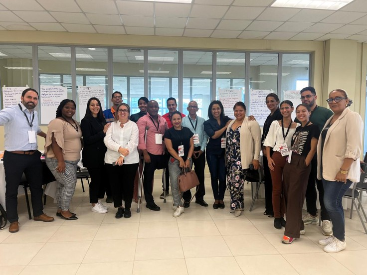{#fig-sem-mesa2-grupo width=70%}

## Mesa 3. Participación pública y tecnologías innovadoras {#sec-mesa3-part-11}

**Facilitadores:** Carlos Manuel Ramírez Arias, Javier Villamizar. **Sílabo completo:** ver @sec-silabo-mesa3 en el Anexo H.

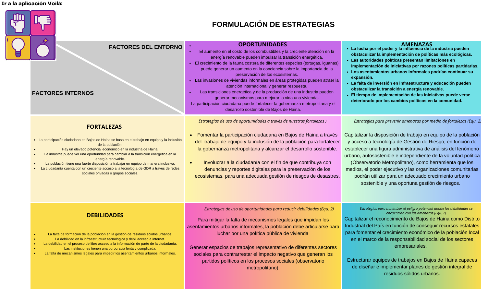{#fig-sem-mesa3-01 width=70%}

La tercera mesa trabajó herramientas digitales para la participación ciudadana y estrategias de involucramiento comunitario. Se formularon estrategias y objetivos SMART en participación ciudadana para Bajos de Haina, con base en los hallazgos del diagnóstico de participación ciudadana (155 encuestas domiciliarias realizadas entre junio y agosto de 2024).

Los principales hallazgos incluyeron: la percepción comunitaria de escaso involucramiento de los funcionarios del Ayuntamiento, contrastada con el compromiso demostrado por algunos participantes institucionales durante la mesa-taller; la disposición de la comunidad para participar activamente en la planificación; y la efectividad de las herramientas digitales seleccionadas para mejorar la confianza y transparencia entre comunidad y autoridades.

El taller de participación ciudadana contó con 10 participantes, funcionarios del Ayuntamiento de Bajos de Haina y líderes de Juntas de Vecinos, seleccionados por la pertinencia de su cargo en los procesos de participación comunitaria. Las dinámicas se estructuraron en cuatro fases: presentación del propósito y herramientas; incorporación de opiniones en pizarra digital colaborativa; integración de la información en matriz FODA asistida por inteligencia artificial; y formulación y presentación de estrategias por equipo con consolidación en plenaria.

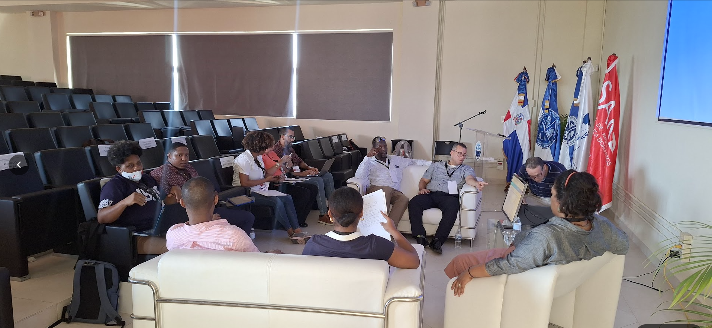{#fig-sem-mesa3-trabajo width=70%}

El análisis del entorno mediante la herramienta PESTEL arrojó hallazgos en seis dimensiones. En lo político, se identificó la discontinuidad de los procesos de planificación con cada cambio de gobierno, la burocracia institucional y las limitaciones del ayuntamiento para gestionar asentamientos informales. En lo económico, los participantes señalaron la ausencia de retorno de los beneficios industriales hacia la infraestructura social del municipio. En lo social, la carencia de formación ciudadana en gestión de residuos y la ausencia de saneamiento. En lo tecnológico, la debilidad de la infraestructura digital y el bajo acceso libre a la información pública. En lo ecológico, el vertido de residuos químicos en cañadas y la invasión de áreas protegidas como la Laguna Aurelio. En lo legal, la inexistencia de mecanismos para impedir la expansión de asentamientos informales. El detalle factor por factor consignado por los equipos de trabajo se consolidó en la tabla siguiente.

| Políticos | Económicos | Sociales | Tecnológicos | Ecológicos | Legales |
|:---|:---|:---|:---|:---|:---|
| **Pérdida del esfuerzo de planeación en participación ciudadana con cada cambio de gobierno. Burocracia de las instituciones. Falta de mecanismos de control para la administración del territorio. Baja capacidad de gestión del ayuntamiento para mejorar la infraestructura del municipio. Ausencia de competencias municipales para controlar los asentamientos urbanos informales. Limitaciones en las acciones de las autoridades por razones político-partidarias. Dispersión administrativa y falta de políticas públicas.** | Ausencia de retorno, como compensación del usufructo, del uso del suelo por parte de la industria. Incumplimiento del Gobierno Central en la canalización de los recursos del sector real a obras de infraestructura social. | Falta de formación de la población en gestión de residuos sólidos urbanos. Carencia de infraestructura de saneamiento de agua. | Debilidad en la infraestructura tecnológica y difícil acceso. Debilidad en el proceso de libre acceso a la información pública por parte de la ciudadanía. | Explotación medioambiental y minera orquestada en complicidad con las autoridades. Aumento de la fauna costera de diferentes especies, como tortugas e iguanas. Vertido indiscriminado de residuos químicos en cañadas aledañas al mercado municipal, afectando a la población. Invasión de viviendas informales en la Laguna Aurelio, que es un área protegida. | Inexistencia de mecanismos legales para impedir los asentamientos urbanos informales. |

: Análisis PESTEL del entorno de la participación ciudadana en Bajos de Haina. Sistematización Mesa 3, octubre 2024. Elaboración propia. {#tbl-pestel-participacion-11 .smaller}

| Análisis FODA |
|:---|
| **Fortalezas.** F1. Participación ciudadana basada en trabajo en equipo e inclusión. F2. Elevado potencial económico de la actividad industrial y portuaria. F3. Fuerte disposición ciudadana para el trabajo colaborativo. F4. Acceso creciente a tecnologías de GDR vía redes sociales. |
| **Oportunidades.** O1. Transición energética impulsada por el alza de combustibles. O2. Crecimiento de fauna costera como motor de conciencia ambiental. O3. Atención internacional por invasiones en áreas protegidas. O4. La participación ciudadana puede fortalecer la gobernanza metropolitana. |
| **Debilidades.** D1. Formación insuficiente en gestión de residuos sólidos urbanos. D2. Debilidad en infraestructura tecnológica y acceso a internet. D3. Burocracia institucional lenta y complicada. D4. Inexistencia de mecanismos legales contra asentamientos informales. |
| **Amenazas.** A1. Ciclos políticos que obstaculizan la continuidad de políticas ecológicas. A2. Limitaciones de autoridades por razones político-partidarias. A3. Expansión continua de asentamientos informales. A4. Falta de inversión en educación e infraestructura básica. |

: Matriz FODA de participación ciudadana, Bajos de Haina. Sistematización Mesa 3, octubre 2024. Elaboración propia. {#tbl-foda-participacion-11 .smaller}

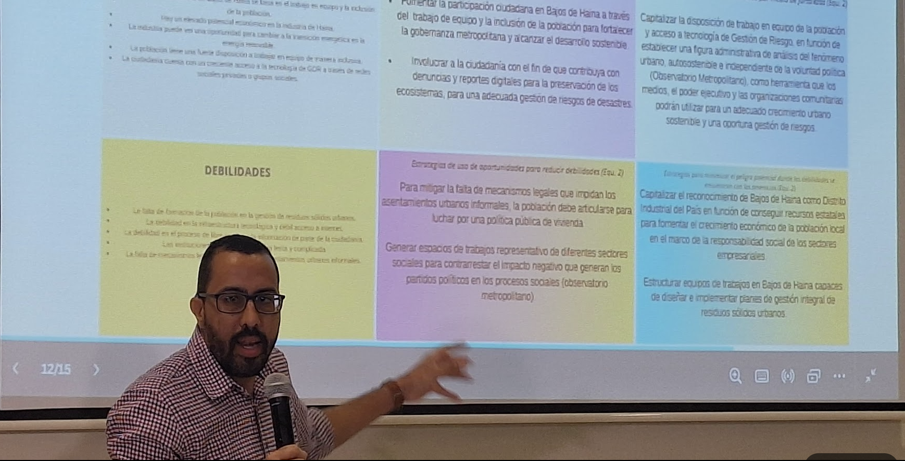{#fig-sem-mesa3-foda-plenaria}

A partir de los cuadrantes FODA, los equipos acordaron tres objetivos SMART: articular el tejido social de Bajos de Haina para incidir en políticas públicas de vivienda y desarrollo económico local con alcance del 50 por ciento de la economía a diez años; fomentar el crecimiento sostenible de centros tecnológicos comunitarios hasta un 50 por ciento en dos años; e impulsar la gobernanza metropolitana mediante el incremento de la participación ciudadana en un 30 por ciento en los próximos 18 meses.

Las recomendaciones estratégicas del taller apuntaron a cinco líneas. Fomentar la participación mediante trabajo en equipo e inclusión para fortalecer la gobernanza metropolitana. Involucrar a la ciudadanía en reportes digitales para la preservación de ecosistemas. Capitalizar la disposición participativa y el acceso tecnológico existente para establecer un Observatorio Metropolitano autosostenible, independiente de la voluntad política. Articular a la población para impulsar políticas públicas de vivienda que mitiguen los asentamientos informales. Generar espacios de trabajo representativos de diferentes sectores para contrarrestar el impacto de los ciclos políticos en los procesos comunitarios.

### Principales acuerdos y propuestas

El taller de participación identificó el Observatorio Metropolitano como el instrumento central para institucionalizar la participación ciudadana en la planificación urbana y la gestión de riesgos de Bajos de Haina [@un-habitatWorldCitiesReport2020]. Los participantes acordaron que este tipo de estructura permite co-construir el desarrollo metropolitano sostenible al canalizar la integración de datos y actores del territorio hacia un objetivo común: el fortalecimiento de la gobernanza y el desarrollo sostenible. Su valor específico frente a los mecanismos de participación convencionales reside en su independencia de la voluntad política coyuntural, ya que su funcionamiento puede sostenerse mediante convenios interinstitucionales y protocolos técnicos que trascienden los ciclos electorales. Los participantes señalaron que, por su complejidad, el Observatorio debe implementarse por etapas, priorizando en una primera fase las dimensiones de urbanización y gestión de riesgos, que son las más directamente conectadas con los resultados de la investigación FONDOCYT.

Los dos equipos de trabajo coincidieron en que la condición de posibilidad del Observatorio es la articulación del tejido social de Bajos de Haina: sin organización comunitaria capaz de sostener una demanda continua de información y transparencia, ninguna plataforma técnica por sí sola puede garantizar la participación significativa. El taller propuso capitalizar el reconocimiento formal de Bajos de Haina como Distrito Industrial del país para conseguir recursos estatales y de responsabilidad social empresarial que financien el crecimiento económico local, reduciendo la dependencia de la comunidad respecto de un ayuntamiento con capacidades institucionales limitadas. La mesa identificó también la necesidad urgente de estructurar equipos de trabajo en el municipio capaces de diseñar e implementar planes de gestión integral de residuos sólidos urbanos, como primera intervención concreta que mejore la calidad de vida y genere confianza en los mecanismos de participación.

### Recomendaciones prioritarias {#sec-recomendaciones-mesa3-11}

Las estrategias formuladas por los dos equipos de trabajo en la plenaria de cierre se consolidaron en seis proposiciones ordenadas por impacto esperado. Primera, fomentar la participación ciudadana mediante trabajo en equipo e inclusión de la población para fortalecer la gobernanza metropolitana y alcanzar el desarrollo sostenible. Segunda, involucrar a la ciudadanía en denuncias y reportes digitales para la preservación de los ecosistemas y una adecuada gestión de riesgos de desastres. Tercera, capitalizar la disposición de trabajo en equipo y el acceso a tecnología de gestión de riesgos para establecer una figura administrativa de análisis del fenómeno urbano autosostenible e independiente de la voluntad política, en la forma de un Observatorio Metropolitano, como herramienta que los medios de comunicación, el poder ejecutivo y las organizaciones comunitarias puedan usar para un crecimiento urbano sostenible y una gestión de riesgos oportuna. Cuarta, articular a la población para luchar por una política pública de vivienda que mitigue los asentamientos urbanos informales, ante la ausencia de mecanismos legales efectivos identificada en el análisis PESTEL. Quinta, generar espacios de trabajo representativos de diferentes sectores sociales para contrarrestar el impacto negativo de los ciclos políticos en los procesos comunitarios. Sexta, capitalizar el reconocimiento de Bajos de Haina como Distrito Industrial del país para conseguir recursos estatales que fomenten el crecimiento económico de la población local en el marco de la responsabilidad social de los sectores empresariales.

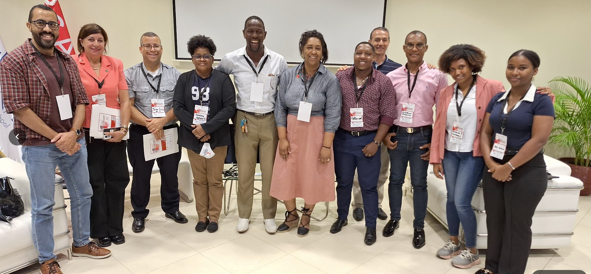{#fig-sem-mesa3-grupo width=70%}

## Síntesis transversal del Seminario-Taller {#sec-sintesis-transversal-11}

Las tres mesas del Seminario-Taller de Planificación Urbana Digital convergieron en un diagnóstico compartido que trasciende los límites de cada eje temático: la principal barrera para la gobernanza territorial en Bajos de Haina no es técnica sino informacional e institucional. La Mesa 1 identificó la fragmentación de datos entre instituciones como el cuello de botella del ordenamiento territorial. La Mesa 2 constató que la desconexión entre capas de información y la dependencia de conectividad degradan la capacidad de respuesta ante desastres. La Mesa 3 señaló que el 78.83% de la población carece de experiencia participativa no por falta de disposición, sino por falta de canales accesibles y confiables de información.

La convergencia transversal más significativa del evento fue la propuesta emergente del Observatorio Ciudadano de Haina. Las tres mesas, desde sus respectivos ángulos técnicos, identificaron de forma independiente la necesidad de una infraestructura institucional que articulara datos, actores y mecanismos de participación en un único dispositivo sostenible, independiente de los ciclos electorales y con capacidad de operación en condiciones de conectividad limitada. El Observatorio no fue un resultado diseñado de antemano: emergió del proceso deliberativo del Seminario-Taller como síntesis de los requerimientos identificados en los tres ejes.

El evento evidenció también la brecha entre capacidad técnica instalada y apropiación institucional. Las plataformas del ecosistema FONDOCYT demostraron ser técnicamente robustas, pero su usabilidad real en condiciones de crisis requiere simplificación, versiones ligeras y capacitación específica por perfil de usuario. Esta tensión entre complejidad técnica y accesibilidad operativa es la agenda pendiente más concreta que el Seminario-Taller dejó consignada para la segunda generación del ecosistema, desarrollada en detalle en el capítulo 7.

<!-- BEGIN refs-per-chapter -->
## Referencias del capítulo {.unnumbered}

:::: {#refs-cap11 .references .csl-bib-body .hanging-indent entry-spacing="0" line-spacing="2"}
::: {#ref-un-habitatWorldCitiesReport2020 .csl-entry}
**UN-Habitat**. (2020). *World Cities Report 2020: The Value of Sustainable Urbanization*. United Nations Human Settlements Programme.
:::
::::
<!-- END refs-per-chapter -->
