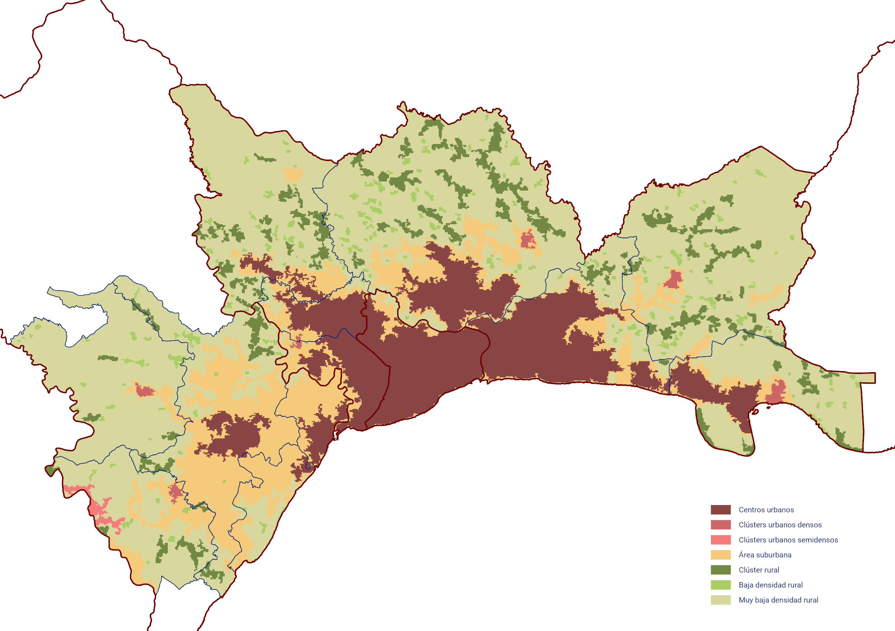

Este anexo reproduce los sílabos didácticos de las tres mesas del Seminario-Taller de Planificación Urbana Digital (SPUD) celebrado en Bajos de Haina los días 11 y 12 de octubre de 2024. Los sílabos son los documentos formativos entregados a participantes y facilitadores: describen la descripción del taller, los objetivos, las competencias a desarrollar, la agenda detallada, la metodología, los recursos y la bibliografía recomendada de cada mesa. Complementan la sistematización editorial del Capítulo 11 con el marco pedagógico que guió el diseño del evento. Los tres sílabos se presentan aquí con la misma estructura canónica para facilitar la lectura comparada.

## Mesa 1: herramientas digitales para el ordenamiento territorial (HDOT) {#sec-silabo-mesa1}

### Metadatos del taller

| Campo | Valor |
|:---|:---|
| **Taller** | Herramientas Digitales para el Ordenamiento Territorial (HDOT) |
| **Código** | HDOT-2024 |
| **Modalidad** | Presencial |
| **Fecha** | Viernes 11 de octubre de 2024 |
| **Horario** | 14:00 a 17:30 |
| **Duración** | 3,5 horas (210 minutos) |
| **Lugar** | Salón FIA-Lab 505, Laboratorio de Alta Tecnología, UASD |
| **Facilitadores** | Ana Solís (Arcoíris RD), Jorge Recio (Arcoíris RD), Karina Pérez Teruel (BARNA) |

: Ficha técnica del sílabo de la Mesa 1. {#tbl-silabo-mesa1-meta .smaller}

### Descripción y propósito

El taller tiene como objetivo principal establecer una comprensión unificada y parametrizada de los conceptos fundamentales del ordenamiento territorial (OT), basándose en la Ley 368-22 y alineándolos con definiciones internacionales. Mediante actividades colaborativas y el uso de herramientas digitales, los participantes abordan problemáticas urbanas y territoriales en sus contextos locales, fomentando una planificación urbana eficiente y sostenible. Se promueve la colaboración interdisciplinaria y el uso de tecnologías modernas para prototipar soluciones que faciliten una gobernanza de datos efectiva.

{#fig-silabo-m1-ghsl}

### Objetivos

**Objetivo general.** Establecer definiciones comunes de los conceptos clave del ordenamiento territorial a partir de la Ley 368-22, facilitando su aplicación práctica en la planificación urbana y territorial.

**Objetivos específicos.**

- Definir colectivamente conceptos clave del OT de manera parametrizada.
- Desarrollar prototipos de herramientas digitales para la representación gráfica y generación de datos.
- Elaborar un flujograma de la gobernanza de datos en el OT.
- Presentar resultados que demuestren la utilidad de las herramientas digitales para resolver problemáticas urbanas y territoriales.

### Competencias a desarrollar

| Dimensión | Elemental | Básico | Avanzado |
|:---|:---|:---|:---|
| **Afectiva** | Mostrar interés en los conceptos fundamentales del OT y herramientas digitales. | Valorar la importancia del uso de herramientas digitales en la planificación urbana y el OT. | Asumir el compromiso de implementar soluciones digitales en su práctica profesional, liderando iniciativas de planificación urbana sostenible. |
| **Cognitiva** | Identificar los conceptos básicos del OT según la Ley 368-22. | Comprender las metodologías y estándares internacionales aplicables al OT. | Analizar y evaluar críticamente las problemáticas territoriales locales frente a los estándares internacionales de OT mediante herramientas digitales avanzadas. |
| **Praxeológica** | Participar en actividades prácticas básicas utilizando herramientas digitales sencillas. | Desarrollar prototipos de soluciones digitales en equipo para problemáticas identificadas. | Formular, presentar y argumentar soluciones digitales complejas, demostrando dominio técnico y capacidad de innovación en el OT. |

: Competencias esperadas en los participantes de la Mesa 1. {#tbl-silabo-mesa1-comp .smaller}

### Perfil de los participantes

El taller está dirigido a profesionales y académicos en áreas de arquitectura, urbanismo, ingeniería civil, geografía y disciplinas afines; funcionarios públicos involucrados en planificación urbana, ordenamiento territorial y gestión de datos; líderes comunitarios y actores sociales interesados en el desarrollo sostenible de sus comunidades; y estudiantes de postgrado en campos relacionados con el urbanismo y la planificación territorial.

### Estructura y agenda

| Bloque | Tiempo (min) |
|:---|---:|
| Registro y bienvenida | 15 |
| F1. Comprensión de los conceptos fundamentales del OT | 30 |
| F2. Estructura y gobernanza de datos | 30 |
| Pausa | 15 |
| F3. Aplicación de herramientas digitales | 60 |
| Presentación de prototipos y retroalimentación | 45 |
| Evaluación final y clausura | 15 |

: Agenda del taller de la Mesa 1. {#tbl-silabo-mesa1-agenda .smaller}

### Metodología y bloques

**Fase 1. Comprensión de los conceptos fundamentales del OT.** Proporciona una comprensión común de los conceptos fundamentales del OT según la Ley 368-22 y sus equivalentes internacionales, identificando posibles desafíos en su implementación. Se trabajan los conceptos urbanos clave de la Ley 368-22 (límite urbano, conurbación, urbano vs. rural, clasificación del suelo urbano, urbanizado, urbanizable y no urbanizable), su comparativa con definiciones internacionales, y los instrumentos normativos para la definición del límite urbano con énfasis en el rol de los ayuntamientos. Se identifica los datos y actores necesarios para determinar el límite urbano y se realiza un ejercicio de definición gráfica del límite urbano sobre el caso de estudio.

{#fig-silabo-m1-sistema}

El Artículo 66 de la Ley 368-22 establece la base normativa del ejercicio F1 al definir el Instrumento de Delimitación del Suelo Urbano (IDSU) como figura obligatoria para los municipios que no dispongan de plan municipal de ordenamiento territorial:

> **CAPÍTULO VIII. DE LA DELIMITACIÓN DEL SUELO URBANO Y DE LAS NORMAS SUBSIDIARIAS REGIONALES DE PLANIFICACIÓN**
>
> **SECCIÓN I. DE LA DELIMITACIÓN DEL SUELO URBANO**
>
> **Artículo 66. Instrumento de Delimitación del Suelo Urbano.** Los municipios y distritos municipales que no dispongan de plan municipal de ordenamiento territorial deberán elaborar un Instrumento de Delimitación del Suelo Urbano con los siguientes contenidos mínimos:
>
> 1) Determinación de los terrenos que respondan a la clasificación del suelo urbano conforme a los criterios incluidos en esta ley;
>
> 2) La definición de las alineaciones y rasantes de la red vial, que sea coherente con la trama urbana existente; y
>
> 3) Las normativas de edificación y urbanización para regular los aspectos morfológicos y estéticos de las construcciones, los usos de los inmuebles y la ordenación de volúmenes.
>
> *República Dominicana. Ley 368-22 de Ordenamiento Territorial, Uso de Suelo y Asentamientos Humanos, Cap. VIII, Sec. I, Art. 66.*

**Fase 2. Estructura y gobernanza de datos.** Profundiza en la gestión de datos dentro del OT, enfocándose en la estructura y gobernanza necesarias para un flujo de información eficiente, y elabora un flujograma que representa este proceso. Analiza el flujo actual de datos entre actores, identifica las problemáticas existentes y las soluciones posibles a problemáticas concretas, y concluye con un diseño participativo de un flujo de datos ideal.

**Fase 3. Aplicación de herramientas digitales.** Idea herramientas digitales para la definición gráfica y generación de datos relacionados con el OT, incorporando métodos de prototipado rápido. Revisa herramientas existentes (aplicaciones de levantamiento en campo, aplicaciones para dibujo en gabinete, herramientas de validación de datos y dashboards comparativos) y desarrolla prototipos de aplicaciones para abordar las problemáticas identificadas en las fases anteriores, con presentación final.

El taller combina aprendizaje basado en proyectos, sesiones teóricas breves, trabajo en equipos interdisciplinarios y prototipado rápido con materiales físicos (post-it, cartón, hilo) para visualizar soluciones digitales antes de su implementación. Se complementa con debates y reflexiones grupales para promover el pensamiento crítico.

### Recursos y materiales

**Tecnológicos.** Computadoras portátiles o tablets con acceso a internet (preferiblemente una por participante o grupo); software SIG (ArcGIS); herramientas de diseño colaborativo (Miro, Jamboard u otras).

**Impresos.** Hojas de trabajo, guías y manuales; infografías y diagramas explicativos de los conceptos clave.

**Lecturas y materiales de apoyo.** Documentos breves sobre zonificación y metodología GHSL; videos o podcasts cortos sobre conceptos clave; referencias bibliográficas para profundizar.

### Evaluación

- Participación en actividades grupales (40 por ciento): nivel de involucramiento y aportes en las actividades colaborativas.
- Desarrollo de prototipos (35 por ciento): creatividad, aplicabilidad y pertinencia de las soluciones propuestas.
- Reflexión final y plan de acción (25 por ciento): capacidad para analizar lo aprendido y proponer acciones concretas.

Se otorga un certificado de participación a quienes completen satisfactoriamente el taller.

### Bibliografía recomendada

- República Dominicana (2022). *Ley 368-22 de Ordenamiento Territorial, Uso de Suelo y Asentamientos Humanos*. Congreso Nacional de la República Dominicana.
- ONU-Hábitat (2014). *Planeamiento urbano para autoridades locales*. Programa de las Naciones Unidas para los Asentamientos Humanos.
- Proyecto FONDOCYT (2025). *Documentación interna sobre gobernanza de datos territoriales en Bajos de Haina* [Informe del proyecto 2023-1-3A13-0725].

---

## Mesa 2: gestión de riesgos y adaptación al cambio climático (GDR) {#sec-silabo-mesa2}

### Metadatos del taller

| Campo | Valor |
|:---|:---|
| **Taller** | Gestión de Riesgos y Adaptación al Cambio Climático |
| **Código** | GDR-2024 |
| **Modalidad** | Presencial |
| **Fecha** | 11 y 12 de octubre de 2024 |
| **Horario** | 14:00 a 17:30 |
| **Duración** | 3,5 horas (210 minutos) |
| **Lugar** | UASD, Santo Domingo |
| **Facilitadores** | Ana Moyano (Arcoíris RD), Yssamar Reyes (Arcoíris RD), Danilo Minaya (BARNA) |

: Ficha técnica del sílabo de la Mesa 2. {#tbl-silabo-mesa2-meta .smaller}

### Descripción y propósito

El taller se inscribe en la investigación FONDOCYT sobre herramientas digitales de planificación urbana, gestión de riesgos y participación pública con tecnologías innovadoras g-locales. Busca promover decisiones informadas y sostenibles en el desarrollo urbano de Bajos de Haina mediante la creación de herramientas digitales adaptativas y escalables. El propósito de la mesa es establecer un proceso dialógico entre las instituciones participantes para contribuir al desarrollo de herramientas digitales accesibles y escalables a nivel municipal de gestión de riesgos y cambio climático, basadas en la normativa y las prácticas institucionales existentes.

Siguiendo el planteamiento de Lavell [@lavellGestionLocalRiesgo2003], el riesgo se entiende como una construcción social derivada de los modelos de desarrollo, las formas de asentamiento en el territorio y los procesos de transformación social y económica. De ahí que la sociedad esté en condiciones de deconstruir y controlar lo que ella misma ha construido, y que la reducción del riesgo solamente puede ser exitosa al considerar la gestión del riesgo como componente de los procesos de gestión del desarrollo sectorial y territorial, del ambiente y de la sostenibilidad. En República Dominicana, la Ley 147-02 sobre Gestión de Riesgos [@congresonacionalrepublicadominicanaLey14702Sobre2002] establece los principios de protección, prevención, coordinación, participación y descentralización que organizan el sistema nacional de prevención y respuesta a desastres. A esto se suman los compromisos del país en las Contribuciones Determinadas a Nivel Nacional (NDC) bajo el Acuerdo de París, que fijan una reducción del 27 por ciento de las emisiones de gases de efecto invernadero para 2030 respecto a un escenario *business as usual*, de la cual un 20 por ciento depende de financiamiento internacional y un 7 por ciento de recursos nacionales.

El taller propone tres instrumentos digitales fundamentales para fortalecer la gestión de riesgos: herramientas de visualización, para reducir la brecha de conocimiento sobre el territorio mediante mapas de riesgo, áreas vulnerables, infraestructuras críticas y recursos naturales; herramientas de identificación, para localizar, clasificar y cuantificar tejidos urbanos degradados de alta vulnerabilidad; y sistemas de reporte de afectaciones, para recopilar y analizar datos posteriores a un evento con vistas a coordinar la respuesta inmediata y retroalimentar los planes de mitigación.

### Objetivos

**Objetivo general.** Crear un proceso dialógico entre las instituciones participantes de la mesa para contribuir al desarrollo de herramientas digitales accesibles y escalables a nivel municipal de gestión de riesgos y cambio climático.

**Objetivos específicos.**

- Aumentar las capacidades locales del Comité Municipal de Prevención, Mitigación y Respuesta (CM-PMR) y de las redes comunitarias en el uso de herramientas digitales de visualización de riesgo.
- Identificar, clasificar y cuantificar tejidos urbanos degradados de alta vulnerabilidad para orientar procesos de consolidación y rehabilitación.
- Diseñar un sistema de reporte de afectaciones que sirva de insumo para la planificación de intervenciones futuras de mitigación y prevención.
- Generar, al finalizar la mesa, propuestas específicas en los tres componentes para el desarrollo posterior de la investigación aplicada a las herramientas.

### Competencias a desarrollar

| Dimensión | Elemental | Básico | Avanzado |
|:---|:---|:---|:---|
| **Afectiva** | Mostrar interés en la discusión de herramientas de visualización, identificación y reporte de riesgos mediante aportes en la mesa de trabajo. | Valorar el papel que cumplen las herramientas digitales en la consolidación de la gestión de riesgos y la planificación urbana, enfocándose en la reducción de la vulnerabilidad territorial. | Asumir el compromiso de liderazgo en la función pública, utilizando herramientas de gestión de riesgos para formular propuestas que promuevan la resiliencia y el servicio a la colectividad. |
| **Cognitiva** | Identificar los elementos básicos de las herramientas digitales para conocer los peligros y vulnerabilidades del territorio. | Comprender las herramientas de visualización, identificación de tejidos vulnerables y reporte de afectaciones, y cómo estas impulsan la toma de decisiones en la gestión de riesgos. | Argumentar el uso estratégico de las herramientas de gestión de riesgos en el marco de la planificación urbana para fortalecer la resiliencia de Bajos de Haina. |
| **Praxeológica** | Participar en la lluvia de ideas para aplicar herramientas digitales en el análisis del contexto de riesgos de Bajos de Haina. | Elaborar propuestas de estrategias de gestión de riesgos con base en el análisis de las herramientas digitales aprendidas. | Formular, presentar y defender estrategias de gestión de riesgos y participación social basadas en herramientas digitales, fundamentando la creación del Observatorio Metropolitano. |

: Competencias esperadas en los participantes de la Mesa 2. {#tbl-silabo-mesa2-comp .smaller}

### Perfil de los participantes

Están invitadas a participar las personas que pertenecen a instituciones de la Mesa Consultiva del proyecto que se involucran en el proceso de gestión de riesgos, es decir, instituciones multinivel de las cuales dependen las decisiones de los procesos de trabajo en la planificación urbana sostenible, la gestión del riesgo y la adaptación al cambio climático.

### Estructura y agenda

| Bloque | Tiempo (min) |
|:---|---:|
| Introducción | 10 |
| Riesgo urbano y adaptación al cambio climático | 35 |
| Vulnerabilidad urbana | 45 |
| Preparación, respuesta y recuperación | 30 |
| Integración de vulnerabilidad y riesgo en la planificación urbana digital | 50 |
| Insumos plenaria y evaluación de la mesa | 20 |

: Agenda del taller de la Mesa 2. {#tbl-silabo-mesa2-agenda .smaller}

### Metodología y bloques

La estrategia pedagógica es el **aprendizaje basado en experiencias**, con un enfoque colaborativo y práctico donde los participantes construyen conocimientos y habilidades a través de la interacción y el uso de herramientas reales. El taller aplica el ciclo *hacer-reflexionar-ajustar*, combinando experiencia activa con herramientas digitales, reflexión grupal tras cada actividad, conceptualización abstracta para estructurar los insumos generados y aplicación directa al contexto local.

La matriz metodológica por ejes se organiza del siguiente modo.

| Ejes / Componentes | Definición | Metodología | Gobernanza | Herramientas digitales |
|:---|:---|:---|:---|:---|
| **Proceso dialógico** | Construcción colectiva de definiciones clave (riesgo sistémico, vulnerabilidad, resiliencia) a través de la reflexión basada en experiencias previas y retos locales. | Metodología experiencial sobre casos reales o simulaciones contextualizadas, con reflexión sobre las actividades para reforzar el aprendizaje y ajustar las definiciones. | Reconocimiento de los actores involucrados en la gobernanza local y regional; autoevaluación de roles y responsabilidades en el manejo del riesgo. | Uso de herramientas digitales en escenarios reales; análisis de resultados y ajuste a necesidades locales para evaluar su aplicabilidad. |
| **Generación de insumos** | Insumos derivados de la experiencia práctica, basados en casos locales y situaciones simuladas para generar definiciones adaptadas a la realidad. | Simulaciones, mapas de riesgo reales y ejercicios prácticos para desarrollar insumos metodológicos adaptados al contexto propio. | Insumos de gobernanza surgidos de la práctica colaborativa, con identificación de mejoras en la estructura de gobernanza local. | Interacción con SIG y dashboards para generar insumos sobre accesibilidad, escalabilidad y aplicabilidad de las tecnologías. |

: Matriz metodológica por ejes del taller de la Mesa 2. {#tbl-silabo-mesa2-ejes .smaller}

Los ejes temáticos que los equipos completan durante la mesa son: riesgo urbano y adaptación al cambio climático; vulnerabilidad urbana; preparación, respuesta y recuperación; e integración de vulnerabilidad y riesgo en la planificación urbana digital. Para cada eje se trabaja una combinación de buenas prácticas, desafíos y propuestas en los cuatro componentes de la matriz (definición, metodología, gobernanza y herramientas digitales), que los participantes consolidan de forma colaborativa como insumo para la plenaria.

**Insumos técnicos.** En la mesa taller se trabaja con los siguientes insumos del ecosistema digital del proyecto: Plataforma Haina (dashboard institucional del municipio); WebApp de Bluespots y conocimiento del riesgo de inundación; WebApp Plataforma TDAV (tejidos degradados de alta vulnerabilidad); Plataforma Reporta.do Haina; y otras prácticas aportadas por los propios participantes.

**Detalle de bloques.** La mesa se organiza en seis bloques con secuencia expositiva, práctica y de cierre.

1. **Introducción y objetivos de la mesa (10 min).** Marco conceptual y operativo de la planificación urbana digital en la gestión de riesgos. Presentación teórica breve y diálogo con los participantes sobre los retos locales. Didáctica expositivo-participativa.

2. **Gestión prospectiva del riesgo sistémico a partir del conocimiento del territorio (40 min).** Herramienta clave: dashboard de conocimiento de riesgo. Los participantes interactúan con las herramientas del proyecto y reflexionan sobre cómo integrarlas en los procesos municipales de planificación de riesgos. Tiene como producto esperado 12 láminas sobre dashboards de conocimiento del territorio (amenazas, capacidades y nivel de riesgo), con invitación a aportar buenas prácticas propias. Didáctica de práctica reflexiva.

3. **Herramientas digitales para la evaluación de vulnerabilidad (40 min).** Exploración de metodologías de evaluación de vulnerabilidad por escalas y actores, experiencias institucionales con SIG (QGIS, ArcGIS, Google Earth Engine), y discusión específica sobre el taller TDAV con sus resultados, desafíos y lecciones aprendidas. Didáctica de aprendizaje colaborativo.

4. **Preparación, respuesta y recuperación.** Aplicación de herramientas digitales en simulaciones de respuesta ante riesgos urbanos en Bajos de Haina. Los participantes generan estrategias de mitigación y comparten lecciones aprendidas. Didáctica de aprendizaje experiencial.

5. **Integración de herramientas digitales en la gestión de riesgos urbanos (90 min).** Desarrollo de estrategias de mitigación y planificación mediante herramientas digitales. Los equipos crean mapas de riesgos con SIG, desarrollan estrategias de mitigación sobre simulaciones y discuten su integración en la planificación urbana local. Didáctica de trabajo en equipo.

6. **Evaluación final y discusión (30 min).** Presentación de los productos generados por los equipos y discusión grupal sobre la aplicabilidad de las soluciones. Didáctica de evaluación colaborativa.

### Recursos y materiales

- Dispositivos móviles y computadoras con acceso a internet.
- Proyector, presentaciones, diapositivas.
- Tablas de riesgo, dashboard de Haina y enlaces del ecosistema FONDOCYT.
- Cuestionarios.
- Diagnóstico de Gestión de Riesgos en Bajos de Haina, entregado a los participantes en la semana previa a través del Drive compartido.

### Evaluación

La evaluación de la mesa se realiza al cierre mediante discusión grupal y presentación de los productos generados por los equipos, con énfasis en la aplicabilidad de las soluciones propuestas al contexto de Bajos de Haina. Se otorga un certificado de participación a quienes completen satisfactoriamente el taller.

### Bibliografía recomendada

- Alexander, D. (2000). *Confronting Catastrophe: New Perspectives on Natural Disasters*. Oxford University Press.
- Birkmann, J. (Ed.). (2013). *Measuring Vulnerability to Natural Hazards: Towards Disaster Resilient Societies* (2.ª ed.). United Nations University Press.
- Cutter, S. L. (1996). Vulnerability to environmental hazards. *Progress in Human Geography*, 20(4), 529-539.
- Pelling, M. (2003). *The Vulnerability of Cities: Natural Disasters and Social Resilience*. Earthscan.
- Wisner, B., Blaikie, P., Cannon, T., & Davis, I. (2004). *At Risk: Natural Hazards, People's Vulnerability and Disasters* (2.ª ed.). Routledge.
- Zevenbergen, C., Cashman, A., Evelpidou, N., Pasche, E., Garvin, S., & Ashley, R. (Eds.). (2010). *Urban Flood Management*. CRC Press.

---

## Mesa 3: participación ciudadana y tecnologías innovadoras {#sec-silabo-mesa3}

### Metadatos del taller

| Campo | Valor |
|:---|:---|
| **Taller** | Participación Social y Tecnologías Innovadoras |
| **Código** | PART-2024 |
| **Modalidad** | Presencial |
| **Fecha** | 11 y 12 de octubre de 2024 |
| **Horario** | 14:00 a 17:30 |
| **Duración** | 3,5 horas (210 minutos) |
| **Lugar** | UASD, Santo Domingo |
| **Facilitadores** | Carlos Ramírez Arias (Arcoíris RD), Javier Villamizar (TECCA Caribe) |

: Ficha técnica del sílabo de la Mesa 3. {#tbl-silabo-mesa3-meta .smaller}

### Descripción y propósito

El proyecto FONDOCYT contiene un objetivo estratégico de promover la participación activa y significativa de la comunidad en el proceso de planificación y toma de decisiones, a través de herramientas digitales que faciliten la comunicación y la colaboración entre la ciudadanía y las autoridades locales. En este tópico se centra el diseño del presente taller.

La participación ciudadana, entendida como mecanismo de diálogo constructivo y argumentado entre la ciudadanía y las instituciones, permite integrar, fortalecer y asegurar la implementación sostenible de los procesos de planeamiento urbano y gestión de riesgos. Según la Guía sobre Participación Ciudadana en la Gestión Municipal de la República Dominicana [@aecid2012guia] se distinguen cuatro tipos: la participación **ciudadana**, que abarca los intereses de todas y todos en temas sociales, culturales, económicos, políticos y de justicia, y corresponde a una macroparticipación; la **comunitaria**, con la cual los residentes de una comunidad se organizan por intereses particulares como asfaltado, alumbrado, parques, seguridad o saneamiento, y que constituye una microparticipación; la **social**, que se expresa en la relación entre los individuos y sus organizaciones y entre estas y otros grupos sociales, promoviendo intereses como medio ambiente, género, salud, vivienda o tierra; y la **económica**, que busca una mejor distribución del ingreso e incluye cooperativas y agencias de desarrollo económico local.

El taller aborda la participación social en la gestión del riesgo y la planificación urbana sostenible, entendida como el conjunto de técnicas y normativas para diseñar las superficies urbanas y regular su conservación y transformación, con atención a los ecosistemas, la calidad de vida y la administración de los recursos. Su institucionalización, con apoyo de tecnología digital, permite sostener los procesos más allá de la voluntad política. En este contexto los **Observatorios Metropolitanos** se plantean como herramientas para co-construir el desarrollo metropolitano sostenible, canalizando la integración de datos y actores del territorio hacia el fortalecimiento de la gobernanza metropolitana, la inclusión y la equidad [@unhabitatObservatoriosMetroHub2020]. Por su complejidad, su implementación se plantea por etapas, priorizando las dimensiones de urbanización y gestión de riesgos, que son las más directamente conectadas con la investigación FONDOCYT.

Un Observatorio Metropolitano presenta, a través de sus indicadores, un alcance holístico para incidir en la toma de decisiones. Las 22 temáticas propuestas para su sistema de indicadores se organizan en tres columnas temáticas: territorio y soporte físico; economía y conectividad; y población y calidad de vida.

| Territorio y soporte físico | Economía y conectividad | Población y calidad de vida |
|:---|:---|:---|
| Urbanización | Ocupación laboral | Población y demografía |
| Catastro | Producción | Pobreza |
| Ruralidad | Renta del suelo | Salud |
| Seguridad territorial | Conectividad | Educación |
| Espacio público | Innovación | Cultura |
| Movilidad | | Tecnologías de la información y las comunicaciones |
| Servicios públicos | | Seguridad ciudadana |
| Recursos naturales | | Género |
| Residuos | | |

: Temáticas propuestas para los indicadores del Observatorio Metropolitano. Organización en tres dimensiones temáticas según el marco de referencia [@unhabitatObservatoriosMetroHub2020]. {#tbl-silabo-mesa3-indicadores .smaller}

### Objetivos

**Objetivo general.** Formular estrategias de participación social para la gestión del riesgo y la planificación urbana sostenible mediante el uso de herramientas digitales, bajo el contexto de las necesidades y características de Bajos de Haina, con el fin de catalizar la implementación de un Observatorio Metropolitano en la República Dominicana.

**Objetivos específicos.**

- Generar definiciones colectivas de los conceptos de participación social, gobernanza metropolitana y Observatorio Urbano aplicados al caso de Bajos de Haina.
- Formular estrategias a partir del análisis FODA realizado sobre la participación ciudadana del municipio.
- Priorizar las estrategias según su aporte al objetivo SMART del Observatorio Metropolitano.
- Presentar y argumentar las estrategias resultantes en la plenaria del seminario-taller.

### Competencias a desarrollar

| Dimensión | Elemental | Básico | Avanzado |
|:---|:---|:---|:---|
| **Afectiva** | Mostrar interés frente al modelo de debate, mediante aportes en la mesa taller. | Valorar el papel que cumple la participación social en el fortalecimiento y consolidación de la planificación urbana y la gestión del riesgo. | Asumir el compromiso de afianzamiento de la función pública como instrumento de servicio a la colectividad, mediante el liderazgo y la participación en la formulación de propuestas. |
| **Cognitiva** | Identificar los elementos básicos para lograr la participación social. | Entender las herramientas básicas de diagnóstico y de formulación de estrategias que estimulen la participación pública. | Argumentar el modelo de planeación estratégica para lograr la participación social en Bajos de Haina. |
| **Praxeológica** | Participar en la lluvia de ideas para rellenar los elementos de análisis del contexto de participación social de Bajos de Haina. | Elaborar propuestas de estrategias de participación social con base en el análisis de los diferentes insumos y herramientas aprendidas. | Formular, presentar y argumentar las estrategias de participación social derivadas del uso de las herramientas digitales, como fundamento para la implementación del Observatorio Metropolitano. |

: Competencias esperadas en los participantes de la Mesa 3. {#tbl-silabo-mesa3-comp .smaller}

### Perfil de los participantes

Se invita a aquellas personas que agregan valor al proceso de participación social, es decir, líderes de comunidades y actores de cuyas decisiones dependen los procesos de trabajo colaborativo comunitario para la planificación urbana sostenible y la gestión del riesgo.

### Estructura y agenda

| Fase | Actividad | Tiempo (min) |
|:---|:---|---:|
| Fase 1 | Presentación del propósito del taller, herramientas de participación ciudadana, conceptos y resultados de la investigación | 45 |
| Fase 2 | Cada equipo incorpora sus opiniones en la pizarra digital | 30 |
| Fase 3 | Integración de toda la información en matriz FODA y formulación de estrategias a partir de los cuadrantes (una por equipo) | 45 |
| Fase 4 | Cada equipo expone sus estrategias y se priorizan en consenso según su aporte al Objetivo SMART (10 min por equipo) | 40 |

: Agenda del taller de la Mesa 3. {#tbl-silabo-mesa3-agenda .smaller}

### Metodología y bloques

La estrategia didáctica es el **aprendizaje basado en proyectos**. El proyecto de la mesa consiste en proponer estrategias para implementar el Observatorio Metropolitano con énfasis en la gestión de riesgos y la planificación urbana sostenible. Cada equipo formula estrategias como insumos clave para su implementación. La mesa trabaja con dos insumos principales: el informe de diagnóstico de participación social de Bajos de Haina y las opiniones de los propios participantes sobre las necesidades del municipio.

**Fase 1. Modelo de análisis.** Presentación del propósito y contenido del taller. Dinámica de opiniones sobre una pizarra Canva colaborativa. Entrega del insumo con los resultados de la investigación de participación ciudadana en Bajos de Haina. Capacitación en la herramienta digital Voilà para análisis FODA asistido por IA, utilizando la información del diagnóstico y las opiniones recogidas. Presentación de la plantilla Canva con estrategias de ejemplo. Estructuración de los equipos y asignación de los factores a analizar.

**Fase 2. Formulación de estrategias (I).** Cada equipo integra los datos, los incorpora en la herramienta digital Voilà y formula estrategias. Cuando hay más de un equipo, se asignan cruces FODA diferentes a cada uno para obtener un análisis holístico sin duplicidad. La discusión integra supuestos, opiniones y experiencias de los participantes.

**Fase 3. Formulación de estrategias (II).** Los equipos consolidan las estrategias basadas en los resultados de Voilà con enfoque en gestión de riesgos y planeamiento urbano sostenible, orientadas a la implementación del Observatorio Metropolitano.

**Fase 4. Ponencias y consolidación.** Presentación en plenaria de las estrategias formuladas por cada equipo. Sustentación de las propuestas. Retroalimentación entre equipos. Integración de todas las estrategias en una presentación única para la plenaria del seminario.

### Recursos y materiales

- Dispositivos móviles o computadoras, al menos uno por equipo.
- Pizarra interactiva Canva (<https://www.canva.com/>).
- Herramienta digital de análisis FODA asistido por IA, Voilà (<https://www.getvoila.ai/ai-tools/swot-analysis-generator>).
- Texto a audio para accesibilidad, Texvoz (<https://www.texvoz.com/>).
- Documentos entregados a los participantes con una semana de antelación, disponibles en el Drive compartido: Guía de Participación Ciudadana de la República Dominicana; Diagnóstico de Participación Ciudadana en Bajos de Haina; Guía de las plataformas digitales de participación.

### Evaluación

La evaluación de la mesa se realiza al cierre mediante la presentación y priorización en plenaria de las estrategias formuladas por cada equipo, con sustentación argumentada y retroalimentación cruzada, y se consolida en una presentación única para la plenaria del seminario. Se otorga un certificado de participación a quienes completen satisfactoriamente el taller.

### Bibliografía recomendada

- Agencia Española de Cooperación Internacional para el Desarrollo y SISMAP Municipal (2012). *Guía sobre Participación Ciudadana en la Gestión Municipal de la República Dominicana*. AECID y FAMSI.
- CityScienceLab HafenCity Universität Hamburg (2017). *DIPAS: Digital Participation System*. HafenCity Universität Hamburg.
- Fundación Participación Ciudadana (2022). *Planificación estratégica y ordenamiento territorial*. Participación Ciudadana.
- Instituto Municipal de Investigación, Planeación y Estadística de Celaya (s.f.). *Observatorio Urbano IMIPE Celaya*. IMIPE Celaya.
- ONU-Hábitat (2003). *Global Urban Observatories Initiative*. Programa de las Naciones Unidas para los Asentamientos Humanos.
- ONU-Hábitat (2020a). *Observatorios Metropolitanos: MetroHub Metropolitan Management Academy*. Programa de las Naciones Unidas para los Asentamientos Humanos.
- ONU-Hábitat (2020b). *Urban Observatory Guide*. Programa de las Naciones Unidas para los Asentamientos Humanos.
