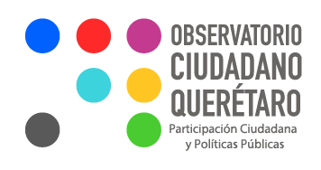
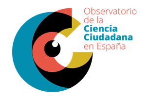
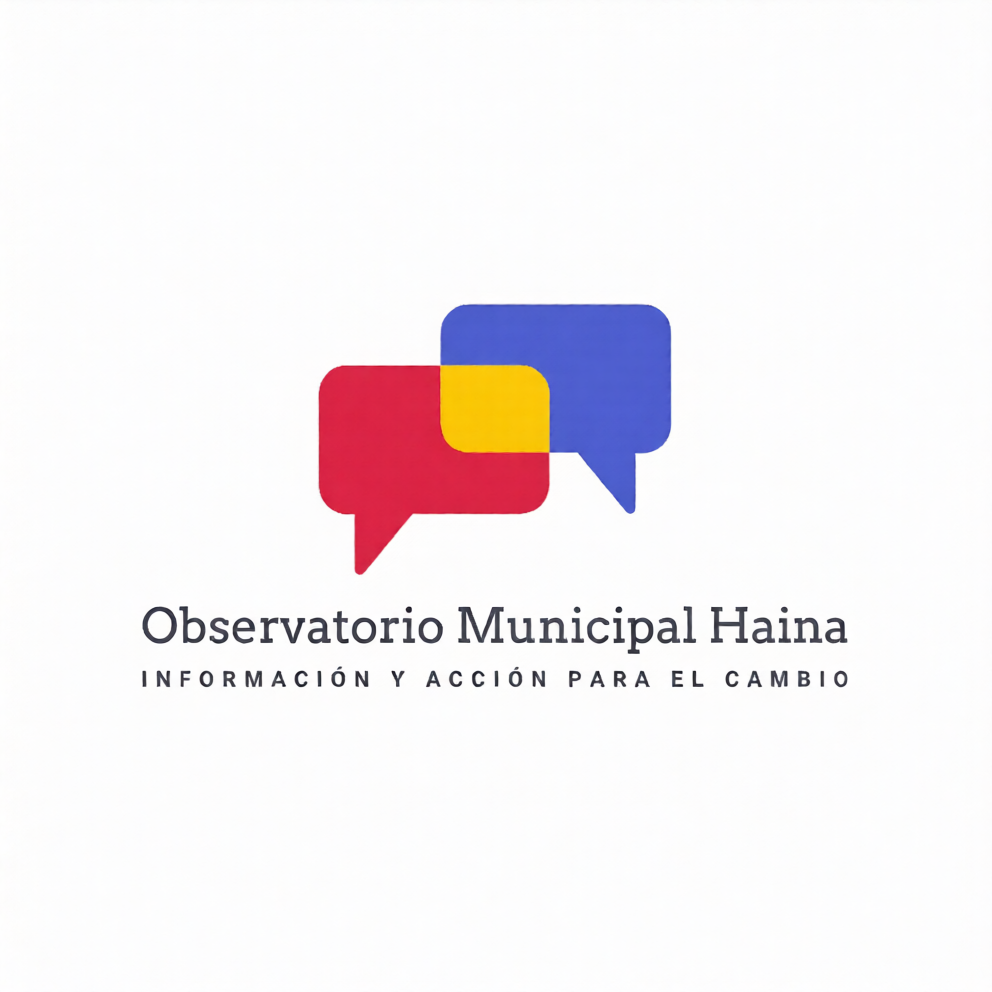

> **Fecha:** agosto 2025 **Anexo:** I. Brief del isotipo del observatorio **Función:** define los atributos visuales, los elementos gráficos y el moodboard de referencia para el diseño del isotipo del Observatorio Ciudadano de Bajos de Haina **Palabras clave:** Identidad visual, Isotipo, Observatorio ciudadano, Diseño gráfico, Branding institucional, Bajos de Haina

## Instrucciones para el diseñador {#sec-instrucciones-disenador-anexoI}

Representar un **Observatorio Ciudadano** en Bajos de Haina que articule a ciudadanos, organizaciones, instituciones y gobierno para generar datos, análisis y decisiones colaborativas sobre ordenamiento territorial, gestión de riesgos y participación ciudadana.

## Sensaciones y atributos clave {#sec-sensaciones-anexoI}

- **Accesible.** Claro y entendible para todo público.
- **Dinámico.** Refleja movimiento, interacción y evolución.
- **Institucional con apertura.** Seriedad, confianza y profesionalismo, sin rigidez, invita a la participación.
- **Memorable.** Fácil de reconocer visualmente, incluso en formatos pequeños.

## Elementos visuales sugeridos {#sec-elementos-visuales-anexoI}

Se pueden combinar o reinterpretar creativamente, siempre alineados a la idea de participación, tecnología y territorio:

- **Territorio.** Contornos de mapas, cuadrículas, fragmentos geográficos.
- **Visores y ojos abstractos.** Para representar observación y monitoreo.
- **Coordenadas geográficas.** Líneas, puntos de latitud y longitud, cruces de coordenadas.
- **Personas abstractas o figurativas.** Comunidad y participación.
- **Bocadillos de diálogo.** Intercambio de ideas y cocreación.
- **Mapas y dashboards.** Iconografía relacionada con datos georreferenciados.
- **Votaciones.** Urnas, checkmarks, botones de votación digital.
- **Conexión entre dispositivos.** Redes, nodos, iconos de tecnología conectada.
- **Flujo de datos.** Líneas, puntos y movimientos que muestren la circulación de información.
- **Interconexión de datos.** Redes neuronales, esquemas de nodos interrelacionados.

## Colores sugeridos {#sec-colores-anexoI}

- **Verde y azul.** Territorio, medioambiente y tecnología.
- **Naranja o amarillo.** Dinamismo, innovación y acción.
- **Grises o neutros.** Balance institucional.

## Tipografía {#sec-tipografia-anexoI}

- Limpia y moderna, sin ser excesivamente técnica.
- Debe leerse bien en digital, en impresiones y a diferentes tamaños.

## Formato esperado {#sec-formato-anexoI}

- Isotipo.
- Logotipo.
- Combinación de ambos.
- Adaptable a fondo claro y oscuro.
- Escalable sin perder legibilidad, desde un favicon hasta un banner.

## Inspiración y moodboard sugerido {#sec-moodboard-anexoI}

### Referencias de observatorios existentes

::: {layout-ncol=3}
{#fig-obs-queretaro}

{#fig-obs-ciencia-ciudadana-es}

{#fig-obs-australian}
:::

### Referencias visuales generales

{#fig-obs-interfaz width=40%}
