---
---

<!--
================================================================================
FONDOCYT 2023-1-3A13-0725 · Equipo y créditos (orden CRediT oficial)
================================================================================

Investigador responsable de la edición del libro y la web:
  Jorge Armando Recio Martínez, PhD (c) · Arcoíris RD · UPM
  Co-investigador. Aportes: conceptualización, investigación, software,
  curación de datos, redacción, edición del libro y de la web.
  ORCID: 0000-0001-7979-5392

Equipo completo (orden CRediT oficial, 11 personas):

  01. Ana Moyano Molina, PhD · Arcoíris RD · UPM
      Investigadora principal. Conceptualización, metodología, supervisión,
      administración del proyecto, redacción, adquisición de fondos.
      ORCID: 0009-0004-7502-0409

  02. Jorge Armando Recio Martínez, PhD (c) · Arcoíris RD · UPM
      Co-investigador. Conceptualización, investigación, software, curación
      de datos, redacción, edición del libro y de la web.
      ORCID: 0000-0001-7979-5392

  03. Javier F. Villamizar Fernández, PhD · TECCA Caribe · UNAL
      Colaborador. Investigación, metodología, análisis formal, curación
      de datos. ORCID: 0000-0001-6083-2835

  04. Carlos Manuel Ramírez Arias, MSc · Arcoíris RD · UASD
      Asistente (experto social). Investigación, metodología, recursos,
      redacción. ORCID: 0009-0008-0827-0108

  05. Karina Pérez Teruel, PhD · BARNA Management School · UCI
      Co-investigadora (gestión administrativa). Project management,
      conceptualización software, administración del proyecto, curación
      de datos. ORCID: 0000-0003-2154-3111

  06. Ana Solís Alonso, MSc · Arcoíris RD · UPM
      Asistente (experta SIG). Curación de datos, software, análisis formal,
      recursos. ORCID: 0009-0001-4738-2363

  07. Yssamar Vismarkis Reyes Sánchez, MSc (c) · Arcoíris RD · UASD
      Asistente. Investigación, administración del proyecto, redacción.
      ORCID: 0009-0005-4144-0656

  08. Danilo Minaya, MSc · Arcoíris RD · PUCMM
      Asistente. Investigación. ORCID: 0009-0006-4123-5617

  09. Jaime R. Hernández Peña · BARNA Management School · INTEC
      Asistente. Software, desarrollo de software.
      ORCID: 0009-0001-4994-9693

  10. Lucía Navarro de Corcuera, PhD · Arcoíris RD · UPM
      Colaboradora. Reutilización de materiales metodológicos de
      investigación doctoral previa. ORCID: 0000-0002-9232-8323

  11. Anyerlina Hernández · Arcoíris RD · UASD
      Asistente. Investigación, curación de datos (normativa urbana).
      ORCID: 0009-0009-3399-7656

Consorcio ejecutor: Arcoíris RD · TECCA Caribe · BARNA Management School
Financiamiento: MESCYT / FONDOCYT · Convocatoria 2023 · RD$ 5,177,300
Territorio: Bajos de Haina, San Cristóbal, República Dominicana
Periodo: 2023-2025

© 2025 Proyecto FONDOCYT 2023-1-3A13-0725
Licencia: CC BY 4.0 (https://creativecommons.org/licenses/by/4.0/)
================================================================================
-->

# Resumen {.unnumbered}

Libro de resultados del proyecto FONDOCYT 2023-1-3A13-0725 (MESCYT, República Dominicana), ejecutado entre 2023 y 2025 por el consorcio Arcoíris RD, TECCA Caribe y BARNA Management School. La investigación examina la hipótesis de la gobernanza digital catalítica frente a la meramente amplificatoria en el contexto de Bajos de Haina, municipio costero de 100,527 habitantes sometido a vulnerabilidad climática e industrial. La metodología opera en tres escalas articuladas (16 manzanas, 3 barrios, 1 municipio) combinando diagnóstico multiescalar, 155 encuestas domiciliarias (Survey123), levantamiento con drones y LIDAR, cartografía histórica y análisis normativo. Los productos principales son:

- **Normativa urbanística por tipologías de manzana**: propuesta regulatoria para seis tipologías (residencial pura, mixta comercial, mixta dotacional, institucional, mixta institucional, tripartita).
- **Observatorio Municipal de Planificación Urbana (OPU)**: diseño del sistema integrado de monitoreo e indicadores de vulnerabilidad urbana.
- **Ecosistema de herramientas digitales g-locales**: dashboard de indicadores, Reporta.do, Mapeo mi Barrio y Cerrando Brechas.
- **Seminario-Taller de Planificación Urbana Dominicana (PUD, octubre 2024)**: sistematización de tres mesas temáticas: ordenamiento territorial, gestión de riesgos y participación ciudadana.

# Abstract {.unnumbered}

Book of results of the project FONDOCYT 2023-1-3A13-0725 (MESCYT, Dominican Republic), carried out from 2023 to 2025 by the consortium Arcoíris RD, TECCA Caribe and BARNA Management School. The research addresses the hypothesis of catalytic versus merely amplificatory digital governance: when technology transforms planning processes, and when it only reproduces their asymmetries. The case study is Bajos de Haina, a coastal municipality of 100,527 inhabitants (Municipal District) in San Cristóbal province, facing severe climate and industrial vulnerability due to its proximity to the national oil refinery and to flood-prone areas. The methodology operates at three articulated scales (16 urban blocks, 3 neighbourhoods, 1 municipality) combining multi-scale diagnosis with 155 household surveys (Survey123), drone and LIDAR surveying, historical cartography, and regulatory analysis. Main deliverables:

- **Urban land-use regulation by block typologies**: regulatory framework for six typologies (pure residential, commercial mixed, amenity mixed, institutional, institutional mixed, tripartite).
- **Municipal Urban Planning Observatory (OPU)**: integrated monitoring system with urban vulnerability indicators.
- **G-local digital ecosystem**: indicator dashboard, Reporta.do, Mapeo mi Barrio and Cerrando Brechas.
- **Dominican Urban Planning Seminar-Workshop (PUD, October 2024)**: systematisation of three thematic sessions: territorial planning, risk management, and citizen participation.

# Prefacio {.unnumbered}

::: {.column-body style="text-align:center; margin-top: 2rem; margin-bottom: 2rem;"}
    
:::

::: {.content-visible when-format="html"}
::: {style="text-align:center; margin-top: 1rem; margin-bottom: 1.5rem;"}
<a href="https://doi.org/10.5281/zenodo.19638440"></a> &nbsp; DOI: <a href="https://doi.org/10.5281/zenodo.19638440">10.5281/zenodo.19638440</a>
:::

<div style="display:flex; gap:0.6rem; flex-wrap:wrap; justify-content:center; margin: 1rem 0 0.3rem;">
<a href="./libro-fondocyt-2023-1-3A13-0725.pdf" class="btn btn-primary" target="_blank">Descargar libro completo (PDF, 141 MB)</a>
<button type="button" id="load-book-iframe-btn" class="btn btn-outline-secondary" onclick="(function(){var c=document.getElementById('book-iframe-container');if(c.querySelector('iframe'))return;var f=document.createElement('iframe');f.src='./libro-fondocyt-2023-1-3A13-0725.pdf';f.width='100%';f.height='820';f.title='Libro FONDOCYT Bajos de Haina - vista previa';f.style.cssText='border:1px solid #d4a53c; border-radius:4px; margin-top: 1rem;';c.appendChild(f);document.getElementById('load-book-iframe-btn').style.display='none';})();">Ver aquí embebido (carga ~141 MB)</button>
</div>

<p style="font-size:0.85rem; color:#6b7280; text-align:center; margin-bottom:1.5rem;">La vista embebida descarga el PDF completo al navegador. En conexiones lentas, usa preferentemente el botón de descarga.</p>

<div id="book-iframe-container" style="margin-bottom: 2rem;"></div>
:::

Este documento constituye la documentación consolidada del Proyecto FONDOCYT 2023-1-3A13-0725, financiado por el Ministerio de Educación Superior, Ciencia y Tecnología (MESCYT) de la República Dominicana a través del Fondo Nacional de Innovación y Desarrollo Científico y Tecnológico (FONDOCYT).

| Componente | Descripción |
|:-----------------------------------|:-----------------------------------|
| **Código** | 2023-1-3A13-0725 |
| **Convocatoria** | 2023 |
| **Título del proyecto** | Desarrollo de herramientas digitales de planificación urbana, gestión de riesgos y participación pública con tecnologías innovadoras g-locales para impulsar municipios seguros, resilientes y adaptados al cambio climático |
| **Caso de estudio** | Bajos de Haina: decisiones informadas y sostenibles en el desarrollo urbano mediante la creación de herramientas innovadoras y tecnologías avanzadas |
| **Financiamiento** | MESCYT / FONDOCYT |
| **Organización proponente** | Convenio entre Arcoíris RD, TECCA Caribe y BARNA Management School |
| **Territorio** | Bajos de Haina, provincia San Cristóbal |
| **Periodo** | 2023--2025 |
| **Investigadora principal** | Ana Moyano Molina, PhD |
| **Co-investigador** | Jorge Armando Recio Martínez, PhD (c) |
| **Co-investigadora (gestión administrativa)** | Karina Pérez Teruel, PhD |

: Ficha del proyecto FONDOCYT 2023-1-3A13-0725. {#tbl-ficha-proyecto .unnumbered tbl-colwidths="\[30,70\]"}

## Equipo y contribuciones (CRediT) {.unnumbered}

Equipo de investigación según la taxonomía CRediT ([Contributor Roles Taxonomy](https://credit.niso.org), NISO). La afiliación indica la organización del consorcio y la universidad académica de cada investigador; el rol dentro del proyecto FONDOCYT se articula a través de los tres miembros del consorcio ejecutor (Arcoíris RD, TECCA Caribe, BARNA Management School).

| Persona | Afiliación | Rol en el proyecto | Contribuciones CRediT |
|:-----------------|:-----------------|:-----------------|:-----------------|
| **Ana Moyano Molina, PhD** | Arcoíris RD · UPM | Investigadora principal | Conceptualización, metodología, supervisión, administración del proyecto, redacción, adquisición de fondos |
| **Jorge Armando Recio Martínez, PhD (c)** | Arcoíris RD · UPM | Co-investigador | Conceptualización, investigación, software, curación de datos, redacción, edición del libro y de la web |
| **Javier F. Villamizar Fernández, PhD** | UNAL | Colaborador (TECCA Caribe) | Investigación, metodología, análisis formal, curación de datos |
| **Carlos Manuel Ramírez Arias, MSc** | UASD | Asistente, experto social (Arcoíris RD) | Investigación, metodología, recursos, redacción |
| **Karina Pérez Teruel, PhD** | UCI / BARNA | Co-investigadora (gestión administrativa) | Project management, Conceptualización software, administración del proyecto |
| **Ana Solís Alonso, MSc** | UPM | Asistente, experta SIG (Arcoíris RD) | Curación de datos, software, análisis formal, recursos |
| **Yssamar Vismarkis Reyes Sánchez, MSc (c)** | UASD | Asistente (Arcoíris RD) | Investigación, administración del proyecto, redacción |
| **Danilo Minaya, MSc** | PUCMM | Asistente (Arcoíris RD) | Investigación |
| **Jaime R. Hernández Peña** | INTEC | Asistente (BARNA Management School) | Software, desarrollo de software |
| **Lucía Navarro de Corcuera, PhD** | UPM | Colaboradora (Arcoíris RD) | Reutilización de materiales metodológicos de investigación doctoral previa |
| **Anyerlina Hernández** | UASD | Asistente (Arcoíris RD) | Investigación, curación de datos (normativa urbana) |

: Contribuciones del equipo por persona. {#tbl-credit-equipo .unnumbered tbl-colwidths="\[22,15,25,38\]"}

## Agradecimientos {.unnumbered}

El Proyecto FONDOCYT 2023-1-3A13-0725 no habría sido posible sin la amplia convergencia de múltiples actores institucionales, académicos y comunitarios que se sumaron en distintos momentos del proceso. El equipo investigador quiere expresar su reconocimiento a todas las personas e instituciones que aportaron tiempo, conocimiento, recursos, confianza o presencia a lo largo de los dieciocho meses de ejecución.

| Institución o actor | Sector | Aportación al proyecto |
|:---|:---|:---|
| **MESCYT / FONDOCYT** | Financiamiento | Financiamiento de la investigación, Convocatoria 2023 |
| **Ayuntamiento de Bajos de Haina** | Municipal | Acceso al territorio, información técnica, acompañamiento del Seminario-Taller y la propuesta del Observatorio Ciudadano |
| **CMPMR y OPU municipal** | Municipal | Implicación sostenida en las mesas de trabajo |
| **MEPyD / VIOTDR** | Nacional | Co-diseño del ecosistema digital y participación técnica |
| **MIVHED** | Nacional | Participación en el Seminario-Taller |
| **MIMARENA** | Nacional | Participación en el Seminario-Taller |
| **MICM / PRO-INDUSTRIA** | Nacional | Participación en el Seminario-Taller |
| **ONE, ONAMET, COE / Defensa Civil** | Nacional | Datos, participación técnica y coordinación de gestión de riesgos |
| **DGII, FEDOMU, INDRHI, REFIDOMSA, IGN, INAPA, SGN, ONESVIE, DGCN, IDERD, OGTIC, INDOTEL** | Nacional | Participación en el Seminario-Taller de Planificación Urbana Digital |
| **ETSAM-UPM, UASD, PUCMM, INTEC, UNAL** | Academia | Respaldo institucional de los investigadores, co-investigadores y asistentes |
| **Arcoíris RD** | Consorcio | Soporte técnico, experiencia previa sobre el territorio y gestión operativa del consorcio |

: Instituciones y actores que contribuyeron al proyecto. {#tbl-agradecimientos .unnumbered tbl-colwidths="[35,15,50]"}

A las veintisiete Juntas de Vecinos de los nueve barrios del municipio que participaron en el levantamiento territorial, los talleres y el diagnóstico de participación ciudadana, con especial reconocimiento a los líderes y lideresas comunitarias de los barrios Bella Vista, Invi-Cea y Villa Penca, donde se concentró el trabajo de campo. A las Redes Comunitarias de Prevención, Mitigación y Respuesta que aportaron su conocimiento del riesgo local y validaron los prototipos del módulo de gestión de riesgos. A los más de cien participantes del Seminario-Taller y a las 47 personas que completaron las tres mesas temáticas, cuyas contribuciones están sistematizadas en el capítulo 11 y en el Anexo H. Cualquier error u omisión en este libro es responsabilidad exclusiva del equipo investigador.

::: {.content-visible when-format="html"}

<div style="margin: 2rem 0 1.5rem; padding: 1.2rem; background: #fafaf8; border-radius: 8px; text-align: center;">

<p style="font-size:0.8rem; text-transform:uppercase; letter-spacing:0.08em; color:#6b7280; margin:0 0 0.8rem;">Apoyo municipal</p>
<div style="display:flex; gap:1rem; justify-content:center; align-items:center; flex-wrap:wrap; margin-bottom:1.3rem;">
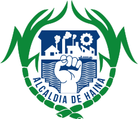
</div>

<p style="font-size:0.8rem; text-transform:uppercase; letter-spacing:0.08em; color:#6b7280; margin:0 0 0.8rem;">Apoyo nacional</p>
<div style="display:flex; gap:1rem; justify-content:center; align-items:center; flex-wrap:wrap; margin-bottom:1.3rem;">

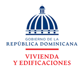
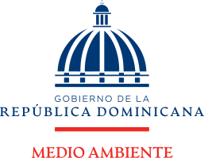
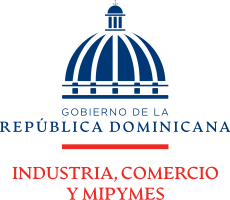


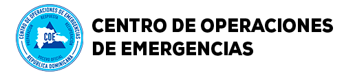
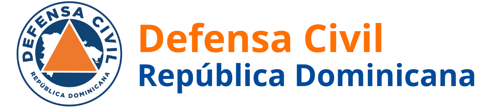
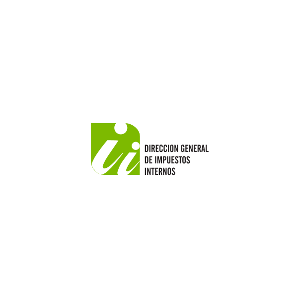
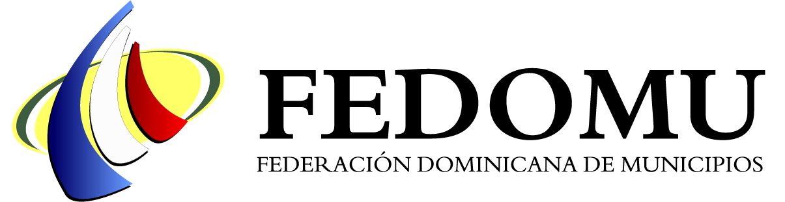
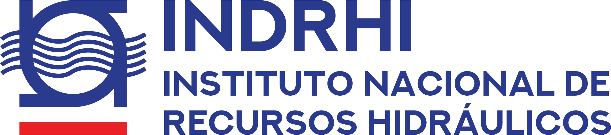
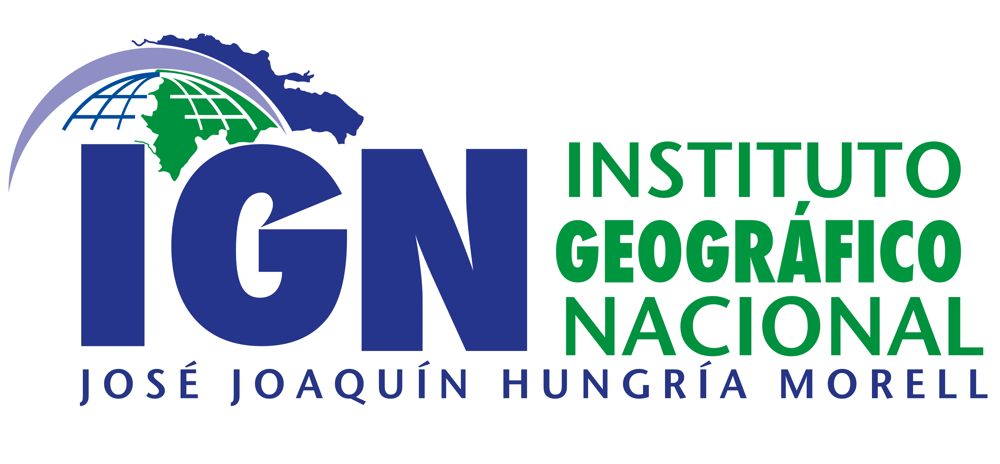


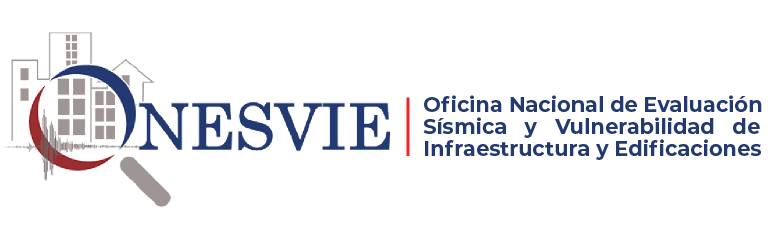
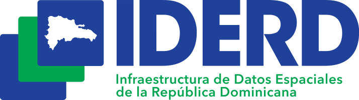


</div>

<p style="font-size:0.8rem; text-transform:uppercase; letter-spacing:0.08em; color:#6b7280; margin:0 0 0.8rem;">Respaldo académico</p>
<div style="display:flex; gap:1rem; justify-content:center; align-items:center; flex-wrap:wrap;">


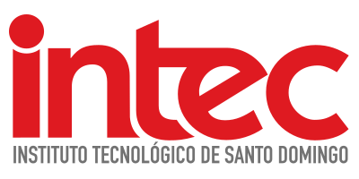

</div>

</div>

:::

::: {.content-visible when-format="pdf"}

```{=latex}
\vspace{0.4cm}
\begin{center}
{\small\sffamily\color{midgray}\MakeUppercase{Apoyo municipal}}\\[2pt]
\includegraphics[height=0.7cm,keepaspectratio]{logos/ayuntamiento_haina_trans.png}
\vspace{0.3cm}

{\small\sffamily\color{midgray}\MakeUppercase{Apoyo nacional}}\\[2pt]
\includegraphics[height=0.45cm,keepaspectratio]{logos/mepyd_trans.png}\hspace{5mm}%
\includegraphics[height=0.45cm,keepaspectratio]{logos/mivhed_trans.png}\hspace{5mm}%
\includegraphics[height=0.45cm,keepaspectratio]{logos/mimarena_trans.png}\hspace{5mm}%
\includegraphics[height=0.45cm,keepaspectratio]{logos/micm_trans.png}\hspace{5mm}%
\includegraphics[height=0.45cm,keepaspectratio]{logos/one_trans.png}\hspace{5mm}%
\includegraphics[height=0.45cm,keepaspectratio]{logos/onamet_trans.png}\hspace{5mm}%
\includegraphics[height=0.45cm,keepaspectratio]{logos/coe_trans.png}\hspace{5mm}%
\includegraphics[height=0.45cm,keepaspectratio]{logos/defensa_civil_trans.png}\hspace{5mm}%
\includegraphics[height=0.45cm,keepaspectratio]{logos/dgii_trans.png}\\[2mm]
\includegraphics[height=0.45cm,keepaspectratio]{logos/fedomu.png}\hspace{5mm}%
\includegraphics[height=0.45cm,keepaspectratio]{logos/indrhi_trans.png}\hspace{5mm}%
\includegraphics[height=0.45cm,keepaspectratio]{logos/ign_trans.png}\hspace{5mm}%
\includegraphics[height=0.45cm,keepaspectratio]{logos/inapa_trans.png}\hspace{5mm}%
\includegraphics[height=0.45cm,keepaspectratio]{logos/sgn_trans.png}\hspace{5mm}%
\includegraphics[height=0.45cm,keepaspectratio]{logos/onesvie_trans.png}\hspace{5mm}%
\includegraphics[height=0.45cm,keepaspectratio]{logos/iderd_trans.png}\hspace{5mm}%
\includegraphics[height=0.45cm,keepaspectratio]{logos/ogtic_trans.png}\hspace{5mm}%
\includegraphics[height=0.45cm,keepaspectratio]{logos/indotel_trans.png}
\vspace{0.3cm}

{\small\sffamily\color{midgray}\MakeUppercase{Respaldo académico}}\\[2pt]
\includegraphics[height=0.55cm,keepaspectratio]{logos/etsam_upm_trans.png}\hspace{7mm}%
\includegraphics[height=0.65cm,keepaspectratio]{logos/uasd_trans.png}\hspace{7mm}%
\includegraphics[height=0.5cm,keepaspectratio]{logos/pucmm_trans.png}\hspace{7mm}%
\includegraphics[height=0.55cm,keepaspectratio]{logos/intec_trans.png}\hspace{7mm}%
\includegraphics[height=0.6cm,keepaspectratio]{logos/unal_trans.png}
\end{center}
\vspace{0.3cm}
```

:::

## Estructura del documento {.unnumbered}

El libro se organiza en seis partes. La Parte I establece el contexto y la metodología del proyecto. La Parte II presenta el diagnóstico territorial correspondiente al Objetivo Específico 1 (OE1), abordando el territorio, la planificación urbana, la gestión de riesgos y la participación diagnóstica. La Parte III documenta las herramientas digitales desarrolladas (OE2). La Parte IV cubre la gobernanza y normativa (OE3), incluyendo las tipologías de manzana, la participación y el observatorio territorial, y las actividades normativas. La Parte V recoge la transferencia y validación a través del Seminario-Taller de Planificación Urbana Digital. La Parte VI cierra con las conclusiones del proyecto. Los anexos documentan la operacionalización de variables, el análisis estadístico, las fichas de tipologías, los sílabos del Seminario-Taller y la infraestructura técnica del proceso editorial.

## Colofón técnico {.unnumbered}

Este libro se compiló con [Quarto](https://quarto.org) (v1.8) a partir de fuentes en Markdown extendido (`.qmd`), generando simultáneamente un sitio web en HTML y un PDF tipografiado con XeLaTeX. La gestión bibliográfica se realizó con Zotero y Better BibTeX, con formato APA 7.ª edición. El código fuente del libro está disponible en <https://github.com/arcoirisrd/fondocyt-haina-libro>. La edición del libro y de la web estuvo a cargo de Jorge Recio (co-investigador).

| Familia | Uso | Licencia |
|:---|:---|:---|
| **IBM Plex Serif** | Cuerpo de texto (PDF) | SIL OFL 1.1 |
| **IBM Plex Sans** | Títulos y elementos de interfaz | SIL OFL 1.1 |
| **IBM Plex Sans Condensed** | Tablas y datos densos | SIL OFL 1.1 |
| **Consolas** | Código y notación técnica | n/a |

: Tipografías empleadas. {#tbl-tech-tipografia .unnumbered tbl-colwidths="[30,45,25]"}

Las herramientas de inteligencia artificial generativa empleadas en la producción editorial se utilizaron exclusivamente como apoyo al trabajo humano y bajo supervisión directa del equipo. Ningún contenido sustantivo del libro fue generado ni interpretado por un modelo de forma autónoma. Toda afirmación, cita y dato numérico mantiene trazabilidad hacia sus fuentes primarias. La infraestructura técnica detallada (versiones de software, entorno Python, modelos de IA y hardware) se documenta en el [Anexo K](#sec-colofonth-k).

