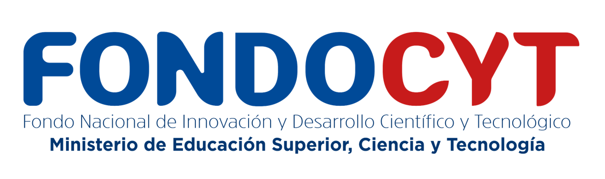

# Prefacio {.unnumbered}

::: {.column-body style="text-align:center; margin-top: 2rem; margin-bottom: 2rem;"}
    
:::

Este documento constituye la documentación consolidada del Proyecto FONDOCYT 2023-1-3A13-0725, financiado por el Ministerio de Educación Superior, Ciencia y Tecnología (MESCYT) de la República Dominicana a través del Fondo Nacional de Innovación y Desarrollo Científico y Tecnológico (FONDOCYT).

| Componente | Descripción |
|:-----------------------------------|:-----------------------------------|
| **Código** | 2023-1-3A13-0725 |
| **Convocatoria** | 2023 |
| **Título del proyecto** | Desarrollo de herramientas digitales de planificación urbana, gestión de riesgos y participación pública con tecnologías innovadoras g-locales para impulsar municipios seguros, resilientes y adaptados al cambio climático |
| **Caso de estudio** | Bajos de Haina: decisiones informadas y sostenibles en el desarrollo urbano mediante la creación de herramientas innovadoras y tecnologías avanzadas |
| **Financiamiento** | MESCYT / FONDOCYT |
| **Organización proponente** | Convenio entre Arcoíris RD, TECCA Caribe y BARNA Management School |
| **Territorio** | Bajos de Haina, provincia San Cristóbal |
| **Periodo** | 2023--2025 |
| **Investigadora principal** | Ana Moyano Molina, PhD |
| **Co-investigador principal** | Jorge Armando Recio Martínez, PhD (c) |
| **Co-investigadora (gestión administrativa)** | Karina Pérez Teruel, PhD |

: Ficha del proyecto FONDOCYT 2023-1-3A13-0725. {#tbl-ficha-proyecto .unnumbered tbl-colwidths="\[30,70\]"}

## Equipo y contribuciones (CRediT) {.unnumbered}

Equipo de investigación según la taxonomía CRediT ([Contributor Roles Taxonomy](https://credit.niso.org), NISO). La afiliación corresponde a la universidad académica de cada persona; el rol dentro del proyecto FONDOCYT se articula a través de los tres miembros del consorcio ejecutor (Arcoíris RD, TECCA Caribe, BARNA Management School). Los identificadores ORCID se incorporarán en la próxima revisión.

| Persona | Afiliación | Rol en el proyecto | Contribuciones CRediT |
|:-----------------|:-----------------|:-----------------|:-----------------|
| Ana Moyano Molina, PhD | **UPM / UASD** | Investigadora principal | Conceptualización, metodología, supervisión, administración del proyecto, redacción, adquisición de fondos |
| Jorge Armando Recio Martínez, PhD (c) | **UASD / UPM** | Co-investigador | Conceptualización, investigación, software, curación de datos, redacción |
| Javier F. Villamizar Fernández, PhD | **UNAL** | Colaborador (TECCA Caribe) | Investigación, metodología, análisis formal, curación de datos |
| Carlos Manuel Ramírez Arias, MSc | **UASD** | Asistente, experto social (Arcoíris RD) | Investigación, metodología, recursos, redacción |
| Karina Pérez Teruel, PhD | **UCI / BARNA** | Co-investigadora (gestión administrativa) | Project management, Conceptualización software, administración del proyecto |
| Ana Solís Alonso, MSc | **UPM** | Asistente, experta SIG (Arcoíris RD) | Curación de datos, software, análisis formal, recursos |
| Yssamar Vismarkis Reyes Sánchez, MSc (c) | **UASD** | Asistente (Arcoíris RD) | Investigación, administración del proyecto, redacción |
| Danilo Minaya, MSc | **PUCMM** | Asistente (Arcoíris RD) | Investigación |
| Jaime R. Hernández Peña | **INTEC** | Asistente (BARNA Management School) | Software, desarrollo de software |
| Lucía Navarro de Corcuera, PhD | **UPM** | Colaboradora (Arcoíris RD) | Reutilización de materiales metodológicos de investigación doctoral previa |
| Anyerlina Hernández | **UASD** | Asistente (Arcoíris RD) | Investigación, curación de datos (normativa urbana) |

: Contribuciones del equipo por persona. {#tbl-credit-equipo .unnumbered tbl-colwidths="\[22,15,25,38\]"}

## Colofón técnico {.unnumbered}

Ficha técnica del proceso editorial, herramientas de software, modelos de inteligencia artificial y hardware utilizados en la producción de este documento. Se incluye por transparencia metodológica y conforme a las buenas prácticas de investigación abierta.

**Edición del libro y de la web.** Jorge Recio (co-investigador principal) se encargó del diseño editorial, la maquetación en Quarto, la programación LaTeX, la integración bibliográfica, la gestión del repositorio Git y la publicación web.

### Formato y compilación {.unnumbered}

El libro está construido como un proyecto **Quarto book** que comparte una única fuente en Markdown extendido (`.qmd`) para generar simultáneamente un sitio web estático (HTML) y un PDF impreso. El pipeline de compilación es:

```         
.qmd  →  pandoc (AST)  →  { HTML5 + CSS (cosmo + SCSS custom) ,  LaTeX  →  xelatex  →  PDF }
```

#### Quarto y motores de conversión {.unnumbered}

| Componente | Versión | Función |
|:-----------------------|:-----------------------|:-----------------------|
| **Quarto** | 1.8.27 | Sistema de publicación científica multiformato. Proyecto tipo `book` con capítulos, anexos, crossref, `link-citations`, `link-bibliography`. <https://quarto.org> |
| **Pandoc** | 3.7.0 | Parser de Markdown y conversor universal (Markdown → AST → LaTeX / HTML). Filtros: `citeproc` (APA 7) y soporte nativo de booktabs, longtable, tbl-colwidths |
| **TeX Live** | 2025 | Distribución TeX que provee XeLaTeX, fontspec, biblatex, hyperref, etc. |
| **XeLaTeX** | 3.141592653-2.6-0.999997 | Motor TeX con soporte Unicode y OpenType para generar el PDF |

: Motores de compilación {#tbl-tech-motores .unnumbered tbl-colwidths="\[28,22,50\]"}

#### Extensiones Quarto y configuración del proyecto {.unnumbered}

-   `_quarto.yml` define el proyecto como `type: book`, con `output-file: libro-fondocyt-2023-1-3A13-0725`.
-   Crossref habilitado: `fig-title`, `tbl-title`, `fig-prefix`, `tbl-prefix` en español, `chapters: true` para numeración por capítulo.
-   `link-citations: true` y `link-bibliography: true`: al pinchar una cita en el PDF o el HTML salta a la entrada bibliográfica.
-   HTML: tema `cosmo` + `custom.scss` (paleta, tipografías de tabla condensadas, zebra).
-   PDF: `documentclass: scrbook` (KOMA-Script) con opciones `DIV=12`, `headinclude=true`, `open=any`, `chapterprefix=false`, `papersize: a4`, márgenes `16/16/16/18 mm`, `fontsize: 8.5pt`, `linestretch: 1.15`.

#### Paquetes LaTeX cargados por el preámbulo custom {.unnumbered}

El preámbulo `libro/latex/preamble.tex` carga explícitamente:

-   **Layout y títulos**: `etoolbox`, `titlesec`, `xparse`, `fancyhdr`, `needspace`, `zref-abspage`
-   **Cajas y marcos**: `tcolorbox` (con `skins` y `breakable`), `mdframed`, `marginnote`
-   **Tablas**: `xcolor[table]` (pasado con `\PassOptionsToPackage`), `colortbl`, `pdflscape` (landscape para tablas anchas), `ragged2e` (`\RaggedRight` anti-overflow)
-   **Captions y listas**: `caption`, `enumitem`
-   **Tipografía**: `fontspec` (cargado por Quarto) con `\newfontfamily\tablefont{IBM Plex Sans Condensed}` para las tablas

Sobre estos paquetes se define el tema visual: paleta coral/bluesteel/charcoal derivada de la tesis doctoral *Ground Truth* del editor, títulos en charcoal sans, zebra casi imperceptible (`#FAFAF7`), reglas de tabla en `black!55`, captions en `footnotesize`, pie de página con identidad del proyecto y marcador ORCID custom (`\orcidmark{...}`) que renderiza el círculo verde oficial enlazado a `orcid.org`.

#### Entorno Python local {.unnumbered}

El repositorio incluye un virtualenv `.venv` con **Python 3.14.3** para scripts auxiliares de normalización, extracción de `.docx` y `.pptx`, generación de hojas de contacto de imágenes rescatadas, consultas a Zotero y orquestación MCP.

| Paquete | Versión | Función |
|:-----------------------|:-----------------------|:-----------------------|
| **python-docx** | 1.2.0 | Lectura de `.docx` canónicos del corpus (`fuentes/corpus/*.docx`) |
| **python-pptx** | 1.0.2 | Extracción de texto e imágenes de 16 presentaciones rescatadas |
| **pdfplumber** | 0.11.9 | Parseo de PDFs (informes, oficios, cartografía) |
| **Pillow (PIL)** | 12.2.0 | Generación de 18 hojas de contacto con 887 thumbnails |
| **pyzbar** | 0.1.9 | Decodificación de QR codes (ORCIDs del equipo) |
| **pyzotero** | 1.11.0 | Cliente Python de la API de Zotero |
| **bibtexparser** | 1.4.4 | Manipulación programática de `references.bib` |
| **zotero-mcp-server** | 0.3.0 | Servidor MCP para integración Zotero ↔ agentes IA |
| **fastmcp** | 3.2.3 | Framework para servidores MCP locales |
| **openpyxl** | 3.1.5 | Lectura de hojas de cálculo del proyecto |
| **numpy** | 2.4.4 | Operaciones numéricas auxiliares |
| **PyYAML** | 6.0.3 | Lectura/escritura de `_quarto.yml` y frontmatter |

: Paquetes Python del entorno `.venv` {#tbl-tech-python .unnumbered tbl-colwidths="\[25,15,60\]"}

#### Git, GitHub y CI/CD {.unnumbered}

-   **Git** 2.x como sistema de control de versiones.
-   **GitHub** como host del repositorio público: <https://github.com/arcoirisrd/fondocyt-haina>.
-   **GitHub Actions** ejecuta el workflow `.github/workflows/publish.yml` en cada push a `main` para renderizar el sitio HTML y publicarlo en **GitHub Pages** (<https://arcoirisrd.github.io/fondocyt-haina/>).
-   Acciones utilizadas: `actions/checkout@v4`, `quarto-dev/quarto-actions/setup@v2`, `actions/configure-pages@v5` (con `enablement: true`), `actions/upload-pages-artifact@v3`, `actions/deploy-pages@v4`.
-   Opt-in a **Node.js 24** mediante `FORCE_JAVASCRIPT_ACTIONS_TO_NODE24=true` para anticipar la deprecación de Node 20 de junio 2026.
-   Permisos mínimos: `contents: read`, `pages: write`, `id-token: write`.
-   Concurrencia: grupo `pages`, `cancel-in-progress: false` para no interrumpir despliegues en curso.
-   El PDF **no** se genera en CI: se compila local con XeLaTeX porque requiere las fuentes IBM Plex (Sans, Serif, Sans Condensed) en `_recursos/fonts/` (fuera del runner estándar de GitHub).

### Tipografía {.unnumbered}

| Familia                      | Uso                       | Licencia    |
|:-----------------------------|:--------------------------|:------------|
| **IBM Plex Sans**            | Texto general y títulos   | SIL OFL 1.1 |
| **IBM Plex Sans Condensed**  | Tablas y datos densos     | SIL OFL 1.1 |
| **Consolas / monoespaciada** | Código y notación técnica | —           |

: Tipografías empleadas {#tbl-tech-tipografia .unnumbered tbl-colwidths="\[25,50,25\]"}

### Bibliografía y citas {.unnumbered}

| Herramienta | Función |
|:-----------------------------------|:-----------------------------------|
| **Zotero** + Better BibTeX | Gestión bibliográfica y exportación a `references.bib` |
| **Citation Style Language (CSL)** | Formato APA 7.ª edición (`apa.csl`) |
| **Pandoc citeproc** | Procesamiento de citas y enlaces cruzados entre texto y bibliografía |

: Gestión bibliográfica {#tbl-tech-biblio .unnumbered tbl-colwidths="\[30,70\]"}

### Hardware e infraestructura local {.unnumbered}

Para el procesamiento de datos sensibles del proyecto (encuestas domiciliarias, transcripciones, imágenes de campo, normativa y documentos internos) se utilizó un *stack* de IA completamente local, ejecutado en infraestructura propia y sin envío de información a servicios externos. A continuación se detalla el servidor de IA y la estación de trabajo editorial desde los que se trabajó.

#### Servidor de IA local {.unnumbered}

Máquina Linux dedicada que expone modelos de lenguaje y visión multimodal vía Ollama y Open WebUI para el equipo del proyecto.

| Capa | Componentes | Uso en el proyecto |
|:-----------------------|:-----------------------|:-----------------------|
| Hardware | Placa MSI MPG B550 Gaming Carbon WiFi. AMD Ryzen 9 5950X (16c/32t). 128 GB DDR4. NVIDIA RTX 5090 32 GB VRAM. NVMe 1 TB | Ejecución local de modelos 30-70 B parámetros para OCR, análisis de tablas y razonamiento multimodal |
| OS / drivers | Ubuntu Server 24.04 LTS (headless). Driver NVIDIA 550+. CUDA 12.8 | Base del stack CUDA para inferencia GPU |
| Runtimes | Python. Docker + NVIDIA Container Toolkit. systemd | Aislamiento de servicios (Ollama, Open WebUI, SearXNG) y gestión de ciclo de vida |
| Runtime de modelos | Ollama 0.17+ como servicio systemd (puerto 11434) | Servidor HTTP local para todos los modelos de lenguaje y visión del proyecto, con descarga y cache automáticos |
| Frontend IA | Open WebUI (contenedor Docker) con RAG integrado | Interfaz web para el equipo (chat, RAG sobre documentos del proyecto, carga de imágenes para OCR) |
| Inferencia alternativa | vLLM + Transformers | Usados para DeepSeek-OCR-2, que no pasa por Ollama; OCR de alto rendimiento en lotes |
| Fine-tuning | LLaMA-Factory. Unsloth Studio | Entrenamientos y *fine-tuning* de modelos propios sobre corpus del proyecto (evaluado, no usado en el libro) |
| Cuantización | llama.cpp. Pipeline HuggingFace → GGUF F16 → Q4_K_M → Ollama | Conversión de modelos externos al formato servible por Ollama cuando no están en el registry oficial |
| Generación de imagen | ComfyUI con modelos FLUX (\~33 GB) | Prototipado visual, no usado para contenido del libro |
| Buscador privado | SearXNG (contenedor Docker) | Integrado en el pipeline RAG de Open WebUI para búsquedas web filtradas sin exponer consultas a buscadores comerciales |

: Stack del servidor local de IA {#tbl-tech-server .unnumbered tbl-colwidths="\[20,45,35\]"}

**Modelos instalados en Ollama** (\~76 GB en disco):

| Modelo | Uso en el proyecto |
|:-----------------------------------|:-----------------------------------|
| `gemma4:26b-a4b` | **Motor OCR canónico del proyecto.** Seleccionado tras benchmark interno frente a `minicpm-v` y `qwen2.5vl`. Extracción de tablas numéricas, gráficos climáticos, capturas de texto denso |
| `gemma3:27b` | Fallback VLM cuando `gemma4:26b-a4b` no responde; también usado como modelo de redacción larga |
| `gemma4:8b` / `gemma4:31b` | Variantes ligera y grande de Gemma 4 para tareas de resumen y clasificación |
| `qwen3:32b` | Razonamiento largo y estructurado, especialmente análisis de normativa urbana |
| `qwen3-coder:30b` | Generación y revisión de código (scripts Python de extracción y renombrado) |
| `deepseek-r1:32b` | Razonamiento tipo "chain-of-thought" para problemas de análisis espacial |
| `nomic-embed-text` | Embeddings para el RAG de Open WebUI sobre el corpus del proyecto |
| `gt-qwen-test` (custom) | Modelo propio experimental, no usado para contenido del libro |

: Modelos abiertos locales y su función {#tbl-tech-models .unnumbered tbl-colwidths="\[28,72\]"}

**DeepSeek-OCR-2** (fuera de Ollama) se usa como alternativa especializada cuando se requiere OCR puro de gran volumen (informes escaneados, cartografía histórica) por su mayor throughput y su capacidad de no alucinar texto.

#### Estación de trabajo editorial {.unnumbered}

Equipo desde el que se escribe, compila y publica el libro:

| Componente | Especificación |
|:-----------------------------------|:-----------------------------------|
| Placa base | ASUS ProArt X870E-Creator WIFI |
| CPU | AMD Ryzen (Family 26, Model 68), 32 hilos \@ \~4.3 GHz |
| Memoria | 128 GB DDR4 |
| GPU | NVIDIA GeForce RTX 5090, 32 GB VRAM |
| Almacenamiento | NVMe Samsung 980 PRO 2 TB · NVMe WD_BLACK SN850X 4 TB · SSD externo Sabrent 4 TB USB 3.2 |
| Red | NIC 10 GbE (uplink al switch del estudio) |
| Sistema operativo | Windows 11 Pro for Workstations (build 26200) |
| Entorno Linux | **WSL2 (Windows Subsystem for Linux)** con Ubuntu 24.04, usado para scripts bash, pandoc, herramientas Unix y pruebas locales del pipeline Quarto antes del push a GitHub Actions |

: Estación de trabajo editorial {#tbl-tech-hardware .unnumbered tbl-colwidths="\[30,70\]"}

### Declaración de uso ético de la inteligencia artificial {.unnumbered}

Las herramientas de IA generativa empleadas en este proyecto se utilizaron exclusivamente como apoyo al trabajo humano y bajo supervisión directa del equipo de investigación. Ningún contenido sustantivo del libro (datos de campo, diagnóstico, análisis, conclusiones, normativa propuesta) fue generado ni interpretado por un modelo de forma autónoma. Toda afirmación del texto, toda cita bibliográfica y todo dato numérico mantienen trazabilidad documental hacia sus fuentes primarias: informes internos del proyecto (`informes/`, `fuentes/`), datos de campo originales (`datos/`), bibliografía externa (`references.bib`) y los documentos respaldados en el repositorio Zotero del proyecto.

### Trazabilidad bibliográfica (Zotero) {.unnumbered}

La bibliografía externa citada en este libro reside en la biblioteca Zotero del proyecto FONDOCYT. Cada referencia está vinculada a su PDF original, notas de lectura y anotaciones internas. Como acompañamiento a este informe final se está preparando un **repositorio abierto con los PDFs de la biblioteca Zotero** (respetando las licencias aplicables y los derechos de los editores), de modo que cualquier lector interesado pueda consultar las fuentes primarias completas y verificar la evidencia detrás de cada afirmación.

### Reproducibilidad {.unnumbered}

El código fuente de este libro (Quarto + LaTeX + Python), la bibliografía (`references.bib`) y los datos derivados están versionados con Git. Todas las herramientas de software, modelos abiertos y tipografías utilizadas en su producción son libres u *open source*; los modelos comerciales (Anthropic Claude) se documentan nominalmente para trazabilidad del proceso editorial y no forman parte del stack estrictamente reproducible, pero tampoco son necesarios para reproducir el resultado a partir del código fuente.

## Agradecimientos {.unnumbered}

El Proyecto FONDOCYT 2023-1-3A13-0725 no habría sido posible sin la convergencia generosa de múltiples actores institucionales, académicos y comunitarios que se sumaron en distintos momentos del proceso. El equipo investigador quiere expresar su agradecimiento a todas las personas e instituciones que aportaron tiempo, conocimiento, recursos, confianza o presencia a lo largo de los dieciocho meses de ejecución del proyecto.

El proyecto fue financiado por el Ministerio de Educación Superior, Ciencia y Tecnología (MESCYT) de la República Dominicana a través del Fondo Nacional de Innovación y Desarrollo Científico y Tecnológico (FONDOCYT), convocatoria 2023. El consorcio ejecutor estuvo formado por BARNA Management School, como institución responsable, en convenio con Arcoíris RD y TECCA Caribe.

Al Ayuntamiento Municipal de Bajos de Haina, en la persona de sus autoridades y técnicos, por abrir las puertas del territorio, compartir información y acompañar el Seminario-Taller de Planificación Urbana Digital y la propuesta del Observatorio Ciudadano. Al Comité Municipal de Prevención, Mitigación y Respuesta (CMPMR) y a la Oficina de Planeamiento Urbano municipal por su implicación sostenida en las mesas de trabajo.

Durante el proceso de co-diseño del ecosistema digital, y especialmente en el Seminario-Taller celebrado los días 11 y 12 de octubre de 2024, participaron de forma activa más de treinta instituciones dominicanas, entre ellas:

-   Ministerio de Economía, Planificación y Desarrollo (MEPyD) y su Viceministerio de Ordenamiento Territorial y Desarrollo Regional (VIOTDR)
-   Ministerio de la Vivienda, Hábitat y Edificaciones (MIVHED)
-   Ministerio de Medio Ambiente y Recursos Naturales (MIMARENA)
-   Ministerio de Industria, Comercio y MiPymes (MICM) y PRO-INDUSTRIA
-   Oficina Nacional de Estadística (ONE)
-   Oficina Nacional de Meteorología (ONAMET)
-   Centro de Operaciones de Emergencias (COE) y Defensa Civil
-   Dirección General de Impuestos Internos (DGII)
-   Federación Dominicana de Municipios (FEDOMU)
-   Instituto Nacional de Recursos Hidráulicos (INDRHI)
-   Refinería Dominicana de Petróleo (REFIDOMSA)
-   Instituto Geográfico Nacional (IGN)
-   Instituto Nacional de Agua Potable y Alcantarillados (INAPA)
-   Servicio Geológico Nacional (SGN)
-   Oficina Nacional de Evaluación Sísmica y Vulnerabilidad de Infraestructura y Edificaciones (ONESVIE)
-   Dirección General de Catastro Nacional (DGCN)
-   Infraestructura de Datos Espaciales de República Dominicana (IDERD)
-   Oficina Gubernamental de Tecnologías de la Información y Comunicación (OGTIC) e Instituto Dominicano de las Telecomunicaciones (INDOTEL)

A la academia y los centros de investigación que aportaron el respaldo institucional de los investigadores, co-investigadores y asistentes del proyecto:

-   Escuela Técnica Superior de Arquitectura de Madrid, Universidad Politécnica de Madrid (ETSAM-UPM)
-   Universidad Autónoma de Santo Domingo (UASD)
-   Pontificia Universidad Católica Madre y Maestra (PUCMM)
-   Instituto Tecnológico de Santo Domingo (INTEC)
-   Universidad Nacional de Colombia (UNAL)
-   Centro Arcoíris, por el soporte técnico, la experiencia previa sobre el territorio y la gestión operativa del consorcio

A las veintisiete Juntas de Vecinos de los nueve barrios del municipio que participaron en el levantamiento territorial, los talleres y el diagnóstico de participación ciudadana, con especial agradecimiento a los líderes y lideresas comunitarias de los barrios Bella Vista, Invi-Cea y Villa Penca, donde se concentró el trabajo de campo. A las Redes Comunitarias de Prevención, Mitigación y Respuesta que aportaron su conocimiento del riesgo local y validaron los prototipos digitales del módulo de gestión de riesgos.

A los más de cien participantes que asistieron al Seminario-Taller de Planificación Urbana Digital y a las 47 personas que completaron las tres mesas temáticas de Ordenamiento Territorial, Gestión de Riesgos y Participación Ciudadana, cuyas contribuciones están sistematizadas en el capítulo 11 del libro y en el Anexo L. A los investigadores y especialistas que, sin formar parte del equipo formal del proyecto, compartieron literatura, datos, referencias o comentarios críticos a lo largo del proceso, y al equipo editorial de esta publicación por la revisión técnica de la bibliografía, la normativa y el aparato estadístico.

A todas estas personas e instituciones, nuestro reconocimiento. Cualquier error u omisión en este libro es responsabilidad exclusiva del equipo investigador.

## Estructura del documento {.unnumbered}

El libro se organiza en seis partes. La Parte I establece el contexto y la metodología del proyecto. La Parte II presenta el diagnóstico territorial correspondiente al Objetivo Específico 1 (OE1), abordando el territorio, la planificación urbana, la gestión de riesgos y la participación diagnóstica. La Parte III documenta las herramientas digitales desarrolladas (OE2). La Parte IV cubre la gobernanza y normativa (OE3), incluyendo las tipologías de manzana, la participación y el observatorio territorial, y las actividades normativas. La Parte V recoge la transferencia y validación a través del Seminario-Taller de Planificación Urbana Digital. La Parte VI cierra con las conclusiones del proyecto.

Los anexos incluyen la operacionalización de variables, el análisis estadístico, el glosario de acrónimos y términos urbanísticos, y el brief del isotipo del observatorio.